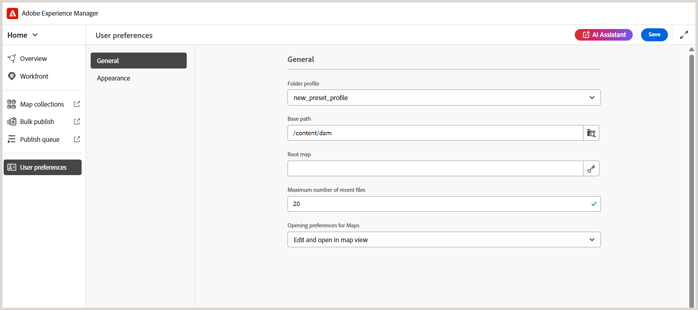

# Explorar la interfaz y los requisitos previos

Este artículo explica cómo acceder a la interfaz de usuario y configurar el perfil de carpeta y la ruta base correctos para los cursos de aprendizaje.

## Acceso y navegación por la interfaz

Siga estos pasos para acceder a la interfaz de usuario:

1. Inicie sesión en la instancia de AEM. 
2. En la página Navegación de AEM, seleccione **Guías**.
3. Ahora se encuentra en la **página de inicio de Experience Manager Guides**. Utilice el interruptor de navegación para cambiar a las siguientes vistas:

   - **Inicio**: La página predeterminada que ve al iniciar sesión en Experience Manager Guides. Permite configurar varias opciones de nivel de carpeta.
   - **Editor**: Un editor fácil de usar que le permite crear contenido de cursos en Experience Manager Guides.
   - **Consola de mapas**: proporciona un área de trabajo dedicada para administrar todos los aspectos de la publicación de cursos.

   Para obtener más información, vea [Experiencia con la página principal de Adobe Experience Manager Guides](../user-guide/intro-home-page.md).

   {width="350" align="left"}

## Requisitos previos

Para empezar a usar la interfaz de usuario, primero debe configurar el **perfil de carpeta** y la **ruta base** correctos en la configuración de **preferencias de usuario** de la página principal de Experience Manager Guides.

Los perfiles de carpeta definen las plantillas de creación, las plantillas de salida, los ajustes preestablecidos de salida y otros ajustes de nivel de carpeta. Experience Manager Guides admite varios perfiles de carpeta, lo que permite a los administradores separar las configuraciones para diferentes departamentos o productos de la empresa. El uso de un perfil de carpeta incorrecto puede provocar la falta de plantillas o una funcionalidad limitada. Si no está seguro de qué perfil de carpeta utilizar, póngase en contacto con el administrador antes de continuar.

La página Preferencias de usuario consta de dos pestañas:

- **General**: permite seleccionar un perfil de carpeta, una ruta de acceso base, un mapa raíz, etc.
- **Aspecto**: proporciona las opciones para seleccionar los temas para la aplicación y la vista de origen del contenido de aprendizaje.

Para obtener más información, vea [Preferencias de usuario](../user-guide/intro-home-page.md#user-preferences) en Experience Manager Guides.
