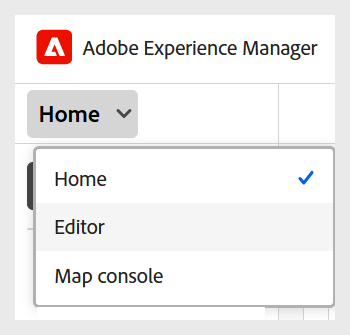

# Interfaz de contenido de Acceso a aprendizaje y formación

Siga estos pasos para acceder a la interfaz de contenido de Aprendizaje y formación:

1. Inicie sesión en la instancia de AEM. 
2. En la página Navegación de AEM, seleccione **Guías**.
3. Ahora se encuentra en la **página de inicio de Experience Manager Guides**. Utilice el interruptor de navegación para cambiar a la vista del editor.

   {width="300" align="left"}

4. Abra el panel **Repositorio**, vaya a la carpeta en la que desea crear un curso y seleccione **Nuevo > Curso** en el menú **Opciones**.

   

