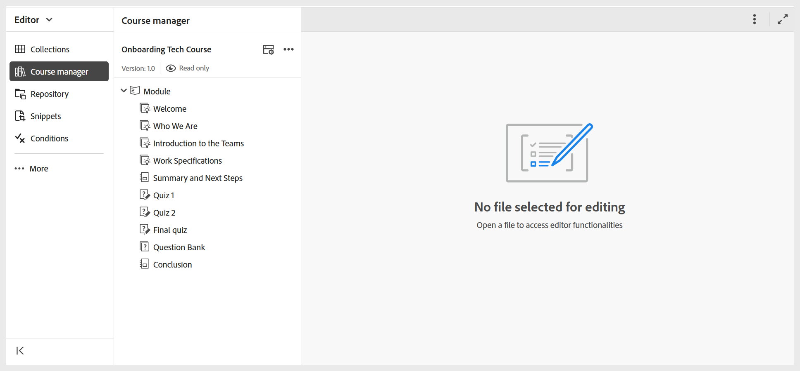

# Cree su primer curso

Los cursos de Experience Manager Guides se pueden diseñar para que coincidan con distintos objetivos de aprendizaje. Aunque un curso de aprendizaje normal puede incluir temas, cuestionarios y resúmenes, también puede crear cursos que se centren principalmente en las evaluaciones. Por ejemplo, puede configurar un curso con solo una prueba o una prueba junto con un tema de información general para comprobar rápidamente la comprensión. También puede crear una ruta estructurada con una prueba previa a la evaluación, el contenido del curso principal y una prueba final. Estas opciones le ayudan a ofrecer experiencias de aprendizaje segmentadas a la vez que miden de forma eficaz el progreso del alumno.

Antes de sumergirse en el proceso paso a paso, aquí tiene un breve vídeo introductorio que muestra cómo crear su primer curso y agregarle componentes.

>[!VIDEO](https://video.tv.adobe.com/v/3469537/aem-guides-learning-content?quality=12&learn=on)

Siga estos pasos para crear su primer curso:

1. Vaya a la carpeta en la que desea crear un curso y seleccione **Nuevo > Curso** en el menú de **Opciones**.
   

   Se muestra el **cuadro de diálogo Nuevo curso**.
2. En el **cuadro de diálogo Nuevo curso**, proporcione los siguientes detalles:
   - Una plantilla en la que se basará el curso.

     >[!NOTE]
     >
     > Solo verá las plantillas de curso configuradas por el administrador.

   - Título del curso.
   - El nombre de archivo del curso. El nombre del archivo se sugiere automáticamente en función del título del curso. Si el administrador ha habilitado nombres de archivo automáticos basados en la configuración UUID, no verá el campo Nombre de archivo.
   - Ruta de acceso en la que desea guardar el curso. De forma predeterminada, la ruta de la carpeta seleccionada actualmente en el repositorio se muestra en el campo Ruta.
3. Seleccione **Crear**.
El curso se crea en la ruta especificada en función de la plantilla seleccionada. Además, el curso se abre en el Administrador de cursos para su edición.

   
