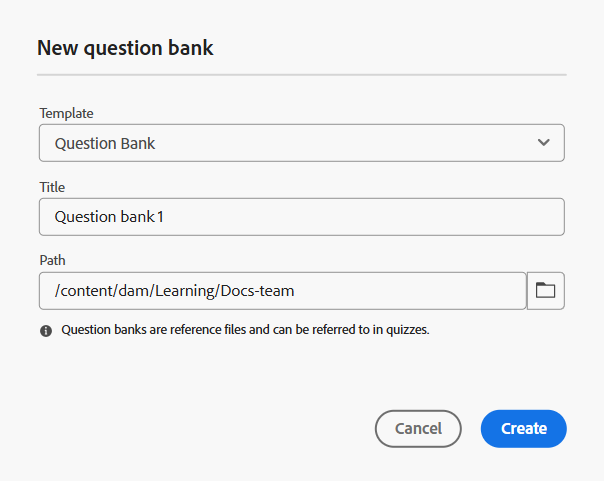

# Crear banco de preguntas

Puede facilitar el proceso de creación de pruebas insertando preguntas directamente desde un banco de preguntas. Esta función le permite reutilizar las preguntas existentes, mantener la coherencia en las evaluaciones y ahorrar tiempo durante la creación de las pruebas.
Para agilizar la creación y reutilización de las pruebas, puede crear un banco de preguntas personalizado y adaptado a sus necesidades específicas.

Antes de sumergirnos en el proceso paso a paso, aquí hay un breve vídeo introductorio que muestra cómo crear un banco de preguntas y utilizarlo dentro de una prueba.

>[!VIDEO](https://video.tv.adobe.com/v/3475212/learning-content-aem-guides)

**Pasos para crear un banco de preguntas**

Realice los siguientes pasos para crear un banco de preguntas:

1. Abra un curso en **Administrador de cursos** y seleccione **Agregar nuevo** en el **menú Opciones**.
1. Seleccione **Banco de preguntas**.
Se abre el cuadro de diálogo **Nuevo banco de preguntas**. Puede seleccionar la plantilla en el menú desplegable, especificar un título adecuado para el banco de preguntas y especificar la ruta en la que desea que se almacene este banco de preguntas en el repositorio.

   {width="350"}

1. Seleccione **Crear**.
Se añade un banco de preguntas como parte del curso que se muestra en el panel Administrador de cursos.
1. Puede añadir preguntas al banco de preguntas de la misma manera que lo hace para una prueba, teniendo al mismo tiempo la flexibilidad de configurar las propiedades de cada pregunta durante el proceso. Para obtener más información, vea [Insertar preguntas en un cuestionario](./quiz-insert-questions.md).
