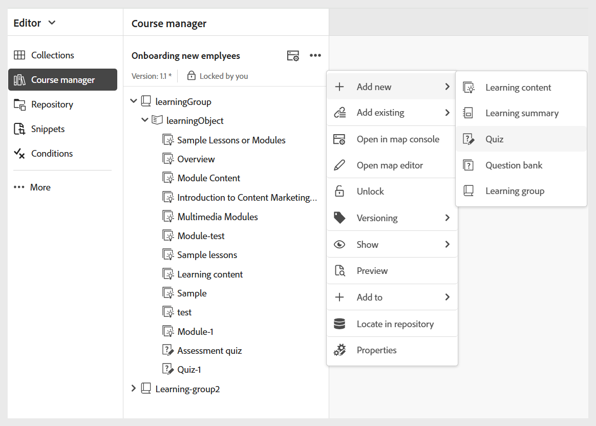

# Crear prueba

Siga estos pasos para añadir una prueba a un curso:

1. Abra un curso en **Administrador de cursos** y seleccione **Agregar nuevo** en el menú **Opciones**.

   {width="650"}

1. Seleccionar **prueba**.\
   Se abre el cuadro de diálogo **Nueva prueba de aprendizaje** para especificar los detalles relevantes de la prueba. Puede seleccionar la plantilla en el menú desplegable y especificar un título adecuado para la misma.

   {width="350"}

1. Seleccione **Crear**.

Se añade una prueba como parte del curso y se muestra en el panel del gestor del curso.

>[!NOTE]
>
>  Una vez que haya creado una prueba, se le asignará automáticamente la versión 1.0.
