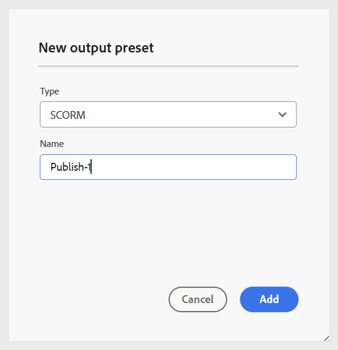

# Crear un ajuste preestablecido de salida SCORM

Siga estos pasos para crear un ajuste preestablecido de salida SCORM:

1. Abra el curso en **consola de mapas**.

   {width="350" align="left"}

1. En el panel **Ajustes preestablecidos de salida**, seleccione el icono + para crear uno de salida.
1. Seleccione **SCORM** del menú desplegable **Tipo** en el cuadro de diálogo **Nuevo ajuste preestablecido de salida**.

   {width="350" align="left"}

1. En el campo **Nombre**, proporcione un nombre para este ajuste preestablecido.
1. Seleccione la opción **Agregar al perfil de carpeta actual** para crear un ajuste preestablecido de salida dentro del perfil de carpeta actual.
1. Seleccione **Añadir**.

Se crea el ajuste preestablecido SCORM. Se abre una página de ajustes preestablecidos de SCORM en la que puede realizar las configuraciones necesarias.

{width="800" align="left"}