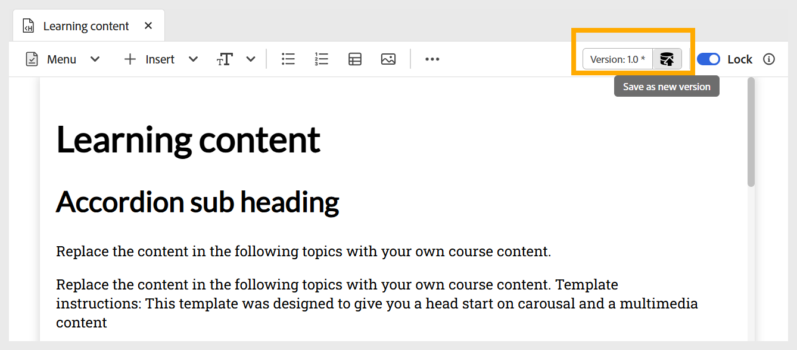

# Editar tema

Siga estos pasos para editar el tema:

1. Haga doble clic en el Tema para abrirlo desde el panel Administrador de cursos.
1. Debe **bloquear** el tema usando la opción como se muestra a continuación. Esto le permite editar el contenido y nadie más puede realizar cambios en este tema.

   {width="650" align="left"}

1. Para agregar contenido a un tema, puede [agregar componentes básicos](./lc-basic-blocks.md), como texto o multimedia, junto con varios [widgets interactivos](./lc-widgets.md).
1. Para guardar tu trabajo, usa **Guardar como nueva versión** para crear una nueva versión o presiona `Ctrl+S` para sobrescribir el archivo existente.

   {width="650" align="left"}

1. Después de guardar el contenido, puedes **desbloquear** el tema para que otros lo editen.
