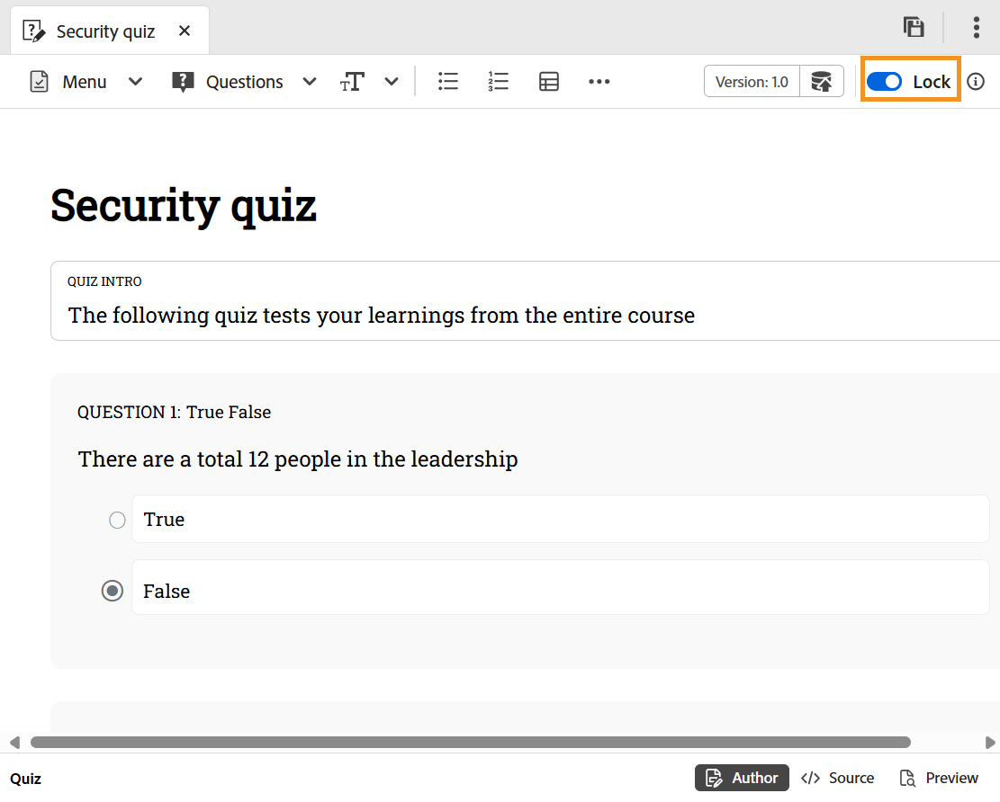

# Editar prueba

Antes de sumergirnos en el proceso paso a paso, aquí hay un breve vídeo introductorio que muestra cómo editar una prueba en el editor de pruebas.

>[!VIDEO](https://video.tv.adobe.com/v/3475209/aem-guides-learning-content)

**Pasos para editar una prueba**

Siga estos pasos para editar la prueba:

1. Haga doble clic en la prueba para abrirla desde el panel Administrador de cursos.
1. Debe **bloquear** el examen mediante la opción. Esto le permite editar la prueba y nadie más puede realizar cambios en ella.

   {width="650" align="left"}

1. Puede [agregar preguntas al cuestionario](./quiz-insert-questions.md), así como [insertar preguntas del banco de preguntas](./insert-questions.md).
1. Para guardar tu trabajo, usa **Guardar como nueva versión** para crear una nueva versión o presiona `Ctrl+S` para sobrescribir el archivo existente.
1. Después de guardar la prueba, puedes **desbloquear** el tema para que otros lo editen.
