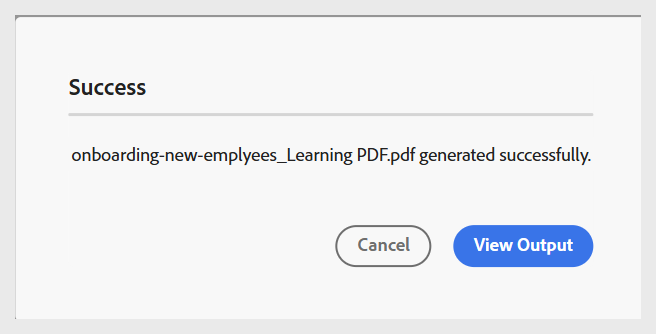

# Generar PDF

Siga estos pasos para generar una PDF:

1. Después de configurar todas las opciones necesarias para la salida de PDF en función de sus preferencias, vaya a la barra de herramientas de la página de ajustes preestablecidos de PDF.
1. Seleccione **Generar salida**.

   {width="650"}

1. Una vez completado el proceso de generación, aparece un mensaje de éxito que confirma que se ha creado PDF.

   {width="350"}

1. Puede descargar PDF seleccionando **Ver salida** en el mensaje de éxito y en la barra de herramientas.

   {width="650"}
