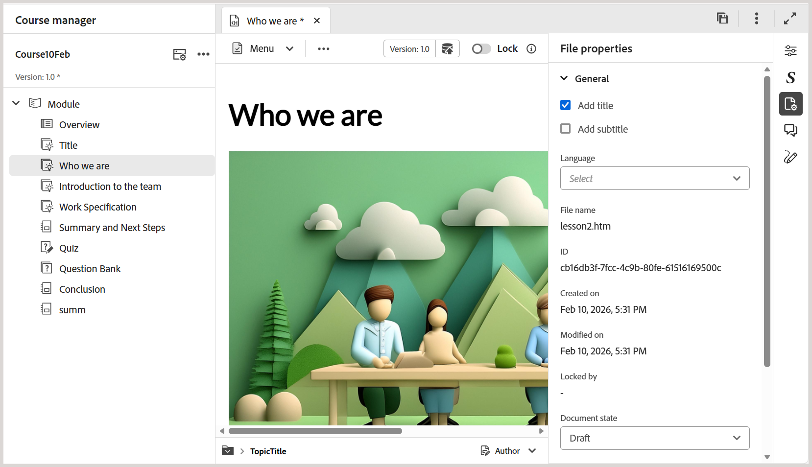

# Añadir componentes básicos al tema

Para comprender mejor cómo crear un tema de aprendizaje y añadirle componentes básicos, el siguiente vídeo ofrece una breve descripción general de las funciones disponibles.

>[!VIDEO](https://video.tv.adobe.com/v/3469535/learning-content-aem-guides)

Puede utilizar las funciones básicas de edición disponibles en la barra de herramientas del Editor, como se describe a continuación:

- **Opciones de inserción**: proporciona opciones para agregar [widgets interactivos](./lc-widgets.md) como acordeón, carrusel, punto interactivo, pestañas, tarjetas giratorias y clic para mostrar, así como [elementos estructurales](./lc-other-insert-options.md) como iframe, comillas de bloque, bloque de código y más. Utilice este menú para añadir funcionalidad y variedad al contenido de aprendizaje, haciéndolo atractivo y bien estructurado.

  {width="650"}

- **Componentes de texto**: agrega encabezado, párrafo, comillas dentro de la línea, superíndice, subíndice y cita al contenido.

  >[!NOTE]
  >
  > También puede incluir un Título y un subtítulo en el contenido de aprendizaje. Para obtener detalles sobre cómo agregarlo al contenido, vea [Agregar título y subtítulo al contenido de aprendizaje](#add-title-and-subtitle-to-learning-content).

  {width="650"}

- **Lista sin ordenar**: Agrega una lista sin ordenar dentro del contenido.

  {width="650"}

- **Lista ordenada**: inserta una lista numerada dentro del contenido.

  {width="650"}

- **Tabla**: inserta una tabla de dimensiones requeridas en el contenido. Puede administrar varias propiedades de tabla mediante el panel **Propiedades de contenido**, como se muestra a continuación.

  {width="650"}

- **Imagen**: inserta imágenes en el contenido junto con texto alternativo y una información de pantalla. Las imágenes se pueden añadir desde el repositorio o a través de una URL externa. Además, las propiedades de imagen se pueden modificar mediante el panel **Propiedades de contenido**.

  {width="650"}

- **Multimedia**: agrega vídeo y audio al contenido. Puede personalizar sus propiedades mediante el panel **Propiedades de contenido**.

  {width="650"}

- **Contenido reutilizable**: le permite incorporar contenido existente de sus recursos o repositorio para reutilizarlo. Siga estos pasos para insertar contenido reutilizable:

   1. Seleccione **Contenido reutilizable** en la barra de herramientas.
Se abre el cuadro de diálogo **Reutilizar contenido**.
   2. Desplácese y seleccione el tema que desee para incluir su contenido en el curso actual.
   3. Seleccione el ID del contenido que desea añadir; junto a él se mostrará una vista previa como referencia.

      {width="650"}

   4. Elija **Seleccionar**.

  El contenido se inserta. Por ejemplo, la sección sobre estructura del vehículo es una parte de contenido que se reutiliza y se añade al tema del curso. El tipo se muestra como **Referencia** y su **ID** se refleja en el panel **Propiedades del contenido**.

  {width="650"}

- **Símbolos**: agrega símbolos de su elección al contenido de una lista como se muestra a continuación.

  {width="350"}

- **Hipervínculos**: agrega hipervínculos a la ubicación requerida del contenido. Puede ser una referencia de archivo, una URL web o un vínculo de correo electrónico, como se muestra a continuación.

  {width="650"}

Además, el menú desplegable **Menú** proporciona acceso a las acciones de edición (Cortar, Copiar, Eliminar), Buscar y reemplazar y a la etiqueta Versión.

## Añadir título y subtítulo al contenido de aprendizaje

Siga estos pasos para incluir el título y el subtítulo en el contenido de aprendizaje:

1. Abra el curso de aprendizaje en la consola Mapa.
1. Abra el tema, la prueba o cualquier otro componente del curso al que desee añadir un título o subtítulo.
1. Vaya al panel Propiedades del archivo y seleccione **Agregar título**.

   
1. Cuando se le solicite, elija si desea utilizar el encabezado existente como título.

   >[!NOTE]
   >
   > Si no desea usar el encabezado existente como título, primero inserte un encabezado utilizando el componente Texto en la barra de herramientas del Editor y, a continuación, seleccione **Agregar título**. Se agrega un ejemplo **Title** al contenido, el cual puede editar según sea necesario.

1. En Propiedades del archivo, seleccione **Agregar subtítulo**.
Se ha agregado un **subtítulo** de muestra al contenido.

   

Para quitar un título, borre la opción **Agregar título** en las propiedades del archivo. Al eliminar el título, se elimina automáticamente el subtítulo asociado.

