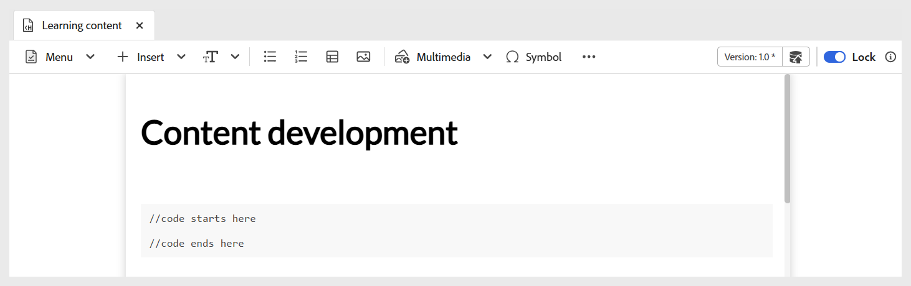

# Uso de widgets interactivos

Puede mejorar el contenido de aprendizaje añadiendo varios widgets para que el curso sea más interactivo. Seleccione el menú **Insertar** de la barra de herramientas para acceder a los widgets. Los widgets disponibles incluyen:

- **Acordeón:** Agrega un acordeón al contenido. Puede insertar texto adecuado en el encabezado del acordeón y en su cuerpo. Sus propiedades se pueden administrar mediante el panel **Propiedades del contenido**, incluidas las opciones para permitir que se abran simultáneamente uno o varios acordeones, así como para agregar o quitar elementos.

  {width="650" align="left"}

- **Carrusel:** Agrega el carrusel al contenido. Puede insertar texto adecuado tanto en el título de la tarjeta como en su cuerpo. Sus propiedades se pueden administrar mediante el panel **Propiedades del contenido**, incluidas las opciones para agregar o quitar elementos.

  {width="650" align="left"}

- **Puntos interactivos:** Agregar puntos interactivos a una imagen seleccionada. Comience eligiendo una imagen y luego vaya a **Insertar > Punto interactivo**. Esto abre el cuadro de diálogo de punto interactivo, donde puede configurar varias opciones, como configurar diferentes tamaños de punto interactivo, añadir los vínculos correspondientes y ajustar la capa acercando o retrocediendo las áreas.

  {width="650" align="left"}

- **Comillas de bloque:** Agrega citas de bloque junto con citas al contenido.

  {width="650" align="left"}

- **Bloques de código:** Agrega un bloque de código al contenido.

  {width="650" align="left"}

- **Iframes:** Inserte un iframe en el contenido para incrustar páginas web externas o recursos interactivos. Puede configurar las propiedades del iframe mediante el panel **Propiedades del contenido**, que incluye la dirección URL de origen, la anchura, la altura, la alineación y el título. Puede ver el contenido agregado en el iframe cambiando al modo **Vista previa**, como se muestra a continuación.

  Vista de **autor**:

  {width="650" align="left"}

  Modo **Vista previa**:

  {width="650" align="left"}

- **Campo de entrada:** Agregue un campo de entrada de texto junto con un botón al contenido. Puede utilizar esta combinación para capturar los datos introducidos por el usuario y las acciones específicas del déclencheur. Se añade un botón de reproducción al contenido como se muestra a continuación.

  {width="650" align="left"}

- **Más opciones:** Tiene opciones adicionales para mejorar el contenido de aprendizaje, como insertar una línea horizontal, un salto de línea, un cuadro de texto, un cuadro de texto posicionado y HTML incrustado.

  {width="650" align="left"}
