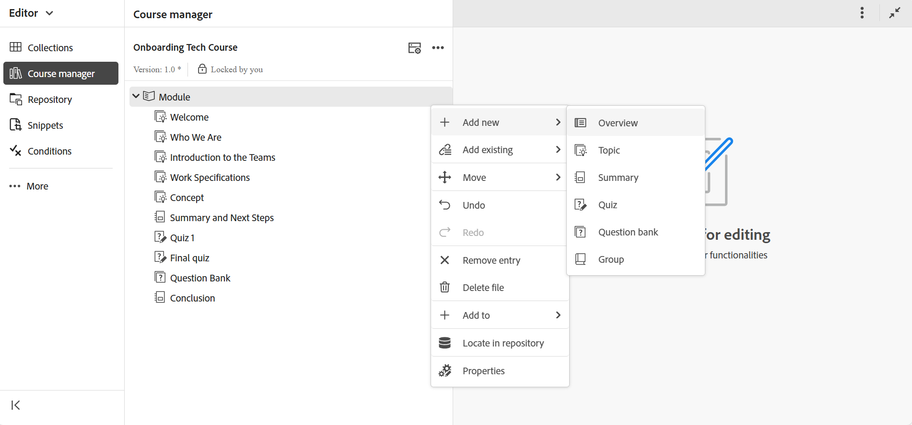
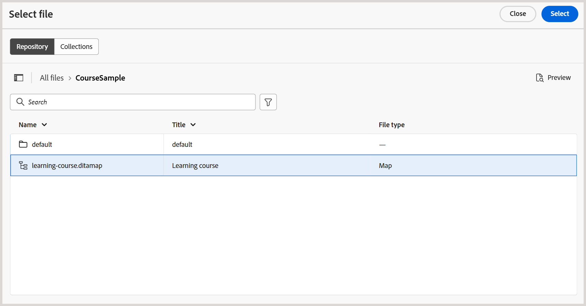

# Gestionar su curso

Después de crear un curso, se abre en el panel Administrador de cursos. Puede bloquear el curso y realizar todos los cambios necesarios en el nivel del curso. En las siguientes secciones se explican las opciones disponibles para editar el curso.

## Añadir contenido nuevo

Siga estos pasos para agregar contenido nuevo en el curso:

1. Seleccione el menú **Opciones** > **Agregar nuevo**.

   
2. Seleccione el tipo de contenido que desea crear. Las opciones disponibles son:
   - **Información general**: El primer tema del curso que proporciona una introducción rápida a lo que cubre el curso.
   - **Tema**: el material principal de un curso consiste en piezas cortas enfocadas, como pasos, ejemplos o explicaciones, que enseñan una habilidad o idea específica. Para obtener más información, vea [Crear y personalizar tema](./create-content.md).
   - **Resumen**: una revisión rápida al final del capítulo de un curso que recuerda a los alumnos los puntos clave que acaban de aprender.
   - **Prueba**: conjunto de preguntas que se usa para comprobar si alguien entiende bien lo que ha aprendido. Para obtener más información, vea [Crear y administrar prueba](./create-quiz.md).
   - **Banco de preguntas**: conjunto compartido de preguntas reutilizables que se pueden usar para crear pruebas de forma rápida y coherente. Para obtener más información, vea [Banco de preguntas](./create-qb.md).
   - **Grupo**: un grupo de aprendizaje ayuda a organizar los temas relacionados, como capítulos, temas y otros módulos, en un orden lógico, creando una jerarquía clara que facilita la administración y reutilización de los materiales de formación.
3. Seleccione **Crear**.

El contenido seleccionado se crea y se añade al curso. Para ver un vídeo introductorio, vea [Agregar contenido nuevo a un curso](https://video.tv.adobe.com/v/3469537/aem-guides-learning-content?quality=12&learn=on) .

## Añadir contenido existente

Puede añadir contenido existente del repositorio de contenido al curso. Siga estos pasos para agregar contenido existente:

1. Seleccione el menú **Opciones** > **Agregar elemento existente**.
2. Seleccione el tipo de contenido del curso que desea crear.
3. En el cuadro de diálogo **Seleccionar archivo**, vaya a la ubicación del contenido y seleccione el contenido de aprendizaje que desee.

   
4. Elija **Seleccionar**.

El contenido del curso seleccionado se añade al curso desde el repositorio.

>[!NOTE]
>
>También puede usar la opción **Agregar archivo existente** > **Archivo (zip solo de recursos)** para incluir un archivo zip que se descomprima e integre en la estructura de carpetas de la salida final de SCORM. Esto ayuda a optimizar el empaquetado de recursos durante la publicación del curso.

Para ver un vídeo introductorio, vea [Agregar contenido existente a un curso](https://video.tv.adobe.com/v/3469537/aem-guides-learning-content?quality=12&learn=on) .

## Eliminar contenido

Puede quitar cualquier tema del curso si selecciona el menú **Opciones** para ese tema específico y, a continuación, selecciona **Quitar entrada**, como se muestra a continuación.

Para ver un vídeo introductorio, vea [Quitar contenido del curso](https://video.tv.adobe.com/v/3475210/learning-content-aem-guides) .

## Creación de versiones de cursos

Puede controlar las versiones del curso seleccionando el menú **Opciones** > **Versiones**.

Dispone de las siguientes opciones para crear versiones de un curso:

- **Guardar como nueva versión**: guarda el curso con un número de versión nuevo.
- **Historial de versiones**: Muestra la vista previa de la versión actual y también le permite compararla con las demás versiones disponibles del curso.
- **Etiqueta de versión**: permite especificar etiquetas en un formato de texto de forma libre o utilizar un conjunto de etiquetas predefinidas.

## Configuración de visualización: Mostrar

La opción **Mostrar** determina cómo se muestran los temas. Puede elegir presentarlos utilizando casillas de verificación para varias selecciones de temas, numeración para indicar una estructura jerárquica o mostrando el título del tema o el nombre del archivo.

>[!NOTE]
>
> Esta configuración de vista se aplica solamente dentro del administrador de cursos y no afecta a la salida publicada.

Para ver un vídeo introductorio, vea [Mostrar configuración](https://video.tv.adobe.com/v/3475210/learning-content-aem-guides) .

## Crear tarea de revisión

Como autor de un curso de aprendizaje o administrador, puede crear una tarea de revisión para el curso y asignarla a un revisor para que le envíe sus comentarios. Comience por abrir el curso en el panel **Administrador de cursos** y, a continuación, seleccione **Crear tarea de revisión** del menú **Opciones**, como se muestra a continuación:

Se le dirigirá a la página **Crear tarea de revisión**, donde tendrá que agregar detalles de la tarea, como el título de la tarea de revisión, especificar el proyecto DITA del que forma parte, definir las escalas de tiempo de las tareas, asignar revisores, etc. Una vez finalizado, los revisores recibirán una notificación para esta tarea. Los temas del curso seleccionados se abren en la interfaz de usuario de revisión, donde el revisor puede añadir comentarios y devolver los temas para que se actualicen.

Para comprender el flujo de trabajo de revisión en Experience Manager Guides, vea [Enviar temas para revisión](../user-guide/review-send-topics-for-review.md).

