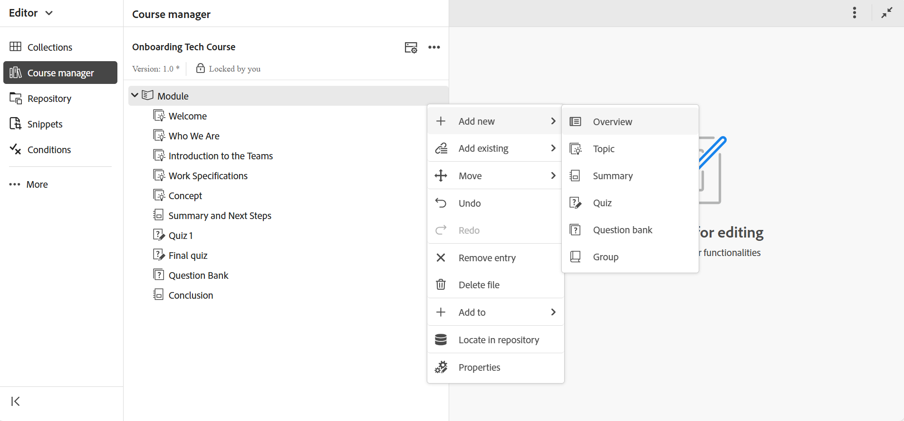

# Gestionar su curso

Después de crear un curso, se abre en el panel Administrador de cursos. Puede bloquear el curso y realizar todos los cambios necesarios en el nivel del curso. En las siguientes secciones se explican las opciones disponibles para editar el curso.

## Añadir contenido nuevo

Siga estos pasos para agregar contenido nuevo en el curso:

1. Seleccione el menú **Opciones** > **Agregar nuevo**.

   
2. Seleccione el tipo de contenido que desea crear. Las opciones disponibles son:
   - **Contenido de aprendizaje**: el material principal de un curso consiste en piezas cortas enfocadas como pasos, ejemplos o explicaciones que enseñan una habilidad o idea específica. Para obtener más información, vea [Crear y personalizar contenido de aprendizaje](./create-content.md).
   - **Resumen del aprendizaje**: Una revisión rápida al final del capítulo de un curso que recuerda a los alumnos los puntos clave que acaban de aprender.
   - **Prueba**: conjunto de preguntas que se usa para comprobar si alguien entiende bien lo que ha aprendido. Para obtener más información, vea [Crear y administrar prueba](./create-quiz.md).
   - **Banco de preguntas**: conjunto compartido de preguntas reutilizables que se pueden usar para crear pruebas de forma rápida y coherente. Para obtener más información, vea [Banco de preguntas](./create-qb.md).
   - **Grupo de aprendizaje**: un grupo de aprendizaje ayuda a organizar el contenido de aprendizaje relacionado, como capítulos, temas y otros módulos, en un orden lógico, creando una jerarquía clara que facilita la administración y reutilización de los materiales de aprendizaje.
3. Seleccione **Crear**.
El contenido seleccionado se crea y se añade al curso.

## Añadir contenido existente

Puede añadir contenido existente del repositorio de contenido al curso. Siga estos pasos para agregar contenido existente:

1. Seleccione el menú **Opciones** > **Agregar elemento existente**.
2. Seleccione el tipo de contenido del curso que desea crear.
3. En el cuadro de diálogo Seleccionar ruta, vaya a la ubicación de contenido y seleccione el contenido de aprendizaje que desee.

   
4. Elija **Seleccionar**.

El contenido de aprendizaje seleccionado se añade al curso desde el repositorio.

## Eliminar contenido

Puede eliminar cualquier tema del curso seleccionando el menú **Opciones** para ese tema específico y luego **Eliminar**, como se muestra a continuación.

{width="350" align="left"}

## Creación de versiones de cursos

Puede controlar las versiones del curso seleccionando el menú **Opciones** > **Versiones**.

{width="650" align="left"}

Dispone de las siguientes opciones para crear versiones de un curso:

- **Guardar como nueva versión**: guarda el curso con un número de versión nuevo.
- **Historial de versiones**: Muestra la vista previa de la versión actual y también le permite compararla con las demás versiones disponibles del curso.
- **Etiqueta de versión**: permite especificar etiquetas en un formato de texto de forma libre o utilizar un conjunto de etiquetas predefinidas.

## Configuración de visualización: Mostrar

La opción **Mostrar** determina cómo se muestran los temas. Puede elegir presentarlos utilizando casillas de verificación para varias selecciones de temas, numeración para indicar una estructura jerárquica o mostrando el título del tema o el nombre del archivo.

>[!NOTE]
>
> Esta configuración de vista se aplica solamente dentro del administrador de cursos y no afecta a la salida publicada.

