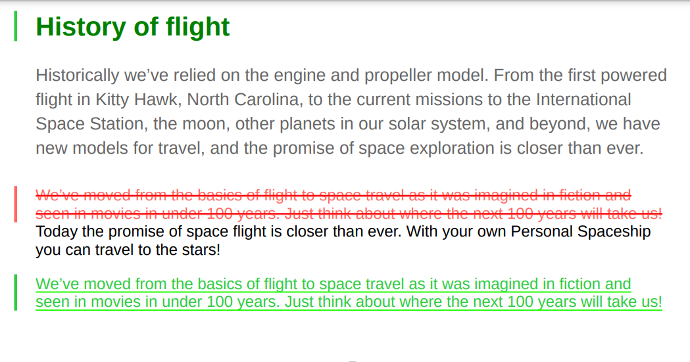

# Trabajar con estilos de barras de cambios personalizados

Una barra de cambios es una línea vertical que identifica visualmente el contenido nuevo o revisado. AEM Guides le permite mostrar una barra de cambios a la izquierda del contenido modificado dentro de los temas y también los temas modificados en la TDC de la salida de PDF.

Para obtener más información sobre cómo mostrar la barra de cambios, consulte *Crear PDF con barra de cambios entre versiones publicadas* en [Publicar salida de PDF](../web-editor/native-pdf-web-editor.md).

## Contenido cambiado en los temas

La barra de cambios aparece a la izquierda del contenido en los temas que se han insertado, cambiado o eliminado.

Puede modificar los estilos siguientes para mostrar el contenido cambiado y entre con las barras de cambio.


>[!NOTE]
>
>Estos estilos forman parte del archivo `layout.css` y puede editarlos según sea necesario.

Por ejemplo, puede utilizar el atributo color en el estilo `.inserted-block` para definir la forma en que el contenido insertado aparece en la salida de PDF publicada.


```css
...
.inserted-block { 
  color: #2ECC40; 
  display: inline; 
  -ro-comment-content: " "; 
  -ro-comment-style: underline; 
  -ro-comment-title: "Inserted"; 
  -ro-comment-date: attr(data-time); 
  -ro-comment-dateformat: "yyyy/dd/MM HH:mm:ss"; 
} 
...
```

Del mismo modo, puede utilizar el estilo `.deleted-block` para definir la forma en que el contenido eliminado aparece en la salida de PDF publicada.

```css
...
.deleted-block { 
  display: inline; 
  color: #FF6961; 
  text-decoration: line-through; 
  -ro-comment-content: " "; 
  -ro-comment-style: strikeout; 
  -ro-comment-title: "Deleted"; 
  -ro-comment-date: attr(data-time); 
  -ro-comment-dateformat: "yyyy/dd/MM HH:mm:ss"; 
} 
...
```

Puede utilizar los estilos `.inserted-change-bar` y `.deleted-change-bar` para modificar el aspecto de las barras de cambio que aparecen a la izquierda del contenido actualizado.

Por ejemplo, puede utilizar el atributo `-ro-change-bar-color` en el estilo `.inserted-change-bar` para mostrar la barra de cambios insertada en color verde. También puede usar el atributo `-ro-change-bar-color` en el estilo `.deleted-change-bar` para mostrar la barra de cambios eliminada en color rojo.

```css
...
.inserted-change-bar { 
  -ro-change-bar-color: #2ECC40; 
} 

.deleted-change-bar { 
  -ro-change-bar-color: #FF6961; 
  } 
...
```



## Se ha cambiado el tema de la tabla de contenido (TDC)

También puede agregar una barra de cambios a la izquierda de los temas modificados en la TDC de la salida de PDF. Puede usar el atributo `-ro-change-bar-color` en el estilo `.changed-topic` para agregar una barra de cambio en el color que elija para los temas actualizados en la lista de TDC.

Por ejemplo, puede agregar una barra de cambios de color verde.

```css
...
.changed-topic { 
 -ro-change-bar-color: #2ECC40; 
}  
...
```


Muestra una barra de cambios verde para todos los temas del índice en los que se han realizado algunas actualizaciones. Puede hacer clic en el tema modificado del índice y ver los cambios detallados.


