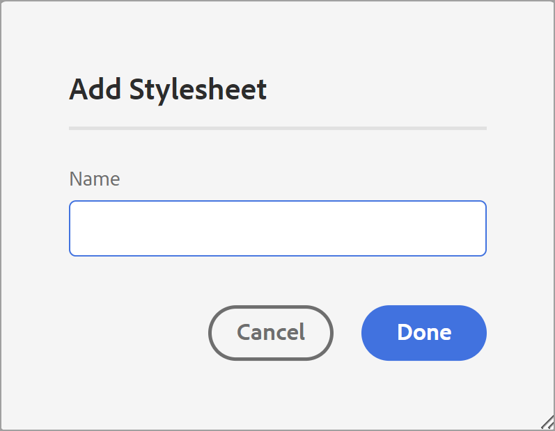
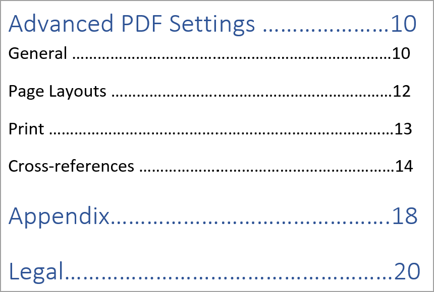
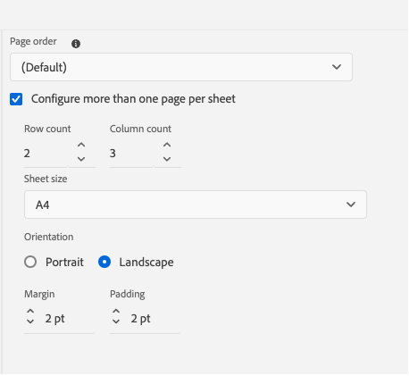
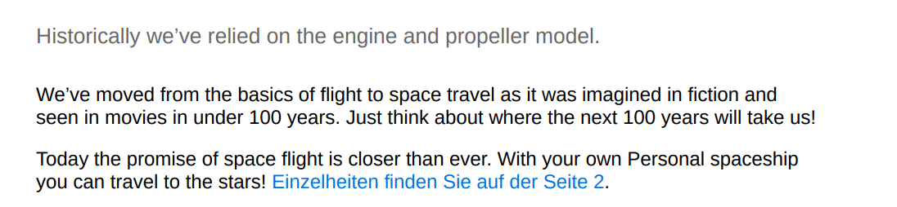

# Componentes de una plantilla de PDF {#components-pdf-template}

Una plantilla de PDF tiene cuatro componentes: diseños de página, hojas de estilo, recursos y configuración. Puede crear una plantilla personalizando estos componentes individuales y asociando la plantilla con un ajuste preestablecido de salida mientras genera una salida de PDF. Las secciones siguientes tratan en detalle estos componentes y su proceso de personalización.

## Creación y personalización de diseños de página {#create-customize-page-layout}

La configuración del componente Diseños de página permite diseñar la estructura de una página definiendo el encabezado, el pie de página y el área de contenido de una página. Con el editor de diseños de página de WYSIWYG, puede crear un diseño de página para diferentes secciones de PDF, como las páginas de portada y de contraportada, el capítulo y la tabla de contenido
Contenido (TDC), índice, página en blanco, páginas principales, páginas secundarias, lista de ilustraciones (LOF), lista de tablas (LOT), glosario o cree un diseño para una página personalizada. En la configuración de la plantilla de PDF, puede asignar un diseño de página con diferentes secciones dentro de una PDF, que luego se utilizan para generar la salida de PDF.

### Crear un nuevo diseño de página {#create-page-layout}

>[!NOTE]
>
>Hay diseños de página de muestra que se envían predefinidos. Puede personalizarlos o crear nuevos diseños de página.

1. En el editor web, vaya a la ficha **Output**.
1. Expanda la barra lateral izquierda y haga clic en **Plantillas**.
1. Abra la plantilla con la que desee trabajar.

   >[!NOTE]
   >
   >Puede abrir una plantilla haciendo doble clic en su nombre o haciendo clic en el icono > junto a su nombre.

1. Para crear un nuevo diseño de página, siga uno de estos procedimientos:

   * Pase el ratón sobre **Diseños de página**, haga clic en el icono (*Opciones*) **...** y elija **Nuevo diseño de página**.

   * En el panel **Plantillas**, haga clic en el icono **+** situado junto a **Plantillas** y elija **Diseño de página** en el menú contextual.

     Se abre el cuadro de diálogo **Agregar diseño**.

     

1. Especifique un nombre para el nuevo diseño de página.
   >[!NOTE]
   >
   >Evite utilizar caracteres especiales al dar nombre a un diseño de página. Un espacio en el nombre se reemplaza con un guion bajo &quot;_&quot;.

1. Haga clic en **Listo**.

   El nuevo diseño se crea y se agrega en Diseños de página.

### Duplicación de un diseño de página {#duplicate-page-layout}

1. En la sección **Plantillas** de la plantilla que desea duplicar, haga doble clic en **Diseños de página** o haga clic en el icono **>** antes de **Diseños de página**.

   Esto muestra la lista de diseños de página dentro de la plantilla.

1. Pase el ratón sobre el diseño de página que quiera duplicar y haga clic en el icono (*Opciones*) **...** y seleccione **Duplicar** del menú contextual.

1. En el cuadro de diálogo _Diseño duplicado_, escriba un nombre para el diseño de página.

1. Haga clic en **Listo**.
Se crea una copia del diseño de página seleccionado y se agrega en Diseños de página.

### Personalizar un diseño de página {#customize-page-layout}

1. En la sección **Plantillas** de la plantilla que desea editar, haga doble clic en **Diseños de página** o haga clic en el icono **>** antes de **Diseños de página**.

   Esto muestra la lista de diseños de página dentro de la plantilla.
1. Para personalizar cualquier diseño de página, siga uno de estos procedimientos:
   * Haga doble clic en cualquier diseño de página.
   * Pase el ratón sobre cualquier diseño de página y haga clic en el icono (*Opciones*) **...** y seleccione **Editar** del menú contextual.

   Esto abre el editor de diseño de página para la personalización.
1. Una vez que haya realizado los cambios deseados, haga clic en *Guardar todo* (o `Crl+S`).

   Para obtener más información sobre la definición de elementos de diseño individuales, como encabezado, pie de página, número de página, título, etc., vea [Diseñar una página](design-page-layout.md).

## Uso de hojas de estilo para personalizar PDF {#stylesheet-customization}

La configuración del componente Hojas de estilo permite aplicar estilo a los componentes del diseño de página y al contenido DITA mediante el editor de WYSIWYG o trabajar directamente con el archivo CSS. Puede crear sus propios estilos o personalizar las propiedades de estilo predeterminadas. El editor de WYSIWYG permite acceder a la mayoría de las propiedades que se necesitan para aplicar estilo al diseño de página o al contenido DITA. Para realizar personalizaciones avanzadas, puede trabajar directamente en la vista de Source.

### Crear nueva hoja de estilos {#create-stylesheet}

Aunque los archivos CSS se proporcionan para el contenido y el diseño, puede crear una nueva hoja de estilo para aplicar varias personalizaciones a un tipo de estilo específico que luego se pueda aplicar a un componente de destino. De forma predeterminada, los archivos CSS de ejemplo están empaquetados dentro del producto. Estos archivos CSS están pensados para ayudarle a organizar la información de estilo en el contenido y los diseños. Puede elegir combinar estos estilos en un solo archivo CSS o en varios archivos.

De manera predeterminada, cada vez que crea un nuevo diseño de página, el archivo `layout.css` se incluye dentro del nuevo diseño de página. Si desea que el diseño de página contenga estilos de un archivo CSS diferente, simplemente puede arrastrar y soltar el archivo CSS deseado en el área de edición de contenido del nuevo diseño de página. Para comprobar si el archivo CSS se ha incrustado en el diseño de página, cambie a la vista de Source y encontrará un vínculo al archivo CSS en el elemento `<head>`.

Para crear una hoja de estilo, siga los siguientes pasos:
1. En el panel **Plantillas**, realice una de las siguientes acciones:
   * Pase el ratón sobre la ficha **Hojas de estilo**, haga clic en el icono (*Opciones*) **...** y seleccione **Nueva hoja de estilo**.
   * Haga clic en el icono **+** junto a **Plantillas** y elija **Hoja de estilo** en el menú contextual.

   Se abrirá el cuadro de diálogo Agregar hoja de estilo.

   
1. Especifique un nombre para la nueva hoja de estilo.
1. Haga clic en **Listo**.

   Se crea una nueva hoja de estilo y se añade en la sección Hojas de estilo.

### Crear un nuevo estilo {#create-style}

De forma predeterminada, los archivos CSS proporcionados con la plantilla contienen estilos para el encabezado, el párrafo, el carácter, el hipervínculo, la imagen, la tabla, el div, la página y otros estilos. Puede anular el formato de estilo predeterminado o crear uno nuevo.

Puede crear un nuevo estilo para utilizarlo en el diseño de página de la plantilla o aplicar un estilo personalizado para cualquier elemento DITA. Para aplicar estos estilos personalizados al elemento DITA, debe asegurarse de que el nombre de clase del estilo sea el mismo que el nombre del elemento DITA o el atributo `outputclass`.  Por ejemplo, `
` en DITA se rige por `.div {}` en CSS o por su atributo `outputclass`. Si aplica `
` en DITA, se rige por `.div {}` o `.my-div {}` en CSS.

Para crear un nuevo estilo, siga los siguientes pasos:
1. Expanda la barra lateral izquierda y haga doble clic en la plantilla en la que desea crear el estilo.
1. Expanda la sección **Hojas de estilo**. Se abrirá el panel **Estilos** que contiene todas las opciones de estilo.
1. Seleccione el icono + para añadir un nuevo estilo.

   **Agregar estilo** se abre el cuadro de diálogo.

   

1. Especifique un nombre de **Clase**. Para aplicar un estilo al elemento DITA, asegúrese de que el nombre de clase del estilo es el mismo que el nombre del elemento DITA o el atributo `outputclass`.
1. En el campo **Etiqueta** (opcional), elija una etiqueta para la cual desee crear un nuevo estilo.

1. Seleccione una **pseudoclase** para aplicar estilo a un elemento. Una pseudoclase le ayuda a definir un estado especial del elemento. Por ejemplo, utilice la pseudoclase para aplicar estilo a un elemento cuando pase el ratón sobre él o cuando se centre sobre él. También puede seleccionar varias pseudoclases. Por ejemplo, puede usar la pseudoclase `a::visited {color: blue;}` para aplicar estilo a los vínculos visitados.

1. Añada el selector para el nuevo estilo. El campo **Selector** le ayuda a agregar selectores personalizados además de la combinación de Clase, Etiqueta y Pseudoclase. Por ejemplo, puede crear el estilo `table a.link` para todos los hipervínculos dentro de una tabla.

   Para obtener más información sobre las etiquetas CSS, vea [Consulte la gramática de estilo CSS](https://www.w3.org/TR/CSS21/syndata.html#characters).

1. Haga clic en **Listo**.

   Se crea un nuevo estilo y se agrega a la lista de estilos.

### Personalizar un estilo predefinido o nuevo {#customize-style}

Una vez que haya creado un nuevo archivo CSS con estilos predeterminados o desee personalizar estilos en un archivo CSS existente, puede utilizar el editor de estilos para hacerlo.

Para personalizar un estilo, siga los siguientes pasos:
1. Haga doble clic en **Hojas de estilo** o haga clic en el icono **>** antes de **Hojas de estilo**.

   Muestra los archivos CSS predeterminados (contenido y diseño) y personalizados.
1. Abra una hoja de estilo para editarla.

   Para abrir una hoja de estilo para editarla, siga uno de estos procedimientos:
   * Haga doble clic en el nombre de la hoja de estilo.
   * Pase el ratón sobre el nombre de la hoja de estilo, haga clic en (icono Opciones) ... y seleccione Editar.

   Se abrirá la hoja de estilos para editarla y se mostrará la lista de estilos en el panel Estilos.

   

1. Para personalizar un estilo, selecciónelo para verlo y personalizarlo con el editor Estilos.

### Propiedades de los estilos

En el panel central, puede editar las propiedades, pero puede resultar difícil obtener una instantánea de todos los valores presentes.  El panel **Propiedades** proporciona una vista rápida de todos los atributos y valores del estilo.

En el panel central, puede editar las propiedades que se utilizan con más frecuencia, pero no todas las que admite CSS. En el panel **Propiedades**, puede editar todas las propiedades compatibles con CSS y previsualizarlas. No es necesario cambiar a la vista Código fuente para editar ninguna propiedad.

Obtenga más información acerca de cómo usar el editor de estilos para [trabajar con los estilos de contenido comunes](stylesheet.md).

## Trabajo con recursos {#work-with-resources}

Este es un contenedor para todos los recursos utilizados para diseñar una plantilla. Puede considerarlo como una carpeta, que contiene recursos como imágenes de fondo, fuentes personalizadas, logotipos y mucho más. Cada vez que se añade un recurso a la plantilla, se carga o se registra en la carpeta de recursos. A continuación, puede utilizar estos recursos para personalizar o diseñar las plantillas de PDF.

Para agregar un archivo de recursos a la carpeta Recursos, siga los siguientes pasos:

1. Pase el ratón sobre la pestaña de la carpeta Recursos y haga clic en (icono Opciones) ... y seleccione Importar.

   Se abrirá el cuadro de diálogo Cargar Assets.

   

   La ruta donde se cargará el archivo de recursos se muestra en el campo **Seleccionar carpeta de recursos**.
   >[!NOTE]
   >
   >No puede cambiar la ruta para cargar recursos. De manera predeterminada, todos los recursos se almacenan en la carpeta `/content/dam/dita-templates/pdf/<PDF-template-name>`.

1. Haga clic en **Elegir archivos** para examinar el archivo de recursos desde el equipo local

1. Haga clic en **Cargar**.
El archivo seleccionado se importa y se enumera en la carpeta Recursos.

## Configuración avanzada de PDF {#advanced-pdf-settings}

Utilice la sección Configuración para establecer la configuración avanzada del diseño de página de PDF, iniciando PDF desde una página impar o par, dando formato a las referencias cruzadas y habilitando las marcas de impresión en la PDF final que se genera
uso de la plantilla.

>
>
> A partir de la versión 5.0/2025.02.0 de Experience Manager Guides, la sección **Imprimir** de la configuración avanzada de PDF se ha movido al panel **Ajustes preestablecidos de salida**. Para establecer la configuración de impresión, vea [Publicar salida de PDF](../web-editor/native-pdf-web-editor.md#print).

Para configurarlo, haga clic en **Configuración** en el panel **Plantillas** para ver las siguientes opciones:

### General

Defina los valores de configuración básicos para iniciar un capítulo desde una página impar o par, la estructura de la tabla de contenido y el formato de línea directriz para las entradas de la tabla de contenido. Puede definir la siguiente configuración:

* **Iniciar cualquier capítulo nuevo de**: permite definir cómo se publica cada capítulo en el PDF final. Puede elegir entre las opciones **Nueva página**, **Página impar**, **Página par** o **Página actual**. Si decide iniciar un nuevo capítulo desde una página impar, se inserta una página en blanco después de un capítulo que termina en una página impar. Por ejemplo, si el capítulo termina en la página número 15, el proceso de publicación insertará una página 16th en blanco para que el nuevo capítulo pueda comenzar desde la página 17th.  Si elige la opción **Página actual**, todos los capítulos se publicarán como continuación sin saltos de página. Por ejemplo, si un capítulo termina en mitad de la página 15, el capítulo siguiente también se inicia desde la propia página 15.

* **Inicia cada tema desde una nueva página**: Si deseas que cada tema de tu capítulo comience desde una nueva página, selecciona la opción **Iniciar cada tema desde una nueva página**. Si desea que los temas continúen sin espacios en la página, anule la selección de esta opción.

* **Estructura del índice**: Permite personalizar la jerarquía de la tabla de contenido. Utiliza la siguiente configuración adicional:

   * **Usar encabezados hasta el nivel**: permite ajustar el número de niveles de encabezado que se mostrarán en la estructura de TDC de su PDF.
   * **No mostrar el número de página del primer nivel en la tabla de contenido**: seleccione esta opción para ocultar los números de página correspondientes de todos los capítulos que contengan temas anidados o secundarios. Consideremos el siguiente ejemplo en el que se crea una salida sin seleccionar esta opción.

  

  En el ejemplo anterior, Configuración avanzada de PDF, Apéndice y Legal son los encabezados de tema o títulos de capítulo de primer nivel. Se asigna un número de página a todos estos encabezados.

  Ahora, si selecciona esta opción y genera la salida, obtendrá la siguiente tabla de contenido:

  

  Aquí puede observar que a la configuración del primer capítulo de Advanced PDF no se le asigna ningún número de página, ya que tiene temas anidados o secundarios. Mientras que un número de página si se asigna a Apéndice y Legal porque son temas independientes sin ningún tema secundario.

* **No mostrar el número de capítulo en el índice** : seleccione esta opción para mostrar los nombres de capítulo sin los números de capítulo en el índice.   De forma predeterminada, los números de capítulo se muestran en la tabla de contenido de la salida de PDF.
* **Formato de relleno**: utilice la lista desplegable para seleccionar líneas directrices de puntos, sólidas o de espacio para conectar los niveles de encabezado con sus números de página correspondientes.
Para aplicar la estructura del índice y los niveles de encabezado de estilo, vea [Agregar un índice de capítulo](design-page-layout.md#add-chapter-toc).

  >[!NOTE]
  >
  >Si es desarrollador de CSS, puede definir el formato de relleno directamente en el archivo CSS.

* **Usar marcador de continuación de tabla**: seleccione esta opción para definir marcadores para tablas largas que se extiendan en varias páginas.
Puede definir el texto que aparecerá antes y después del salto. Por ejemplo, una tabla se divide en la página 5 y usted define `<Continued on page %page-num%>` para **Texto antes del salto**.  El texto muestra &quot;Continúa en la página 6&quot; al final de la página 5.

  Utilice variables de idioma para definir el texto del marcador de continuación antes y después del salto. Según el idioma elegido, el valor localizado se selecciona automáticamente en la salida de PDF. Por ejemplo, puede publicar `Continued on page %page-num%` como texto en inglés y `Fortsetzung auf Seite %page-num%` en alemán.

  Pase el ratón sobre  cerca de la opción para ver más detalles al respecto.
* **Vincular términos del glosario a la página del glosario**: seleccione esta opción para mostrar los términos del glosario como hipervínculos en el contenido y vincularlos a los términos de la página del glosario. Esto ayuda a los lectores a ver rápidamente la definición de un término definido en el glosario.

  Para convertir los términos del glosario en hipervínculos, debe:
   * Habilite **Glosario** en la ficha **Orden de diseño de página** para un mapa DITA.
   * Agregue el glosario en las páginas de contenido posterior de un mapa del libro.

  Si no habilita la página del Glosario, los términos del Glosario del contenido no se convierten en hipervínculos en la salida de PDF.
  <!--For more information on using table continuation markers, see Use table continuation markers.-->

### Diseños de página {#page-layouts}

La configuración de Diseños de página le proporciona un control completo sobre cómo especificar qué diseño de página se utilizará para una sección específica del documento. Por ejemplo, para seleccionar un diseño para la tabla de contenido, haga clic en el menú desplegable situado debajo del campo TDC y seleccione el diseño que ha diseñado para generar la tabla de contenido.

Es importante tener en cuenta que la configuración del mapa de libros tiene prioridad sobre la configuración del diseño de página.

Las siguientes configuraciones están disponibles en la sección Diseño de página:

**Diseño de página predeterminado**: seleccione un diseño de página que actúe como el diseño predeterminado para todas las páginas de PDF. Este es el diseño de página base que se aplica en las secciones o temas en los que no se ha creado un diseño de página dedicado.

**Diseño de página para diferentes secciones**: puede asignar un diseño de página con las siguientes secciones de la salida de PDF. Si ha diseñado un diseño de página para la sección relacionada, selecciónelo en la lista desplegable. Si no se ha creado ningún diseño de página para una sección específica, se aplica el diseño de página predeterminado.

* **Capítulos y temas**: puede especificar el diseño de página para el capítulo y los temas. El diseño seleccionado se aplicará a todos los capítulos y temas.

* **TDC**: si ha diseñado el diseño de página del índice, seleccione **TDC** en la lista desplegable y todas las páginas del documento tendrán el diseño de página del índice.

* **Lista de ilustraciones y Lista de tablas**: también puede especificar el diseño de página para ilustraciones y tablas. El diseño seleccionado se aplicará a todas las figuras y tablas.

* **Índice**: si ha diseñado un diseño de página Índice, asígnelo a la opción Índice. Con las hojas de estilo, se puede aplicar estilo a diferentes elementos de índice en la salida de PDF. Use los estilos de índice `.idx-header`, `.idx-footer`, `.idx-body`, `.idx-title`, `.idx-keyword-group`, `.idx-unit`, `.idx-keyword`, `.idx-name`, `.idx-link` y `.idx-child` para personalizar los estilos de los elementos del índice.

* **Glosario**: Si tiene un diseño de página Glosario, asígnelo a la opción Glosario.

  Los términos del glosario de la salida de PDF siempre se ordenan en orden alfabético.

  También puede agregar la etiqueta `sort-as` para definir un criterio de ordenación para los términos del glosario. A continuación, Experience Manager Guides utiliza el criterio de ordenación para ordenar los términos del glosario en lugar de los términos del glosario. Si no ha definido el criterio de ordenación, utiliza los términos del glosario para ordenar. Por ejemplo, puede agregar la etiqueta `sort-as` a `glossterm` y establecer su valor en `A` para el término &quot;USB&quot; (por ejemplo, `<glossterm>USB<sort-as>A</sort-as></glossterm>`). Del mismo modo, puede agregar la etiqueta `sort-as` y establecer su valor en `B` para el término &quot;Pen Drive&quot;. Al ordenar estos términos del glosario, la clave de ordenación `A` del término de glosario &quot;USB&quot; aparece antes de la clave de ordenación `B` del término de glosario &quot;Pen Drive&quot;. Por lo tanto, en la salida de PDF, &quot;USB&quot; va antes que &quot;Pen Drive&quot; en la página del glosario.

  Con las hojas de estilo, puede aplicar estilo a diferentes elementos del glosario en la salida de PDF. Use los estilos del glosario `.glo-header`, `.glo-footer`, `.glo-body`, `.glo-title`, `.glo-unit`, `.glo-link` y `.glo-term` para personalizar los estilos de los elementos del glosario.

  Obtenga más información acerca de cómo usar el editor de estilos para [trabajar con los estilos de contenido comunes](stylesheet.md).

* **Páginas principales y Páginas secundarias importantes**: estos diseños de página definen el estilo de las páginas principales y secundarias del libro. Si ha diseñado el diseño de la materia frontal, asígnelo a la opción **Páginas de la materia frontal**. Al seleccionar el diseño de la materia frontal en la lista desplegable, el diseño de la materia frontal se aplica a todos los temas presentes en la materia frontal.

  Si ha diseñado el diseño de la materia posterior, asígnelo a la opción **Páginas de materia posterior**. Al seleccionar el diseño de la materia posterior en la lista desplegable, el diseño de la materia posterior se aplica a todos los temas presentes en la materia posterior.

  **Páginas principales** también se usa como diseño de reserva para la **tabla de contenido**, **lista de ilustraciones** y lista de tablas.  Del mismo modo, **Páginas de contenido posterior** también se usa como diseño de reserva para los diseños **Índice** y **Glosario**. Si no ha seleccionado el diseño para estas páginas, se aplica el diseño de páginas principales o secundarias seleccionado.  Si no ha seleccionado el diseño Páginas principales o páginas secundarias, se les aplica el diseño de página predeterminado.

* **Diseño de página para páginas vacías**:    También puede especificar el diseño de página para las páginas vacías. El diseño seleccionado se aplicará a todas las páginas vacías. Por ejemplo, si ha diseñado un diseño de página en blanco para todas las páginas vacías, seleccione **En blanco** en la lista desplegable y todas las páginas vacías del documento tendrán el diseño de página en blanco.

* **Portada y página posterior**: Si ha diseñado un diseño de portada, asígnelo a la opción **Portada**. Del mismo modo, si tiene un diseño de página posterior, asígnelo a la opción **Página posterior**. Si no se han creado diseños de portada o de página posterior, se aplica el diseño de página predeterminado.

Para obtener más información sobre los diseños de página, vea [Diseñar un diseño de página](design-page-layout.md).

### Orden de diseño de página {#page-order}

Puede mostrar u ocultar las siguientes secciones en PDF y también organizar el orden en que deben aparecer en la salida final de PDF:

* TDC
* Capítulos y temas
* Lista de figuras
* Lista de tablas
* Índice
* Glosario
* Cita

  

  Si no desea mostrar una sección en particular en la salida de PDF, puede ocultarla desactivando el conmutador.

  También puede definir el orden en que se generan estas diferentes secciones en PDF. Para cambiar el orden predeterminado de estas secciones, seleccione las barras de puntos para arrastrar y soltar las secciones en la ubicación deseada.

  >[!NOTE]
  >
  > La configuración de orden e inclusión sólo se aplica a un mapa DITA. Para un mapa de libros, esta configuración no es aplicable. Las páginas de un mapa de libros se muestran según el orden de las secciones del mapa de libros.

.
El diseño de **Capítulo y temas** siempre está habilitado de manera predeterminada. No puede cambiarlo.

**Combinar páginas**

De forma predeterminada, todas las secciones comienzan en una nueva página. Seleccione la opción **Página anterior** o **Página siguiente** del menú desplegable **Combinar con** para combinar una sección con una página anterior o siguiente. Esto publicará la sección como continuación con la página seleccionada en la salida de PDF. Con esto, no habrá ningún salto de página entre medias.

>[!NOTE]
>
> Esta configuración solo se aplica a la sección y no a sus componentes.  Por ejemplo, si selecciona la opción **Página anterior** para **Capítulos y temas**, la sección **Capítulos y temas** se combina con la página anterior. Los diversos capítulos y temas se publican según la configuración de **General**. Por ejemplo, si en **Iniciar cualquier capítulo nuevo desde la configuración**, selecciona **Página impar**, se inserta una página en blanco después de un capítulo que termina en una página impar.

Al combinar una sección con su página anterior o siguiente, el contenido se combina y se aplica el estilo de la sección de destino en la que se combina el contenido.

Por ejemplo, si habilita **TOC** y **Capítulo y temas** y selecciona **Página siguiente** para **TOC**, el **TOC** se combina con la siguiente sección, que es **Capítulo y temas**. El estilo de la sección **Capítulo y temas** se aplica al contenido combinado de ambas secciones.

La opción de combinación funciona sucesivamente, por lo que si ha seleccionado **Página siguiente** para varias secciones continuas, todas se combinarán con la primera sección (en la dirección siguiente), que no tiene establecida esta propiedad. Por ejemplo, habilita **TDC**, **Capítulo y temas**, **Lista de ilustraciones** e **Índice**. Entonces, si establece **Página siguiente** para **TOC**, **Capítulo y temas**, **Lista de figuras** y **Ninguno** para **Índice**, todos se combinarán con **Índice**.

**Páginas estáticas**

Los distintos diseños de página le ayudan a diseñar la salida de las distintas secciones. Estas secciones se generan a partir del mapa DITA mientras se publica la salida.
También puede crear diseños de página personalizados y publicarlos como páginas estáticas en la salida de PDF. Esto le ayuda a añadir contenido estático como notas o páginas en blanco.

Siga estos pasos para agregar un diseño de página personalizado:

1. Seleccione **Agregar**  para agregar un nuevo diseño de página. Se abre el panel Agregar diseño de página.
2. Seleccione el diseño de página de la lista y haga clic en Agregar. El nuevo diseño de página se agrega a la lista de diseños de página.

También puede realizar las siguientes acciones:

* Seleccione las barras de puntos para arrastrar y soltar el diseño de página en la ubicación deseada.

* Seleccione **Quitar diseño**  para quitar un diseño.

* También puede combinar una página estática con la página anterior o con la página siguiente.

* También puede agregar un diseño personalizado varias veces y ordenarlos. Esto le ayuda a publicar el contenido estático en consecuencia.

  Por ejemplo, puede utilizar un diseño personalizado para publicar una advertencia estática varias veces dentro de la salida de PDF.

### Organización de página

Las páginas de un documento de PDF se publican normalmente según el contenido organizado en el mapa DITA o en el fichero de mapa de libros. Sin embargo, también puede cambiar el orden de las páginas en el documento de PDF. Por ejemplo, puede imprimir un documento de varias páginas como un folleto. Al intercalar, plegar y grapar las hojas, el resultado es un solo libro con el orden de página correcto.  A continuación, puede leer el folleto publicado como un libro.

La siguiente configuración está disponible en la sección **Organización de la página**:

#### Orden de páginas

Seleccione un orden de páginas que determine la secuencia de las páginas del documento de PDF. Puede elegir las siguientes opciones en la lista desplegable:

* **Predeterminado**: El orden predeterminado de las páginas según el archivo de origen.
* **Primero las páginas impares**: todas las páginas impares se mueven antes que todas las páginas pares.
* **Primero las páginas pares**: todas las páginas pares se mueven antes que todas las impares.
* **Invertir**: el orden de la página se ha invertido.
* **Folleto**: todas las páginas se ordenan como en un folleto.
* **Folleto de derecha a izquierda**: todas las páginas están en orden de folleto de derecha a izquierda.
* **Personalizado**: defina un orden personalizado de páginas en lugar de un orden predefinido.
   * &quot;a..b&quot;: todas las páginas consecutivas de a a b.
   * &quot;a,b,c&quot; — Nuevo orden de páginas a, b, c.
   * &quot;a*b&quot; — La página a se repite por veces.
   * &quot;-a&quot;: los números de página negativos se cuentan hacia atrás a partir de la última página y se pueden combinar con otros pedidos personalizados.
   * &quot;X&quot; — todas las páginas del documento. Mismo resultado que &quot;1..-1&quot;.

Por ejemplo, puede dar un pedido personalizado como &quot;2, 3, 5*2, 7..10,-1,-2.
El orden de páginas dado hace que una PDF tenga los siguientes números de página del documento original, suponiendo que tenga 25 páginas en total: 2, 3, 5, 5, 7, 8, 9, 10, 25, 24.

#### Configurar más de una página por hoja

Elija esta opción para publicar varias páginas en una sola hoja de papel.  A continuación, seleccione el número de filas y columnas y publique las páginas como una cuadrícula en una sola hoja. Por ejemplo, puede publicar las páginas como una cuadrícula de 2 filas y 4 columnas.

Defina el tamaño de hoja de destino y la orientación en la que desea publicar la hoja. También puede especificar las propiedades de margen y relleno de la hoja.

### Referencias cruzadas {#cross-references}

Use la pestaña **Referencia cruzada** para definir cómo se publican las referencias cruzadas en PDF. Puede dar formato a las referencias cruzadas para el título del tema, tablas, ilustraciones, etc.

>[!NOTE]
>
> Si ha definido el texto del vínculo al insertar la referencia cruzada, tiene prioridad sobre el formato de referencia cruzada definido en la plantilla nativa de PDF.

También puede utilizar variables para definir una referencia cruzada.  Cuando se utiliza una variable, su valor se selecciona de las propiedades. Puede utilizar una sola variable o una combinación de ellas para definir una referencia cruzada. También puede utilizar una combinación de una cadena y una variable.

Por ejemplo, puede usar `View details on {chapter}`. Si el nombre del capítulo es &quot;Configuración general&quot;, la referencia cruzada en la salida es &quot;Ver detalles sobre la configuración general&quot;.

AEM Guides proporciona las siguientes variables listas para usarse:

* {title}: crea una referencia cruzada al título del tema. Por ejemplo, consulte Vínculos útiles en la página 2.
* {page} Agrega una referencia cruzada a los números de página. Por ejemplo, consulte en la página 1.
* {description}: agrega una referencia cruzada al texto de la descripción. Por ejemplo, consulte los detalles de AEM Guides.
* {chapter}: agrega una referencia cruzada a los números de capítulo. Por ejemplo, consulte en el capítulo 1.
* {bookmarkText}: crea una referencia cruzada al texto marcado. Por ejemplo, Consulte stop_words en la página 5.
* {captionText}: crea una referencia cruzada al título de la figura o tabla del tema. Por ejemplo, consulte Flujo de aire en la página 2.
* {figure}: agrega una referencia cruzada al número de figura. Selecciona el número de figura de los estilos de numeración automática que ha definido para figcaption.  Por ejemplo, puede usar &quot;Ver {figure} en la página {page}&quot;. La referencia cruzada en la salida contiene el número de figura generado automáticamente y su número de página, &quot;Ver Figura 1 en la página 5&quot;.
* {table}: agrega una referencia cruzada al número de tabla. Selecciona el número de tabla de los estilos de numeración automática que ha definido para el pie de ilustración. Por ejemplo, puede usar &quot;Ver {table} en la página {page}&quot;. La referencia cruzada de la salida contiene el número de tabla generado automáticamente y su número de página, &quot;Consulte la Tabla 1 de la página 5&quot;.

  >[!NOTE]
  >
  >Puede crear estilos de numeración automática para las etiquetas caption y figcaption.

#### Formato de referencia cruzada predeterminado

Si deja en blanco el campo de texto y no ha definido el texto del vínculo al insertar una referencia cruzada, Experience Manager Guides agrega las siguientes variables para las referencias cruzadas correspondientes:

* **Título**: `{title}`
* **Descripción**: `{description}`
* **Párrafo**: `{bookmarkText}`
* **Marcador**: `{bookmarkText}`
* **Figura**: `{captionText}`
* **Tabla**: `{captionText}`

El orden de prioridad de las referencias cruzadas es el siguiente:
* Texto del vínculo añadido en las referencias cruzadas
* Formato de referencia cruzada definido en la plantilla nativa de PDF
* Formato de referencia cruzada predeterminado

#### Variables de idioma en referencias cruzadas

También puede utilizar variables de idioma para definir referencias cruzadas localizadas. Según el idioma elegido, el valor localizado se selecciona automáticamente en la salida de PDF.

Por ejemplo, puede agregar una variable de idioma &quot;reference-label&quot; y definir los valores en inglés y alemán.

* Inglés - &quot;Ver en la página {page}&quot;
* Alemán - &quot;Einzelheiten finden Sie auf der Seite {page}&quot;

Cuando agrega `${lng:<variable name>}` a la sección Párrafo, las referencias cruzadas de los párrafos de la salida contienen el texto localizado y el número de página.\
Por ejemplo, las siguientes capturas de pantalla muestran las referencias cruzadas &quot;Ver en la página 1&quot; en inglés y &quot;Einzelheiten finden Sie auf der Seite 1&quot; en alemán.

*Referencia cruzada dentro de un párrafo cuando se publica en inglés.*

*Referencia cruzada dentro de un párrafo cuando se publica en alemán.*

<!--For more information, see *Format cross-references*.-->
