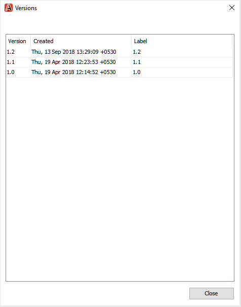
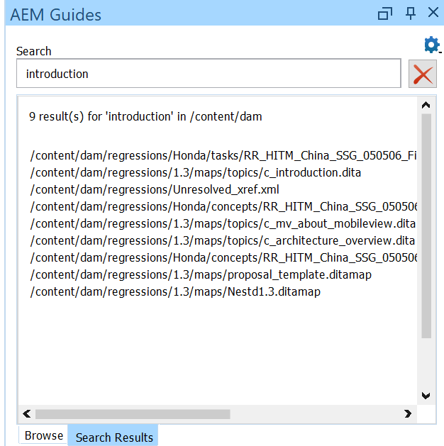

# Complemento de oxígeno para Adobe Experience Manager Guides {#id1645H6010Q5}

El complemento Oxygen para Adobe Experience Manager Guides \(más adelante denominado complemento Oxygen para AEM Guides en la guía\) le permite conectar el Autor XML de oxígeno con el repositorio Adobe Experience Manager AEM \(\) para crear y administrar contenido. AEM Puede utilizar el complemento para examinar, buscar y abrir archivos, desproteger y proteger archivos, cargar carpetas y archivos en el repositorio de. El panel AEM Guides AEM de la aplicación de escritorio le permite marcar las carpetas deseadas \(del repositorio de carpetas) a la lista de carpetas favoritas para acceder rápidamente a ellas. AEM AEM Además, puede instalar un paquete en la interfaz web y abrir los archivos DITA en Oxygen XML Author directamente desde la interfaz web de la.

## Descargar e instalar {#id1826M0L0PUI}

El complemento de oxígeno para AEM Guides está disponible a través de su Portal de distribución de software de Adobe. Busque &quot;oxígeno&quot; en la ficha Experience Manager y, a continuación, descargue el instalador del complemento desde su [Portal de distribución de software de Adobe](https://experience.adobe.com/#/downloads/content/software-distribution/en/general.html).

>[!NOTE]
>
>Compruebe la compatibilidad de la versión del conector de oxígeno en las notas de la versión de la Adobe Experience Manager Guides específica.

Una vez que tenga el instalador, instálelo en el equipo local donde esté instalado Oxygen XML Author. Antes de comenzar el proceso de instalación, debe asegurarse de que el sistema cumpla los requisitos técnicos para instalar el complemento de oxígeno para AEM Guides.

### Requisitos técnicos

- Oxygen XML Author versión 26.1

- Adobe Experience Manager Guides versión 4.6 o superior

- Adobe Experience Manager versión 6.5 con Service Pack 21, 20 y 19

- Sistema operativo compatible con Oxygen XML Author versión 26.1

- Java Development Kit
   - Oracle SE 8 JRE 1.8

### Instalación del complemento en Windows

>[!IMPORTANT]
>
>Si tiene una versión anterior del complemento instalado en el sistema, asegúrese de desinstalarlo antes de iniciar el proceso de instalación. Consulte la sección **Desinstalación de paquetes** en el artículo de [Cómo trabajar con paquetes](https://helpx.adobe.com/experience-manager/6-4/sites/administering/using/package-manager.html) para obtener instrucciones de desinstalación.

Realice los siguientes pasos en el sistema donde está instalado Oxygen XML Author:

1. Inicie el archivo `.exe` del instalador.

   Aparecerá la pantalla de bienvenida del asistente de instalación.

1. Haga clic en **Siguiente** y busque la ubicación donde esté disponible el archivo .exe de Oxygen XML Author.

1. Seleccione el archivo y haga clic en **Abrir**.

   La ubicación del archivo seleccionado se agrega en el asistente de instalación.

1. Haga clic en **Siguiente**.

1. Haga clic en **Instalar**.

1. Haga clic en **Finalizar** para cerrar el asistente de instalación.
1. Inicie Oxygen XML Author.

   El panel AEM Guides se muestra en Oxygen XML Author.

   AEM {width="800" align="left"}

   >[!NOTE]
   >
   >Si no ve el panel AEM Guides, consulte las soluciones en la sección de solución de problemas: [Falta el panel AEM Guides](#id192BH200ZAX).


### Instalación del complemento en Mac

>[!IMPORTANT]
>
>Si tiene una versión anterior del complemento instalado en el sistema, asegúrese de desinstalarlo antes de iniciar el proceso de instalación. Consulte la sección **Desinstalación de paquetes** en las instrucciones de desinstalación del artículo [Cómo trabajar con paquetes](https://helpx.adobe.com/experience-manager/6-4/sites/administering/using/package-manager.html).

Realice los siguientes pasos en el sistema donde está instalado Oxygen XML Author:

1. Localice el archivo .dmg del complemento en su sistema.

1. Haga doble clic en el archivo .dmg para abrir el contenido del archivo.

   El archivo .dmg contiene una carpeta aem-connector-x.x y un archivo aem-connector-x.x-setup.

   >[!NOTE]
   >
   >x.x en los nombres de archivo es el número de versión del complemento.

1. Copie la carpeta aem-connector-x.x en la carpeta de complementos de Oxygen XML Author.
1. Haga doble clic en el archivo aem-connector-x.x-setup para iniciar el instalador.

1. Inicie Oxygen XML Author.

   El panel AEM Guides se muestra en Oxygen XML Author.

   AEM  {width="800" align="left"}

   >[!NOTE]
   >
   >Si no ve el panel AEM Guides, consulte las soluciones en la sección de solución de problemas: [Falta el panel AEM Guides](#id192BH200ZAX).


### AEM Instale el paquete para habilitar la función de edición de documentos desde la interfaz web de {#id182CE0Q0TY4}

AEM Como autor, puede abrir y editar sus mapas o temas DITA en Oxygen XML Author directamente desde la interfaz web de la. AEM AEM AEM Para habilitar esta función en interfaz web, el administrador de la debe instalar un paquete en la instancia de creación de la aplicación.

AEM Como administrador de la, realice los siguientes pasos para instalar el paquete:

1. Obtenga el archivo .zip del paquete de su equipo de TI.
1. AEM Inicie sesión en la instancia de *\(como administrador\)* y vaya al Administrador de paquetes de CRX. La URL predeterminada para acceder al administrador de paquetes es

   `http://<server name>:<port>/crx/packmgr/index.jsp`

   AEM El Administrador de paquetes administra los paquetes en la instalación local de la. AEM Para obtener más información acerca de cómo trabajar con el Administrador de paquetes, vea [Cómo trabajar con paquetes](https://experienceleague.adobe.com/docs/experience-manager-cloud-service/content/implementing/developer-tools/package-manager.html?lang=en) en la documentación de la documentación de la aplicación de paquetes de.

    {width="650" align="left"}

1. Para cargar el paquete Oxygen, haga clic en **Cargar paquete**.
1. En el cuadro de diálogo Cargar paquete, vaya al archivo del paquete Oxygen que descargó en el paso 1 y haga clic en Aceptar.

   AEM El paquete se cargará en la instancia de la.

1. Para iniciar el proceso de instalación, haga clic en **Instalar**.

   {width="650" align="left"}

1. En el diálogo Instalar paquete, haga clic en **Instalar**.
1. Una vez finalizada la instalación, haga clic en el botón Inicio en la esquina superior izquierda del Administrador de paquetes de CRX.
1. Seleccione un archivo DITA en la carpeta de recursos.

   La opción **Editar en oxígeno** está disponible en la barra de herramientas. AEM Para obtener más información sobre el uso de esta opción, consulte [Abrir tema de DITA en Oxygen XML Author desde la interfaz web de la interfaz de usuario de la web](#id182CE0I905Z).

   >[!NOTE]
   >
   >La opción **Editar en oxígeno** está visible al seleccionar un tema DITA. Si selecciona varios temas, la opción no estará visible.


## Configuración del complemento de oxígeno para AEM Guides {#id1826KF00AHS}

Después de descargar e instalar el complemento, debe configurar lo siguiente para trabajar con el complemento:

- **Configuración de autenticación web**: Configuración de autenticación SSO en el complemento para AEM Guides.
- AEM **Configuración general**: Configuración de conexión para el complemento, como URL del servidor de la, detalles de inicio de sesión, etc.
- **Preferencia para la personalización de atributos de generación de perfiles y nombres de archivo y en referencias cruzadas**: esta configuración es necesaria para los esquemas de atributos de generación de perfiles para los conjuntos de documentación.

### Configuración de autenticación web

JxBrowser se utiliza para la autenticación SSO mediante el complemento Conector de oxígeno. Es un navegador basado en cromo. Para java 9+, se requiere acceso a las API no públicas y el usuario debe conceder explícitamente este acceso a JxBrowser. Para obtener más información, consulte [Solución de problemas con JxBrowser](https://jxbrowser-support.teamdev.com/docs/guides/troubleshooting/issues.html).

Actualice los archivos dados para establecer la configuración de autenticación web en el complemento Oxygen para AEM Guides:

>[!NOTE]
>
>Realice una copia de seguridad del archivo antes de actualizarlo.

**Para Mac y Oxygen 26.1**

Añada las siguientes líneas en env.sh

```java
--illegal-access=permit\
--add-opens=java.desktop/javax.swing.plaf.basic=ALL-UNNAMED\
--add-exports=javafx.controls/com.sun.javafx.scene.control=ALL-UNNAMED\
--add-exports=javafx.graphics/com.sun.javafx.stage=ALL-UNNAMED\
--add-exports=javafx.graphics/com.sun.javafx.scene=ALL-UNNAMED\
--add-exports=javafx.graphics/com.sun.javafx.scene.traversal=ALL-UNNAMED\
--add-exports=javafx.graphics/com.sun.javafx.tk=ALL-UNNAMED\
--add-exports=javafx.graphics/com.sun.glass.ui=ALL-UNNAMED\
--add-opens=javafx.graphics/com.sun.glass.ui=ALL-UNNAMED\
--add-opens=javafx.graphics/javafx.stage=ALL-UNNAMED\
--add-opens=javafx.graphics/com.sun.javafx.tk.quantum=ALL-UNNAMED\
--add-exports=java.desktop/sun.awt=ALL-UNNAMED\
--add-opens javafx.swing/javafx.embed.swing=ALL-UNNAMED
```

Añada las siguientes líneas en oxygenAuthor.sh

```java
-Djdk.module.illegalAccess=permit\-Djava.ipc.external=true\
```

**Para Windows y oxígeno 26.1**

Añada las siguientes líneas en env.bat

```java
--illegal-access=permit --add-opens=java.desktop/javax.swing.plaf.basic=ALL-UNNAMED --add-exports=javafx.controls/com.sun.javafx.scene.control=ALL-UNNAMED --add-exports=javafx.graphics/com.sun.javafx.stage=ALL-UNNAMED --add-exports=javafx.graphics/com.sun.javafx.scene=ALL-UNNAMED --add-exports=javafx.graphics/com.sun.javafx.scene.traversal=ALL-UNNAMED --add-exports=javafx.graphics/com.sun.javafx.tk=ALL-UNNAMED --add-exports=javafx.graphics/com.sun.glass.ui=ALL-UNNAMED --add-opens=javafx.graphics/com.sun.glass.ui=ALL-UNNAMED --add-opens=javafx.graphics/javafx.stage=ALL-UNNAMED --add-opens=javafx.graphics/com.sun.javafx.tk.quantum=ALL-UNNAMED --add-exports=java.desktop/sun.awt=ALL-UNNAMED --add-opens javafx.swing/javafx.embed.swing=ALL-UNNAMED
```

Añada las siguientes líneas en oxygenAuthor.bat

```java
-Djdk.module.illegalAccess=permit -Djava.ipc.external=true
```

>[!NOTE]
>
>Debe ejecutar oxígeno desde oxygenAuthor.sh para Mac y oxygenAuthor.bat para Windows como administrador.

### Configuración general

Realice los siguientes pasos para configurar las opciones de conexión en el complemento Oxygen para Adobe Experience Manager Guides:

1. En el panel AEM Guides, haga clic en el icono de configuración y, a continuación, seleccione **Configuración**.

   {width="800" align="left"}

1. Especifique los siguientes detalles:
   - AEM **URL del servidor**: URL del servidor de la, por ejemplo:

     ```http
     http[s]://<host>:<port>
     ```

     AEM En la URL anterior, especifique el nombre de host y el puerto del servidor en el que está implementado el servidor de la unidad de administración de datos ().

     >[!IMPORTANT]
     >
     >AEM Si el servidor de está implementado en el puerto 80 o 443, no es necesario especificarlo en la dirección URL.

   - **Autenticación:** Elija entre **Básica \(Nombre de usuario/Contraseña\)** o **Autenticación web**. Si selecciona la autenticación **Basic**, debe introducir el **Nombre de usuario** y la **Contraseña** en el cuadro de diálogo Preferencias.

     AEM Si selecciona Autenticación web, aparecerá la pantalla Inicio de sesión de la sesión de la página de inicio de sesión de la página de la aplicación. Escriba sus credenciales de inicio de sesión y haga clic en el botón **Iniciar sesión**. AEM Cuando el inicio de sesión se realiza correctamente, la pantalla Inicio de sesión de la se cierra y el panel AEM Guides AEM muestra la lista de archivos del servidor de.

   - AEM **Tiempo de espera de la conexión**: especifique el tiempo en segundos que el cliente esperará una respuesta del servidor de la conexión de la red de distribución de datos de la red de la red de distribución de la red (). Si no se recibe ninguna respuesta del servidor en el tiempo especificado, se finaliza la solicitud. El valor predeterminado es 20 segundos.

   - AEM **Carpeta local**: ubicación en el equipo local donde se almacenan los archivos del repositorio tras la desprotección de los archivos de la carpeta de almacenamiento de los archivos de la carpeta de almacenamiento de la carpeta de destino. Si especifica una ubicación que no existe en la unidad, el complemento crea esa ubicación.
   - **Abrir archivo cuando está desprotegido**: si está seleccionado, abre los archivos durante la desprotección.
   - **Cerrar archivo al protegerlo**: si está seleccionado, cierra los archivos al protegerlos. Antes de cerrar el archivo, aparece una ventana emergente en la que puede especificar los comentarios de la versión.
   - **Mostrar cuadro de diálogo de registro al cerrar el archivo**: si está seleccionado, aparecerá una ventana emergente al cerrar un archivo. En la ventana emergente, puede elegir proteger el archivo o cerrarlo sin protegerlo.
   - **Archivo de desprotección automática al abrirlo**: si está seleccionado, al hacer doble clic en un archivo, se desprotege automáticamente y se abre para su edición. En caso de que el archivo ya esté desprotegido, simplemente se abrirá para editarlo. Si esta opción no está seleccionada, al abrir un archivo sin bloqueo se abre en modo de solo lectura.
1. Haga clic en **OK**.

### Preferencia para la personalización de atributos de perfil y nombres de archivo en referencias cruzadas {#id1827K0D0OHT}

AEM Es necesario configurar las preferencias en Oxygen XML Author para utilizar el atributo de generación de perfiles asociado a los temas DITA en el repositorio de la. También debe configurar la preferencia para mostrar los nombres de archivo en lugar de los GUID en las referencias cruzadas.

Realice los siguientes pasos para configurar atributos de generación de perfiles y referencias cruzadas:

1. En Oxygen XML Author, haga clic en **Opciones** \> **Preferencias**.
1. En la ficha **Asociación de tipo de documento**, seleccione **DITA** y, a continuación, haga clic en **Extender**.

   {width="650" align="left"}

1. En la ficha **Classpath**, seleccione `com.adobe.o2.connector` en la lista desplegable **Usar el cargador de clase principal del complemento con ID**.

   {width="650" align="left"}

1. En la ficha **Extensiones**, realice los cambios siguientes:

   - Haga clic en **Elegir** junto al **paquete de extensiones** y seleccione   `LinkResolverExtensionBundle - com.adobe.o2.framework.extn` en la lista **Class**. Haga clic en **OK**.
      {width="650" align="left"}
   - Haga clic en **Elegir** junto al **Receptor de estado de extensión de autor** en **Extensiones individuales** y seleccione `CustomAuthorExtensionStateListener - com.adobe.o2.framework.extn` en la lista **Clase**. Haga clic en **OK**.
   - Haga clic en **Elegir** junto al **Editor de valores de atributos personalizados de autor** en **Extensiones individuales** y seleccione `CustomValueEditor - com.adobe.o2.framework.extn` en la lista **Clase**. Haga clic en **OK**.
   - Haga clic en **Elegir** junto al controlador de inserción de objetos externos de **Autor** en **Extensiones individuales** y seleccione `CustomURLInsertionHandler - com.adobe.o2.ui ` en la lista **Clase**. Haga clic en **OK**.


   La siguiente captura de pantalla muestra la ficha **Extension** configurada para temas de DITA:
   
1. Haga clic en **Aceptar** en todos los cuadros de diálogo para guardar los cambios.

### Configuración de la extensión de mapa DITA

AEM La configuración de la extensión de mapa DITA es necesaria para permitir la apertura de archivos de mapa en Oxygen XML Author directamente desde la interfaz web de la. Estas configuraciones son similares a las configuraciones de generación de perfiles de atributos realizadas en el procedimiento anterior.

Siga estos pasos para configurar la extensión de mapa DITA:

1. En Oxygen XML Author, haga clic en **Opciones** \> **Preferencias**.
1. En la ficha **Asociación de tipo de documento**, seleccione **Mapa DITA** y, a continuación, haga clic en **Extender**.
1. En la ficha **Classpath**, seleccione com.adobe.o2.connector en la lista desplegable **Usar el complemento Parent Class Loader From con ID**.
1. En la ficha **Extensiones**, realice los cambios siguientes:
   - Haga clic en **Elegir** junto al **paquete de extensiones** y seleccione   `com.adobe.o2.framework.extn.LinkResolverDITAMapExtensionBundle` en la lista **Class**. Haga clic en **OK**.

   - Haga clic en **Elegir** junto al **Receptor de estado de extensión de autor** en **Extensiones individuales** y seleccione `CustomDITAMapAuthorExtensionStateListener - com.adobe.o2.framework.extn` en la lista **Clase**. Haga clic en **OK**.

   - Haga clic en **Elegir** junto al controlador de inserción de objetos externos de **Autor** en **Extensiones individuales** y seleccione `CustomURLInsertionHandler - com.adobe.o2.ui ` en la lista **Clase**. Haga clic en **OK**.

   - Haga clic en **Elegir** junto al **Editor de valores de atributos personalizados de autor** en **Extensiones individuales** y seleccione `CustomValueEditor - com.adobe.o2.framework.extn` en la lista **Clase**. Haga clic en **OK**.

   - Haga clic en **Elegir** junto a la **Resolución de referencias** en **Extensiones individuales** y seleccione `CustomDITAMapReferenceResolver - com.adobe.o2` en la lista **Clase**. Haga clic en **OK**.
   - *\(Opcional\)* Si no desea resolver las referencias al abrir un archivo de asignación, debe realizar la siguiente configuración adicional:

   La siguiente captura de pantalla muestra la ficha **Extension** configurada:
   

1. Haga clic en **Aceptar** en todos los cuadros de diálogo para guardar los cambios.

## Trabajar con el complemento de oxígeno para AEM Guides {#id1826JG00WY4}

### Panel de AEM Guides

La siguiente pantalla muestra el panel AEM Guides.

{width="550" align="left"}

**A**\) Muestra la barra de búsqueda.

**B**\) Muestra la carpeta Favoritos. De forma predeterminada, está vacío. AEM Puede añadir carpetas del repositorio de la como favoritas; a continuación, las carpetas favoritas se muestran aquí.

AEM **C**\) La carpeta DAM muestra el repositorio de la. Puede expandir y contraer la vista de carpetas.

**D**\) El icono \(engranaje\) de Configuración con las siguientes opciones:

- AEM **Conectar**: selecciona esta opción para conectarte al servidor de. AEM La opción se desactiva cuando Oxygen XML Author está conectado al servidor de la.
- AEM **Actualizar**: seleccione esta opción para obtener el estado más reciente de los archivos y la carpeta del repositorio de carpetas de la biblioteca de la biblioteca de la biblioteca de la biblioteca de carpetas de la biblioteca de la biblioteca de carpetas de la biblioteca de datos de la biblioteca de datos de la biblioteca de carpetas.

  >[!NOTE]
  >
  >Asegúrese de guardar los archivos antes de actualizarlos. Si selecciona la opción **Actualizar**, recibirá una advertencia para guardar los archivos antes de actualizarlos. Si no has guardado tus archivos, puedes hacer clic en **Cancelar** y guardarlos.

- **Configuración**: Puede utilizar esta opción para abrir el cuadro de diálogo Preferencias generales del complemento.
- AEM **Cerrar sesión**: seleccione esta opción para cerrar la conexión al servidor de la. Esta opción solo está disponible si utiliza el modo Autenticación web.

### Funciones del menú contextual

Las funciones del complemento Oxygen para AEM Guides AEM están disponibles al hacer clic con el botón derecho en una carpeta o archivo del repositorio de. Las funciones disponibles para las carpetas son diferentes de los archivos. Esta es una lista completa de funciones en el menú contextual de Oxygen Plugin for AEM Guides:

- **Abrir**: Abre el archivo seleccionado o expande la carpeta seleccionada.
- **Abrir en**: puede elegir abrir el archivo seleccionado en el Editor web de AEM Guides, en el Panel de mapas o en el Editor de mapas. Para obtener más información sobre estas opciones, consulte [Abrir archivo en el editor de AEM Guides](#id195GH0V30KX).
- AEM **Desproteger**: desprotege un archivo del repositorio de la. Para obtener más información, consulte [Archivos de desprotección](#id195HC020TS4).
- **Desproteger con dependientes**: desprotege un archivo con sus referencias directas. Para obtener más información, consulte [Archivos de desprotección](#id195HC020TS4).
- **Desproteger con dependientes de solo lectura**: desprotege el archivo seleccionado junto con sus dependientes. No puede realizar ningún cambio en los archivos dependientes. Para obtener más información, consulte [Archivos de desprotección](#id195HC020TS4).
- **Cancelar desprotección**: cancela el archivo desprotegido, lo cierra del editor y revierte los cambios a la última versión del archivo guardado en el servidor.
- AEM **Actualizar**: en el caso de un archivo, recupera la última copia del archivo del repositorio de. Para una carpeta, recupera la estructura de carpetas y el estado del archivo. Esto significa que se agrega un archivo y, a continuación, se mostrará en la vista de AEM Guides. AEM Además, si un archivo está desprotegido en el servidor, al realizar una actualización en Oxygen Author, se mostrará el archivo como desprotegido. Sin embargo, esto no actualiza la lista de archivos en la vista *Archivos desprotegidos en AEM Guides*.
- **Actualizar archivos desprotegidos**: actualiza la lista de archivos desprotegidos en la vista *Archivos desprotegidos en AEM Guides*. AEM Si un archivo está desprotegido en el servidor, al realizar una actualización, se actualizará la lista de archivos desprotegidos en la vista *Archivos desprotegidos en AEM Guides*. Sin embargo, si se ha agregado un nuevo archivo o si el estado de un archivo ha cambiado, no se actualiza en la vista de árbol de AEM Guides. AEM Para actualizar el estado de los archivos en el momento de la actualización, debe realizar una actualización.
- **Proteger**: protege archivos que ha desprotegido. Para obtener más información, consulte [Proteger un archivo](#id182CF0J0FHS).
- **Proteger con dependientes**: Si ha desprotegido archivos con dependientes, esta opción protege el archivo principal junto con sus dependientes. Para obtener más información, consulte [Proteger un archivo](#id182CF0J0FHS).
- AEM **Crear carpeta**: crea una carpeta en el repositorio de la. Esta opción solo está disponible en el nivel de carpeta.
- **Cargar archivo\(s\)**: Carga uno o varios archivos. Para obtener más información, consulte [Cargar archivos y carpetas](#id195HC03F03J).
- **Cargar con dependientes**: carga archivos DITA \(XML, DITA, Book map o DITA map\) con sus dependientes. Para obtener más información, consulte [Cargar archivos y carpetas](#id195HC03F03J).
- AEM **Cargar carpeta**: carga una carpeta en el repositorio de la. Para obtener más información, consulte [Cargar archivos y carpetas](#id195HC03F03J).
- **Agregar a Favoritos**: Agrega una carpeta a la carpeta *Favoritos* del panel AEM Guides. AEM Se recomienda agregar la carpeta de trabajo aquí, lo que facilita la sincronización de archivos y el estado del archivo desde el punto de vista de la vista de la vista de la vista de la vista de los archivos
- **Quitar de Favoritos**: quita una carpeta de *Favoritos*. Para obtener más información, consulte [Agregar o quitar favoritos](#id195HC04405P).
- **Ver metadatos**: muestra metadatos como la clase DITA, el título, el tipo, el UUID y otra información asociada a un archivo. Para obtener más información, consulte [Ver los metadatos de un archivo](#id195GHN0H05C).
- **Ver versiones**: muestra el historial de versiones de un archivo. Para obtener más información, consulte [Ver el historial de versiones de un archivo](#id195GI000D5Q).

### Abra un archivo en Oxygen XML Author {#id195GHJ0A0UB}

AEM Una vez que se haya conectado al repositorio de, puede abrir los archivos para editarlos en Oxygen XML Author. Realice los siguientes pasos para abrir un archivo para editarlo en Oxygen XML Author:

1. Haga clic con el botón derecho en un archivo del panel de AEM Guides que desee abrir para editarlo.

1. Seleccione **Abrir** en el menú contextual.

   El archivo se abre en el editor de Oxygen XML Author.

    {width="800" align="left"}

   Cuando pasa el puntero del ratón sobre la pestaña de un archivo, se muestra la ruta del servidor junto con su UUID. En la captura de pantalla anterior, se resalta el UUID del documento.


Si ha seleccionado la opción \(en el cuadro de diálogo Preferencias\) **Desproteger automáticamente el archivo al abrirlo**, al abrirlo, el archivo se desprotege automáticamente y está disponible para su edición. Para abrir un archivo, puedes hacer doble clic en el nombre de un archivo o hacer clic con el botón derecho en el nombre del archivo y elegir **Abrir** en el menú contextual. Si no se selecciona esta opción, el archivo se abre en modo de solo lectura.

>[!NOTE]
>
>También puede hacer doble clic en un archivo para abrirlo.

### Abrir archivo en el editor de AEM Guides {#id195GH0V30KX}

Si desea utilizar los editores disponibles en AEM Guides, puede hacerlo seleccionando la opción requerida en el menú contextual. Realice los siguientes pasos para utilizar el editor de AEM Guides en lugar del editor de Oxygen XML Author:

1. Haga clic con el botón derecho en un archivo del panel de AEM Guides que desee abrir para editarlo.

1. Seleccione **Abrir en** en el menú contextual y elija entre las siguientes opciones:

   - **Editor de temas web**: Si el archivo que está abriendo es un archivo .xml o .dita, puede abrirlo para editarlo en el Editor web. Elija la opción **Editor de temas web** para abrir el archivo seleccionado y editarlo en el Editor web.

   - **Tablero de mapas**: puede elegir editar un archivo .ditamap en el tablero de mapas, donde puede realizar varias operaciones en el archivo de mapa. Estas operaciones dependen de la función o el grupo al que pertenezca.

   - **Editor de mapas DITA Web**: Si desea abrir el archivo .ditamap para editarlo en el Editor de mapas, elija esta opción. Con la opción Editor de mapas DITA, se pueden añadir o quitar temas, añadir tablas de relación y realizar otras operaciones en el mapa.


### Archivos de desprotección {#id195HC020TS4}

AEM Cuando se retira un archivo, se almacena localmente en el sistema y se bloquea para su edición en el repositorio de. Realice los siguientes pasos para desproteger un archivo:

1. Puede desproteger los archivos de una de las siguientes maneras:
   - Haga clic con el botón derecho en un archivo del panel AEM Guides.
   - Pulse con el botón derecho del ratón en la ficha de asignación del panel Administrador de mapas DITA.
   - Haga clic con el botón derecho en un archivo del panel Administrador de mapas DITA.
   - Haga clic con el botón secundario en la ficha del archivo cuando abra un mapa o tema en el Editor.

1. Seleccione una de las siguientes opciones:
   - AEM **Desproteger:** Desprotege un archivo del repositorio de la biblioteca de recursos y lo pone a disposición para que lo edite.
   - **Desproteger con dependientes**: desprotege un archivo con sus referencias directas. Puede realizar cambios en las páginas principales y secundarias mediante esta opción. El complemento de oxígeno para AEM Guides admite el registro de un nivel de dependientes. Por ejemplo, el Mapa A hace referencia al Tema A y el Tema A hace referencia al Tema B. Si se retira el Mapa A, se retirará el Tema A independientemente de su nivel en la jerarquía del índice. Sin embargo, no comprobará el Tema B porque no está directamente vinculado desde el Mapa A.
   - **Desproteger con dependientes de solo lectura**: Desprotege un archivo y descarga sus dependientes en el equipo local como copias de solo lectura. No puede realizar ningún cambio en los archivos dependientes.

Si ha seleccionado la opción **Abrir archivos al desproteger** \(en el cuadro de diálogo Preferencias\), al desproteger un archivo, éste se abrirá automáticamente para editarlo.

Si ha seleccionado la opción \(en el cuadro de diálogo Preferencias\) **Desproteger automáticamente el archivo al abrirlo**, al abrirlo, el archivo se desprotege automáticamente y queda disponible para la edición. Para abrir un archivo, puedes hacer doble clic en el nombre de un archivo o hacer clic con el botón derecho en el nombre del archivo y elegir **Abrir** en el menú contextual.

Cuando un archivo está desprotegido, el icono del archivo cambia para mostrar su estado bloqueado.

{width="650" align="left"}

En la captura de pantalla anterior, se muestra un archivo desprotegido por otro usuario con un icono de candado de color negro \(A\). El archivo desprotegido por el usuario actual se muestra con un candado \(B\) de color verde.

>[!NOTE]
>
>AEM Si el archivo desprotegido se elimina o se mueve a cualquier otra carpeta de la lista de carpetas, aparecerá un mensaje de error al proteger el archivo. AEM Asegúrese de que el archivo desprotegido no se mueve ni se elimina mediante la interfaz Web de la interfaz de usuario de la aplicación de seguridad de la aplicación de seguridad de la aplicación de seguridad de la aplicación (Web).

### Proteger un archivo {#id182CF0J0FHS}

AEM Cuando se protege un archivo, la copia local del sistema se almacena en el repositorio de la y se elimina el bloqueo del archivo. Siga estos pasos para proteger un archivo:

1. Guarde el archivo haciendo clic en **Archivo** \> **Guardar**.

1. Haga clic con el botón secundario del mouse (ratón) en un archivo o mapa desprotegido en una de las ubicaciones siguientes:
   - Panel de AEM Guides
   - Panel Administrador de mapas DITA
   - Ficha del archivo cuando se abre un mapa o un tema en el Editor.
   - La ficha Mapa del panel Administrador de mapas DITA.

1. Elija entre las dos opciones siguientes:

   - AEM **Proteger**: Protege el archivo seleccionado del sistema local en el repositorio de la.
   - **Proteger con dependientes:** Si ha desprotegido un archivo junto con sus dependientes, utilice esta opción para proteger todos los archivos dependientes en una sola operación. Al seleccionar esta opción, se muestra el cuadro de diálogo Proteger con todos los archivos dependientes. Haga clic en Aceptar para proteger todos los archivos a la vez.

   Si no ha desprotegido los archivos dependientes y elige esta opción, sólo se desprotegerán los archivos dependientes que tenga \(por separado\). Se mostrará una lista de archivos que no se pudieron proteger:

   {width="800" align="left"}

   Se recomienda no mover un archivo desprotegido. Sin embargo, si un archivo desprotegido se mueve a una ubicación diferente, deberá cancelar la desprotección de dicho archivo. Si desea realizar actualizaciones en ese archivo, vuelva a desprotegerlo, realice cambios y vuelva a protegerlo. Si intenta proteger un archivo que se ha movido desde su ubicación original, obtendrá un error.

   AEM Si se extrae un archivo dependiente en el modo de archivo, la opción Registrar con dependientes no mostrará el archivo dependiente en el cuadro de diálogo Registrar. AEM Para obtener una lista de los archivos dependientes desprotegidos en el archivo de datos, debe realizar una actualización de la carpeta.

   AEM Del mismo modo, si ha protegido un archivo dependiente a través de la opción de archivo, la lista de archivos no se actualiza en Oxygen Author hasta que realice una operación de actualización de carpeta y actualización de archivos desprotegidos. AEM Si realiza un registro con dependientes con algunos archivos registrados a través de la opción de registro, obtendrá un error que enumera los archivos que no se han podido registrar.

1. \(Opcional\) En el cuadro de diálogo **Registrar** o **Registrar con dependientes**, agregue un comentario en el cuadro de texto **Comentarios de la versión**.

   >[!NOTE]
   >
   >AEM Este comentario se muestra en el historial de versiones del archivo en el que se ha realizado la.

1. Agregue etiquetas en el cuadro de texto **Etiqueta** del **registro** o del cuadro de diálogo **Registrar con dependientes** Introduzca una etiqueta y pulse Intro. Por ejemplo, *Versión 2307*.

   Si el administrador ha predefinido una lista de etiquetas y las ha cargado en el archivo `label.json`, esas etiquetas se mostrarán como una lista desplegable. Puede elegir una o más etiquetas de la lista desplegable.

   {width="550" align="left"}

   Puede agregar varias etiquetas (separadas por comas) a la misma versión de un tema.  Por ejemplo, *Adobe AEM*, **, *Guías*.
Sin embargo, no se puede agregar la misma etiqueta a las distintas versiones de un tema. Si agrega una etiqueta que ya ha agregado a una versión anterior, se agrega a la versión más reciente y se elimina de la versión anterior.

   >[!NOTE]
   > 
   > AEM Estas etiquetas se muestran en el historial de versiones del archivo en el que se ha realizado la.


1. Haga clic en **OK**.

>[!NOTE]
>
>AEM Si el archivo desprotegido se elimina o se mueve a cualquier otra carpeta de la lista de carpetas, aparecerá un mensaje de error al proteger el archivo. AEM Asegúrese de que el archivo desprotegido no se mueve ni se elimina mediante la interfaz Web de la interfaz de usuario de la aplicación de seguridad de la aplicación de seguridad de la aplicación de seguridad de la aplicación (Web).

### Archivos desprotegidos en la vista de AEM Guides

Cuando tiene archivos en varias carpetas, no es fácil averiguar cuántos archivos están desprotegidos en una vista. AEM Guides proporciona Archivos desprotegidos en la vista de AEM Guides que proporciona una instantánea completa de los archivos desprotegidos actualmente. AEM Con esta vista, puede averiguar fácilmente qué archivos ha comprobado en el repositorio de datos mediante el uso de AEM Guides. Siga estos pasos para acceder a esta vista y trabajar con ella:

1. Haga clic en **Ventana** \> **Mostrar vista** \> **Archivos desprotegidos en AEM Guides**.

   Se muestran los archivos desprotegidos en la vista AEM Guides.

   {width="550" align="left"}

1. Haga clic con el botón derecho en un archivo de esta vista para obtener las siguientes opciones:

   - [Abrir](#id195GH0V30KX)
   - [Abrir en](#id195GH0V30KX)
   - Cancelar desprotección
   - [Check-In](#id182CF0J0FHS)
   - [Registro de entrada con dependientes](#id182CF0J0FHS)
   - [Ver metadatos](#id195GHN0H05C)
   - [Ver versiones](#id195GI000D5Q)

**Notas sobre los archivos desprotegidos en la vista de AEM Guides:**

- La vista *Archivos desprotegidos en AEM Guides* mantiene las sesiones del usuario. Esto significa que los archivos desprotegidos por el usuario actual se almacenan y mantienen en la vista en las sesiones \(o caché\) del mismo usuario.

- AEM Si el usuario cambia las credenciales de inicio de sesión o el servidor de, se restablecerán los datos \(o caché\) del archivo desprotegido en la vista. El usuario debe ejecutar manualmente un comando *Actualizar archivos desprotegidos* en cada carpeta desde la que se desprotegieron los archivos anteriormente. Para simplificar esto, se recomienda agregar las carpetas de trabajo a *Favoritos* desde donde podrá actualizar rápidamente las carpetas.

- Puede ordenar la lista de archivos según sus nombres de archivo, título o ruta de acceso. Si se desprotege un nuevo archivo, éste aparece ordenado en la vista.


### Carga de archivos y carpetas {#id195HC03F03J}

Siga estos pasos para cargar archivos o carpetas:

1. Haga clic con el botón derecho en una carpeta del panel AEM Guides.
1. Seleccione una de las siguientes opciones:
   - AEM **Cargar archivo\(s\)**: seleccione esta opción para cargar uno o varios archivos en la carpeta seleccionada en el repositorio de la. En el cuadro de diálogo Seleccionar archivos \(s\) para cargar, seleccione los archivos y haga clic en **Abrir**.
   - **Cargar con dependientes**: seleccione esta opción para cargar un archivo DITA con sus dependientes. En el diálogo Seleccionar archivo para cargar, seleccione los archivos y haga clic en **Abrir**.
   - AEM **Cargar carpeta**: seleccione esta opción para cargar una carpeta en el repositorio de la. En el diálogo Elegir, seleccione la carpeta y haga clic en **Elegir**.

**Notas adicionales sobre cómo trabajar con archivos basados en UUID**:

AEM Se deben tener en cuenta los siguientes puntos al mover o copiar contenido del sistema local a un repositorio de datos de la base de datos de la base de datos de la base de datos de la base de datos de:

- Al cargar uno o más archivos, se genera un nuevo UUID para los archivos que no tienen ningún UUID. Este UUID se agrega en `topic id` de un archivo DITA.

- Al copiar una carpeta, las referencias a los ficheros \(dentro de la carpeta\) se actualizan automáticamente en todas las asignaciones DITA que hacen referencia a ficheros de dicha carpeta.

- Al copiar un fichero de mapa DITA, las referencias UUID dentro del fichero de mapa no cambian.

- Si un archivo o una carpeta tiene un conflicto o un duplicado, se generará un nombre de archivo único para el nuevo archivo que se está copiando o moviendo.

- Dos archivos no pueden tener el mismo UUID. Se asigna un UUID único a todos los archivos nuevos.

- Si dos usuarios diferentes están cargando un archivo al mismo tiempo, el archivo que se procese más adelante sobrescribirá el archivo anterior. Sin embargo, esa práctica debería evitarse.

- AEM Cuando extraiga contenido del repositorio de y realice cambios en el sistema local, asegúrese de que el nombre del archivo no cambie en el momento de cargarlo.

- Al insertar una referencia en el Administrador de mapas DITA o en el Editor, se muestra el título del archivo y no el UUID. Si el título no está presente, se muestra el nombre del archivo.

### Agregar o quitar Favoritos {#id195HC04405P}

Siga estos pasos para agregar o quitar una carpeta a la carpeta Favoritos en el panel AEM Guides:

- Haga clic con el botón derecho en una carpeta y seleccione **Agregar a Favoritos**. Puede agregar una carpeta a Favoritos si no está en Favoritos.
- Puede quitar una carpeta de favoritos de las siguientes maneras:
   - Haga clic con el botón derecho en una carpeta de la carpeta **Favoritos** y seleccione **Quitar de Favoritos**.
   - AEM Haga clic con el botón derecho en una carpeta del repositorio de la carpeta **DAM** que ya se haya agregado como favorita y seleccione **Quitar de Favoritos**.

### Ver el historial de versiones de un archivo {#id195GI000D5Q}

Siga estos pasos para ver el historial de versiones de un archivo:

1. Haga clic con el botón derecho en un archivo del panel AEM Guides.

1. Seleccione **Ver versiones** en el menú contextual.

   El historial de versiones del archivo se muestra en el cuadro de diálogo Versiones.

   {width="550" align="left"}


### Visualización de los metadatos de un archivo {#id195GHN0H05C}

Siga estos pasos para ver los metadatos de un archivo:

1. Haga clic con el botón derecho en un archivo del panel AEM Guides.

1. Seleccione **Ver metadatos** en el menú contextual.

   Los metadatos del archivo, como la clase DITA, el estado del documento, la fecha de modificación, el tamaño, el título y el UUID, se muestran en el cuadro de diálogo Metadatos.

   {width="550" align="left"}


## AEM Buscar un tema en el repositorio de la {#id1826J20405Z}

AEM Puede buscar temas en el repositorio de mediante la barra de búsqueda del panel AEM Guides. Puede buscar en toda la carpeta DAM o seleccionar una carpeta y, a continuación, buscar un tema en esa carpeta. El resultado de la búsqueda muestra los temas cuyo texto coincide con la consulta de búsqueda.

Siga estos pasos para buscar temas:

1. AEM Seleccione una carpeta en el repositorio de en la que desee buscar un tema.
1. Escriba la consulta de búsqueda \(por ejemplo, `introduction`\) en la barra de búsqueda del complemento Oxígeno para AEM Guides.
1. Haga clic en el botón de búsqueda o pulse Intro.

   El resultado se muestra en la ficha Resultados de la búsqueda como una lista con la ruta de acceso del archivo. Si no hay resultados coincidentes para la consulta de búsqueda, se muestra el mensaje No se encontraron resultados en la &lt;ruta de la carpeta seleccionada\>.

   {width="550" align="left"}

1. \(Opcional\) Haga doble clic en un archivo en el resultado de la búsqueda para abrirlo en Oxygen XML Author.
1. AEM Para volver a la vista Repositorio de, siga uno de estos procedimientos:
   - AEM Para ver la vista del repositorio de la sin borrar los resultados de la búsqueda, haz clic en la pestaña **Examinar**.
   - AEM Para borrar los resultados de la búsqueda y ver el repositorio de, haga clic en el icono Eliminar búsqueda.

## AEM Abrir el tema DITA en Oxygen XML Author desde la interfaz web de la interfaz de usuario de {#id182CE0I905Z}

AEM Puede abrir y editar el tema DITA en Oxygen XML Author desde la interfaz web de la interfaz de usuario de la aplicación de. AEM Para activar esta opción, debe instalar un paquete en el. AEM Para obtener más información acerca de la instalación del paquete, consulte [Instalar el paquete para habilitar la característica de edición de documentos desde la interfaz web](#id182CE0Q0TY4) de la interfaz de usuario del sitio web de la interfaz de usuario.

>[!NOTE]
>
>AEM Se puede acceder a la opción **Editar en oxígeno** desde varios lugares de la lista: cuando se selecciona un tema, cuando se obtiene una vista previa de un tema o desde la pestaña Temas e informes de la consola de mapas DITA. Si selecciona varios temas, la opción no estará visible en la barra de herramientas.

**Abrir un tema DITA**

Realice los siguientes pasos para abrir un tema DITA en Oxygen XML Author:

1. Seleccione un tema en sus recursos y haga clic en la opción **Editar en oxígeno** de la barra de herramientas.

   >[!NOTE]
   >
   >Si el tema no está extraído, primero se extrae y, a continuación, se abre en Oxígeno en el modo de edición.

1. Seleccione Oxygen XML Author *&lt;version\>* en el cuadro de mensaje **Iniciar aplicación**. AEM Puede seleccionar la opción **Recordar mi elección para los vínculos de la** para guardar su preferencia.

**Editar un tema DITA**

Realice los siguientes pasos para editar un tema DITA en Oxygen XML Author:

1. Seleccione y desproteja un tema de los recursos.
1. Haga clic en la opción **Editar en oxígeno** de la barra de herramientas.

   >[!NOTE]
   >
   >Si el tema no está extraído, primero se extrae y, a continuación, se abre en Oxígeno en el modo de edición.

1. Seleccione Oxygen XML Author *&lt;version\>* en el cuadro de mensaje **Iniciar aplicación**. AEM Puede seleccionar la opción **Recordar mi elección para los vínculos de la** para guardar su preferencia.
1. Edite el tema en Oxygen XML Author.
1. Consulte el tema en el complemento Oxígeno para AEM Guides.

   Para obtener más información sobre cómo proteger un tema con el complemento Oxygen para AEM Guides, vea [Proteger un archivo](#id182CF0J0FHS).

   >[!NOTE]
   >
   >Asegúrese de proteger el tema con el complemento Oxygen para AEM Guides AEM; si lo hace desde la interfaz web de la aplicación, los cambios que realice en Oxygen XML Author no se guardarán en la versión protegida del tema.

**Insertar una referencia a un tema del repositorio de Experience Manager Guides**

También se puede arrastrar y soltar un tema para insertar la referencia en un tema o en un mapa DITA.
>[!NOTE]
>
> Es necesario desproteger un archivo antes de agregar cualquier referencia a él.

Se añaden los siguientes elementos en función del tipo de referencias:

Si suelta en el editor con un tema abierto:
- Se agregó una referencia con el elemento `<image>` para las imágenes.
- Se agrega un elemento de objeto para un vídeo o audio.
- El elemento `<xref>` se agrega para todas las demás referencias como tema, asignación, DITAVAL, PDF, ZIP y XML.

Si se coloca en el Editor o en el Administrador de mapas DITA con un mapa abierto:
- El elemento `<mapref>` se agrega para referencias de mapa, que incluyen un mapa DITA, un mapa de libro o un esquema de asunto.
- El elemento `<topicref>` se agrega para todas las demás referencias como tema, asignación, DITAVAL, PDF, ZIP y XML.


## Trabajo con perfiles de atributos {#id1827JA002YK}

AEM Guides permite crear y asociar fácilmente atributos condicionales utilizando los atributos DITA relevantes. Puede definir atributos condicionales en el nivel global o de carpeta. Las condiciones definidas globalmente son visibles en todos los proyectos y las condiciones a nivel de carpeta solo son visibles en proyectos creados dentro de la carpeta especificada. Los autores de contenido pueden utilizar estos atributos condicionales para condicionar el contenido de sus temas o mapas DITA que crean o utilizan. AEM Para obtener más información acerca de cómo crear atributos condicionales en los que utilizan AEM Guides, consulte la sección *Configuración de atributos condicionales para perfiles globales o de nivel de carpeta* en Instalar y configurar Adobe Experience Manager Guides.

>[!NOTE]
>
>AEM Asegúrese de haber agregado los atributos condicionales en el contenido y de haber establecido [Preferencia para la personalización de atributos de creación de perfiles](#id1827K0D0OHT) antes de agregar atributos condicionales al contenido.

Realice los siguientes pasos para agregar atributos condicionales al contenido en Oxygen XML Author:

1. Comprueba y abre un tema del *Complemento de oxígeno para AEM Guides*.
1. Seleccione la parte del contenido donde desea aplicar los atributos condicionales.
1. Haga doble clic en el atributo condicional en el panel Atributos del Autor XML de Oxygen.

   {width="300" align="left"}

1. En la columna **Disponible** del cuadro de diálogo Editar atributo, seleccione el atributo\(s\) y haga clic en **Agregar**.

   La siguiente pantalla muestra `audience` atributos.

   {width="550" align="left"}

1. Haga clic en **OK**.

   Los atributos se añaden al contenido.


## Solución de problemas comunes {#id188ABC00RY4}

Este tema cubre algunos de los problemas más comunes que podría tener al trabajar con el complemento, junto con sus soluciones.

### Falta el panel AEM Guides {#id192BH200ZAX}

**Problema**: si no ve el panel AEM Guides en Oxygen XML Author, pruebe las siguientes soluciones:

Solución 1:

1. En Oxygen XML Author, habilite el complemento.

   Haga clic en **Opciones** \> **Preferencias** \> **Complementos** y seleccione **Complemento de oxígeno para Adobe Experience Manager Guides.**

1. Reinicie Oxygen XML Author.


Solución 2:

1. Si sigue sin ver el panel AEM Guides, habilite la ventana AEM Guides.

   En Oxygen XML Author, Haga Clic En **Ventana** \> **Mostrar Vista** \> **AEM Guides**.

Solución 3:

1. Desinstale y vuelva a instalar el complemento Oxygen para Adobe Experience Manager Guides.

   - En Windows, desinstale el complemento de la lista **Agregar o quitar programas**. A continuación, vuelva a instalar el complemento.

   - En Mac, accede a la carpeta aem-connector-x.x de la carpeta de complementos de Oxygen XML Author y muévala a **Papelera**. A continuación, vacíe la carpeta **Papelera**.


### Configurar el puerto para la transformación DITA-OT

**Problema**: al ejecutar cualquier transformación DITA-OT en archivos procesados por el complemento, la transformación falla con el siguiente error:

{width="800" align="left"}

**Solución**: este problema se ha corregido agregando un servidor proxy entre DITA-OT y el complemento. Este servidor proxy procesa y comparte todos los archivos solicitados por DITA-OT para las transformaciones. El puerto predeterminado en el que se ha configurado este servidor es: `5972`. Si utiliza este puerto para algún otro servidor, puede especificar un puerto diferente para el servidor proxy.

Realice los siguientes pasos para cambiar el puerto predeterminado del servidor proxy:

1. Vaya al directorio de inicio de \(user\).
1. Cree un archivo llamado aem\_connector\_proxy.
1. Abra el archivo en cualquier editor de texto y agregue un número de puerto disponible en la primera línea del archivo.
1. Guarde y cierre el archivo.
1. Reinicie Oxygen XML Author y ejecute la transformación DITA-OT.


### El panel AEM Guides no busca la ubicación del archivo abierto

AEM Problema: Cuando elige abrir un archivo para editarlo en Oxygen XML Author desde el servidor de, el archivo se abre para editarlo en Oxygen XML Author. Sin embargo, el panel AEM Guides no muestra la ubicación del archivo en el árbol de navegación.

Solución: este problema se ha observado en escenarios en los que la ruta de archivo contiene /content/dam dos veces. AEM De forma predeterminada, todos los recursos de los recursos de se almacenan en la carpeta /content/dam. Si carga o crea una estructura de carpetas que también contiene /content/dam, se observa este problema. Puede realizar todas las operaciones normales con estos archivos, pero su ubicación en el árbol de navegación no se muestra de forma predeterminada. Para acceder a dicho archivo en el árbol de navegación, debe examinar manualmente la ubicación del archivo. Tenga en cuenta que en el árbol de navegación, la ruta duplicada /content/dam se reemplaza por /content/assets.

### Configurar el registro

Problema: De forma predeterminada, el complemento Oxygen para AEM Guides no genera ningún registro, lo que dificulta la depuración de cualquier escenario de error.

Solución: realice los siguientes pasos para configurar los registradores de Xygen y JxBrowser:

1. Cerrar Oxygen XML Author

1. Cree un archivo de nombre `logback.xml` con el siguiente contenido:

   ```xml
   <configuration>
       <appender name="R2" class="ch.qos.logback.core.rolling.RollingFileAppender">
           <file>${user.home}/Desktop/oxygenLog/oxygen.log</file>
           <rollingPolicy class="ch.qos.logback.core.rolling.FixedWindowRollingPolicy">
               <fileNamePattern>${user.home}/Desktop/oxygenLog/oxygen%i.log.gz</fileNamePattern>
               <minIndex>1</minIndex>
               <maxIndex>20</maxIndex>
           </rollingPolicy>
           <triggeringPolicy class="ch.qos.logback.core.rolling.SizeBasedTriggeringPolicy">
               <maxFileSize>100MB</maxFileSize>
           </triggeringPolicy>
           <encoder>
               <pattern>%r %marker %p [ %t ] %c - %m%n</pattern>
           </encoder>
       </appender> 
   
       <root level="debug">
           <appender-ref ref="R2" />
       </root>
   </configuration>   
   ```

1. Guarde el archivo en el directorio `Oxygen Author 26`. (Por ejemplo, la ruta sería: `C:\Program Files\Oxygen XML Author 26\logback.xml`)

1. Cierre el archivo. Se habilitarán los registros de oxígeno, que estarán disponibles en la ruta: `${user.home}/Desktop/oxygenLog/oxygen.log`
1. Abra el archivo `oxygenAuthor.bat` en un editor de texto.
1. Configure los registros relacionados con JxBrowser añadiendo el parámetro
   `-Denable.aem.jx.log=true`. Esto habilita los registros relacionados con JxBrowser, que puede ver en la ruta: `${user.home}\AppData\Local\Temp\Oxygen_Plugin_Javax_Log.log`:


   ```java
   SET OXYGEN_JAVA=java.exe
   if exist "%JAVA_HOME%\bin\java.exe" set OXYGEN_JAVA="%JAVA_HOME%\bin\java.exe"
   if exist "%~dp0\jre\bin\java.exe" SET OXYGEN_JAVA="%~dp0\jre\bin\java.exe"
   rem Set environment variables
   call "%~dp0\env.bat"
   %OXYGEN_JAVA% -XX:-OmitStackTraceInFastThrow -XX:SoftRefLRUPolicyMSPerMB=10 -Djdk.module.illegalAccess=permit -Djava.ipc.external=true 
   -Denable.aem.jx.log=true -Dsun.java2d.noddraw=true -Dsun.awt.nopixfmt=true -Dsun.java2d.dpiaware=true -Dsun.io.useCanonCaches=true -Dsun.io.useCanonPrefixCache=true 
   -Dsun.awt.keepWorkingSetOnMinimize=true -Dcom.oxygenxml.app.descriptor=ro.sync.exml.AuthorFrameDescriptor
    -Dcom.oxygenxml.ApplicationDataFolder="%APPDATA%" -cp %CP% ro.sync.exml.Oxygen %*
   ```


Con los pasos anteriores, los registros se habilitarán y puede utilizarlos para depurar los problemas.
