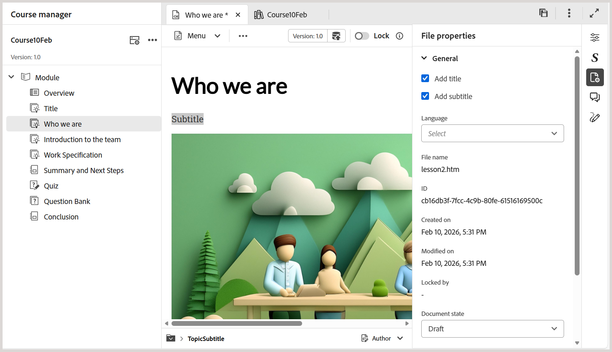
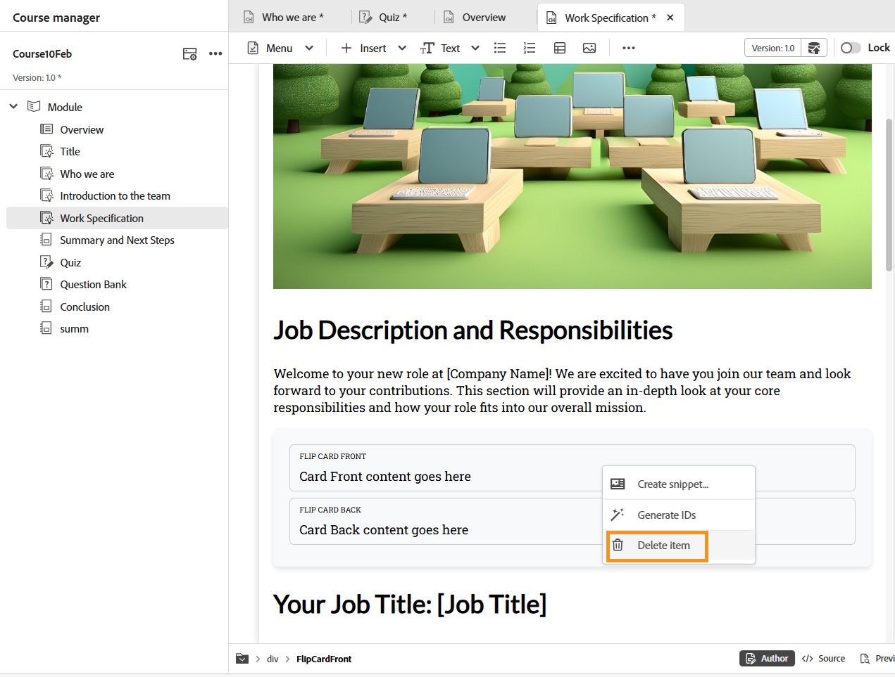
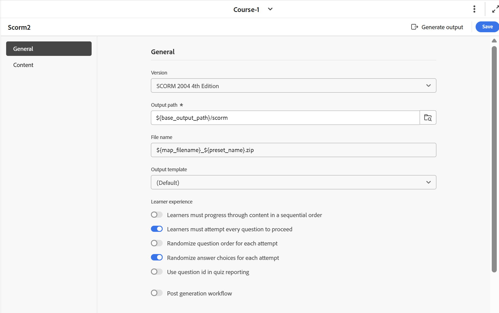

# Lanzamiento de febrero de 2026 del contenido de aprendizaje y formación sobre productos

Esta nota de la versión cubre las nuevas mejoras de funciones y los problemas corregidos en la versión de febrero de 2026 de Formación del producto y contenido de aprendizaje.

## Nuevas mejoras de funciones

Las siguientes funciones se introdujeron en la versión de febrero de 2026 de Formación del producto y contenido de aprendizaje:

- **Compatibilidad con subtítulos**: ahora puede agregar subtítulos al contenido de aprendizaje con la nueva opción **Agregar subtítulo** en **Propiedades del archivo**. Esto mejora la claridad y la capacidad de búsqueda en todo el contenido del curso.

  Para obtener más información, vea [Agregar título y subtítulo al contenido de aprendizaje](../learning-content/lc-basic-blocks.md#add-title-and-subtitle-to-learning-content).

  

- **Habilitar o deshabilitar la puntuación negativa final**: al configurar las propiedades de la prueba, puede controlar la puntuación negativa mediante la opción **Permitir puntuación final negativa**. Cuando está activado, los alumnos reciben una puntuación final mínima de cero, incluso si se ha aplicado una puntuación negativa. Esto mantiene a los alumnos motivados porque garantiza que las puntuaciones nunca caigan por debajo de cero.

  Más información sobre [Propiedades de las pruebas](../learning-content/quiz-properties.md).

  

- **Eliminar widgets con un clic derecho**: además de eliminar preguntas de prueba, ahora puede eliminar widgets como Acordeones, Voltear tarjetas y otros widgets con **clic derecho > Eliminar elemento**. Esta mejora amplía la funcionalidad *Eliminar pregunta* existente a los widgets, lo que le permite eliminarlos con menos clics y una navegación mínima.

  Más información sobre [Usar widgets interactivos](../learning-content/lc-widgets.md).

  
- **Anclar opciones de respuesta**: ahora puede fijar opciones de respuesta específicas para que su posición permanezca sin cambios, incluso cuando las respuestas se aleatorizan durante la generación de salida de SCORM. Esto es especialmente útil para opciones como *Todo lo anterior* o *Ninguno de los anteriores*.

  Más información sobre [Propiedades de la pregunta](../learning-content/quiz-insert-questions.md#question-properties).

  
- **Tipo de respuesta corta**: El tipo de pregunta de respuesta corta permite que los alumnos respondan mediante respuestas alfanuméricas breves y descriptivas en lugar de seleccionar opciones predefinidas. Este tipo de pregunta anima a los alumnos a recordar y articular activamente su comprensión con sus propias palabras, lo que hace que las evaluaciones sean más atractivas para los alumnos.

  Más información sobre [Tipos de preguntas](../learning-content/quiz-insert-questions.md#question-types).

  
- **Intento secuencial de preguntas de prueba**: ahora puede aplicar intentos de prueba secuenciales para la salida de SCORM mediante la opción **Los alumnos deben intentar cada pregunta para continuar** en el ajuste preestablecido de salida de SCORM. Cuando está activada, los alumnos deben responder a cada pregunta antes de pasar a la siguiente, con la navegación restringida hasta que se complete la pregunta actual. Esto garantiza un flujo de evaluación guiado, paso a paso y una experiencia de aprendizaje coherente.

  Para obtener más información, vea [Configurar el ajuste preestablecido de salida de SCORM](../learning-content/config-scorm-preset.md).

  

## Problemas solucionados

Los siguientes problemas se solucionaron en la versión de febrero de 2026 de Formación del producto y contenido de aprendizaje:

- Al publicar el resultado de SCORM e implementarlo en ALM, el informe de pruebas L2 muestra puntuaciones totales y máximas incorrectas para las pruebas que utilizan varios intentos y una selección aleatoria del banco de preguntas. (GUIDES-38855)
- Cuando se genera cualquier curso en el servidor de la nube, aparece un espacio en blanco no deseado debajo del pie de página de copyright debido a la hoja de estilo `coralui3.css`, lo que provoca incoherencia en el diseño. (GUIDES-38853)
- Cuando se navega por un curso de aprendizaje con un acordeón mediante el teclado, el signo + o el título de la pestaña no están resaltados, lo que impide la identificación visual del elemento activo. (GUIDES-38852)
- En el caso de los cursos generados mediante la plantilla de carbón SCORM o la plantilla predeterminada, cuando se accede a ella desde un dispositivo móvil en modo horizontal, la tabla de contenido (menú del curso) no muestra los vínculos del módulo que impiden la navegación. (GUIDES-38851)
- Al replicar la jerarquía de un curso en Experience Manager Guides, la creación de un objeto de aprendizaje requiere crear primero un grupo de aprendizaje, ya que no se admiten adiciones de nivel de objeto. (GUIDES-38849)
- Los intentos de acceso a las opciones desplegables de Coincidir con el siguiente tipo de pregunta mediante el teclado fallan porque las opciones no responden a la tecla de tabulación o flecha que impide la navegación. (GUIDES-38985)
- Al aplicar un ajuste preestablecido de estilo de encabezado, el texto seleccionado desaparece, probablemente debido a que el color de la fuente cambia a blanco, lo que hace que el texto no se pueda seleccionar y no sea visible. (GUIDES-39981)
- Cuando se utiliza Experience Manager Guides en Mozilla Firefox, la tarjeta Voltear muestra el texto de la parte frontal en sentido inverso en la parte posterior después de voltear. (GUIDES-39983)
- Al hacer clic en la Tabla de contenido (TDC) en el panel izquierdo del curso, el curso sigue mostrando el estado de finalización aunque se haya producido un error en la prueba. (GUIDES-40398)
- Si se intenta hacer coincidir el siguiente tipo de pregunta en una prueba de forma incorrecta en ALM, las opciones seleccionadas no aparecerán en el informe. (GUIDES-38640)
- Al generar la salida de PDF, los estilos de creación aplicados no se conservan, lo que provoca incoherencias en el diseño. (GUIDES-38642)

