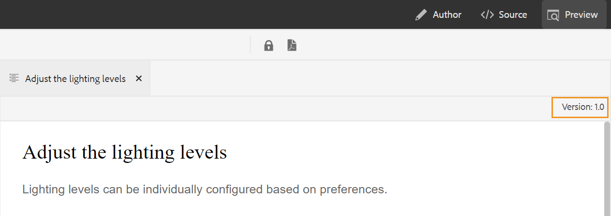

# Lanzamiento de Adobe Experience Manager Guides as a Cloud Service en abril

## Actualización a la versión de abril

Actualice la configuración actual de [!DNL Adobe Experience Manager Guides] as a Cloud Service (más adelante denominada *[!DNL AEM Guides]as a Cloud Service*) realizando los siguientes pasos:
1. Consulte el código Git de Cloud Services y cambie a la rama configurada en la canalización de Cloud Services correspondiente al entorno que desea actualizar.
1. Actualice la propiedad `<dox.version>` en el archivo `/dox/dox.installer/pom.xml` de su código Git de Cloud Services a 2022.4.133.
1. Confirme los cambios y ejecute la canalización de Cloud Services para actualizar a la versión de abril de [!DNL AEM Guides] as a Cloud Service.

## Matriz de compatibilidad

Esta sección enumera la matriz de compatibilidad para las aplicaciones de software compatibles con la versión de abril de 2022 de as a Cloud Service [!DNL AEM Guides].

### FRAMEMAKER y FRAMEMAKER PUBLISHING SERVER

| FMPS | FrameMaker |
| --- | --- |
| No compatible | Actualización 4 de 2020 y posterior |
| | |

### Conector de oxígeno

| Versión de AEM Guides Cloud | Ventanas de conector de oxígeno | Conector de oxígeno Mac |
| --- | --- | --- |
| 2022.4.0 | 2.5.6 | 2.5.6 |
|  |  |  |

*Las condiciones y de línea de base creadas en AEM son compatibles con las versiones de FMPS a partir de 2020.2.

## Nuevas funciones y mejoras

Se han añadido muchas mejoras y nuevas funciones en el editor web:

### Resolución de clave mejorada

Una referencia de clave de contenido DITA inserta una parte del contenido de un tema en otro. Utiliza una clave para localizar el contenido. Deben resolverse las referencias clave asociadas a un tema DITA. El mapa raíz seleccionado tiene la prioridad más alta para resolver las referencias clave.

Ahora, las referencias clave se resuelven en función del mapa raíz establecido en el siguiente orden de prioridad:

1. Preferencias de usuario
1. Panel Vista de mapa
1. Perfil de carpeta

Para obtener más información, consulte la sección *Resolver referencias clave* en la guía del usuario.

### Agregar un panel personalizado en el panel izquierdo

Ahora puede agregar un panel personalizado en el panel izquierdo del editor web. Puede utilizar un panel personalizado para varios fines, como proporcionar ayuda o realizar pruebas en un proyecto. Si se ha configurado un panel personalizado, también aparecerá en la lista de paneles dentro de **Configuración del editor**. Puede alternar el conmutador para mostrar u ocultar el panel personalizado.

### Posibilidad de cambiar el estado del documento de temas en un mapa DITA

Ahora puede cambiar fácilmente el estado del documento de los temas seleccionados dentro de un mapa DITA. También puede abrir y editar las propiedades de los temas seleccionados en un mapa DITA desde el menú **Más opciones** en la parte inferior del panel Vista de mapa.

### Información de versión mostrada en el modo Vista previa

El editor web le ayuda a administrar sus versiones. Ahora también puede ver la versión del tema activo o el mapa DITA en la esquina superior derecha de la ficha de archivo del tema en el modo Vista previa de un tema.

## Problemas solucionados

A continuación se enumeran los errores corregidos en varias áreas:

* Las nuevas etiquetas no se reflejan automáticamente en el menú desplegable Agregar/Quitar etiqueta; en su lugar, se requiere una actualización de Línea base. (9249)
* No se puede editar el título de la línea base si se ha creado una línea base según los criterios de la etiqueta. (9171)
* El trabajo de publicación mediante una línea de base se queda atascado en el estado &quot;en espera&quot; si el estado de la línea de base cambia a &quot;fallido&quot;. (9194)
* Al eliminar las etiquetas en referencias directas, también se eliminan las etiquetas de las referencias indirectas. (9257)
* La búsqueda mientras escribe provoca solicitudes de búsqueda no deseadas en la vista Repositorio. (9307)
* Se producen problemas cuando se utiliza cualquier palabra clave en el título de la pestaña. (9318)
* La línea de base falla al añadir una etiqueta con espacios. (9362)
* La salida del sitio de AEM no muestra correctamente el elemento glosusage. (8936)
* El error de la consola se produce al abrir la ficha **Output** en el editor web. (8715)
* El mensaje de error que se muestra al publicar un tipo de registro manual mediante Salesforce no es intuitivo. (8952)
* La configuración Validar con atributos de condición no se abre inmediatamente, sino que el usuario debe volver a abrir el archivo para ver las validaciones. (9300)
* Los metadatos no se pueden eliminar una vez que se publica un mapa DITA con metadatos.  (9178)
* El panel Traducción es visible incluso al abrir el mapa DITA en el Editor de mapas. (9053)
* La DTD personalizada definida por el usuario no tiene prioridad sobre la DTD DITA estándar incrustada en DITA-OT. (9104)
* En la función Native PDF, la carga en las plantillas falla para los archivos que no son DITA ni de imagen. (9070)
* El mecanismo de autorización ejecuta dos consultas en lugar de una, en algunos casos especializados. (9221)
* La publicación de la salida del sitio de AEM falla al utilizar la DTD personalizada. (9243)
* La nota al pie utilizada por referencia no se desplaza a la sección de notas al pie en la salida del sitio de AEM. (9234)

## Problemas conocidos

Adobe ha identificado el siguiente problema conocido en la versión de abril de as a Cloud Service [!DNL AEM Guides].

* El editor web no informa de un error cuando se crean dos o más líneas de base con el mismo nombre pero tienen diferencias de espacio o de mayúsculas y minúsculas. Por ejemplo, &quot;adobe&quot; y &quot;Adobe&quot; o &quot;Adobe&quot;.
* El conector de oxígeno se bloquea intermitentemente mientras se realiza un inicio o cierre de sesión frecuente o se cambia entre diferentes tipos de autenticación.
