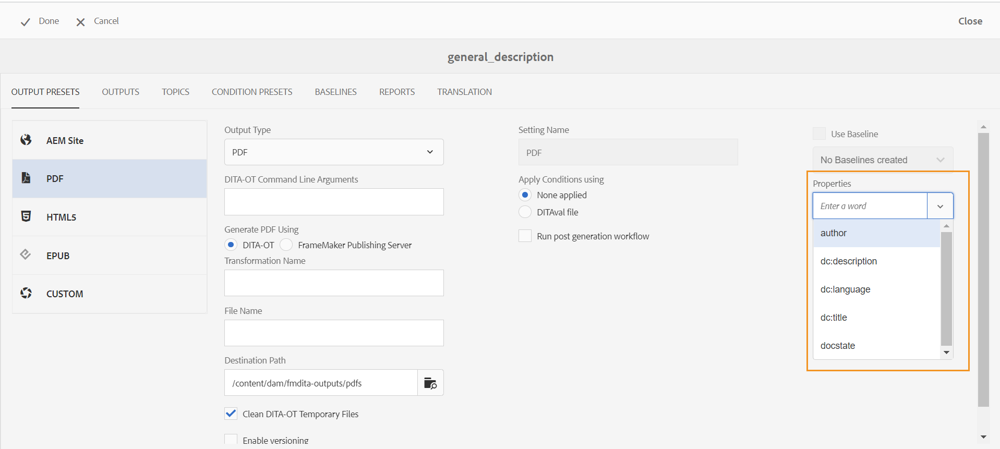

# Notas de versión | Adobe Experience Manager Guides 4.0.x

**Descargo de responsabilidad**:

*Adobe Experience Manager Guides* se había marcado anteriormente como *XML Documentation para Adobe Experience Manager*. Tenga en cuenta que algunas referencias de la documentación pueden seguir haciendo referencia a marcas anteriores, pero siguen siendo aplicables a la oferta actual.

En estas notas de la versión se explican las instrucciones de actualización, las nuevas funciones y las mejoras realizadas en la versión 4.0.x de Adobe Experience Manager Guides (denominada posteriormente AEM Guides).

## 4.0.3 | Notas de la versión

### Matriz de compatibilidad

Esta sección enumera la matriz de compatibilidad para las aplicaciones de software compatibles con AEM Guides versión 4.0.3.

#### Adobe Experience Manager

- Paquete de servicio 12, 10, 11 o 9 de la versión 6.5

Para obtener más información, consulte la sección *Requisitos técnicos* en la Guía de instalación y configuración.

#### FRAMEMAKER y FRAMEMAKER PUBLISHING SERVER

| Versión | FMPS 2020 | FMPS 2019 | Fm 2020 | Fm 2019 |
|---|---|---|---|---|
| No UUID | 2020.2 o superior* | 2019 | 2020.3 o superior | 2019.8 (última actualización) |
| UUID | 2020.2 o superior* | No compatible | 2020.4 o superior | No compatible |

*La línea de base y las condiciones creadas en la solución XML Documentation son compatibles a partir de la versión 2020.2 de FMPS.*

#### Conector de oxígeno

| Versión | Ventanas de conector de oxígeno | Conector de oxígeno Mac | Editar en ventanas de oxígeno | Editar en Oxygen Mac |
|---|---|---|---|---|
| No UUID | 1.6.8 | 1.6.8 | 1.5 | 1.5 |
| UUID | 2.3.8 | 2.3.8 | 2,2 | 2,2 |

### Problemas solucionados

A continuación se enumeran los errores corregidos en varias áreas:

- Oxygen comprueba una versión incorrecta de un tema después de revertir una versión de archivo en AEM. (9661)
- Las diferencias de marca de tiempo incorrectas se muestran en la IU de Assets al revertir una versión de archivo. (9662)
- Los archivos se desprotegen automáticamente al revertir a cualquier versión. (9663)
- El contenido traducido se interrumpe si el código de idioma se menciona como fr-fr o en-us. (9665)
- En la versión sin UUID, la traducción aprobada no se integra al idioma de destino cuando el código del idioma de destino contiene cinco caracteres, como fr_ca. (9666)
- La versión de destino de la imagen se muestra como jcr:root, después de la traducción con la opción crear nueva versión habilitada. (9668)
- Cuando la traducción se realiza con la línea de base, se envía la versión incorrecta de la imagen para su traducción. (9669)

## 4.0.2 | Notas de la versión

### Matriz de compatibilidad

Esta sección enumera la matriz de compatibilidad para las aplicaciones de software compatibles con AEM Guides versión 4.0.2.

#### Adobe Experience Manager

- Paquete de servicio 12, 10, 11 o 9 de la versión 6.5

Para obtener más información, consulte la sección *Requisitos técnicos* en la Guía de instalación y configuración.

#### FRAMEMAKER y FRAMEMAKER PUBLISHING SERVER

| Versión | FMPS 2020 | FMPS 2019 | Fm 2020 | Fm 2019 |
|---|---|---|---|---|
| No UUID | 2020.2 o superior* | 2019 | 2020.3 o superior | 2019.8 (última actualización) |
| UUID | 2020.2 o superior* | No compatible | 2020.4 o superior | No compatible |

*La línea de base y las condiciones creadas en la solución XML Documentation son compatibles a partir de la versión 2020.2 de FMPS.*

#### Conector de oxígeno

| Versión | Ventanas de conector de oxígeno | Conector de oxígeno Mac | Editar en ventanas de oxígeno | Editar en Oxygen Mac |
|---|---|---|---|---|
| No UUID | 1.6.8 | 1.6.8 | 1.5 | 1.5 |
| UUID | 2.3.8 | 2.3.8 | 2,2 | 2,2 |

### Problemas solucionados

A continuación se enumeran los errores corregidos en varias áreas:

- La posición del texto insertado o eliminado no es correcta en un documento de revisión recién creado. (9454)
- La versión 1.0 no aparece en determinados casos en el panel **Historial de versiones** después de la actualización a la versión 4.0.1. (9441)
- La etiqueta y los comentarios no se muestran para la versión actual en Versión 1.0. no aparece en determinados casos en el panel **Historial de versiones**. (9440)
- El editor se bloquea cuando se abren ciertos archivos de contenido en el editor. (9433)
- La búsqueda en el panel del repositorio y el cuadro de diálogo de exploración *topicref* se bloquea al buscar archivos de contenido grande. (9432)
- Se crean dos versiones para un archivo al guardarlo una vez desde el Editor Web. (9428)
- No se pueden insertar recursos ditaval y que no sean DITA en topicref. (9363)
- El editor depende de la carga de la previsualización de un mapa con un gran número de claves. (9332)
- Las referencias se rompen al mover los recursos en los archivos de origen durante la creación con FM update 4. (9177)

### Problemas conocidos

- Si la opción **Crear nueva versión para el archivo cargado** está activada, se crea una nueva versión al elegir **Guardar todo** de forma intermitente en algunos casos.
- La funcionalidad Eliminar usuarios en el perfil de carpeta no funciona de forma intermitente en el explorador Chrome. **Solución alternativa**: Actualice el explorador Chrome.

## 4.0.1 | Notas de la versión

### Matriz de compatibilidad

Esta sección enumera la matriz de compatibilidad para las aplicaciones de software compatibles con la versión 4.0.1 de la solución XML Documentation.

#### Adobe Experience Manager

- Paquete de servicio 12, 11 o 10 de la versión 6.5
- Java: 11

#### FRAMEMAKER y FRAMEMAKER PUBLISHING SERVER

| Versión | FMPS 2020 | FMPS 2019 | Fm 2020 | Fm 2019 |
|---|---|---|---|---|
| No UUID | 2020.2 o superior* | 2019 | 2020.3 o superior | 2019.8 (última actualización) |
| UUID | 2020.2 o superior* | No compatible | 2020.4 o superior | No compatible |

*La línea de base y las condiciones creadas en la solución XML Documentation son compatibles a partir de la versión 2020.2 de FMPS.*

#### Conector de oxígeno

| Versión | Ventanas de conector de oxígeno | Conector de oxígeno Mac | Editar en ventanas de oxígeno | Editar en Oxygen Mac |
|---|---|---|---|---|
| No UUID | 1.6.8 | 1.6.8 | 1.5 | 1.5 |
| UUID | 2.3.8 | 2.3.8 | 2,2 | 2,2 |

### Problemas solucionados

A continuación se enumeran los errores corregidos en varias áreas:

- El árbol Referencias se rompe para un mapa cuando se añaden o eliminan referencias de temas duplicados. (8922)
- Varios problemas presentes en la sección **Versiones actuales** del **Historial de versiones.** (8909)
- Las referencias se rompen al usar **Seleccionar todo** y mover los archivos multimedia o el contenido DITA a otra carpeta. (8897)
- Varios problemas de interfaz de usuario en **Insertar referencia cruzada** > **Referencia de archivo** > **Buscar archivo** > **Filtros** > **Cambiar ruta de búsqueda** en el cuadro de diálogo del Editor web. (8889)
- Busque problemas con *topicref* y *ditavalerf* en el editor de mapas (8983).
- La búsqueda mientras escribe provoca solicitudes de búsqueda no deseadas en la vista Repositorio. (8982)
- No se pueden eliminar los usuarios administradores en el perfil de carpeta. (8926)
- La nota al pie utilizada por referencia no se desplaza a la sección de notas al pie en la salida del sitio de AEM. (9061)
- No se pueden publicar los artículos actualizados en Salesforce. (9008)
- La posición del resaltado es incorrecta en la vista en paralelo. (9009)
- No se pueden arrastrar y soltar condiciones en temas DITA. (9031)
- css_layout.css no se puede superponer en el perfil de carpeta. (9032)
- Se recibe una excepción al ver un recurso después de la carga. (9068)
- La personalización de los caracteres especiales permitidos en el Editor XML no funciona correctamente. (9075)
- En el flujo de trabajo de traducción se crea una versión adicional para el recurso traducido. (9107)
- Publicación de línea de base con un tema que usa una imagen como *conref* de otro tema, la imagen no aparece en la salida. (9172)
- Cuando se utilizan los directorios temporales de la API de asignación de descarga, no se limpian en caso de que falle la descarga. (9176)
- La alineación horizontal no está disponible para tablas de la versión 4.0. (9207)
- El atributo Keys no se muestra para *glossref*, por lo que el formulario abreviado no se puede insertar mediante referencias de inserción. (9213)
- Crear un *keydef* solo permite seleccionar un vínculo en la versión 4.0. (9214)
- El comportamiento de la funcionalidad Insertar definición de clave/*keyref* es diferente en 4.0 en comparación con 3.8.10. (9215)
- Se han corregido problemas del Editor web presentes en las versiones 3.8.6 a 3.8.10. (9219)
- Se producen problemas cuando se utiliza cualquier palabra clave en el título de la pestaña. (9317)
- La vista Source muestra varios errores para atributos no condicionales. (9278)
- Problemas presentes en el cuadro de diálogo de **Seleccionar ruta**. (9289)

## 4,0 | Notas de la versión

### Matriz de compatibilidad

Esta sección enumera la matriz de compatibilidad para las aplicaciones de software compatibles con la solución de XML Documentation versión 4.0.

#### Adobe Experience Manager

- Paquete de servicio 11, 10 o 9 de la versión 6.5

#### FRAMEMAKER y FRAMEMAKER PUBLISHING SERVER

| Versión | FMPS 2020 | FMPS 2019 | Fm 2020 | Fm 2019 |
|---|---|---|---|---|
| No UUID | 2020.2 o superior* | 2019 | 2020.3 o superior | 2019.8 (última actualización) |
| UUID | 2020.2 o superior* | No compatible | 2020.4 o superior | No compatible |

*La línea de base y las condiciones creadas en la solución XML Documentation son compatibles a partir de la versión 2020.2 de FMPS.*

#### Conector de oxígeno

| Versión | Ventanas de conector de oxígeno | Conector de oxígeno Mac | Editar en ventanas de oxígeno | Editar en Oxygen Mac |
|---|---|---|---|---|
| No UUID | 1.6.8 | 1.6.8 | 1.5 | 1.5 |
| UUID | 2.3.8 | 2.3.8 | 2,2 | 2,2 |

### Nuevas funciones y mejoras

#### Publicación basada en artículos

Con la versión 4.0, hemos introducido una función de publicación basada en artículos integrada en el editor web. Puede utilizar la función de publicación basada en artículos para generar de forma incremental el resultado de uno o más temas o publicar el contenido en una plataforma de base de conocimiento.

Esta función permite a los usuarios crear el mapa DITA de forma aditiva y publicar temas cuando estén listos. Una vez publicado el mapa, utilice la función de publicación basada en artículos para lograr una publicación incremental solo para los artículos actualizados.

Además de AEM, puede utilizar esta función única para publicar sus artículos en cualquier portal de la base de conocimiento como Salesforce. Esta función también incluye una plantilla de contenido OOTB, basada en los componentes principales de AEM, que le permite crear un repositorio basado en el conocimiento del contenido técnico. Lo bueno de esta plantilla es que es completamente personalizable para adaptarse a los requisitos de su organización y también puede admitir casos de uso como portales de intranet corporativos.

Esta publicación de artículos basada en las necesidades sobre la marcha no solo le proporciona un control completo sobre la publicación de contenido, sino que también reduce el tiempo total para publicar el contenido actualizado.

Para obtener más información, consulte *Publicación basada en artículos desde el editor web* en la Guía del usuario.

#### Editor web mejorado

Se han introducido muchas mejoras y nuevas funciones en el editor web:

- Se ha cambiado el marco principal de la IU basada en Coral a la IU basada en espectro. Esto proporciona una interfaz de usuario muy estandarizada e intuitiva.
- La nueva función Propiedades del archivo se ha introducido en el panel derecho. Puede comprobar las propiedades de un documento activo. La información se clasifica en dos secciones:
   - *General*: contiene los detalles generales del archivo, como nombre de archivo, UUID, etiquetas de metadatos, idioma, fecha de creación, estado de desprotección y estado del documento.
   - *Referencia*: contiene referencias entrantes y salientes.

     

- También se ha agregado compatibilidad con el esquema de temas en el Editor web. Ahora puede crear y utilizar el esquema de asunto mediante el panel Esquema del asunto. Con la adición del esquema de asunto, ahora puede utilizar sus propios metadatos y taxonomía corporativos.

  

- En esta versión se ha introducido una nueva herramienta de punto interactivo de glosario para administrar los glosarios de forma masiva. Con esta herramienta, puede convertir rápidamente texto en glosario y glosario en términos en lote para un mapa seleccionado o temas abiertos.

  

- Funcionalidad de actualización añadida en el panel Contenido reutilizable que le permite actualizar rápidamente el contenido reutilizable en los archivos de referencia.
- El indicador de actualización de nuevo archivo le muestra si su archivo actual (copia de trabajo) está sincronizado con la versión guardada o no.

  

- El filtro de búsqueda en el panel del repositorio y el cuadro de diálogo de exploración de archivos se han mejorado para ofrecer más opciones de filtrado, que se pueden personalizar aún más.

  

- Ahora puede cargar archivos .docx desde el Editor web.
- Las preferencias de usuario ahora se almacenan en el perfil de usuario de y no en las cookies del explorador. Esto ayuda a los usuarios a conservar sus preferencias entre exploradores o sesiones de usuario.

#### Nuevo panel de traducción

Se ha introducido un nuevo panel de traducción en el Editor web con las siguientes funciones:

- Ordenar, buscar y filtrar la lista de temas.
- Filtrar contenido por tipo de referencia: referencias directas o indirectas.
- Navegación sencilla para encontrar un proyecto existente al iniciar una solicitud de traducción.
- Se ha introducido un mecanismo de traducción en varios idiomas para evitar la creación de varios proyectos para cada idioma cuando la solicitud de traducción se inicia para más de un idioma.
- Se ha introducido una configuración para ocultar la pestaña de traducción en el panel de mapas. De forma predeterminada, está visible. Puede elegir traducir contenido mediante el panel de mapas o el Editor web.

#### Publicación mejorada

Las siguientes mejoras ya están disponibles en el proceso de publicación:

- La generación de PDF a través de FrameMaker Publishing Server ahora admite líneas de base y ajustes preestablecidos de condición.
- Los autores ahora pueden pasar metadatos de nivel de tema y mapa a la publicación DITA-OT. Esto resulta útil cuando las plantillas de PDF personalizadas están diseñadas para utilizar propiedades de metadatos de archivo como etiquetas, autor, estado del documento y mucho más.

  

- Se ha agregado una nueva configuración en configMgr para permitir a los usuarios conservar o eliminar las versiones de los temas que se eliminan cuando se utiliza la opción **Eliminar y crear** en la generación de resultados del sitio de AEM.

#### Administración de archivos mejorada

Ahora se pueden ver las siguientes mejoras mientras se trabaja con archivos en AEM Assets:

- Se ha introducido una nueva experiencia de carga de archivos y un nuevo cuadro de diálogo para elegir una estrategia de resolución de conflictos.

  

- Capacidad para crear una nueva versión del archivo cargado con la posibilidad de evitar sobrescribir un archivo desprotegido.
- Ahora puede ver una previsualización de imágenes directamente desde la vista Historial de versiones. Además, para los ficheros DITA y no DITA, el Historial de versiones muestra la información de la versión actual por separado.

  

#### Nueva función de exportación de informes

Los informes son muy útiles para identificar el estado del contenido. La solución XML Documentation proporciona varios informes para tomar el control del contenido. Ahora, no solo puede ver los informes, sino también exportar los datos del informe en un archivo CSV para verlos y compartirlos con su equipo más grande. Los datos del informe pueden darle un vistazo rápido a los vínculos rotos o a las imágenes que faltan.

#### Mejora de la experiencia de actualización de Oxygen DAM

Al actualizar archivos del servidor de AEM en Oxygen, aparece un mensaje de advertencia si no ha guardado los archivos en la sesión actual de Oxygen. Puede optar por cancelar la operación de actualización para guardar los archivos no guardados. Sin esta función, los usuarios perdían información no guardada en sus documentos.

#### Otras mejoras de las funciones

- De acuerdo con las prácticas recomendadas de AEM, los datos de la aplicación ahora se han migrado de /content/fmdita, /etc/fmdita/ y /content/xml/ a una ubicación más reciente.
- El flujo de trabajo de actualización de recursos DAM se ha vuelto a introducir con una mejor gestión y un rendimiento optimizado para ejecutarse junto con el flujo de trabajo de posprocesamiento XML.
- El paquete de API de XML Documentation ya está disponible en un repositorio de Maven de acceso público.
- Ahora puede crear una nueva plantilla de proyecto digital en la ruta /apps/projects/templates.
- Ahora descargue el archivo ui_config.json predeterminado de sus perfiles de carpeta. Esto se puede utilizar para combinar cambios personalizados del archivo ui_config.json existente al actualizar.

### Problemas solucionados

A continuación se enumeran los errores corregidos en varias áreas:

#### Editor web

- los conrefs aparecen en color rojo incluso cuando no están rotos. (8239)
- El valor del atributo condicional no se rellena automáticamente cuando se selecciona **Agregar todas las propiedades** en el editor DITAVAL. (8234)
- Los autores no pueden insertar una imagen en un tema mediante una ruta relativa. (8112)
- Las referencias de Ph añadidas en la celda de la tabla se muestran en color rojo. (8083)
- En el caso de los sistemas basados en UUID, los vínculos de una tarea de revisión no se actualizan cuando se mueven los archivos en revisión. (8080)
- El editor web no representa correctamente imágenes que tengan la propiedad de escalado establecida en 75 % o superior. (8073)
- Las imágenes de GIF se representan como imágenes estáticas en el editor web. (8024)
- Un elemento conkeyref de una nota no se muestra en la vista previa del Editor Web ni en la salida. (8006)
- xref a un elemento que es en sí mismo una conref no se resuelve en el editor. (7933)
- El título que tiene la clave no se representa correctamente en la previsualización del editor y en el panel Repositorio. (7909)
- Los fragmentos de código con caracteres especiales no se almacenan correctamente. (7908)
- Incluso cuando hay un problema de validación de JS, la solicitud de POST se envía al servidor. (7989)
- Al guardar un tema después de dar formato a las ecuaciones de MathML, se produce un error. (7954)
- keydef having (tm) no se representa correctamente en el editor y la salida del sitio de AEM contenía símbolos de TM duplicados. (7859)
- La operación de arrastrar y soltar un fragmento no funciona según los DTD. (7758)
- HTML ignora las dimensiones definidas personalizadas para los gráficos. (7718)
- El atributo conrefend no se actualiza cuando se mueve el archivo de origen. (7698)
- El trabajo con documentos de tipo de tema de referencia conduce a varios problemas de interfaz de usuario. (7656)
- Los archivos DITAVAL no se muestran cuando el autor añade ditavalef en un mapa. (7594)
- Se encuentra espacio inesperado en cada elemento `<entry>` vacío cuando se agrega el atributo outputclass al elemento `<tgroup>`. (7532)
- El botón Source no funciona para los temas abiertos a través del panel de mapas. (7465)
- La impresión Pretty inserta líneas y espacios en blanco que se pueden ver cuando el archivo se abre en FrameMaker u Oxygen. (7408)
- Los mapas con href=&quot;/&quot; en cualquiera de los temas no se publican en sitios de AEM (7405)
- Se han encontrado problemas de rendimiento en el editor cuando el mapa raíz tiene un gran número de keydefs. (7400)
- El estado del documento de un mapa con plantilla personalizada no se hereda de su perfil de estados correspondiente. (7359)
- El elemento `<tm>` se representó incorrectamente como elemento de bloque. (7286)
- Las plantillas duplicadas se muestran en el panel de plantillas del editor cuando se crea una nueva plantilla. (5814)
- Las plantillas definidas en ui_config para imágenes para establecer atributos adicionales no se aplican a los casos de arrastrar y soltar. (5713)
- Apariencia predeterminada incorrecta de uicontrol en cascada. (5483)
- Las plantillas personalizadas para Tema/Mapa no muestran nuevos nombres en la interfaz de usuario. Muestra el nombre como &quot;Tema&quot;/&quot;Mapa&quot; en lugar del nombre configurado (4958)

#### Conector de oxígeno

- Los archivos cuya carpeta principal tiene caracteres especiales dan error al cargarse en Oxygen. (8054)
- Cuando se abre un documento recién creado en Oxygen, aparece el error &quot;No se puede encontrar el GUID&quot;. (7856)
- La opción de registro se desactiva después de que el archivo se haya retirado de AEM mediante Editar en oxígeno. (7471)

#### Revisión

- Cuando las tareas de revisión se reasignan desde la bandeja de entrada AEM, las cargas asociadas con las tareas no son visibles para los usuarios asignados. (8003)
- Si el nombre de un archivo tiene espacio, la página Revisar tarea no muestra el contenido del archivo (multimedia). (8111)

#### Tablero de mapas

- No se puede ver el contenido de referencia en el título de un tema en la pestaña de temas o informes del panel de asignación. (8263)
- Salida de AEM Sites | jcr:title de la página de sitio generada no se actualiza cuando se actualiza el título del tema DITA. (8131)
- Download MAP no descarga los archivos de vídeo utilizados dentro de los temas. (8070)
- La descarga de bookmap de AEM produce un error en la jerarquía plana si bookmap tiene 2 temas con el mismo nombre en carpetas diferentes. Si hay archivos con el mismo nombre pero mayúsculas y minúsculas diferentes, se tratan como los archivos duplicados. (8058)
- Los archivos multimedia no se descargan cuando se utiliza la etiqueta de objeto a través de la API de descarga de bookmap. (8057)
- Se muestra un informe incorrecto en la pestaña Informes si algún tema tiene una referencia a un archivo cuyo título comience por una referencia. (4698)

#### Publicación

- La creación de PDF falla por primera vez cuando se selecciona Enable Versioning. (8053, 8294)
- Para el contenido que no es UUID, las imágenes conref no se muestran en la salida del sitio de AEM. (7907)
- El carácter de espacio en blanco se agrega automáticamente después de una etiqueta &#39;tm; en la salida del sitio de AEM. (7964)
- No se pueden ver los vídeos de YouTube en la salida del sitio de AEM. (7401)
- El filtro por etiqueta falla en el contenido referenciado después de que el usuario haga clic en examinar todos los temas en la pestaña de línea de base del panel de mapas. (7388)
- El tema de publicación con el elemento `<tm>` con valor de propiedad SM o reg se muestra incorrectamente en la salida generada. (7239)
- La publicación de línea de base con imagen no selecciona la última versión de la imagen en la salida publicada. (7231)
- Los temas referenciados relacionados se muestran en la pestaña Línea base. (5424)
- La publicación incremental de un tema con conkeyref en su título no funciona como se esperaba. (4474)
- El título de la página no se utiliza para generar la URL de salida aunque se haya marcado esa configuración. (8257)
- Publicación de línea de base que selecciona la versión actual de las imágenes en lugar del nodo inmovilizado. Esto también se ve si una imagen tiene espacios o caracteres especiales en el nombre del archivo. (8274, 8322)
- La publicación incremental falla para el mapa DITA con el esquema de asunto de tipo con mapref. (8218)

#### AEM Assets

- Se han encontrado problemas de rendimiento al realizar la selección/eliminación en un conjunto de contenido enorme en la IU de Assets. (8238)
- La función de búsqueda guardada (recopilación inteligente) se interrumpe si se añade un predicado DITA a los filtros de búsqueda. (8048)
- La reversión de la imagen a una versión anterior no funciona. (DXML-7903)
- La opción Eliminar también está visible para los autores que no tienen permiso para eliminar. (7322)
- La superposición de CCMS para el Editor de Assets interrumpe el procesamiento de la opción Eliminar. (8093)

#### Importación de contenido

- Conversión de HTML a DITA | La tabla con &#39;tr&#39; con entradas &#39;td&#39; vacías provoca filas adicionales en la salida. (8132)
- Conversión de HTML a DITA | HTML tiene una tabla con varios tbody y falla con la excepción. (7940)
- Conversión de HTML a DITA | elimina el error si el HTML de origen tiene comentarios. (7937)
- La importación de ficheros DITA 1.3 hace que algunos href se transformen en vínculos mal formados. (8019)

#### Otros

- En la vista Historial de versiones, falta la miniatura de las imágenes o está rota. (7948, 8008)
- La API zipMapWithDependents no proporciona información relevante en caso de referencias defectuosas en el contenido. (7521)
- Para los clientes de UUID, los valores de configuración predeterminados han cambiado para algunas configuraciones, como la regex para identificar archivos UUID, el uso del título de página para generar la salida y más. (8301, 8305)

## Instrucciones de actualización {#upgrade-instructions}

Puede actualizar fácilmente su versión actual de AEM Guides a la versión 4.0.3. Antes de continuar actualizando a la versión 4.0.3 de AEM Guides, debe tener en cuenta los siguientes puntos:

- Si utiliza la versión 4.0.2, puede actualizar directamente a la versión 4.0.3. Debe actualizar a la versión 4.0.2 antes de actualizar a la 4.0.3.
- Si utiliza la versión 4.0, puede actualizar directamente a la versión 4.0.2.
- Si está utilizando la versión 4.0.1, debe desinstalarla.
- Si utiliza la versión 3.8.5, debe actualizar a la versión 4.0 antes de actualizar a la 4.0.2.
- Si su versión es anterior a la 3.8.5, consulte la sección de actualización en la guía de instalación específica del producto.

Para obtener más información, consulte [Instrucciones de actualización](https://helpx.adobe.com/content/dam/help/en/xml-documentation-solution/4-0-3/Adobe-Experience-Manager-Guides_Upgrade-Instructions_EN.pdf).

