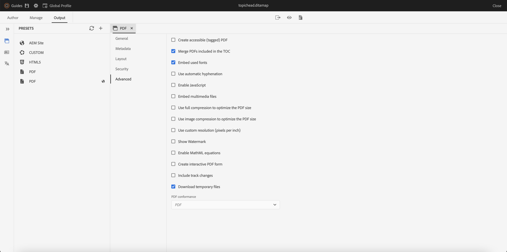

# Novedades de la versión de julio de 2023 de Adobe Experience Manager Guides as a Cloud Service

Este artículo cubre las funciones nuevas y mejoradas de la versión de julio de 2023 de Adobe Experience Manager Guides (más adelante denominadas *AEM Guides as a Cloud Service*).

Para obtener más información sobre las instrucciones de actualización, la matriz de compatibilidad y los problemas corregidos en esta versión, consulte [Notas de la versión](release-notes-2023-7-0.md).

## Conectarse a un origen de datos e insertar datos en los temas

Ahora puede conectarse rápidamente a sus fuentes de datos mediante conectores integrados desde AEM Guides. La conexión a una fuente de datos le permite mantener la información sincronizada con la fuente y las actualizaciones de los datos se reflejan automáticamente, lo que convierte a AEM Guides en un auténtico centro de contenido. Esta función le ayuda a ahorrar tiempo y esfuerzo para agregar o copiar manualmente los datos.

Ahora, AEM Guides permite al administrador configurar los conectores predeterminados para las bases de datos JIRA y SQL (MySQL, PostgreSQL, SQL Server, SQLite). También pueden agregar otros conectores ampliando las interfaces predeterminadas.

Una vez agregados, podrá ver los conectores configurados que aparecen en el panel **Fuentes de datos** del Editor web.

{width="300" align="left"}

Puede crear un generador de fragmentos de contenido para recuperar los datos de una fuente de datos conectada. A continuación, puede insertar los datos en los temas y editarlos.

Una vez creado un generador de fragmentos de contenido, puede volver a utilizarlo para insertar los datos en cualquier tema. Para obtener más información, vea [Insertar un fragmento de contenido de su fuente de datos](../user-guide/web-editor-content-snippet.md).

## Panel Revisar para mostrar los proyectos de revisión y las tareas de revisión activas

Ahora, AEM Guides hace que sus críticas sean más fluidas. Proporciona el panel Revisiones dentro del Editor web. El panel Revisiones muestra todos los proyectos de revisión y las tareas de revisión activas dentro de los proyectos de revisión de los que forma parte.

Como autor, esta función le ayuda a abrir fácilmente las tareas de revisión, ver los comentarios y dirigirlos rápidamente en una vista centralizada.
{width="800" align="left"}
Para obtener más información, vea la descripción de la característica **Revisar** en la sección [Panel izquierdo](../user-guide/web-editor-features.md#id2051EA0M0HS).

## Mejoras en la colección de mapas

Una colección de mapas ayuda a organizar varias asignaciones y a publicarlas por lotes. Se han realizado muchas mejoras en la colección de mapas:

- Ahora, también puede agregar ajustes preestablecidos de salida de PDF nativo a una colección de mapas y utilizarlos para generar la salida de PDF.
- Puede ver los ajustes preestablecidos de perfil global y de carpeta creados por el administrador y utilizarlos para generar la salida del PDF.
- Ahora, no solo puede seleccionar un ajuste preestablecido individual, sino que también puede activar todos los ajustes preestablecidos de perfil de carpeta para un mapa DITA de una sola vez.
  {width="800" align="left"}

Para obtener más información, vea [Usar la colección de mapas para la generación de resultados](../user-guide/generate-output-use-map-collection-output-generation.md).

## Capacidad para acceder a archivos de HTML temporales al generar la salida del PDF nativo

Ahora, AEM Guides le permite descargar los archivos temporales del HTML creados al generar la salida nativa del PDF. En la configuración del ajuste preestablecido de salida, seleccione la opción para descargar los archivos temporales.  A continuación, AEM Guides le permite descargar los archivos temporales creados al generar la salida mediante ese ajuste preestablecido.

Esta función permite obtener una mejor perspectiva del proceso de generación con acceso a estilos y diseños provisionales y le ayuda a corregir o cambiar los estilos CSS según sus necesidades.

{width="800" align="left"}

Para obtener más información, vea [Crear un ajuste preestablecido de salida de PDF](../web-editor/native-pdf-web-editor.md#create-output-preset).

## Publicación basada en microservicios para generar HTML5 y salida personalizada

El nuevo microservicio de publicación le permite ejecutar grandes cargas de trabajo de publicación simultáneamente en AEM Guides as a Cloud Service y aprovechar la plataforma Adobe I/O Runtime sin servidor líder del sector. Ahora, con el microservicio, también puede generar el HTML 5 y la salida personalizada.
Puede ejecutar varias solicitudes de publicación y obtener un rendimiento mejorado para generar estos formatos de salida.
Para obtener más información, vea [Configurar la publicación basada en microservicios para AEM Guides as a Cloud Service](../knowledge-base/publishing/configure-microservices.md).

## Consulte los detalles de la versión de AEM Guides en la información Acerca de

AEM Ahora, junto con la información de **Acerca de**, también puede ver los detalles de la versión de AEM Guides. AEM Puedes ver los detalles de la versión actual en la opción **Acerca de** de la **Ayuda** en la página Navegación de la.

(width=&quot;800&quot; align=&quot;left&quot;)
