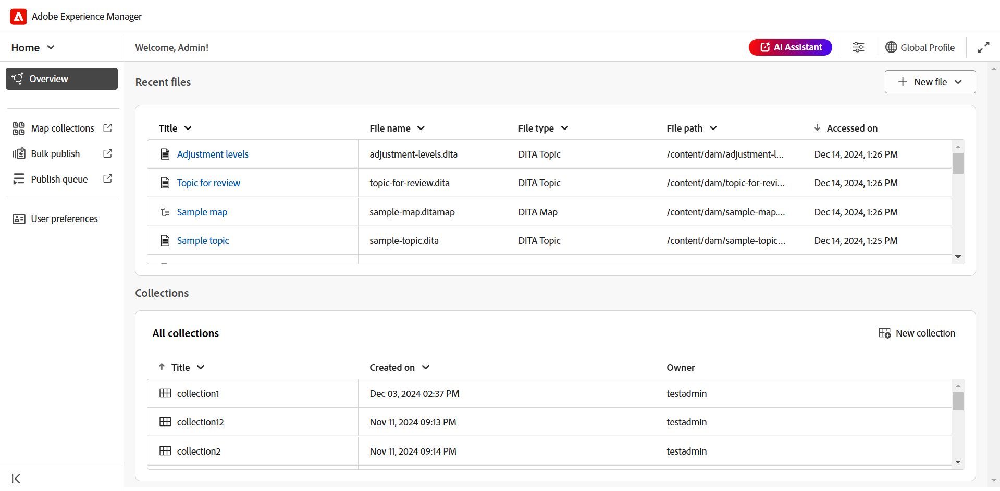
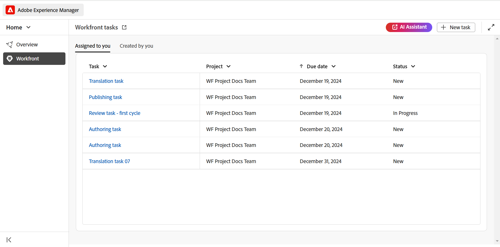

# Novedades de la versión 2025.02.0 (febrero de 2025)

Este artículo cubre las funciones nuevas y mejoradas introducidas con la versión 2025.02.0 de Adobe Experience Manager Guides as a Cloud Service.

## Se ha modificado la IU de Experience Manager Guides para mejorar la productividad y la experiencia

Adobe Experience Manager Guides ahora cuenta con un diseño renovado y funciones mejoradas para ayudarle a trabajar de forma más rápida y eficaz que nunca. La nueva interfaz de usuario ofrece una experiencia de usuario intuitiva y mejorada, con una página de inicio completamente nueva, una barra de herramientas del editor más limpia y organizada, una consola de mapas dedicada y funciones mejoradas.

Los aspectos destacados son los siguientes:

- **Presentación de la página de inicio**: Experience Manager Guides ahora incluye una página de inicio que ofrece una experiencia de pantalla de bienvenida intuitiva, que incluye una vista rápida de los archivos a los que ha accedido recientemente, colecciones y mucho más.

  Para obtener más información, vea [Experiencia con la página principal de Adobe Experience Manager Guides](../user-guide/intro-home-page.md).

  {width="800" align="left"}

- **Nueva experiencia de editor**: ahora experimenta el editor con una nueva apariencia. La interfaz del editor reformada incluye una barra de herramientas más limpia y organizada, una navegación perfecta y una experiencia intuitiva general para ayudar a crear documentos de forma más rápida y eficaz.

  [Conozca las características del editor](../user-guide/web-editor-features.md).

  {width="800" align="left"}

- **Consola de mapas dedicada**: Presentamos la consola de mapas, una consola dedicada en la que se agrupan todas las características de administración y publicación de mapas. Ahora, tiene opciones para generar resultados, traducir contenido, crear informes y mucho más, todo dentro de una interfaz.

  Más información sobre la administración y publicación de [mapas](../user-guide/map-console-overview.md).

  {width="800" align="left"}

## Integración con Adobe Workfront para funciones sólidas de administración del trabajo

Experience Manager Guides ahora se integra perfectamente con Adobe Workfront, proporcionándole acceso a sólidas funciones de administración de proyectos además de las funciones principales de CCMS de Experience Manager Guides.

Con esta integración, puede crear y administrar tareas de Adobe Workfront directamente desde Experience Manager Guides. Por ejemplo, como autor, puede crear una tarea de revisión (con uno o más temas o mapas DITA agregados) directamente en la interfaz de Experience Manager Guides y asignarla a un revisor. Como revisor, puede trabajar en las tareas asignadas en la interfaz de usuario de revisión de Experience Manager Guides y devolvérselas al autor con comentarios. Del mismo modo, puede crear una tarea de publicación y traducción y, a continuación, asignarla a los usuarios necesarios para trabajar en ella.

La integración también permite supervisar las colas de trabajo, asegurándose de estar organizado y al día de todas las tareas (tareas asignadas). También permite a los jefes de proyecto aprovechar el poder de Adobe Workfront para una administración de proyectos exhaustiva dentro de Experience Manager Guides.

Para obtener más información, consulte [Integración de Workfront](../user-guide/workfront-integration.md).

{width="800" align="left"}

## Asistente de IA (Beta) con funciones inteligentes de creación y ayuda para mejorar la productividad

Ahora, experimente una productividad mejorada con la creación inteligente con tecnología de IA y las funciones de ayuda de Experience Manager Guides. Con el asistente de IA, mejore la eficacia con las funciones de creación inteligente y las sugerencias inteligentes para reutilizar contenido del repositorio existente. Utilice la ayuda inteligente para encontrar rápidamente respuestas relevantes a sus consultas relacionadas con las funciones de Experience Manager Guides, sus flujos de trabajo y mucho más.

Para obtener más información, vea [Asistente de IA en Experience Manager Guides](../user-guide/ai-assistant.md).

{width="300" align="left"}

## Nuevo motor de publicación de AEM Sites más rápido y escalable

Experimente una publicación más rápida y escalable en AEM Sites con el nuevo motor de publicación, optimizado con asignación de componentes compuestos para una creación y representación de páginas más rápidas. Está disponible con nuevas plantillas editables integradas que se pueden personalizar según sus necesidades con el editor de plantillas de AEM. Las plantillas utilizan una combinación de componentes principales de WCM y componentes especializados de guías para garantizar que los usuarios finales obtengan la mejor experiencia en las páginas de AEM Sites. También puede personalizar las plantillas existentes para aprovechar la potencia de este nuevo motor de publicación.

Más información sobre [publicación de AEM Sites](../user-guide/generate-output-aem-site-web-editor.md).

{width="500" align="left"}

## Publicación de contenido independiente sin problemas en AEM Sites con publicación de un solo tema

Introducción a la publicación de un solo tema en páginas de AEM Sites que permite publicar temas individuales directamente en páginas de AEM Sites sin necesidad de publicar un mapa completo.  Esto optimiza el proceso de publicación, lo que lo hace más eficiente cuando se trabaja con contenido independiente, como contenido de marketing, boletines técnicos o cualquier otro contenido independiente. También simplifica el mantenimiento del contenido al eliminar la necesidad de crear mapas para publicar temas únicos.

Para obtener más información, vea [Publicar páginas de AEM Sites](../user-guide/publish-aem-sites.md).

{width="500" align="left"}

## El nuevo editor Markdown para disfrutar de una experiencia de creación enriquecida

Ahora, experimente una forma más limpia, eficiente y potente de crear temas de Markdown. Experience Manager Guides presenta una nueva interfaz de editor de Markdown con una barra de herramientas bien organizada y funciones avanzadas, que incluyen una vista **en paralelo** para crear y previsualizar contenido al mismo tiempo. También permite publicar sin problemas temas de Markdown que forman parte de un mapa en varios canales.

Para obtener más información, consulte [Creación de Markdown](../user-guide/web-editor-markdown-topic.md).

{width="800" align="left"}

## Mejoras del editor

Se han realizado las siguientes mejoras en el editor como parte de la nueva versión:

**Mejoras en la inserción de tablas**

- Capacidad para configurar los valores predeterminados de las filas de encabezado, las filas del cuerpo y las columnas en la tabla o en el cuadro de diálogo de inserción simple.
- Capacidad para configurar los ajustes de la tabla para pegar tablas copiadas de orígenes externos como tablas simples o tablas.

  Para obtener más información, vea la sección Tablas en [Conozca las características del Editor](../user-guide/web-editor-features.md#content-insertion-options).

**Se ha mejorado la característica de nombres descriptivos para los elementos DITA**

Se ha mejorado la función de nombre descriptivo para los elementos DITA. Ahora, los valores enumerados predeterminados se conservan cuando se asigna un nombre descriptivo a un elemento y el nombre actualizado se refleja en las rutas de exploración, las propiedades de contenido, el panel Contenido reutilizable, el panel Glosario y otras ubicaciones relevantes.

**Experiencia mejorada para búsquedas filtradas**

Se ha aumentado el límite de visualización de recursos para resultados de búsqueda filtrados en el repositorio de Adobe Experience Manager Guides. Los resultados de la búsqueda ahora devuelven todos los recursos o archivos relevantes que coinciden con los criterios de búsqueda. Puede desplazarse por la lista para cargar más resultados, lo que elimina la necesidad de realizar búsquedas repetidas para localizar los recursos necesarios.

**Texto alternativo para imágenes ahora agregado como elemento**

Las imágenes ahora utilizan el elemento `<alt>` para texto alternativo, según los estándares DITA más recientes. El uso del atributo `@alt` para texto alternativo ha quedado obsoleto, pero sigue siendo compatible con versiones DITA anteriores.

**Personalización de referencias cruzadas en la barra de herramientas del editor**

Ahora, crea un botón personalizado de la barra de herramientas para **Cross-reference** para acceder directamente a una de las opciones del menú. Por ejemplo, puede configurar esta opción para que salte directamente a un vínculo web, un vínculo de correo electrónico, una referencia de archivo o cualquier otra opción disponible según el requisito.

Para obtener más información, vea [personalizar la barra superior y la barra de herramientas](../guides-ui-extensions/customisations/toolbar-topbar.md).

## Revisar mejoras

En la versión 2025.02.0 de se han realizado las siguientes mejoras de revisión:

- Ahora, al crear una tarea de revisión, puede escribir el nombre de un proyecto para localizarlo y seleccionarlo rápidamente en la lista desplegable Proyecto. Esta mejora elimina la necesidad de desplazarse por listas de proyectos largas, lo que hace que asignar tareas de revisión sea más rápido y eficiente, especialmente al administrar varios proyectos.

- En la interfaz de usuario Editor y Revisión, el cuadro de **Responder** de revisión admite ahora entradas multilínea. Puedes usar **Mayús**+**Entrar** para ir a la línea siguiente. También puede expandir el cuadro de comentarios mientras escribe el comentario.

  Para obtener más información, vea [Revisar temas](../user-guide/review-topics.md).

- Ahora los autores pueden acceder a los comentarios de la revisión en el Editor incluso cuando la tarea de revisión está marcada como cerrada. Con las mejoras más recientes, el panel Revisar incluye tareas de revisión activas y cerradas para cada proyecto en el Editor. Al seleccionar una tarea de revisión cerrada, los comentarios correspondientes se muestran en el panel Comentarios de la derecha, lo que garantiza el acceso continuo a los comentarios de revisión importantes incluso después de cerrar una tarea.

  Para obtener más información, vea la sección Revisar de [Conozca las características del Editor](../user-guide/web-editor-features.md).

## Mejoras de publicación

Se han realizado las siguientes mejoras de publicación como parte de la nueva versión:

**Mejoras en el PDF nativo**

- Posibilidad de incluir los metadatos del elemento `prolog` de un tema, como copyright, autor y otros detalles, en los diseños de página al generar la salida nativa de PDF. Esto garantiza que los PDF generados sean más detallados y proporcionen un contexto esencial, lo que los hace más informativos para el lector.

  Para obtener más información, vea [Agregar campos y metadatos en el diseño de página](../native-pdf/design-page-layout.md#add-fields-and-metadata-add-fields-metadata).

  {width="300" align="left"}

- Se ha introducido una opción para activar o desactivar el preprocesamiento DITA-OT para la salida nativa de PDF. Active esta opción si el contenido requiere una normalización basada en DITA-OT o complementos DITA-OT personalizados durante el procesamiento. Esto le proporciona un mayor control sobre cómo se procesa el contenido para la generación de PDF. De manera predeterminada, el valor se establece en **Habilitado**.

  Para obtener más información, vea [Trabajo con el ajuste preestablecido de salida de PDF](../user-guide/generate-output-pdf.md)

  {width="500" align="left"}

- La configuración de impresión para la generación nativa de resultados de PDF se ha movido de la configuración **Templates** a la configuración **Native PDF Output preset** para mejorar la facilidad de uso. Ahora puede utilizar la misma plantilla para PDF en línea e imprimir con diferentes configuraciones de impresión, como el perfil de color.

  Para obtener más información, vea [Ajuste preestablecido de salida de PDF nativo](../web-editor/native-pdf-web-editor.md)

- Posibilidad de añadir un marcador para la página del índice en la salida nativa de PDF para una navegación perfecta por la página, especialmente en PDF largos.

  Para obtener más información, vea [Agregar un marcador personalizado en la salida de PDF](../native-pdf/add-custom-bookmark.md).

## Mejoras en la administración de contenido

Se han realizado las siguientes mejoras en la administración de contenido como parte de la nueva versión:

**Campos de metadatos personalizados en informes**

Esta característica le permite configurar campos de metadatos personalizados para informes mediante **Configuración**. Una vez configurados, puede ver estos campos en **Columnas** en el panel Filtro de los informes, donde puede seleccionarlos o deseleccionarlos para controlar su visibilidad.

Para obtener más información, consulte el [informe de asignación DITA de la consola de mapas](../user-guide/reports-web-editor.md).

**Botón Actualizar en la IU de traducción**

Presentamos un botón Actualizar en la interfaz de usuario de traducción que le permite actualizar el panel de traducción con archivos y estados actualizados.

**Mejora del flujo de trabajo de posprocesamiento de recursos**

La compatibilidad con el posprocesamiento de recursos se ha proporcionado mediante la API de REST y la API de SDK. Ahora, el evento de procesamiento de recursos se activaría y se podrá escuchar para definir un flujo de trabajo más amplio.

Para obtener más información, vea [Controlador de eventos posteriores al procesamiento](../api-reference/post-process-event.md).

## Funciones obsoletas

**Generación rápida**

Experience Manager Guides ya no admite la característica **Generación rápida** para generar resultados directamente desde la vista Repositorio o la vista Mapa.

Esta función se ha eliminado de los paneles Repositorio y Vista de mapa. Se recomienda usar la **consola de mapas** para todas las acciones relacionadas con la administración y publicación de mapas.

Para obtener más información, vea [Administración y publicación de mapas](../user-guide/map-console-overview.md).

**Pase argumentos de metadatos de mapa raíz a la línea de comandos DITA-OT**

La capacidad de pasar argumentos de metadatos de mapa raíz a través de la línea de comandos DITA-OT ha quedado obsoleta como parte de la versión. Ahora, se recomienda usar el campo **File property** o **Metadata** en el ajuste preestablecido para pasar los metadatos DITA-OT necesarios.

Para seguir pasando los metadatos en la línea de comandos DITA-OT, debe actualizar `pass.metadata.args.cmd.line` en `Config.Manager`.

Para obtener más información, vea [Configurar opciones de generación de resultados](../cs-install-guide/conf-output-generation.md#configure-the-dita-ot-command-line-argument-field-to-accept-root-map-metadata).

