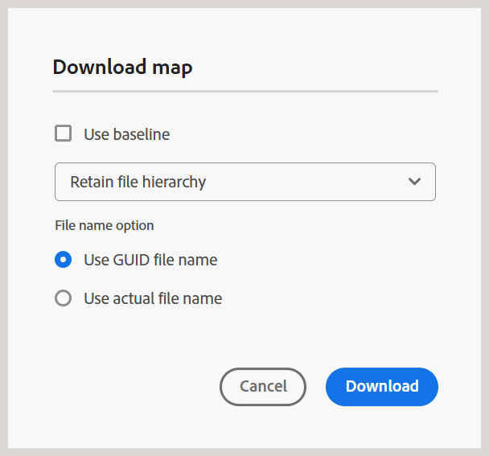

# Novedades de la versión 2025.06.0 (junio de 2025)

Este artículo cubre las funciones nuevas y mejoradas introducidas con la versión 2025.06.0 de Adobe Experience Manager Guides as a Cloud Service.

Para ver la lista de problemas corregidos en esta versión, consulte [Problemas solucionados en la versión 2025.06.0](fixed-issues-2025-06-0.md).

Obtenga información acerca de [instrucciones de actualización para la versión 2025.06.0](../release-info/upgrade-instructions-2025-06-0.md).

## Tiempo de espera de sesión para evitar la pérdida accidental de contenido

Ahora, un mensaje emergente le notifica cuando caduca la sesión de Adobe Experience Manager y cuando ha cerrado la sesión debido a la inactividad. Este mensaje se activa cuando intenta editar contenido en Experience Manager Guides después de que finalice la sesión. La función ayuda a reducir el riesgo de perder trabajo no guardado y mejora la fiabilidad y fluidez generales de la experiencia, incluso durante períodos de inactividad.

Obtenga más información acerca de [solicitud de tiempo de espera de sesión](../user-guide/session-timeout-prompt.md) en Experience Manager Guides.

## Opciones mejoradas de descarga de mapas en el editor

Experience Manager Guides presenta una nueva opción **Usar nombres de archivo reales** en el cuadro de diálogo **Descargar mapa**. Ahora, al descargar archivos de asignación, puede elegir mantener sus nombres de archivo originales en lugar de los UUID predeterminados, lo que facilita en gran medida el reconocimiento y la administración de sus archivos. Esta opción solo está disponible si selecciona **Conservar jerarquía de archivos** y se deshabilita al elegir **Acoplar jerarquía de archivos**, lo que le proporciona más flexibilidad para organizar las asignaciones descargadas.

Para obtener más información, vea [Descargar archivos](../user-guide/authoring-download-assets.md#download-a-dita-map-file-from-the-editor).

{width="300" align="left"}

## Tratamiento mejorado de `navref` en el editor

Las mejoras más recientes realizadas en el Editor mejoran el control de `navref` elementos en un mapa DITA. Ahora, cuando agregue un elemento `navref` a un mapa, se abrirá el cuadro de diálogo **Seleccionar ruta**, que le permitirá elegir fácilmente las referencias de mapa que se incluirán como vínculos de navegación en el mapa. Una vez añadido, el título del mapa añadido se muestra en las vistas Autor y Presentación, lo que proporciona una mejor visibilidad de la navegación incluida durante la creación.  Además, el elemento `navref` agregado se resuelve automáticamente para mostrar el mapa referido en el Editor.

Para obtener más información, vea [Agregar referencias de navegación](../user-guide/map-editor-other-features.md#add-navigation-references).

## Mejoras de rendimiento en el Asistente de IA

La versión introduce mejoras en el motor back-end del asistente de IA, que ofrece un rendimiento mejorado y una mayor estabilidad. Para habilitar esta actualización y seguir utilizando la Ayuda del Asistente de IA:

- Actualice la configuración de `chat.url` para reflejar la nueva dirección URL de punto final.
- Agregue una nueva variable de entorno `GUIDES_AI_SITE_ID` en Cloud Manager.

Para obtener más información, vea [Configurar el asistente de IA](../cs-install-guide/conf-smart-suggestions.md).

