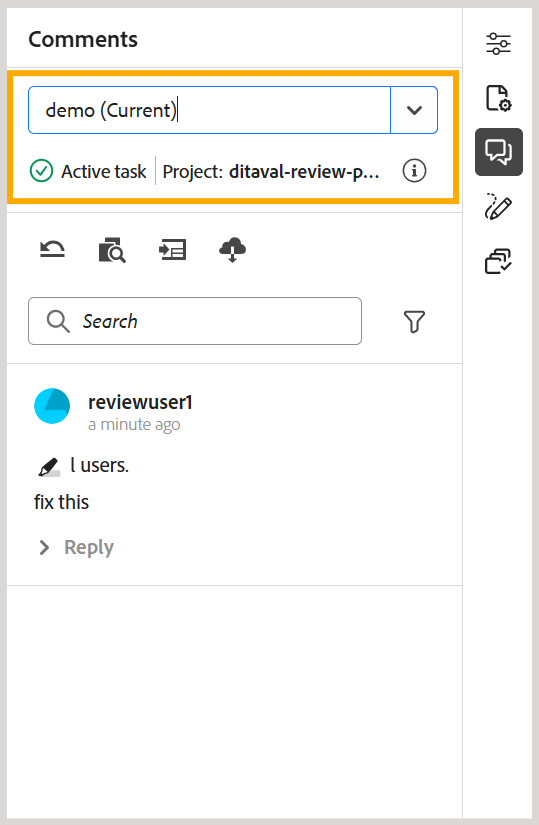

# Novedades de la versión 2026.08.0 (agosto de 2026)

Este artículo cubre las funciones nuevas y mejoradas introducidas con la versión 2026.08.0 de Adobe Experience Manager Guides as a Cloud Service.

Para obtener la lista de problemas corregidos en esta versión, vea [Problemas corregidos en la versión 2026.08.0](fixed-issues-2026-08-0.md).

Obtenga información acerca de [instrucciones de actualización para la versión 2026.08.0](../release-info/upgrade-instructions-2026-08-0.md).

## Nueva colección de mapas para administrar mapas y publicar salidas

La nueva colección de mapas reúne la administración de la colección de mapas y las actividades de generación de resultados en una sola interfaz. Desde una ubicación, puede administrar mapas y ajustes preestablecidos, generar y publicar salidas, ver el historial de generación y publicación, y mucho más. Al unir las tareas de publicación relacionadas, resulta más fácil trabajar con colecciones de mapas y rastrear la actividad de salida en varios mapas y sus idiomas asociados. Esta actualización también aborda los problemas de rendimiento vistos con colecciones de mapas grandes.

Para obtener más información, vea [Usar nueva colección de asignaciones para la generación de resultados](../user-guide/generate-output-use-new-map-collection-output-generation.md).

## Recuperación de contenido de repositorios Git mediante el conector Git

Experience Manager Guides ahora presenta el conector Git, que le permite importar contenido de repositorios Git a Experience Manager Guides. Una vez importado el contenido, los equipos pueden seguir utilizando Experience Manager Guides para sus flujos de trabajo de creación, revisión, traducción y publicación.

Para ayudar a mantener el contenido importado actualizado, el conector Git también admite la recuperación de contenido del repositorio de origen para introducir actualizaciones. Incluye detección inteligente de cambios para identificar actualizaciones de contenido, conserva los GUID de temas y asignaciones durante las operaciones de importación y recuperación, y proporciona capacidades de resolución de conflictos para ayudar a administrar las diferencias entre el contenido del repositorio y el contenido ya disponible en Experience Manager Guides. Para obtener más información, vea [Importar contenido mediante el conector Git](../user-guide/web-editor-git-connector.md).

## Experience Manager Guides añade compatibilidad con MCP para la integración de AI Assistant

Experience Manager Guides ahora admite la integración de MCP (Model Context Protocol), lo que permite a los asistentes de IA, como Anthropic Claude, conectarse directamente al entorno de AEM Guides.

A través de un único punto final de MCP, los usuarios autenticados pueden administrar temas y mapas, crear y exportar líneas de base y generar informes utilizando lenguaje natural, todo mientras funcionan con sus permisos de AEM existentes. Esto elimina las tareas repetitivas que requieren mucha navegación y permite a los equipos de documentación trabajar de forma más eficaz en todas las aplicaciones de chat y herramientas para desarrolladores compatibles con MCP, como Cursor y Visual Studio Code. Para obtener más información, vea [Usar el servidor MCP de Adobe Experience Manager Guides](../install-conf-guide/conf-aem-guides-mcp.md).

## Revisar mejoras

### Delegar una tarea de revisión a otro revisor

Los revisores ahora pueden recomendar a otro usuario que evalúe una revisión antes de que vuelva al Autor mediante la nueva opción **Delegar** disponible para una tarea de revisión. Esto resulta útil cuando parte del contenido no pertenece a la experiencia del revisor o cuando se necesita una segunda opinión antes de completar la revisión, sin tener que enviar la solicitud a través de un administrador del proyecto.

Al seleccionar la opción Delegar, se envía la recomendación al autor, que decide si desea agregar el revisor recomendado a la tarea. Más información acerca de [Delegar una tarea de revisión a otro revisor](../user-guide/review-complete-review-tasks.md#delegate-a-review-task-to-another-reviewer).

{width="350"}

### La descripción de la tarea ahora está visible en la IU de revisión

Los revisores ahora pueden ver la descripción de la tarea directamente en la experiencia de revisión, en lugar de depender únicamente del correo electrónico de notificación. La descripción introducida al crear una tarea de revisión ahora se muestra en el cuadro de diálogo Revisar detalles, al que se puede acceder mediante el icono **Información** tanto en la interfaz de usuario de revisión como en la interfaz del editor.

Esto proporciona a los revisores acceso a las instrucciones, el ámbito y las áreas de interés a lo largo de la revisión. Para obtener más información, vea [Enviar temas para revisión](../user-guide/review-send-topics-for-review.md).

{width="350"}

### Identificación del usuario en la lista de etiquetado durante la revisión

Al etiquetar a los usuarios en comentarios de revisión o respuestas, la lista desplegable de etiquetado ahora muestra la dirección de correo electrónico de cada usuario junto con su ID de usuario. Esto facilita la identificación y selección del revisor correcto, especialmente en organizaciones grandes en las que los nombres para mostrar pueden ser ambiguos.

Si no hay una dirección de correo electrónico disponible, se muestra el ID de usuario en su lugar. Para obtener más información sobre cómo trabajar con la interfaz de usuario de revisión, vea [Etiquetar usuarios de tareas en un comentario](../user-guide/review-topics.md#tag-task-users-in-a-comment).

### Ver todas las tareas de revisión de un tema

Los autores ahora pueden ver todas las tareas de revisión, abiertas o cerradas, asociadas al tema abierto actualmente directamente desde el panel Comentarios. Una lista desplegable muestra todas las tareas de revisión de las que forma parte el tema, junto con el estado y el proyecto de cada tarea, y le permite alternar entre ellos para ver comentarios sin abandonar el tema ni cambiar de proyecto de revisión. Más información acerca de [Ver todas las tareas de revisión de un tema](../user-guide/review-address-review-comments.md#view-all-review-tasks-for-a-topic).

{width="350"}

### Experiencia de revisión mejorada con condiciones DITAVAL

Cuando una tarea de revisión incluye uno o más archivos DITAVAL adjuntos, el panel Condiciones ahora presenta cada condición como una opción, preconfigurada para que coincida con los archivos DITAVAL adjuntos, de modo que los revisores vean el contenido de la manera en que lo pretendía el iniciador de la revisión. Al desactivar una opción, se oculta ese contenido de la revisión; al activarla, se restaura.

Para obtener más información, vea el panel [Condiciones con condiciones basadas en DITAVAL](../user-guide/review-topics.md#conditions-panel-with-ditaval-based-conditions).

{width="350"}

## Mejoras de publicación

### Usar ajustes preestablecidos de salida como plantillas

Los administradores ahora pueden designar ajustes preestablecidos de salida como plantillas, aplicando configuraciones estandarizadas en todas las asignaciones de un perfil de carpeta con una sola acción a través de la consola de mapas. Cuando se aplica una plantilla, el sistema muestra el número de mapas afectados, lo que proporciona a los administradores una visibilidad completa antes del despliegue. Para mantener la coherencia, los ajustes preestablecidos de plantilla solo los pueden modificar los administradores y la generación de resultados está desactivada para los ajustes preestablecidos de plantilla (a menos que ya se haya generado la salida antes de establecer los ajustes preestablecidos como plantilla).

Para obtener más información, vea [Configurar ajustes preestablecidos de plantilla para la generación de resultados](../install-conf-guide/template-presets-output-generation.md).

### Validar la calidad del contenido con comprobación de estado del contenido

La comprobación del estado del contenido ayuda a validar la calidad del contenido en los mapas DITA antes de la publicación. Los administradores pueden crear ajustes preestablecidos de comprobación de estado reutilizables combinando comprobaciones de vínculos rotos, ID duplicados y validación de Schematron.

Los autores pueden ejecutar una comprobación de estado en un mapa DITA o una línea de base seleccionada para generar un informe consolidado de problemas en los temas y mapas asociados. Para obtener más información, vea [Ejecutar comprobación de estado en un mapa](../user-guide/map-editor-other-features.md#run-health-check-on-a-map).

## Mejoras de traducción

### Especificar una ruta de carpeta personalizada para proyectos de traducción

Al enviar contenido para su traducción, ahora puede seleccionar la carpeta en la que se crea un nuevo proyecto de traducción, en lugar de todos los proyectos que tienen una ubicación predeterminada bajo `/content/projects`. Esto ayuda a evitar una estructura de proyecto saturada y mejora el rendimiento de carga de página a medida que aumenta el número de proyectos de traducción.

Para obtener más información, vea [Crear proyecto de traducción](../user-guide/translate-documents-web-editor.md#create-a-translation-project).

## Mejoras en el contenido de aprendizaje

En esta versión están disponibles las siguientes mejoras para la función de contenido Aprendizaje y formación sobre productos:

- Ahora hay disponible una nueva pestaña **Experiencia del alumno** en la configuración de salida de SCORM, que le permite configurar cómo los alumnos interactúan con la salida de SCORM y navegar por ella. La configuración está organizada en General, Navegación y Prueba, lo que le permite controlar la accesibilidad del contenido, el flujo de navegación y el comportamiento de las pruebas para conseguir una experiencia de aprendizaje adaptada.

  En **Navegación**, ahora puede controlar si el botón **Siguiente** está habilitado o deshabilitado en una página, lo que permite que los alumnos progresen solo después de que se cumplan las condiciones especificadas en esa página, como abrir todos los elementos interactivos, ver todos los medios y más. Para obtener más información, vea [Configurar el ajuste preestablecido de SCORM](../learning-content/config-scorm-preset.md).

  {width="650"}

- Ahora puede habilitar las descargas de PDF para los alumnos en la salida de SCORM. Cuando esta opción está activada, se añade un icono de descarga de PDF a la salida de SCORM publicada, lo que permite a los alumnos descargar una versión de PDF del contenido del curso para referencia sin conexión. Esto proporciona una mayor flexibilidad en la forma en que los alumnos acceden a los materiales del curso, al tiempo que proporciona a los autores más control sobre la experiencia publicada. Para obtener detalles de configuración y requisitos previos, vea [Permitir que los alumnos descarguen el curso PDF](../learning-content/config-scorm-preset.md).

  {width="650"}

- En el resultado publicado de un curso, los alumnos ahora pueden usar la opción **Revisar respuestas** después de completar un intento de prueba para revisar sus respuestas enviadas y ver qué respuestas eran correctas o incorrectas. Más información acerca de [propiedades de la pregunta en un examen](../learning-content/quiz-insert-questions.md#question-properties).

  {width="650"}

- En las preguntas de comprobación de conocimientos de un curso, ahora se muestra el botón **Intentar de nuevo** cuando un alumno selecciona una respuesta incorrecta, lo que le permite volver a intentar la pregunta. Este comportamiento es coherente en las comprobaciones de conocimientos de selección única y de selección múltiple. Para obtener más información, vea [Otras opciones en el menú Insertar](../learning-content/lc-other-insert-options.md).

- Cuando se agrega un tema de HTML a un mapa del grupo de aprendizaje, el atributo `format="html"` ahora se agrega automáticamente al `topicref` correspondiente, lo que garantiza un procesamiento y una publicación correctos en DITA-OT 4.x. Para obtener más información, vea [Agregar contenido existente en el curso](../learning-content/manage-course.md#add-existing-content).

## Mejora de API

Esta versión introduce nuevas API de Swagger para la administración, traducción y publicación de recursos, lo que facilita la conexión de estos flujos de trabajo con las herramientas y los sistemas existentes. Para obtener más información, vea [Actualizaciones de la API en las versiones de Experience Manager Guides](../api-reference/api-update-swagger.md).

