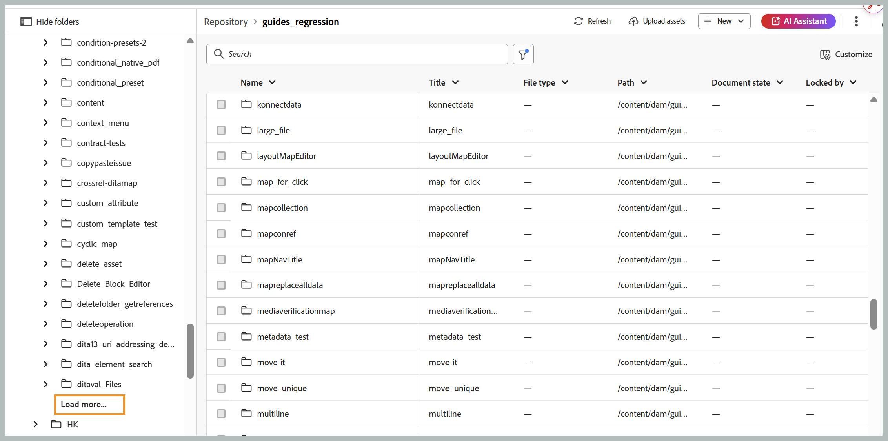

# Novedades de la versión 2026.09.0 (septiembre de 2026)

Este artículo cubre las funciones nuevas y mejoradas introducidas con la versión 2026.09.0 de Adobe Experience Manager Guides as a Cloud Service.

Para obtener la lista de problemas corregidos en esta versión, vea [Problemas corregidos en la versión 2026.09.0](fixed-issues-2026-09-0.md).

Obtenga información acerca de [instrucciones de actualización para la versión 2026.09.0](../release-info/upgrade-instructions-2026-09-0.md).

## Introducción al etiquetado inteligente con tecnología de IA en el asistente de IA

Ahora, puede utilizar el Asistente de IA para sugerir y agregar etiquetas al contenido. Con la nueva capacidad de etiquetado inteligente, los autores pueden pedir al asistente de IA que sugiera etiquetas para uno o más temas, con la habilidad de etiquetado inteligente de Adobe CX Enterprise Coworker. La aptitud revisa el contenido, genera recomendaciones de etiquetas y las presenta para su revisión. Una vez confirmadas, las etiquetas sugeridas se aplican a los temas relevantes dentro de un mapa.

Para obtener más información, vea [Usar el Asistente de IA en el modo Agente](../user-guide/ai-assistant-agentic.md).

Actualmente, la capacidad de etiquetado inteligente está disponible cuando el Asistente de IA está configurado en modo **Agentic**. Los administradores pueden optar por habilitar el modo **Agentic** o **Standard** en la **configuración de Workspace** para una instancia.

- **El modo automático** proporciona a los autores la interfaz de etiquetado inteligente para la aplicación y recomendación de etiquetas.
- **Modo estándar** proporciona la experiencia del Asistente de IA existente, con las pestañas **Ayuda** y **Creación** en el panel del Asistente de IA.

## Mejoras del editor

### Evitar sobrescrituras de contenido durante la edición simultánea

Cuando dos autores trabajan en el mismo tema al mismo tiempo, un autor puede tener el tema abierto mientras otro autor lo bloquea, realiza cambios y guarda una versión más reciente. El tema ya abierto puede contener contenido obsoleto y, si edita esta versión, se podrían sobrescribir los cambios más recientes.

Para evitar estos conflictos, la última versión guardada ahora se carga automáticamente en el Editor al bloquear un tema. Esto garantiza que trabaje con el contenido más reciente y evita que sobrescriba los cambios realizados por otro autor.

Esto se aplica cuando la opción **Deshabilitar la edición sin bloquear el archivo** está habilitada.

Para obtener más información, vea [Evitar sobrescrituras de contenido durante la edición simultánea](../user-guide/web-editor-edit-topics.md#prevent-content-overwrite-during-concurrent-editing).

### Vista previa del contenido del mapa a partir de una línea base estática seleccionada

Cuando un mapa tiene una o más líneas de base estáticas, ahora se puede obtener una vista previa del mapa en función de una línea de base seleccionada en lugar de la copia de trabajo actual en el Editor.

Todas las versiones de los temas, recursos, imágenes y referencias asociados con la línea de base seleccionada se muestran en la vista previa, lo que proporciona una vista precisa del contenido del mapa en el momento en que se creó la línea de base. Para obtener más información, vea [Vistas del editor de los temas](../user-guide/web-editor-views.md#preview-content-using-baseline).

## Revisar mejoras

### Marcar temas individuales como realizados en una tarea de revisión

Experience Manager Guides presenta el seguimiento del progreso en el nivel de tema para los revisores, lo que ofrece una mejor visibilidad del progreso de revisión de las tareas con varios temas. Como Revisor, ahora puede marcar los temas individuales como finalizados y distinguir entre los temas que ha completado y los que aún necesitan atención.

Para admitir esto, los temas de la vista de documento de la IU de revisión se organizan en acordeones con una casilla de verificación **Marcar tema como listo**. Los temas que marque como revisados mediante la casilla de verificación se indican en el panel **Temas**, mientras que el contador **Temas revisados** de la parte superior muestra su progreso en relación con los temas que se le han asignado. Juntos, le proporcionan una visión clara de lo que ha cubierto y lo que queda, incluso cuando vuelve a una tarea de revisión más larga después de una pausa.

Para obtener más información, vea [Revisar temas](../user-guide/review-topics.md#mark-individual-topics-as-done-in-a-review-task).

### Identificación de usuarios con funciones al etiquetar comentarios

Los revisores y los autores ahora pueden ver la función de un usuario, como Revisor, Autor o Propietario, junto con su nombre de usuario y dirección de correo electrónico (si está disponible), al etiquetar a alguien en un comentario o una respuesta. Esto facilita la identificación rápida del usuario correcto que debe etiquetarse, especialmente en proyectos con un gran número de participantes.

Más información sobre [etiquetar usuarios en un comentario](../user-guide/review-topics.md#tag-task-users-in-a-comment).

### Ver la jerarquía de mapas al seleccionar temas para revisión

Al seleccionar contenido para una revisión, como autor o iniciador de una tarea de revisión, ahora puede ver asignaciones, subasignaciones y temas en su jerarquía existente en la página **Contenido**, en lugar de ver todos los temas como una lista plana. La vista jerárquica facilita la comprensión de la estructura del contenido y la selección de temas individuales o submapas completos para su revisión.

Para obtener más información, vea [Ver la jerarquía del mapa al seleccionar temas para revisión](../user-guide/review-send-topics-for-review.md#view-the-map-hierarchy-while-selecting-topics-for-review).

## Mejoras de publicación

### Publicar salida nativa de PDF en el idioma del mapa

La página de ajustes preestablecidos de salida nativos de PDF ahora incluye una nueva opción **Usar idioma de asignación**. Cuando se seleccionan, las variables de plantilla de salida resuelven su idioma a partir del atributo `xml:lang` del mapa raíz en lugar de un idioma seleccionado explícitamente en el ajuste preestablecido. Esto significa que ya no necesita mantener un ajuste preestablecido de salida independiente para cada idioma al publicar mapas traducidos. Si el mapa no tiene ningún `xml:lang` definido, el valor predeterminado de la salida es inglés (en_US).

Para obtener más información, vea [Configuración preestablecida de PDF nativa](../web-editor/native-pdf-web-editor.md) y [Usar variables de idioma en las plantillas de salida](../native-pdf/native-pdf-language-variables.md#use-language-variables-in-the-output-templates).

## Mejoras en el contenido de aprendizaje

### Habilitar la vista de pantalla completa para el contenido H5P en un curso de aprendizaje

Los autores ahora pueden habilitar o deshabilitar la visualización de pantalla completa para cada elemento H5P utilizado dentro de un curso de aprendizaje. Use la opción **Habilitar pantalla completa** en el panel **Propiedades del contenido** para controlar esta configuración. Cuando está habilitado, los alumnos pueden ampliar el contenido H5P a pantalla completa. Cuando está desactivado, el contenido permanece en línea dentro de la vista estándar. Esta configuración se aplica de forma coherente en el modo de vista previa y en la salida publicada.

Más información acerca de [Otras opciones en el menú Insertar](../learning-content/lc-other-insert-options.md) de Formación sobre productos y contenido de aprendizaje.

## Mejoras de rendimiento

### Rendimiento mejorado con la carga paginada de archivos y carpetas

Experience Manager Guides ahora admite la carga paginada de archivos y carpetas para mejorar la experiencia de exploración, especialmente en el caso de las carpetas con un gran número de recursos. En lugar de cargar todo el contenido a la vez, las carpetas se cargan progresivamente en lotes de 50 recursos, con recursos adicionales recuperados al desplazarse o seleccionar **Cargar más**, según el panel o el cuadro de diálogo.

La ordenación se realiza en el servidor, por lo que al aplicar un criterio de ordenación se obtienen los resultados recién ordenados en lugar de reordenar los datos ya cargados en el explorador. Las operaciones comunes, como cambiar el nombre, eliminar, agregar y mover, ya no cargan una carpeta completa. En su lugar, solo actualizan el elemento afectado o la primera página de resultados.

La carga paginada está disponible en la tabla Repositorio de inicio, en los paneles Colecciones, Explorador, Buscar y Plantilla y en el cuadro de diálogo Seleccionar ruta.

Para obtener más información, vea [Carga paginada de archivos y carpetas](../user-guide/paginated-loading-assets.md).

{width="650"}

