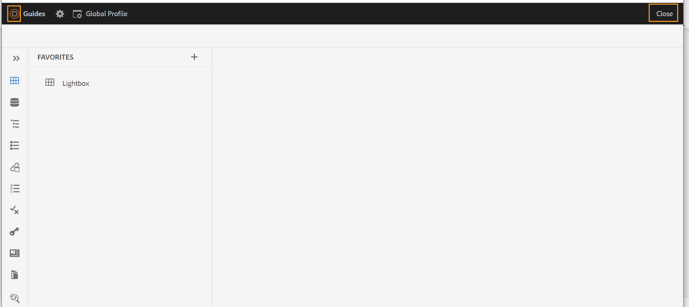
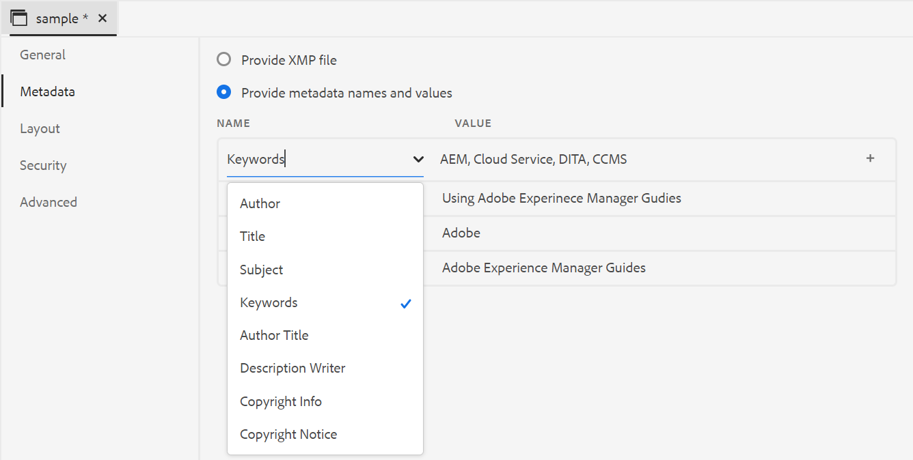
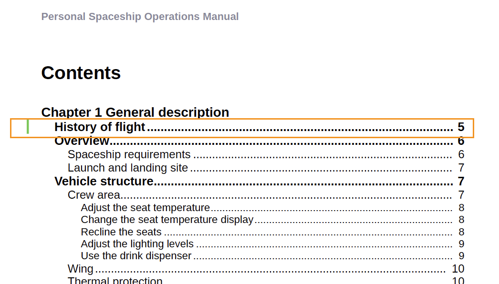

# Novedades de la versión 4.2.1 de Adobe Experience Manager Guides (mayo de 2023)

Este artículo cubre las funciones nuevas y mejoradas de la versión 4.2.1 de Adobe Experience Manager Guides (más adelante denominada *AEM Guides*).

Para obtener más información sobre las instrucciones de actualización, la matriz de compatibilidad y los problemas corregidos en esta versión, consulte el artículo [Notas de la versión](release-notes-4-2-1.md).

## Vaya del Editor Web a la página principal de AEM

Ahora puede navegar fácilmente desde el Editor Web a la página Navegación de AEM.

{width="800"}

* Haga clic en el icono **Guías** ( ) para volver a la página Navegación de AEM.

Para obtener más información, consulte [Página de navegación de AEM](../user-guide/web-editor-launch-editor.md#id2056BG00RZJ).

## Compatibilidad con metadatos avanzados en la publicación de PDF

AEM Guides ahora proporciona compatibilidad avanzada con los metadatos asignados a los metadatos de la salida de PDF. Las opciones de metadatos incluyen información sobre el documento y su contenido, como el nombre del autor, el título del documento, las palabras clave, la información de copyright y otros campos de datos.

Puede importar un archivo de XMP y AEM Guides puede elegir la información del archivo. También tiene la opción de proporcionar los nombres y valores de los metadatos mediante la lista desplegable. También puede agregar metadatos personalizados escribiendo directamente en el campo de nombre.

Para obtener más información, consulte la descripción de la característica **Metadatos** en [Crear un ajuste preestablecido de salida de PDF](../web-editor/native-pdf-web-editor.md).

### Panel de vista de esquema mejorada

AEM Guides proporciona un panel de vista de esquema mejorado en el que se obtiene la vista jerárquica de los elementos utilizados en el documento.

La vista Esquema proporciona las siguientes mejoras:

* El menú desplegable Opciones de vista se muestra en la parte superior del panel Vista de esquema. Si un elemento tiene un ID, un atributo y un texto, puede seleccionarlos en la lista desplegable para mostrarlos junto con el elemento. Los atributos que se pueden mostrar en el panel Vista de esquema están determinados por la configuración de Atributos de visualización que ha configurado el administrador en **Configuración del editor**.

* Con la función de búsqueda, puede buscar un elemento por su nombre, ID, texto o valor de atributo.

Para obtener más información, consulte la descripción de la función de vista Esquema en la sección [Panel izquierdo](../user-guide/web-editor-features.md#id2051EA0M0HS).

## Generar el informe Multimedia desde el editor web

AEM Guides proporciona la función para generar los informes de los documentos técnicos.  Puede utilizar esta función para ver la lista de temas y administrar los metadatos de sus documentos. Ahora también puede ver el contenido multimedia utilizado en todas las referencias del mapa actual desde la ficha **Informes** del Editor Web.

Puede generar el informe multimedia que contiene información detallada sobre el contenido multimedia utilizado en sus referencias dentro del mapa actual. Tiene la flexibilidad de filtrar y ordenar los archivos multimedia enumerados en el informe.
También puede generar el CSV para descargar la instantánea actual de los elementos multimedia utilizados en el mapa DITA.

Para obtener más información, consulte la descripción de la función Generar un informe multimedia en la sección [Informe de mapa DITA desde el editor web](../user-guide/reports-web-editor.md).

## PDF nativo | Barra de cambios para indicar los temas modificados en la Tabla de contenido

AEM Guides ahora le permite identificar rápidamente los temas modificados en la TDC de la salida de PDF.  Muestra una barra de cambios a la izquierda de los temas modificados en el índice. Puede hacer clic en el tema del índice y ver los cambios detallados.

Para obtener más información, consulte [Trabajar con estilos personalizados de barras de cambio](../native-pdf/change-bar-style.md).

## PDF nativo | Aplicar estilo al marcador de página en el componente de nota al pie

Ahora puede aplicar estilo al marcador de página en las notas al pie. Por ejemplo, puede agregar corchetes o cambiar su color. Estos estilos ayudan a los usuarios a identificar fácilmente los marcadores de página del documento.

Para obtener más información, consulte [Usar estilos personalizados en las notas al pie](../native-pdf/footnote-number-style.md).

## Abra y reproduzca archivos de vídeo o audio en el Editor web

AEM Guides ahora proporciona la función para abrir y reproducir los archivos de audio o vídeo en el Editor Web. Puede cambiar el volumen o la vista del vídeo. En el menú contextual, también tienes las opciones de **Descargar**, cambiar **Velocidad de reproducción** o ver **Imagen en imagen**.

Para obtener más información, consulte la descripción de la función Vista de repositorio en la sección [Panel izquierdo](../user-guide/web-editor-features.md#id2051EA0M0HS).
