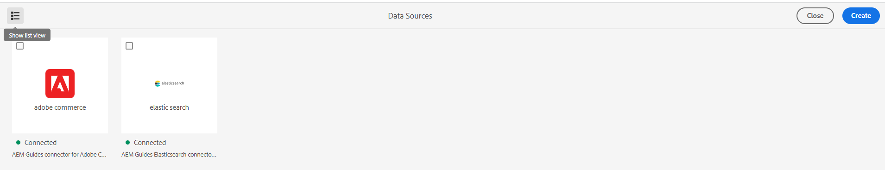

# Novedades de la versión 4.3.1 de Adobe Experience Manager Guides (octubre de 2023)

Este artículo cubre las funciones nuevas y mejoradas de la versión 4.3.1 de Adobe Experience Manager Guides (más adelante denominada *Experience Manager Guides*).

Para obtener más información sobre las instrucciones de actualización, la matriz de compatibilidad y los problemas corregidos en esta versión, consulte [Notas de la versión](./release-notes-4-3-1.md).

## Conectarse a un origen de datos e insertar los temas

Experience Manager Guides proporciona conectores predeterminados que le ayudan a conectarse con sus fuentes de datos, lo que convierte a Experience Manager Guides en un auténtico centro de contenido. Esto le proporciona la ventaja de ahorrarle tiempo y esfuerzo que, de lo contrario, se invertirían en la adición o replicación manual de datos.

Junto con los conectores predeterminados existentes, como JIRA y SQL (MySQL, PostgreSQL, SQL Server, SQLite), el administrador también puede configurar conectores para bases de datos MariaDB, H2DB, AdobeCommerce y Elasticsearch. También pueden agregar otros conectores ampliando las interfaces predeterminadas.

Puede ver los conectores configurados en el panel **Fuentes de datos** del Editor web.

*Ver los orígenes de datos conectados.*

Ahora también puede crear un tema a partir de una fuente de datos conectada. Un tema puede contener datos en varios formatos, como tablas, listas y párrafos. También permite crear un mapa DITA para todos los temas. Puede asociar metadatos al tema al extraer de una fuente de datos.

Para obtener más información, vea [Usar datos del origen de datos](../user-guide/web-editor-content-snippet.md).

## Configuración de un conector de fuente de datos desde la interfaz de usuario

Experience Manager Guides ahora también proporciona una herramienta **Fuentes de datos** que le ayuda a configurar conectores listos para usar para fuentes de datos. Puede crear fácilmente los conectores para bases de datos JIRA, SQL (MySQL, PostgreSQL, Microsoft SQL Server, SQLite, MariaDB, H2DB), AdobeCommerce y Elasticsearch.

También puede editar, volver a conectar, duplicar o eliminar fácilmente un conector de origen de datos. Obtenga más información acerca de cómo [configurar fácilmente un conector de origen de datos desde la interfaz de usuario](../install-guide/conf-data-source-connector-tools.md).

{width="550" align="left"}

*Cree y vea los conectores de origen de datos desde el panel de orígenes de datos.*

## Ver registros del generador de temas

Ahora también puede ver el archivo de registro de generación de contenido. Este archivo de registro le ayuda a comprobar las advertencias, errores y excepciones.  Obtenga más información sobre cómo las [opciones de un generador de temas](../user-guide/web-editor-content-snippet.md#options-for-a-topic-generator) le ayudan a generar y administrar fácilmente los generadores de temas.

## Compatibilidad con las herramientas de Velocity en las plantillas de fuente de datos

Ahora puede utilizar las herramientas de Velocity en las plantillas de Experience Manager Guides. Estas herramientas le ayudan a aplicar varias funciones a los datos que obtiene de las fuentes de datos. Puede utilizar las plantillas al crear un fragmento de contenido o un tema. Esta función le ayuda a ahorrar tiempo y esfuerzo para aplicar manualmente la misma función a cada conjunto de datos.  También garantiza resultados precisos.
Por ejemplo, puede utilizar $mathTool para realizar funciones matemáticas.
Obtenga más información sobre cómo [usar las herramientas de Velocity en las plantillas de fuentes de datos](../user-guide/web-editor-content-snippet.md#use-velocity-tools).

## Mejoras del PDF nativo

En la versión de octubre de 2023 de se realizaron las siguientes mejoras en el PDF nativo:

### Restablecer el número de página de la primera página de un diseño

En la salida del PDF nativo, puede reiniciar los números de página y especificar el número a partir del cual comienza la numeración. Ahora también puede iniciar la numeración solo para la primera aparición de una sección.
Más información acerca de cómo [trabajar con las propiedades de página de un diseño de página](../native-pdf/design-page-layout.md#page-props-page-layout).

### Ver capítulos sin números automáticos en la TDC

Experience Manager Guides muestra los números de capítulo junto con los nombres de capítulo en la tabla de contenido (TDC). Ahora puede elegir publicar solo los nombres de capítulo sin los números de capítulo. Ver más detalles acerca de cómo configurar las [opciones avanzadas del PDF](../native-pdf/components-pdf-template.md#advanced-pdf-settings).

## Descarga de un mapa desde el editor web

Ahora no solo puede editar un mapa en la vista de mapa del Editor Web, sino también descargarlo. Puede elegir descargar el mapa con una línea de base específica. También tiene la opción de acoplar la jerarquía y guardar todos los archivos y carpetas en una sola carpeta.

Para obtener más información, consulte la descripción de la característica **Vista de mapa** en la sección [Panel izquierdo](../user-guide/web-editor-features.md#id2051EA0M0HS).

{width="550" align="left"}

*Seleccione un archivo en la vista del repositorio y elija la opción para realizar una acción en el archivo.*

## Compatibilidad con varias definiciones de asunto en una sola definición de enumeración

Ahora puede definir una o más definiciones de asunto en un mapa y las definiciones de enumeración en otro mapa y, a continuación, añadir la referencia de mapa. Las referencias de asunto y enumeración se resuelven en el mismo mapa o en el mapa al que se hace referencia.

Ahora también puede definir condiciones y aplicarlas a algunos elementos específicos de un tema.  Las condiciones solo son visibles para esos elementos específicos y no para todos los demás elementos.

Para obtener más información sobre la administración de definiciones jerárquicas de definiciones de temas y enumeraciones, vea la descripción de la función Esquema de temas en la sección [Panel izquierdo](../user-guide/web-editor-features.md#id2051EA0M0HS).

## Experiencia de previsualización mejorada desde el menú contextual

Utilice el menú contextual para previsualizar rápidamente el archivo (.dita, .xml, audio, vídeo o imagen) sin abrirlo. Ahora puede cambiar el tamaño del panel de vista previa y, si el contenido contiene algún vínculo de referencia, puede seleccionarlo para abrirlo en una nueva pestaña.

{width="800" align="left"}

*Obtener una vista previa del archivo en el panel.*

Para obtener más información sobre el menú contextual, consulte la descripción de la característica **Opciones para un archivo** en la sección [Panel izquierdo](../user-guide/web-editor-features.md#id2051EA0M0HS).

## Edición de un archivo en el complemento Conector de oxígeno

Experience Manager Guides ahora le permite seleccionar un archivo en el Editor Web y, a continuación, elegir editar el archivo en el complemento Conector de oxígeno. Esta opción no está habilitada como parte de la compatibilidad predeterminada. No se requiere que esté habilitada.

Para obtener más información, consulte **Opciones para una descripción de característica de archivo** en la sección [Panel izquierdo](../user-guide/web-editor-features.md#id2051EA0M0HS).

## Utilice variables para la fecha y la hora actuales en las opciones Ruta de destino, Nombre del sitio o Nombre de archivo

AEM Al generar resultados en el sitio o en los PDF, puede usar variables para establecer las opciones **Ruta de destino**, **Nombre de sitio** o **Nombre de archivo**. Ahora también puede usar las variables `${system_date}` y `${system_time}`. Estas variables le ayudan a anexar la fecha y la hora actuales a estas opciones.

Aprenda a [usar variables para establecer las opciones Ruta de destino, Nombre de sitio o Nombre de archivo](../user-guide/generate-output-use-variables.md).

## Métodos abreviados de teclado para mover el cursor en el Editor Web

Experience Manager Guides ahora también permite utilizar métodos abreviados de teclado para mover el cursor en el Editor Web. Puede utilizar los métodos abreviados del teclado para mover rápidamente una palabra a la izquierda o a la derecha. También puede desplazarse al principio o al final de la línea con la ayuda de los métodos abreviados de teclado.

Obtenga más información acerca de los [métodos abreviados de teclado en el Editor Web](../user-guide/web-editor-keyboard-shortcuts.md).
