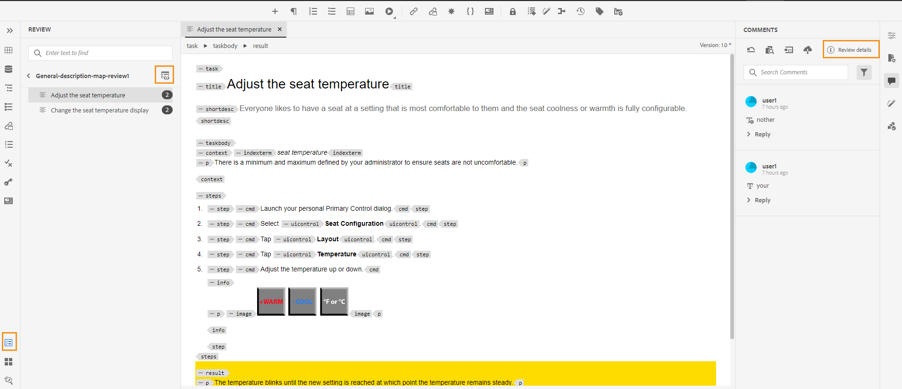
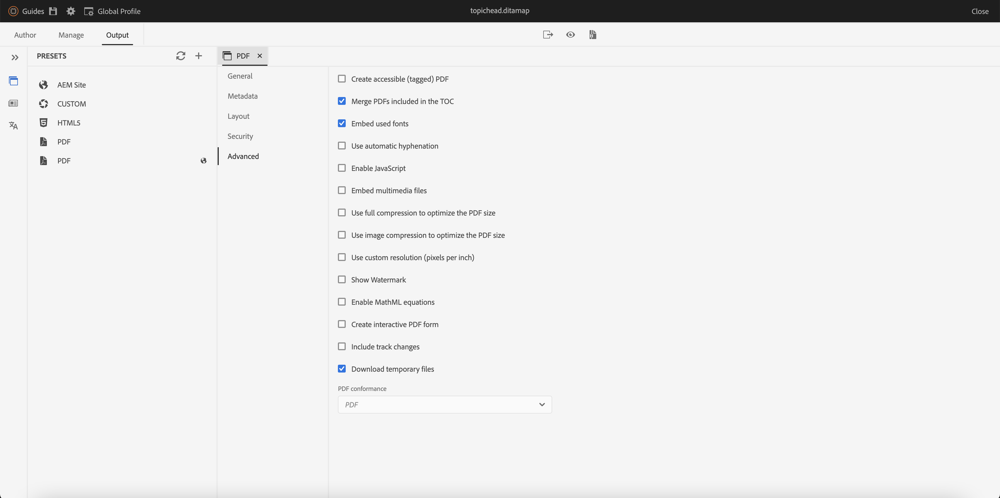

# Novedades de la versión 4.3.0 de Adobe Experience Manager Guides (julio de 2023)

Este artículo cubre las funciones nuevas y mejoradas de la versión 4.3.0 de Adobe Experience Manager Guides (más adelante denominada *AEM Guides*).

Para obtener más información sobre las instrucciones de actualización, la matriz de compatibilidad y los problemas corregidos en esta versión, consulte [Notas de la versión](./release-notes-4-3.md).

## Conectarse a un origen de datos e insertar datos en los temas

Ahora puede conectarse rápidamente a sus fuentes de datos mediante conectores integrados desde AEM Guides. La conexión a una fuente de datos le permite mantener la información sincronizada con la fuente y las actualizaciones de los datos se reflejan automáticamente, lo que convierte a AEM Guides en un auténtico centro de contenido. Esta función le ayuda a ahorrar tiempo y esfuerzo para agregar o copiar manualmente los datos.

AEM Guides permite al administrador configurar los conectores predeterminados para las bases de datos JIRA y SQL (MySQL, PostgreSQL, SQL Server, SQLite). También pueden agregar otros conectores ampliando las interfaces predeterminadas.
Una vez agregados, puede ver los conectores configurados en el panel Fuentes de datos del Editor web.

Cree un fragmento de contenido para recuperar los datos de una fuente de datos conectada. A continuación, puede insertar los datos en los temas y editarlos. Una vez creado un generador de fragmentos de contenido, puede volver a utilizarlo para insertar los datos en cualquier tema.

Ahora también puede crear un tema a partir de una fuente de datos conectada. Un tema puede contener datos en varios formatos, como tablas, listas y párrafos. También permite crear un mapa DITA para todos los temas. Puede asociar metadatos al tema al extraer de una fuente de datos.

Para obtener más información, vea [Usar datos del origen de datos](../user-guide/web-editor-content-snippet.md).

## Añadir citas al contenido

Las citas son referencias a la fuente de información agregada al contenido. Las citas le ayudan a establecer credibilidad y prevenir el plagio. Las citas ayudan a los lectores a localizar la fuente y verificar la información presentada en el texto.

En AEM Guides, puede añadir o importar citas y aplicarlas al contenido. Puede añadir estas citas desde cualquier fuente de libros, sitios web y diarios.

Después de insertar las citas en los temas, puede obtener una vista previa de las mismas en el Editor Web. También puede publicar contenido con citas mediante PDF nativo.

{width="300"}

Para obtener más información, consulta [Agregar y administrar citas en tu contenido](../user-guide/web-editor-apply-citations.md).

## Publicación en un fragmento de contenido

Los fragmentos de contenido son fragmentos de contenido discretos en AEM. Son contenidos estructurados basados en un modelo de contenido. Los fragmentos de contenido son contenido puro sin información de diseño. Se pueden crear y administrar de forma independiente de los canales compatibles con AEM. La modularidad y reutilización de los fragmentos de contenido aumenta la flexibilidad, coherencia, eficacia y simplifica la administración.

Ahora, AEM Guides ofrece una forma de publicar un tema o los elementos dentro de un tema en un fragmento de contenido. Puede crear una asignación basada en JSON entre un tema y un modelo de fragmento de contenido. Utilice esta asignación para publicar contenido presente en algunos o todos los elementos de un tema en un fragmento de contenido.

Capitalice la potencia de AEM Guides y los fragmentos de contenido y utilice fragmentos de contenido en cualquier sitio de AEM. También puede extraer los detalles a través de las API admitidas por los fragmentos de contenido.

{width="550"}

## Revisar mejoras

AEM Guides ahora proporciona una capacidad de revisión mejorada con las siguientes funcionalidades:

### Panel Revisar para mostrar los proyectos de revisión y las tareas de revisión activas

Ahora, AEM Guides hace que sus críticas sean más fluidas. Proporciona el panel Revisiones dentro del Editor web. El panel Revisiones muestra todos los proyectos de revisión y las tareas de revisión activas dentro de los proyectos de revisión de los que forma parte.

Como autor, esta función le ayuda a abrir fácilmente las tareas de revisión, ver los comentarios y dirigirlos rápidamente en una vista centralizada.
{width="800"}
Para obtener más información, vea la descripción de la característica **Revisar** en la sección [Panel izquierdo](../user-guide/web-editor-features.md#id2051EA0M0HS).

### Buscar temas de revisión

Realizar revisiones es una característica fundamental de AEM Guides. Ayuda a los revisores a revisar los documentos asignados a ellos
Ahora puede buscar un tema escribiendo parte del texto del título o ruta de archivo en la barra de búsqueda de la vista Temas del panel de revisión. También puede elegir ver todos los temas o ver los temas con comentarios. De forma predeterminada, puede ver todos los temas presentes en la tarea de revisión.

{width="800"}

Para obtener más información, vea [Revisar temas](../user-guide/review-topics.md).

## Marco de extensión de Guides

Cree paquetes personalizados sobre AEM Guides para proporcionar extensibilidad mediante el marco de trabajo de extensión de AEM Guides. Estos paquetes son útiles para desarrolladores y consultores y les proporcionan extensibilidad a los componentes del Editor. Pueden segmentar botones, cuadros de diálogo y listas desplegables, y agregar JavaScript personalizado que pueda interoperar fácilmente con la interfaz de usuario de AEM Guides.

## Mejoras nativas de PDF

En la versión 4.3.0 se han realizado las siguientes mejoras nativas de PDF para hacer de AEM Guides un producto más robusto:

### Compatibilidad con variables de idioma

AEM Guides proporciona compatibilidad con variables de idioma. Puede utilizar variables de idioma para definir una versión localizada de las etiquetas predeterminadas como Nota, Precaución y Advertencia o texto estático en la salida de PDF.
Puede añadir las variables de idioma o la versión localizada de las etiquetas a las secciones adecuadas de la salida de PDF y en las plantillas de salida.

#### Variables de idioma en la salida de PDF

Puede utilizar las variables de idioma para definir etiquetas localizadas para elementos como Nota, Precaución y Advertencia. Puede actualizar el valor de estas variables en uno o más idiomas y, a continuación, el valor localizado se selecciona automáticamente en la salida de PDF.
Por ejemplo, puede presentar la etiqueta Nota en la salida de PDF de las siguientes maneras:

* Inglés: Nota
* Francés: Remarque
* Alemán: Hinweis

#### Variables de idioma en las plantillas de salida

Si desea crear la salida de PDF en varios idiomas, debe crear diferentes plantillas de PDF que contengan texto localizado para cada idioma. Ahora, con la función de variables de idioma, solo debe crear la plantilla una vez. A continuación, para cualquier texto estático que necesite localizar, puede crear las variables de idioma correspondientes y utilizarlas en la plantilla.
Puede crear variables de idioma para texto más largo, como una oración completa o incluso un párrafo. También puede aplicar estilos y utilizar el marcado de HTML para dar formato a estas variables de idioma.

Para obtener más información, vea [Compatibilidad con variables de idioma](../native-pdf/native-pdf-language-variables.md).

### Agregar una marca de agua a la salida de PDF para borradores de documentos

Ahora puede agregar una marca de agua a la salida de PDF del documento que aún no se ha aprobado. Esta marca de agua no aparece si genera el PDF para el documento en el estado de documento &quot;Aprobado&quot;. Por ejemplo, puede agregar una marca de agua Borrador para la salida de PDF.

Para obtener más información, vea [Agregar una marca de agua a la salida de PDF para los borradores de documentos](../native-pdf/use-javascript-content-style.md#watermark-draft-document).

### Capacidad para utilizar metadatos de AEM en diseños de PDF

Los metadatos son la descripción o definición del contenido. Estos metadatos se almacenan en el contenido del mapa DITA de origen.

Ahora, en AEM Guides también puede seleccionar las propiedades de metadatos de los recursos y agregarlas al diseño de página. A continuación, AEM Guides selecciona estas propiedades de metadatos de los recursos y los publica en la salida de PDF.

{width="300"}

>[!NOTE]
>
> AEM Guides también admite las propiedades de metadatos para los mapas DITA.

Para obtener más información, vea [Agregar campos y metadatos](../native-pdf/design-page-layout.md#add-fields-metadata).

### Ordenar páginas en la salida de PDF

Puede mostrar u ocultar las siguientes secciones en PDF y también organizar el orden en que deben aparecer en la salida final de PDF:

* TDC
* Capítulos y temas
* Lista de figuras
* Lista de tablas
* Índice
* Glosario
* Cita
* Diseños de página

Si no desea mostrar una sección en particular en la salida de PDF, puede ocultarla desactivando el conmutador.

Para obtener más información, vea [Orden de las páginas](../native-pdf/components-pdf-template.md#page-order).

### Combinar páginas

De forma predeterminada, en una salida nativa de PDF, todas las secciones comienzan en una nueva página. Ahora puede combinar una sección con su página anterior o con la página siguiente. Esto publica la sección como continuación de la página seleccionada en la salida de PDF y no hay ningún salto de página intermedio.

Para obtener más información, vea la descripción de la característica Combinar páginas en la sección [Orden de las páginas](../native-pdf/components-pdf-template.md#page-order).

### Páginas estáticas

También puede crear diseños de página personalizados y publicarlos como páginas estáticas en la salida de PDF. Esto le ayuda a añadir contenido estático como notas o páginas en blanco.

Para obtener más información, vea la descripción de la característica de páginas estáticas en la sección [Orden de las páginas](../native-pdf/components-pdf-template.md#page-order).

### Variables en referencias cruzadas

Puede utilizar variables para definir una referencia cruzada. Cuando se utiliza una variable, su valor se selecciona de las propiedades.

Ahora también puede usar {figure} y {table}.
Use {figure} para agregar una referencia cruzada al número de figura. Selecciona el número de figura de los estilos de numeración automática que ha definido para figcaption.

Use {table} para agregar una referencia cruzada al número de tabla. Selecciona el número de tabla de los estilos de numeración automática que ha definido para el pie de ilustración.

Para obtener más información, vea [Referencias cruzadas](../native-pdf/components-pdf-template.md##cross-references).

### Iniciar cualquier capítulo desde la página actual

Se pueden definir los valores de configuración básicos para iniciar un capítulo desde una página impar o par, la estructura del índice y definir el formato de línea directriz para las entradas del índice.

Ahora también puede iniciar un capítulo desde la página actual. Si decide hacerlo, todos los capítulos se publican a continuación sin saltos de página. Por ejemplo, si un capítulo termina en mitad de la página 15, el capítulo siguiente también comienza desde la propia página 15.

### Capacidad para acceder a archivos temporales de HTML al generar la salida nativa de PDF

Ahora, AEM Guides le permite descargar los archivos temporales de HTML creados al generar la salida nativa de PDF. En la configuración del ajuste preestablecido de salida, seleccione la opción para descargar los archivos temporales.  A continuación, AEM Guides le permite descargar los archivos temporales creados al generar la salida mediante ese ajuste preestablecido.

Esta función permite obtener una mejor perspectiva del proceso de generación con acceso a estilos y diseños provisionales y le ayuda a corregir o cambiar los estilos CSS según sus necesidades.

{width="800"}

Para obtener más información, vea [Crear un ajuste preestablecido de salida de PDF](../web-editor/native-pdf-web-editor.md#create-output-preset).

### Rediseño del editor CSS

Ahora el editor CSS se ha rediseñado para mejorar la experiencia del usuario con selectores y propiedades de estilo.

#### Mejora del cuadro de diálogo Agregar estilo

Ahora puede utilizar selectores personalizados para añadir estilos complejos. El nuevo campo Selector le ayuda a añadir selectores personalizados además de la combinación de Clase, Etiqueta y Pseudoclase. Por ejemplo, puede crear el estilo `table a.link` para todos los hipervínculos dentro de una tabla.

{width="300"}

#### Personalizar propiedades de estilo

Ahora, AEM Guides le presenta un nuevo panel de propiedades en la sección de vista previa para estilos. Puede editar las propiedades de los estilos de forma más eficaz y rápida desde el panel Propiedades.

## Cambiar nombre y mover archivos en la vista Repositorio

Ahora también puede cambiar el nombre de un archivo o moverlo desde el panel del repositorio. Esta función es útil y ayuda a administrar los archivos fácilmente desde el panel Repositorio. Puede seleccionar un archivo y cambiarle el nombre o moverlo utilizando el menú **Opciones** del archivo seleccionado. AEM Guides muestra un mensaje de éxito al mover o cambiar el nombre de un archivo.

{width="550"}

Para obtener más información sobre el menú Opciones de un archivo, vea la descripción de la característica **Vista del repositorio** en la sección [Panel izquierdo](../user-guide/web-editor-features.md#id2051EA0M0HS).

## Informe Vínculos rotos en el editor web

AEM Guides permite comprobar la integridad general de los documentos técnicos y generar informes desde el editor web. Ahora, en la versión de junio de 2023 de AEM Guides, se incluye la función para ver y corregir los vínculos rotos. Este es un informe útil que le ayuda a administrar los vínculos rotos. Puede ver fácilmente los vínculos rotos presentes en el mapa DITA y también corregirlos.
{width="800"}

Una vez corregido un vínculo, no se muestra en la lista de vínculos rotos.

Para obtener más información, consulte [Ver y corregir vínculos rotos](../user-guide/reports-web-editor.md#report-broken-links).

## Mejoras de Schematron

### Usar instrucciones de informe para comprobar reglas en Schematron

AEM Guides ahora también admite las instrucciones de informe con Schematron. Una instrucción de informe genera un mensaje cuando una instrucción de prueba se evalúa como verdadera. Por ejemplo, si desea que la descripción breve tenga menos de 150 caracteres o menos, puede definir una instrucción de informe para comprobar los temas en los que la descripción breve tenga más de 150 caracteres.

Para obtener más información, vea [Use instrucciones de aserción e informe para buscar reglas](../user-guide/support-schematron-file.md#schematron-assert-report).

### Uso de expresiones Regex

También puede utilizar expresiones Regex para definir una regla con la función matches() y luego realizar la validación mediante el archivo Schematron.

Para obtener más información, vea [Usar expresiones Regex](../user-guide/support-schematron-file.md#schematron-assert-report).

### Definir patrones abstractos

AEM Guides también admite patrones abstractos en Schematron. Puede definir patrones abstractos genéricos y reutilizarlos. Los patrones abstractos pueden simplificar el esquema de Schematron y también ayudarle a administrar y actualizar la lógica de validación.

Para obtener más información, vea [Definir patrones abstractos](../user-guide/support-schematron-file.md#schematron-abstract-patterns).

## Compatibilidad con el formato XLIFF en la traducción

AEM Guides también admite el formato XLIFF (XML Localization Interchange File Format) en traducción. Ahora también puede elegir **Crear un nuevo proyecto de traducción XLIFF** para convertir el contenido XML al formato XLIFF. AEM Guides es compatible con la versión 1.2 de XLIFF.

Con este formato, puede exportar el contenido al formato XLIFF estándar del sector y, a continuación, proporcionar lo mismo a los proveedores de traducción. Para obtener más información, vea [Crear un proyecto de traducción](../user-guide/translate-documents-web-editor.md#create-translation-project).

{width="350"}

## Mejoras en la colección de mapas

Una colección de mapas ayuda a organizar varias asignaciones y a publicarlas por lotes. Se han realizado muchas mejoras en la colección de mapas:

* Ahora puede agregar ajustes preestablecidos de salida nativos de PDF a una colección de mapas y utilizarlos para generar la salida de PDF.
* Puede ver los ajustes preestablecidos de perfil global y de carpeta creados por el administrador y utilizarlos para generar la salida de PDF.
* Ahora, no solo puede seleccionar un ajuste preestablecido individual, sino que también puede activar todos los ajustes preestablecidos de perfil de carpeta para un mapa DITA de una sola vez.
  {width="800"}

Para obtener más información, vea [Usar la colección de mapas para la generación de resultados](../user-guide/generate-output-use-map-collection-output-generation.md).

## Compatibilidad con PDF nativo en el tablero de publicación en lote

Con la función Activación masiva de AEM Guides, puede activar de forma rápida y sencilla el contenido desde la creación a la publicación. En el mapa de activación masiva, puede incluir los ajustes preestablecidos de salida nativa de PDF, el sitio de AEM, PDF, HTML5, personalizado y salida JSON.
Para obtener más información, vea [Activación masiva del contenido publicado](../user-guide/conf-bulk-activation.md).

## Herramienta de movimiento masivo mejorada

Ahora, como administrador, puede utilizar la herramienta de movimiento masivo mejorada para mover carpetas con muchos archivos de una ubicación a otra.
Puede utilizar el cuadro de diálogo Examinar archivo para seleccionar las carpetas de origen que desea mover. También puede examinar y seleccionar la ubicación de destino para mover las carpetas de origen. Seleccione  {width="25"} cerca de un campo para ver más información al respecto.

Para obtener más información, vea [Mover archivos de forma masiva](../user-guide/authoring-file-management.md#move-files-bulk).

## Panel Favoritos mejorado

AEM Guides le ayuda a crear una colección o una lista de favoritos de sus archivos y carpetas y a utilizarlos fácilmente. Ahora el menú **Opciones** también está disponible en el panel **Favoritos**. Puede cambiar el nombre de la colección seleccionada o eliminarla del menú **Opciones**. Puede seleccionar la opción **Actualizar** para obtener una lista nueva de archivos o carpetas del repositorio. También puede ver el contenido de la carpeta en la interfaz de usuario de Assets.

{width="650"}

>[!NOTE]
>
> También puede actualizar la lista con el icono **Actualizar** de la parte superior.

Para obtener más información sobre el menú **Opciones** de una colección de favoritos, vea la descripción de la característica **Favoritos** en la sección [Panel izquierdo](../user-guide/web-editor-features.md#id2051EA0M0HS).

## Cambiar al tema del sistema

Ahora también puede utilizar el tema del dispositivo. Con las **Preferencias de usuario**, puede configurar AEM Guides para que cambie automáticamente entre los temas claro y oscuro en función del tema del dispositivo.

{width="550"}

Para obtener más información, vea la descripción de la característica **Preferencias de usuario** en la sección [Barra de herramientas principal](../user-guide/web-editor-features.md#id2051EA0G05Z).
