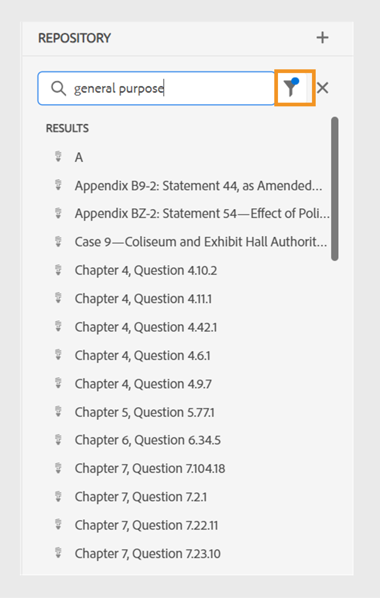
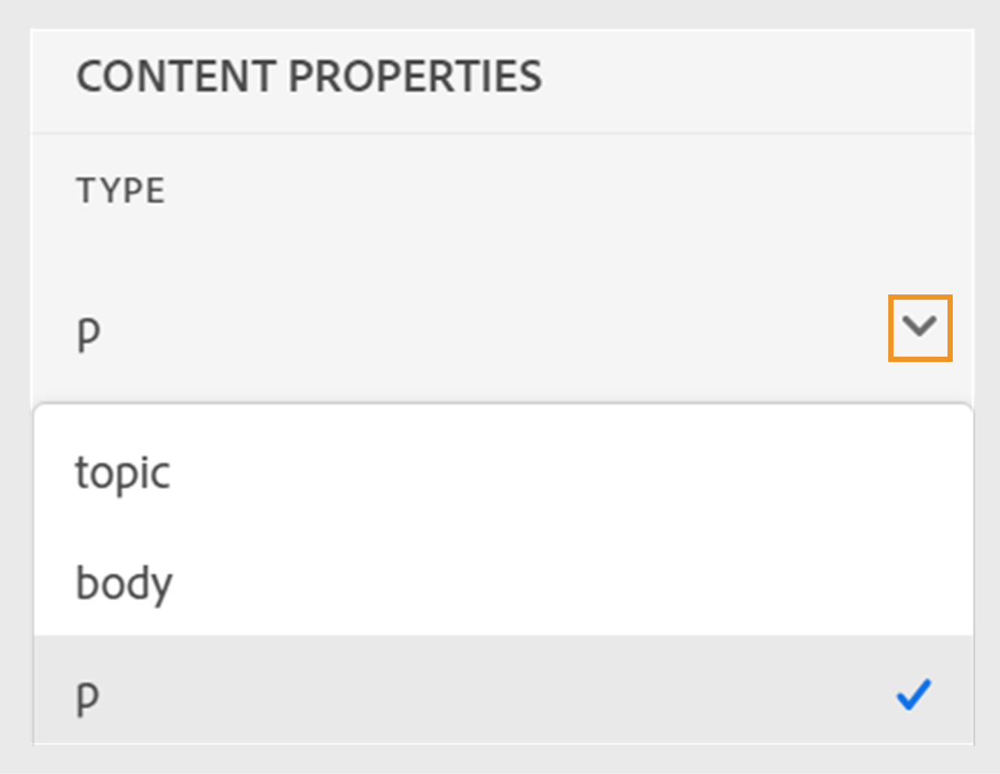

# Novedades de la versión 4.6.0 (septiembre de 2024)

Este artículo cubre las funciones nuevas y mejoradas introducidas con la versión 4.6.0 de Adobe Experience Manager Guides.

Para ver la lista de problemas que se han corregido en esta versión, consulte [Problemas corregidos en la versión 4.6.0](../release-info/fixed-issues-4-6-0.md).

Obtenga información acerca de [instrucciones de actualización para la versión 4.6.0](../release-info/upgrade-instructions-4-6-0.md).

## Mejoras de publicación

En la versión 4.6.0 de se han realizado las siguientes mejoras en la publicación de contenido:

### Publish un tema o sus elementos en un fragmento de experiencia

Un fragmento de experiencia es una unidad de contenido modular dentro de Adobe Experience Manager que integra contenido y diseño. Los fragmentos de experiencias son fundamentales para crear experiencias coherentes y atractivas que se pueden reutilizar en varios canales. Por ejemplo, puede crear fragmentos de experiencias para encabezados o pies de página con elementos de marca, titulares promocionales, testimonios de clientes y promociones de eventos.

 {width="300" align="left"}

*Publish y vea los fragmentos de experiencias de un tema desde la sección **Salidas**&#x200B;en las **Propiedades del archivo**.*

Ahora, Experience Manager Guides le permite publicar un tema o sus elementos en un Fragmento de experiencia. Puede crear una asignación basada en JSON entre un tema o sus elementos y una plantilla de fragmento de experiencia. También puede crear variaciones de Fragmento de experiencia utilizando los filtros de condición.

Obtenga más información sobre cómo [Fragmentos de experiencias de Publish](../user-guide/publish-experience-fragment.md).

### Mejoras en la publicación de fragmentos de contenido

Experience Manager Guides también proporciona algunas mejoras útiles en los fragmentos de contenido:

- Experience Manager Guides permite publicar un tema o sus elementos en un fragmento de contenido.

- Puede publicar y ver los fragmentos de contenido de un tema desde la sección **Salidas** en las **Propiedades del archivo**.

- Puede crear fácilmente variaciones de fragmentos de contenido filtrando el contenido con condiciones mientras publica en un fragmento de contenido.

- Utilice la nueva interfaz de asignación para seleccionar y publicar fácilmente los elementos en un fragmento de contenido.

Ahora, la publicación de fragmentos de contenido solo reemplaza el contenido asignado en lugar de sobrescribir el fragmento de contenido completo. Esta función permite que un fragmento de contenido contenga datos de varias fuentes, como varios temas o el editor de fragmentos de contenido.

Para obtener más información, vea [Fragmentos de contenido de Publish](../user-guide/publish-content-fragment.md).

### Ajuste preestablecido de AEM Sites reorganizado para facilitar su uso

La configuración se ha reorganizado para ayudarle a configurar rápidamente el ajuste preestablecido de salida y generar la salida de AEM Sites.
Puede crear los ajustes preestablecidos de AEM Sites existentes seleccionando la opción **Usar asignación de componentes heredados** en el cuadro de diálogo **Nuevo ajuste preestablecido de salida**.

Vea las fichas **General**, **Contenido** y **Referencia de mapa cruzado** en los ajustes preestablecidos de AEM Sites:
- **General**: Contiene las configuraciones generales para generar el resultado. Puede especificar el sitio y la ruta de acceso de salida, eliminar o sobrescribir las páginas de salida existentes, eliminar las páginas generadas anteriormente para los temas eliminados, seleccionar la plantilla de diseño, conservar los archivos temporales y especificar el flujo de trabajo de generación posterior.
- **Contenido**: contiene la configuración aplicable al contenido para la generación de resultados. Se pueden seleccionar los filtros, la línea de base del mapa DITA y las propiedades de metadatos para la publicación.
- **Referencias de mapas cruzados**: esta lista contiene temas que contienen referencias de mapas cruzados con ámbito =&quot;peer&quot;. Se puede especificar el contexto de publicación para una lista de referencias de mapas cruzados con scope=&quot;peer&quot; para los temas disponibles en otros mapas DITA. Esta pestaña aparece si utiliza la versión de Experience Manager Guides (UUID).

### Referencias de mapas cruzados de ajustes preestablecidos de AEM Sites en el Editor web

La última mejora de Experience Manager Guides introduce referencias cruzadas de mapas en los ajustes preestablecidos de AEM Sites del Editor web.
Las referencias cruzadas en mapas en Experience Manager Guides ayudan a mejorar la navegación por el contenido, aumentar la reutilización del contenido y mejorar la experiencia del usuario.

Se puede especificar el contexto de publicación para una lista de referencias de mapas cruzados a temas disponibles en otros mapas DITA con scope=&quot;peer&quot;. Por ejemplo, el Tema 1 del Mapa A contiene una referencia al Tema 2. El tema 2 puede estar presente en mapas únicos o múltiples.  Puede seleccionar el mapa principal y un ajuste preestablecido específico o la salida publicada más recientemente para cada vínculo.

Si se hace referencia al mismo tema más de una vez en un archivo, puede agregar un contexto de publicación diferente para cada instancia. Esto proporciona una mayor flexibilidad y control sobre su contenido. Por ejemplo, el tema 3 está presente tanto en el mapa B como en el mapa C. El tema 1 contiene dos referencias al tema 3. Puede elegir Mapa B como mapa principal para el primer vínculo y Mapa C como mapa principal para el segundo vínculo.

*Especifique el contexto de publicación para los temas vinculados desde la ficha **Referencias de mapas cruzados**&#x200B;del ajuste preestablecido **AEM Sites**.*

### Capacidad para pasar metadatos de propiedades de archivo de tema a la salida del PDF nativo

Ahora, Experience Manager Guides le permite agregar los metadatos de las propiedades de archivo de un tema a los diseños de página mientras genera la salida del PDF nativo. Utilice esta función para agregar metadatos específicos del tema, como el título, las etiquetas y la descripción a los diseños de página. También puede personalizar el PDF publicado en función de los metadatos del tema, como agregar una marca de agua al fondo del tema en función del estado del documento del tema.

 {width="300" align="left"}

*Agregar metadatos a los campos de los diseños de página.*

Aprenda a [agregar campos y metadatos](../native-pdf/design-page-layout.md#add-fields-metadata) en un diseño de página.

### Compatibilidad con documentos Markdown en la publicación nativa de PDF

Experience Manager Guides también admite documentos Markdown en la publicación de PDF nativos. Esta función es útil y le ayuda a generar PDF para los archivos Markdown en el mapa DITA.

Para obtener más información, vea [compatibilidad con documentos de Markdown](../web-editor/native-pdf-web-editor.md#support-for-markdown-documents).

### Descargar el archivo temporal mientras se genera la salida mediante DITA-OT

También puede descargar los archivos temporales que se generan al publicar la salida de AEM Sites, HTML, Custom, JSON o PDF mediante DITA-OT. Esta función le ayuda a analizar cualquier problema que pueda producirse durante el proceso de generación de resultados y a solucionar problemas de forma eficaz.  
También puede descargar el archivo metadata.xml si ha seleccionado alguna propiedad de metadatos que se haya pasado a la salida generada mediante DITA-OT. 

Para obtener más información acerca de los ajustes preestablecidos, vea [Explicación de los ajustes preestablecidos de salida](../user-guide/generate-output-understand-presets.md).

### Opción para elegir una jerarquía de archivos plana o anidada para la salida de HTML 5

Ahora, Experience Manager Guides le permite conservar la jerarquía de carpetas plana para los archivos temporales en los que todo el contenido se publica en formato de salida HTML5 y se guarda en una sola carpeta.
Si no decide acoplar la jerarquía de archivos, la salida de HTML5 se genera en una jerarquía de carpetas anidada. Esto implica que la estructura de carpetas original del contenido, con archivos organizados en subcarpetas, se replica en la salida. Esta jerarquía de carpetas anidada permite una organización y categorización de archivos más complejas, lo que facilita la administración y la navegación por grandes volúmenes de datos.

Obtenga más información sobre cómo [generar la salida de HTML5](../user-guide/generate-output-html5.md)

## Mejoras del editor

Se han añadido las siguientes mejoras del editor en la versión 4.6.0:

### Acceso de solo lectura al modo Autor y Source para archivos bloqueados

Si un fichero DITA o Markdown está bloqueado o extraído por otro usuario, no se puede editar ni cambiar el contenido. Además de la Vista previa, también puede verla como un archivo de solo lectura en el modo Autor o Source.
En modo de solo lectura, puede ver el contenido junto con las etiquetas y atributos en el modo **Autor** o **Source** y editar las propiedades del archivo.

También puede acceder a la vista **Diseño** para obtener mapas DITA de solo lectura.
>[!NOTE]
>
> Los administradores de perfil de carpeta deben actualizar *ui_config.json* para que pueda acceder de manera armoniosa a los archivos de solo lectura en los modos Autor, Source y Diseño.

*Ver los archivos bloqueados en los modos Autor y Source.*

Aprenda a [abrir archivos bloqueados en los modos Autor y Source](../user-guide/web-editor-edit-topics.md#open-locked-files-in-author-and-source-modes).

### Selección de contenido parcial entre elementos para las operaciones

Experience Manager Guides mejora la experiencia de selección del contenido en los elementos del editor web. Puede seleccionar fácilmente contenido en diferentes elementos y realizar operaciones como ponerlo en negrita, cursiva y subrayado.

Esta función le permite aplicar o quitar sin problemas el formato del contenido seleccionado parcialmente. También puede eliminar rápidamente el contenido seleccionado en todos los elementos. Una vez eliminado el contenido, si es necesario, el contenido restante se combina automáticamente con un solo elemento válido. También se puede seleccionar contenido parcial entre elementos y, a continuación, rodearlo con un elemento DITA válido.

En general, estas mejoras proporcionan una mejor experiencia y le ayudan a mejorar su eficacia al editar sus documentos.
Para obtener más información, vea [Selección parcial del contenido en todo el elemento](../user-guide/web-editor-edit-topics.md#partial-selection-of-content-across-elements).

### Lista separada para ver e insertar elementos válidos según su posición

Al editar un documento en el Editor Web, ahora puede ver una lista separada de elementos que son válidos en la ubicación actual y fuera de la ubicación actual. Según sus necesidades, puede elegir un elemento de las siguientes opciones:

- **Elementos válidos en la ubicación actual** que puede insertar en la propia ubicación del cursor actual.
- **Elementos válidos fuera de la ubicación actual** que se pueden insertar después de cualquiera de los elementos primarios del elemento actual dentro de la jerarquía de elementos.

{width="300" align="left"}

*Ver las listas separadas de elementos válidos para insertar un elemento en la ubicación actual.*

Esta lista dividida de elementos válidos le ayuda a mantener la estructura de contenido y a seguir los estándares DITA.

Obtenga más información acerca de la característica **Insertar elemento** en la sección [Barra de herramientas secundaria](../user-guide/web-editor-features.md#2051ea0j0y4).

### Experiencia modificada para buscar y filtrar archivos en la vista del repositorio

Ahora tiene una mejor experiencia al filtrar archivos. La funcionalidad renovada para filtrar archivos ofrece una mejor forma de buscar y navegar por los archivos sin esfuerzo.

{width="300" align="left"}

*Busque los archivos que contienen el texto`general purpose.`*

Disfrute de ventajas como un acceso más rápido a los archivos relevantes y una interfaz de usuario más intuitiva, lo que hace que su experiencia de búsqueda sea más fluida y eficiente.

 {width="300" align="left"}

*Utilice los filtros rápidos para buscar archivos DITA y no DITA.*

>[!NOTE]
>
> Los administradores de perfil de carpeta deben actualizar *ui_config.json* para que pueda acceder de manera armoniosa a esta característica.

Obtenga más información sobre la función **Filtrar búsqueda** en la sección [Panel izquierdo](../user-guide/web-editor-features.md#id2051EA0M0HS).

### Condiciones agrupadas para la organización de contenido mejorada

Experience Manager Guides ahora le permite agrupar condiciones y presentarlas en una jerarquía anidada, lo que le permite agregar varias condiciones a un solo grupo. Al agrupar las condiciones, puede organizarlas y aplicarlas mejor en todo el contenido.

{width="300" align="left"}

Obtenga más información acerca de la descripción de la característica **Condiciones** en la sección [Panel izquierdo](../user-guide/web-editor-features.md#id2051EA0M0HS).

### Personalice su experiencia de editor web con una nueva interfaz de usuario de preferencias de usuario

El cuadro de diálogo **Preferencias de usuario** del Editor web ahora incluye una nueva pestaña **Aspecto**. Esta nueva pestaña le permite configurar cómodamente las preferencias de aspecto y funcionamiento más comunes en la interfaz del editor web.

Puede configurar para ver los archivos por título o nombre de archivo, y cambiar el tema de la aplicación y la vista de origen. También le ayuda a configurar los ajustes para localizar un archivo abierto en la vista del repositorio y gestionar los espacios de no separación.

{width="550" align="left"}

*Personalice el aspecto según sus preferencias.*

Obtenga más información acerca de la descripción de la característica **Preferencias de usuario** en la sección [Panel izquierdo](../user-guide/web-editor-features.md#id2051EA0M0HS).

### Busque un archivo abierto en la vista del repositorio del Editor Web

Seleccione la opción **Buscar siempre archivos en el repositorio** en las **Preferencias del usuario** para navegar rápidamente y localizar el archivo en la vista del repositorio. No es necesario que lo busque manualmente.

Al editar, esta función también le ayuda a ver fácilmente la ubicación del archivo dentro de la jerarquía del repositorio.

Para obtener más información, vea [buscar un archivo abierto en la vista del repositorio](../user-guide/web-editor-edit-topics.md#locate-an-open-file-in-the-repository-view).

### Se ha mejorado el control de los espacios de no separación en el Editor web

Experience Manager Guides permite mostrar un indicador de espacio de no separación al editar documentos en el Editor web. También mejora el manejo de los espacios de no separación.
Convierte varios espacios en blanco consecutivos en un único espacio para conservar la vista WYSIWYG del documento en el Editor Web. Esta función también ayuda a mejorar el aspecto general y la profesionalidad del documento.

Para obtener más información, vea las [otras características del editor web](../user-guide/web-editor-other-features.md).

### Capacidad para ver propiedades de cualquier elemento desde la jerarquía de elementos

Ahora, las Propiedades de contenido **Type** aparecen como un menú desplegable. Puede ver y seleccionar las etiquetas de la jerarquía completa para la etiqueta actual en el menú desplegable.

Este menú desplegable le ayuda a acceder rápidamente a las propiedades de contenido de la etiqueta seleccionada.

{width="300" align="left"}

*Seleccione una etiqueta de la jerarquía para la etiqueta actual.*

Obtenga más información acerca de la característica **Propiedades de contenido** en la sección [Panel derecho](../user-guide/web-editor-features.md#id2051eb003yk).

### Se ha mejorado el rendimiento al proteger los archivos de forma masiva desde el Editor de mapas

Experience Manager Guides mejora el rendimiento y la experiencia de la función de registro de archivos en lote desde el Editor de mapas. Esta mejora le ayuda a proteger los archivos de forma masiva con mayor rapidez.
También puede ver el progreso de la operación de protección de los archivos en el cuadro de diálogo **Guardar como nueva versión y desbloquear**. Por último, el mensaje de confirmación aparece una vez finalizada la operación y se registran todos los archivos desprotegidos seleccionados.

{width="300" align="left"}

*Ver la lista y el estado de los archivos comprobados de forma masiva desde el Editor de mapas.*

Aprenda a [trabajar con el Editor de mapas avanzado](../user-guide/map-editor-advanced-map-editor.md)

## Mejoras en la administración del ciclo vital de contenido

La administración del ciclo de vida de contenido se ha mejorado de las siguientes maneras:

### Capacidad para traducir contenido a varios idiomas utilizando grupos de idiomas preconfigurados

Ahora, Experience Manager Guides permiten crear grupos de idiomas y traducir fácilmente su contenido a varios idiomas. Esta función le ayuda a organizar y administrar las traducciones según las necesidades de su organización.

Por ejemplo, si tiene que traducir el contenido para algunos países de Europa, puede crear un grupo de idiomas para idiomas europeos como el inglés (EN), francés (FR), alemán (DE), español (ES) e italiano (IT).

{width="300" align="left"}

*Seleccione los grupos de idiomas o idiomas que desee traducir sus documentos.*

>[!NOTE]
>
>Si falta la carpeta de destino de un idioma o el idioma de destino es el mismo que el de origen, aparecerá atenuado y mostrará un signo de advertencia.

Como administrador, puede crear grupos de idiomas y configurarlos en varios perfiles de carpeta. Como autor, puede ver los grupos de idiomas configurados en el perfil de la carpeta.

En general, la creación de grupos de idiomas mejora la eficacia y la productividad de los proyectos de traducción y, en última instancia, mejora el proceso de localización en varios idiomas.

Aprenda a [traducir documentos desde el editor web](../user-guide/translate-documents-web-editor.md).

### Rendimiento y escalabilidad mejorados para proyectos de traducción grandes

La función de traducción es más rápida y escalable que nunca. Viene con una nueva arquitectura que proporciona un rendimiento mejorado. El tiempo de creación del proyecto es ahora más rápido que antes, y los conflictos durante el proceso son casi inexistentes. Este rendimiento mejorado le ayuda a realizar traducciones más rápidas, lo que garantiza un funcionamiento sin problemas incluso en proyectos de traducción grandes.

Esta mejora es muy beneficiosa, ya que mejora la productividad y la experiencia general.

Obtenga más información sobre cómo [traducir documentos desde el editor web](../user-guide/translate-documents-web-editor.md).

### Eliminar o deshabilitar el proyecto de traducción automáticamente después de la traducción

Ahora, como administrador, puede configurar los proyectos de traducción para que se deshabiliten o eliminen automáticamente después de completar la traducción. Esta función le ayuda a utilizar recursos de forma eficaz y a administrar archivos después de completar la traducción.

Al eliminar un proyecto, se quitan permanentemente todos los archivos y carpetas presentes en el proyecto. La eliminación de los proyectos de traducción también le permite liberar el espacio en disco ocupado.

Puede desactivar los proyectos de traducción si desea utilizarlos más adelante.

{width="550" align="left"}

*Configurar grupos de idiomas y la configuración de limpieza para proyectos de traducción.*

Obtenga más información sobre cómo [eliminar o deshabilitar automáticamente el proyecto de traducción](../user-guide/translate-documents-web-editor.md#automatically-delete-or-disable-a-completed-translation-project).

### Desactivar el posprocesamiento para carpetas selectivas en Adobe Experience Manager Assets

Como administrador, ahora puede deshabilitar el posprocesamiento y la generación de UUID para carpetas selectivas en Experience Manager Assets. Esta configuración puede resultar útil, especialmente cuando se tratan muchos recursos o estructuras de carpetas complejas. También permite a varios usuarios cargar rápidamente los recursos de forma simultánea sin interferir entre sí.  

La desactivación del posprocesamiento de una carpeta también afecta a todas sus carpetas secundarias. Sin embargo, Experience Manager Guides ahora ofrece la capacidad de habilitar selectivamente el posprocesamiento para carpetas secundarias individuales dentro de la carpeta ignorada.

Aprenda a [deshabilitar el posprocesamiento para una carpeta](../cs-install-guide/conf-folder-post-processing.md).

## Mejoras en los conectores de fuentes de datos

Se han realizado las siguientes mejoras en los conectores de fuente de datos para la versión 2024.4.0:

### Conéctese a las fuentes de datos de los paneles de desarrollo de Salsify, Akeneo y Microsoft Azure (ADO)

Además de los conectores predeterminados existentes, las guías de Experience Manager también proporcionan conectores para fuentes de datos de Salsify, Akeneo y Microsoft Azure DevOps Boards (ADO). Como administrador, puede descargar e instalar estos conectores. A continuación, configure los conectores instalados.

### Copie y pegue la consulta de ejemplo para crear un fragmento de contenido o un tema

Puede copiar y pegar fácilmente una consulta de datos de muestra en el generador para crear un fragmento de código de contenido o un tema. Con esta función, no es necesario recordar la sintaxis ni crear una consulta manualmente. En lugar de escribir manualmente la consulta, puede copiar y pegar una consulta de muestra, editarla y utilizarla para recuperar los datos según sus necesidades.

{width="800" align="left"}

*Copie y edite una consulta de muestra para crear el fragmento de código de contenido.*

### Conexión a archivos de datos JSON mediante un conector de archivos

Ahora, como administrador, puede configurar un conector de archivo JSON para utilizar archivos de datos JSON como fuente de datos. Utilice el conector para importar los archivos JSON del equipo o de Adobe Experience Manager Assets. A continuación, como autor, puede crear fragmentos de código de contenido o temas mediante los generadores.

Esta función le ayuda a utilizar los datos almacenados en sus archivos JSON y a reutilizarlos en varios fragmentos de código. El contenido también se actualiza dinámicamente cada vez que se actualizan los archivos JSON.

### Configure varias URL de recursos para un conector para crear fragmentos de contenido o temas

Como administrador, puede configurar varias URL de recursos para algunos conectores, como Cliente REST genérico, Salsify, Akeneo y Tableros de DevOps de Microsoft Azure (ADO).

A continuación, como autor, conéctese con las fuentes de datos para crear fragmentos de código de contenido o temas mediante los generadores. Esta función es práctica, ya que no tiene que crear una fuente de datos para cada URL. Ayuda a recuperar datos rápidamente de cualquiera de los recursos de una fuente de datos concreta en un solo fragmento de contenido o tema.

Ver más detalles acerca de los conectores de origen de datos y cómo [configurar un conector de origen de datos desde la interfaz de usuario](../cs-install-guide/conf-data-source-connector-tools.md).

Obtenga información sobre cómo [utilizar datos de la fuente de datos](../user-guide/web-editor-content-snippet.md).

