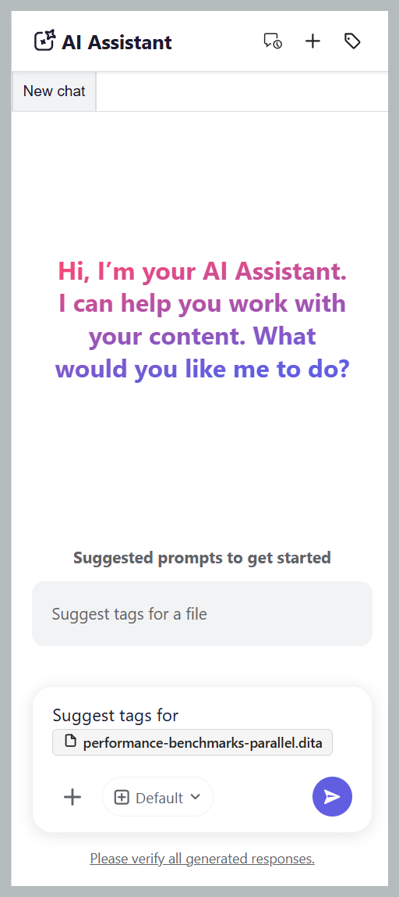
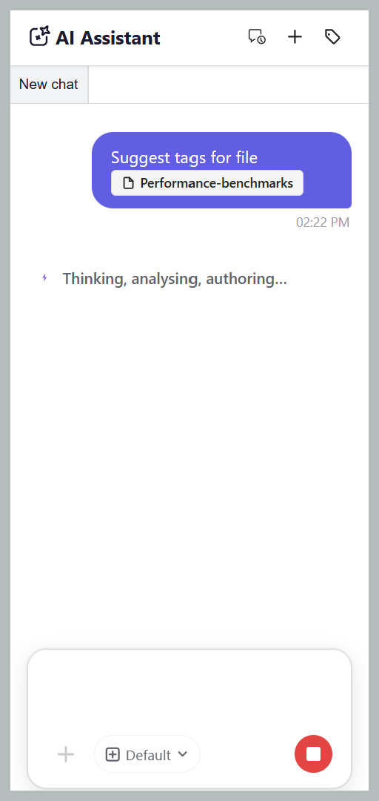
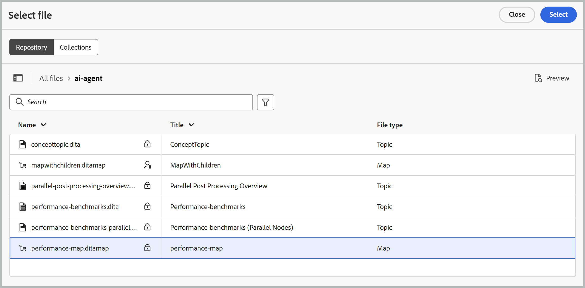
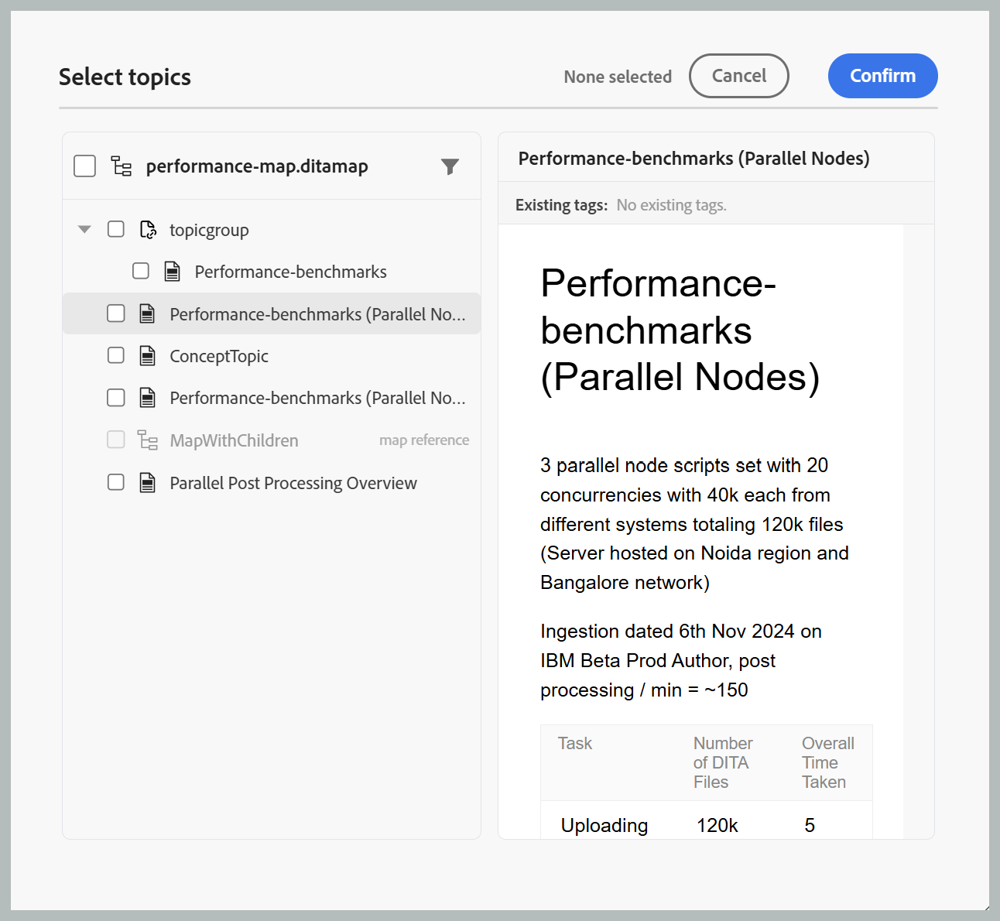

# Uso del asistente de IA en modo automático

>[!NOTE]
>
> El asistente de IA en modo automático está disponible en Experience Manager Guides as a Cloud Service a partir de la versión 2026.09.0. Requiere que su organización esté integrada en CX Enterprise Coworker; una vez integrada, póngase en contacto con el equipo de éxito del cliente para habilitar la función. Para obtener detalles de configuración, vea [Configurar el Asistente de IA en modo agente](../install-conf-guide/configure-ai-assistant-agentic-mode-cs.md).

El asistente de IA en modo automático hace que el etiquetado del contenido sea más rápido, fácil y coherente. Con la habilidad auténtica de etiquetado inteligente de Adobe CX Enterprise Coworker, el asistente de IA analiza el contenido y recomienda las etiquetas relevantes en función de la taxonomía de su organización, en lugar de leer manualmente el contenido para decidir qué etiquetas se aplican. Mantenga el control revisando las etiquetas sugeridas y eligiendo aplicarlas o rechazarlas antes de confirmar su selección, reducir el esfuerzo manual, mejorar la precisión del etiquetado y garantizar metadatos coherentes en toda la documentación.

## Panel del asistente de IA

El panel Asistente de IA proporciona todas las herramientas necesarias para generar, revisar y aplicar etiquetas sugeridas por IA.

{width="650"}

Los siguientes componentes del asistente de IA en modo automático le ayudan a agregar archivos, configurar recomendaciones de etiquetas y administrar el flujo de trabajo de etiquetado inteligente:

- **(A)** Historial de conversaciones: vea y vuelva a abrir conversaciones anteriores para revisar acciones y recomendaciones de etiquetas anteriores.

  {width="350"}

- **(B)** Nuevo chat: inicia una nueva sesión de etiquetado para un tema, asignación o conjunto de archivos diferente.
- **(C)** Área de nombres de etiquetas: seleccione las áreas de nombres de taxonomía desde las que el Asistente de IA genera recomendaciones de etiquetas. Solo se tienen en cuenta las etiquetas de las áreas de nombres seleccionadas.

  {width="350"}

- **(D)** Espacio de respuesta: revise las recomendaciones de etiquetas generadas por IA y elija aceptarlas, rechazarlas o modificarlas antes de aplicar las etiquetas.
- **(E)** Espacio de solicitud: escriba una solicitud de solicitud para generar recomendaciones de etiquetas para el contenido seleccionado.
- **(F)** Adjuntar archivos o agregar contexto: Agrega temas, asignaciones o archivos externos del sistema local para proporcionar el contenido que el Asistente de IA analiza para las recomendaciones de etiquetas.
- Modelo **(G)**: Muestra el modelo de IA utilizado para analizar contenido y generar recomendaciones de etiquetas. Hay varios modelos OpenAI y Anthropic Claude disponibles para su selección. De manera predeterminada, la opción **Usar manifiesto predeterminado** está seleccionada, que usa el modelo configurado para el asistente seleccionado.
- **(H)** Enviar: Envíe el mensaje y el contenido adjunto para generar recomendaciones de etiquetas con tecnología de IA.

## Aplicar etiquetas a uno o varios temas con la habilidad de etiquetado inteligente

Siga estos pasos para utilizar el Asistente de IA para aplicar etiquetas a uno o varios temas con la habilidad de etiquetado inteligente:

1. Inicie sesión en Experience Manager Guides.
1. En la página de inicio, seleccione **Ayudante de IA** en la barra de navegación. Asegúrese de que el administrador haya activado el asistente de IA en modo automático.
1. Añada el tema para el que desea generar recomendaciones de etiquetas mediante uno de los siguientes métodos:

   - **Uso de mensajes sugeridos**: para el primer chat en el área de respuesta, seleccione **Sugerir etiquetas para un mensaje de archivo**. La solicitud se agrega automáticamente al espacio de solicitud. Seleccione `[file]` y, a continuación, elija el tema del repositorio o una colección en el cuadro de diálogo **Seleccionar archivo**. Puede seleccionar un tema del cuadro de diálogo **Seleccionar archivo**.

     {width="650"}

   - **Usando acceso directo**: escriba `/` en el campo Preguntar, luego elija **Agregar referencia de repositorio** para elegir un tema del Repositorio (o **Agregar archivos del dispositivo** para cargar un tema desde el equipo) y escriba un mensaje como *Sugerir etiquetas para un archivo*.

   - **Arrastrar y soltar**: Arrastre y suelte uno o varios temas en el espacio Preguntar y escriba un mensaje como *Sugerir etiquetas para un archivo*.

     {width="650"}

   - **Especificar rutas de acceso temáticas**: escriba `@` seguido de las rutas de acceso separadas por comas para varios temas de las mismas asignaciones o de otras diferentes, e introduzca un mensaje como *Sugerir etiquetas para un archivo*.

     {width="650"}

1. Seleccione **Enviar**.

1. El asistente de IA analiza el contenido del tema y genera recomendaciones de etiquetas.

   {width="650"}

1. Revise las etiquetas sugeridas de la siguiente manera:

   >[!NOTE]
   >
   > Para los temas que ya contienen etiquetas, el Ayudante de IA muestra las etiquetas existentes. Estas etiquetas son de solo lectura y no se pueden modificar ni eliminar.

   - Para un solo tema, puede **aceptar** las recomendaciones para aplicarlas o **rechazarlas** si no son necesarias.

     {width="650"}

   - Para varios temas:
     1. Seleccione **Vista previa** para revisar las recomendaciones de etiquetas generadas por IA.

        {width="650"}

     1. Revise las etiquetas sugeridas para cada tema y elija una de las siguientes acciones:
        - **Acepte todo** para aplicar todas las etiquetas sugeridas para todos los temas.
        - **Rechazar todo** para descartar todas las etiquetas sugeridas para todos los temas.
        - **Borrar todas las sugerencias** para quitar todas las etiquetas sugeridas para un tema específico.
        - Seleccione el icono **X** junto a una etiqueta para eliminar una sugerencia de etiqueta individual.

          {width="650"}

1. Cuando acepta las etiquetas sugeridas, la habilidad Etiquetado inteligente agrega las etiquetas generadas por IA a las etiquetas ya aplicadas al contenido.

Una vez completada la revisión, el Asistente de IA muestra un resumen de las etiquetas aplicadas al tema y las recomendaciones de etiquetas rechazadas.

{width="650"}

## Aplicación de etiquetas a varios temas de un mapa mediante la habilidad de etiquetado inteligente

Siga estos pasos para utilizar el Asistente de IA para aplicar etiquetas a varios temas de un mapa con la habilidad de etiquetado inteligente:

1. Inicie sesión en Experience Manager Guides.
1. En la página de inicio, seleccione **Ayudante de IA** en la barra de navegación. Asegúrese de que el administrador haya activado el asistente de IA en modo automático.
1. Añada el mapa para el que desea generar recomendaciones de etiquetas utilizando cualquiera de los siguientes métodos, tal como se describe en los temas:

   - **Uso de mensajes sugeridos**: para el primer chat en el área de respuesta, seleccione **Sugerir etiquetas para un mensaje de archivo**. La solicitud se agrega automáticamente al espacio de solicitud. Seleccione `[file]` y, a continuación, elija el mapa del repositorio o una colección en el cuadro de diálogo **Seleccionar archivo**.

   - **Arrastrar y soltar**: Arrastre y suelte un mapa en el espacio Preguntar y escriba un mensaje como *Sugerir etiquetas para un archivo*.

   - **Usando acceso directo**: escribe `/` en el campo Preguntar, luego elige **Agregar referencia de repositorio** para elegir un mapa del Repositorio (o **Agregar archivos del dispositivo** para cargar un mapa desde tu equipo) e ingresa una solicitud como *Sugerir etiquetas para un archivo*.

     {width="650"}

1. Seleccione **Enviar**.
Un mensaje indica que la asignación seleccionada contiene varios temas. Seleccione **Seleccionar temas** para elegir los temas para los que desea recomendaciones de etiquetas.

   {width="650"}

1. En el cuadro de diálogo **Seleccionar temas**, seleccione los temas para los que desea recomendaciones de etiquetas.\
   El cuadro de diálogo **Seleccionar temas** proporciona lo siguiente:

   - **Lista de temas:** Muestra todos los temas del mapa seleccionado. Seleccione los temas para los que desea generar recomendaciones de etiquetas.
   - **Panel de vista previa:** muestra una vista previa del tema seleccionado junto con las etiquetas existentes.
   - **Filtro:** Filtre los temas para mostrar solo los que tengan **Etiquetas agregadas** o **No se agregaron etiquetas**.

     {width="650"}

1. Seleccione **Confirmar**. El Asistente de IA analiza los temas seleccionados y muestra el número de recomendaciones de etiquetas generadas para cada tema.
1. Seleccione **Vista previa** para revisar las recomendaciones de etiquetas generadas por IA.
1. Revise las etiquetas sugeridas para cada tema y elija una de las siguientes acciones:
   - **Acepte todo** para aplicar todas las etiquetas sugeridas para todos los temas.
   - **Rechazar todo** para descartar todas las etiquetas sugeridas para todos los temas.
   - **Borrar todas las sugerencias** para quitar todas las etiquetas sugeridas para un tema específico.
   - Seleccione el icono **X** junto a una etiqueta para eliminar una sugerencia de etiqueta individual.

     >[!NOTE]
     >
     > Para los temas que ya contienen etiquetas, el Ayudante de IA muestra las etiquetas existentes. Estas etiquetas son de solo lectura y no se pueden modificar ni eliminar.

   {width="650"}

1. Cuando acepta las etiquetas sugeridas, la habilidad de etiquetado inteligente agrega las etiquetas generadas por IA a las etiquetas ya aplicadas al contenido.

Una vez finalizada la revisión, el Asistente de IA muestra un resumen de las etiquetas aplicadas a cada tema y de las recomendaciones de etiquetas rechazadas.

