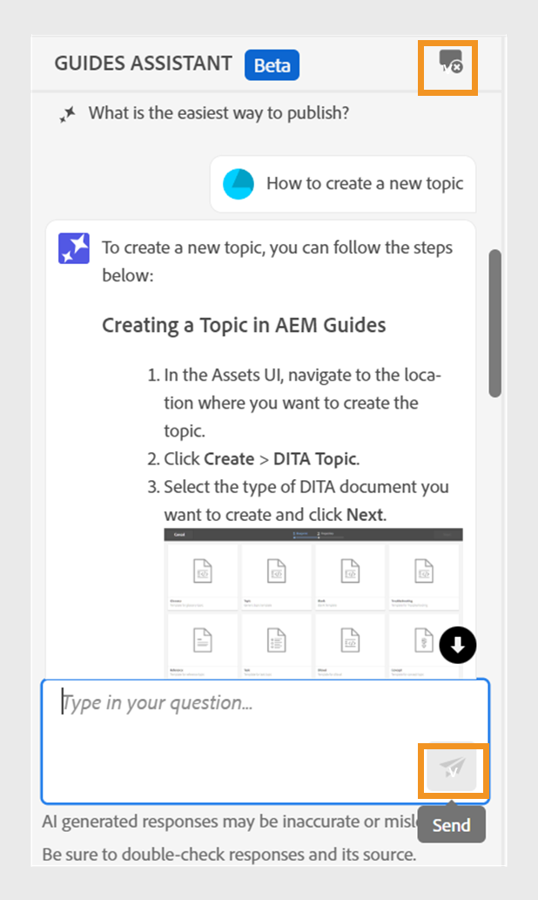

# Asistente de guías con tecnología de IA para buscar contenido

Durante la creación de documentos en el Editor Web, puede utilizar el Asistente para guías basado en GenAI. Esta función de búsqueda conversacional le ayuda a encontrar contenido relevante en la [Documentación de guías de Adobe Experience Manager](https://experienceleague.adobe.com/en/docs/experience-manager-guides/using/overview).
Puede hacer sus preguntas y obtener respuestas de una manera informativa. La respuesta a la consulta se basa en el contenido de la documentación del producto. Esta búsqueda es completamente conversacional. Puede hacer preguntas y luego, en función de la respuesta, también puede hacer más preguntas. La respuesta también incluye vínculos a documentos de origen, a los que puede hacer referencia para obtener más información.

Por ejemplo, es posible que desee crear un tema en Guías del Experience Manager para su documentación. Puedes preguntar, *¿Cómo se crea un tema?* Recibirá una respuesta y los vínculos de los artículos relacionados. A continuación, si desea aprender a generar la salida del PDF para el documento, puede hacer preguntas al respecto. Por ejemplo, *¿Cómo publicar un tema en un PDF?* o *¿Cómo se genera la salida del PDF para un tema?*

Al abrir el Editor Web, la variable **Ayudante de guías** el panel aparece a la derecha.

>[!NOTE]
>
> El administrador debe configurar la variable **Ayudante de guías** función. Para obtener más información, consulte [Configuración del Asistente para guías con tecnología de IA para buscar contenido](../cs-install-guide/conf-guides-assistant.md) de la Guía de instalación y configuración para Cloud Service.

{width="300" align="left"}

*Ver el **Ayudante de guías**panel.*

Realice los siguientes pasos para utilizar la búsqueda conversacional para encontrar el contenido apropiado y resolver sus consultas:

1. Seleccionar **Ayudante de guías**  para abrir el panel.

   >[!NOTE]
   >
   > En el [perfiles globales o de carpeta](../cs-install-guide/conf-folder-level.md#conf-ai-guides-assistant), el administrador debe definir las preguntas predeterminadas que aparecen en el panel.

1. Escriba la pregunta para encontrar el contenido relacionado en la documentación de Guías del Experience Manager. Puede seleccionar la pregunta predeterminada en el panel o escribir su pregunta en el cuadro de texto.

1. Seleccionar **Enviar**    o pulse **Entrar**  para ver la respuesta a sus preguntas.

   Según la pregunta, puede ver el contenido, las imágenes aplicables y los vínculos a los artículos.

   {width="300" align="left"}

   *Seleccione la pregunta de ejemplo y vea el contenido y las imágenes como respuesta.*

1. Seleccione los vínculos a los artículos del final y vea información detallada sobre su pregunta.

1. Seleccionar **Borrar conversación**  para eliminar el historial de conversaciones del panel. A continuación, puede iniciar una nueva conversación y encontrar contenido relevante.

Esta función inteligente le ayuda a encontrar soluciones rápidamente y le permite centrarse en su documentación y completar sus tareas de forma eficaz.