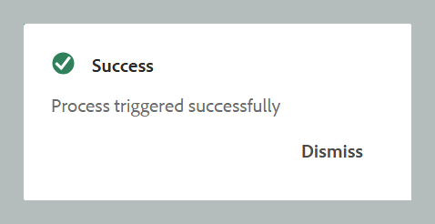

# Procesar recursos

En flujos de trabajo con gran cantidad de datos, como la publicación, la administración eficiente de recursos es crucial para mantener el rendimiento y la fiabilidad. El flujo de trabajo de procesamiento de recursos está diseñado para administrar los recursos específicos del usuario que requieren operaciones de datos intensivas. Aborda principalmente dos casos: cuando el procesamiento inicial falla debido a errores o cuando los archivos permanecen sin procesar porque no se inició ningún déclencheur de procesamiento de recursos. Al habilitar el procesamiento específico en el nivel de carpeta, los usuarios pueden aislar y procesar solo los recursos necesarios, lo que evita la sobrecarga de cálculos innecesarios. Este enfoque selectivo mejora significativamente el rendimiento, reduciendo el tiempo necesario para operaciones críticas como la publicación y la generación de informes. En general, contribuye a una mayor eficiencia y velocidad en la gestión de tareas de datos complejas.

>[!NOTE]
>
> - Para conjuntos de datos grandes, es mejor ejecutar el procesamiento durante las horas de menor actividad para evitar afectar al rendimiento del sistema. Una vez finalizada la tarea de procesamiento, puede revisar los detalles para analizar los resultados. 
>- El sistema déclencheur el procesamiento de recursos de la carpeta `/content/dam` cada 15 minutos. Durante cada ciclo, los recursos que se agregaron recientemente o que permanecieron sin procesar en el intervalo de 15 minutos más reciente se recogen y se vuelven a procesar. Para configurar la vista de características de procesamiento automático de recursos, [Configure la característica de procesamiento de recursos](../cs-install-guide/configure-asset-processing-cs.md).

## Procesamiento de recursos

Siga los pasos mencionados a continuación para procesar los recursos:

1. Seleccione el logotipo de Adobe Experience Manager en la parte superior y elija **Herramientas**.
1. En el panel **Herramientas**, seleccione **Guías**.
1. Seleccione el mosaico **Procesador en lotes**.

   {align="left"}

1. La ventana Guides Bulk Processor se abre con los detalles que se muestran a continuación. Además, solo se muestra en esta ventana la información perteneciente a las últimas cinco migraciones.

   - **Tipo de característica**: Muestra la característica del proceso que se está ejecutando.

   - **ID de ejecución**: es el identificador único de cada tarea de procesamiento que realiza.

   - **Carpeta**: muestra la carpeta seleccionada para el procesamiento.

   - **Carpetas excluidas**: muestra la carpeta excluida del procesamiento.

   - **Creado por**: Muestra quién creó la tarea o el proceso. Puede ser tanto usted como el sistema.

   - **Hora de inicio:** Muestra la fecha y la hora en que se inició el proceso de procesamiento.

   - **Hora de finalización**: muestra la fecha y la hora de finalización del proceso de procesamiento.

   - **Estado**: muestra el estado del procesamiento como En curso, Completado o Cancelado.

   {align="left"}

1. Seleccione la pestaña **Nuevo proceso** en la esquina superior derecha de la ventana para iniciar una nueva tarea de procesamiento.

   Se abre el cuadro de diálogo **Nuevo proceso**.

   {width="350" align="left"}

1. Proporcione los siguientes detalles en el cuadro de diálogo:

   1. **Tipo de característica**: seleccione **Procesamiento de recursos** de la lista desplegable.
   1. **Seleccionar carpetas y archivos**: Desplácese y elija una o varias carpetas y archivos para procesar.
   1. **Seleccionar carpetas para omitir**: opcionalmente, seleccione subcarpetas dentro de la carpeta principal elegida para excluirlas del procesamiento.
   1. **Tipo de recurso**: en el menú desplegable, seleccione el tipo de recurso específico que desea procesar (por ejemplo, Tema DITA, Mapa DITA, Markdown, HTML/CSS, DITAVAL u otros archivos). Solo se procesa el tipo de recurso seleccionado de las carpetas especificadas anteriormente.
Ejemplo: al seleccionar un tema DITA, sólo se procesan temas DITA dentro de la carpeta seleccionada, lo que permite el filtrado con objetivo.
   1. **Creado después de/Creado antes de**: aplique filtros de fecha para procesar los recursos creados dentro del intervalo de tiempo especificado.

   >[!NOTE]
   >
   > Si ya se está ejecutando un proceso para una carpeta, no puede iniciar un nuevo proceso para la misma carpeta hasta que se complete la tarea actual.

1. Seleccione **Crear**. Aparece una ventana emergente que muestra **Éxito y el proceso se ha activado correctamente**. Puede ver el estado de la tarea de procesamiento en la ventana.

   {width="350" align="left"}

## Opciones adicionales para tareas de procesamiento de recursos

Hay opciones adicionales disponibles para la tarea de procesamiento una vez iniciada. Puede acceder a estas opciones pasando el puntero sobre el ID de ejecución de la tarea. A continuación se ofrecen detalles sobre estas opciones:

- **Restart** : reinicia la tarea de procesamiento de recursos que se realizó correctamente anteriormente.

  {width="650" align="left"}

- **Reanudar**: Reanuda la tarea de procesamiento de recursos que se canceló o produjo un error.

  {width="650" align="left"}

- **Cancelar** : Cancela la tarea de procesamiento de recursos en curso.

  {width="650" align="left"}

- **Ver registros**: muestra los registros de la tarea de procesamiento de recursos. Para las tareas en curso, el registro muestra información de procesamiento detallada, incluido el tiempo restante estimado y el estado del recurso. Esta lista de registros muestra hasta las últimas 500 entradas. Se puede descargar el registro completo.

  {width="650" align="left"}
