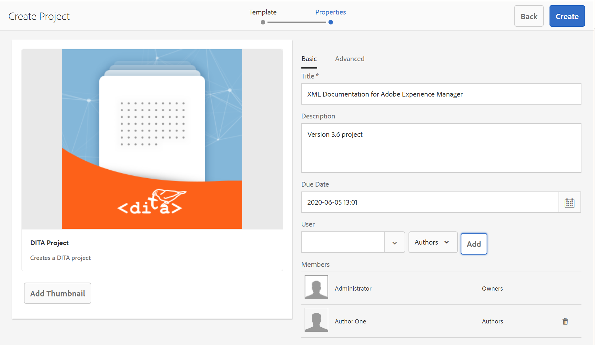

# Creación de un proyecto DITA {#id1645HA00NM6}

AEM Guías de recursos proporciona una plantilla de proyecto DITA que puede utilizar para crear y administrar las tareas de revisión.

Puede crear un proyecto DITA y, a continuación, utilizarlo para iniciar las revisiones. Un proyecto permite definir una fecha límite y controlar las tareas y el tiempo necesarios para completar la tarea de revisión para la que se ha creado el proyecto.

Puede agregar integrantes del equipo a un proyecto a los que luego se les podrían asignar diversas funciones: autores, revisores y editores.

Una vez creado el proyecto DITA, puede iniciar la revisión desde el Editor web o desde la interfaz de usuario de Assets. Para obtener más información, consulte [Enviar temas para revisión](review-send-topics-for-review.md#).

Del mismo modo, cada vez que un autor inicia un flujo de trabajo de revisión, los miembros seleccionados del proyecto reciben una notificación por correo electrónico. Para configurar las notificaciones por correo electrónico, consulte *Personalizar plantillas de correo electrónico* en Instalar y configurar las guías de Adobe Experience Manager as a Cloud Service.

Siga estos pasos para crear un proyecto DITA:

1. Abra la consola Proyectos.

   También puede acceder a la consola Proyectos mediante la siguiente URL:

   ```http
   http://<server name>:<port>/projects.html
   ```

1. Clic **Crear** \> **Proyecto** para iniciar el asistente Crear proyecto.

   {width="650" align="left"}

1. En la página Crear proyecto, seleccione **Proyecto DITA** y haga clic en **Siguiente**.

1. En la página Propiedades del proyecto, escriba los siguientes detalles:

   Información en la **Básico** pestaña:

   {width="650" align="left"}

   - Introduzca el del proyecto **Título**, **Descripción**, y **Fecha de vencimiento**.

   - Si lo desea, puede elegir una miniatura para el proyecto.

   - De forma predeterminada, pasa a ser el propietario del proyecto. Para agregar más usuarios a este proyecto:

   1. Introduzca o elija un usuario del **Usuario** lista desplegable.

   1. Elija un tipo de usuario: autores, revisores o editores.

      >[!NOTE]
      >
      >En esta lista desplegable verá otros tipos de usuarios, pero para un proyecto DITA sólo debe elegir entre los tipos de usuario Autores, Revisores o Editores. AEM Incluso si añade un usuario de un tipo diferente, dicho usuario no podrá acceder a ninguna función específica de DITA disponible en las guías de usuario de la interfaz de usuario de la interfaz de usuario de la interfaz de usuario de la interfaz de usuario de.

   1. Clic **Añadir**.

      >[!NOTE]
      >
      >AEM Si utiliza las guías de la versión 3.5 o anteriores de las guías de los temas, se muestra una opción para seleccionar un fichero de mapa DITA con el fin de resolver las referencias clave para los flujos de trabajo de edición, previsualización y revisión de temas. En las versiones 3.6 y posteriores, puede establecer el mapa raíz mediante el Editor Web. Para obtener más información, consulte la [Preferencias de usuario](web-editor-features.md#id2087G0P40SB) en el Editor web. Otra forma de configurar el mapa raíz es configurándolo en los perfiles globales o de nivel de carpeta. Para obtener más información, consulte *Configuración de perfiles globales o de nivel de carpeta* en la Guía de instalación y configuración.

   Información en la **Avanzadas** pestaña:

   - Escriba un nombre para el proyecto. Este nombre se utiliza para crear la dirección URL de este proyecto.

1. Haga clic en **Crear**.

   Aparecerá el cuadro de diálogo Proyecto creado.

1. Clic **Abrir** para abrir la página del proyecto.


**Tema principal:**[ Revisar temas o mapas](review.md)
