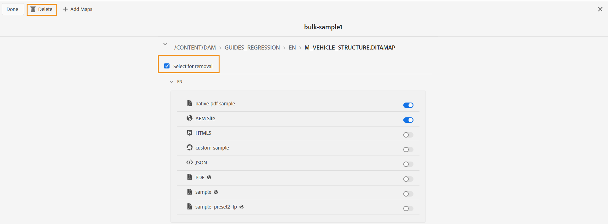

# Edición de una colección de mapas de activación masiva {#id214GI40B0XA}

Puede editar una colección de mapas de activación masiva añadiendo o eliminando archivos de mapa o ajustes preestablecidos de una colección. Para editar una recopilación de mapas de activación masiva, realice los siguientes pasos:

1. Seleccione el logotipo de Adobe Experience Manager en la parte superior y elija **Herramientas**.

1. En el panel **Herramientas**, seleccione **Guías**.

1. Seleccione el mosaico **Panel de publicación en lotes**.

   El tablero de publicación en lote se muestra con una lista de colecciones de mapas de activación en lote. También puede acceder a este tablero desde el panel izquierdo de [Adobe Experience Manager Guides Home page](intro-home-page.md).

1. Seleccione la colección que desea editar y seleccione **Abrir**.

1. Seleccione **Editar**.

   La página de recopilación de mapas de activación masiva aparece donde se muestran los mapas junto con sus ajustes preconfigurados para cada configuración regional disponible.
Puede ver los distintos tipos de ajustes preestablecidos de salida junto con sus iconos, como AEM Site, PDF, Native PDF, HTML5, Custom y salida JSON
.

   >[!NOTE]
   >
   > El icono pequeño  indica un ajuste preestablecido de nivel de perfil de carpeta.

1. Utilice el regulador para activar o desactivar el ajuste preestablecido de salida deseado que desea activar o desactivar.

1. Si desea quitar un mapa de la colección, expanda el mapa y elija la opción **Seleccionar para eliminación**.

1. Seleccione **Eliminar**.

   {width="600"}

   El mapa seleccionado se elimina de la colección de mapas de activación masiva.

1. Seleccione **Listo**.

**Tema principal:**[ Activación masiva del contenido publicado](conf-bulk-activation.md)
