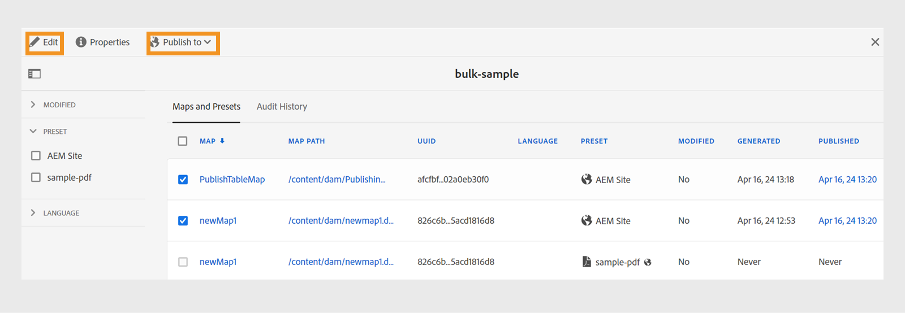

# Activar salida {#id214GGF00V5U}

Una vez creada una colección de mapas para la activación masiva, el siguiente paso es activar el contenido en la instancia de publicación. Para activar el contenido, realice los siguientes pasos:

1. Seleccione el logotipo de Adobe Experience Manager en la parte superior y elija **Herramientas**.

1. En el panel **Herramientas**, seleccione **Guías**.

1. Seleccione el mosaico **Panel de publicación en lotes**.

   El tablero de publicación en lote se muestra con una lista de colecciones de mapas de activación en lote. También puede acceder a este tablero desde el panel izquierdo de [Adobe Experience Manager Guides Home page](intro-home-page.md).

1. Seleccione la colección que desea publicar y seleccione **Abrir**.

   

1. \(*Opcional*\) Aplique los filtros necesarios del carril izquierdo para filtrar el mapa en función de su \(estado\), ajuste preestablecido de salida o idioma modificado.

   >[!NOTE]
   >
   >Genere la salida para el mapa utilizando el ajuste preestablecido de salida antes de activarlos en la colección de mapas.

Vea las diferentes formas de activar la colección en función de su configuración.

 Cloud Services 

{width="650"}

Puede activar el resultado en las instancias **Preview** o **Publish**.

**Vista previa**

* Para activar la salida de los mapas seleccionados, seleccione la salida de mapa pregenerada y seleccione **Publicar en** > **Vista previa**.
* Para activar la salida de todas las asignaciones DITA con sus ajustes preestablecidos configurados, seleccione la casilla de verificación situada junto a la columna **Mapa** y, a continuación, seleccione **Publicar en** > **Publicar**.

**Publicar**

* Para activar la salida de los mapas seleccionados, seleccione la salida de mapa pregenerada y seleccione **Publicar en** > **Publicar**.

* Para activar la salida de todas las asignaciones DITA con sus ajustes preestablecidos configurados, active la casilla de verificación situada junto al mapa (columna) y, a continuación, seleccione **Publicar en** > **Publicar**.

>[!NOTE]
> 
> La casilla de verificación para una salida de mapa solo está activada si se ha generado la salida para un mapa.

Se muestra un mensaje de éxito cuando el resultado del mapa está en la cola para su publicación.

Una vez que se activa la salida para los archivos de mapa seleccionados, se actualiza la pestaña Historial de auditoría y aparece la última salida activada en la parte superior. La columna **Publicado** se ha actualizado con la fecha y la hora de publicación.

    

  Software On-Premise 

Realice una de las siguientes acciones:

* Para activar la salida de los mapas seleccionados, seleccione la salida de mapa pregenerada y seleccione **Publicación rápida**.
* Para activar la salida de todos los mapas DITA con sus ajustes preestablecidos configurados, active la casilla de verificación situada junto al mapa (columna) y, a continuación, seleccione **Publicación rápida.**
  {width="650"}

  >[!NOTE]
  > 
  >La casilla de verificación para una salida de mapa solo está activada si se ha generado la salida para un mapa.

Se muestra un mensaje de éxito cuando el resultado del mapa está en la cola para su publicación.

Una vez que se activa la salida para los archivos de mapa seleccionados, se actualiza la pestaña Historial de auditoría y aparece la última salida activada en la parte superior. La columna **Publicado** se ha actualizado con la fecha y la hora de publicación.

**Tema principal: &#x200B;** [Activación masiva del contenido publicado](conf-bulk-activation.md)
