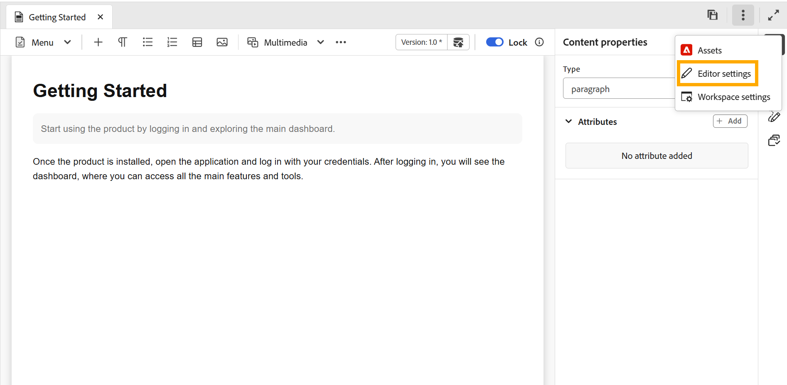

# Configuración del editor

>[!NOTE]
>
> Este artículo solo se aplica al nuevo editor. Para habilitar esta capacidad en su entorno, póngase en contacto con el equipo de éxito del cliente de AEM Guides.

La configuración del editor proporciona un panel de configuración centralizado que le permite personalizar el comportamiento del editor en un nivel de autor individual. Proporciona mayor flexibilidad, coherencia y control durante el proceso de creación.

Este panel de configuración centralizado le permite administrar las preferencias clave del editor desde una sola ubicación, lo que reduce la necesidad de realizar configuraciones dispersas o manuales. Se puede acceder a la configuración del editor desde las **más acciones** de la barra de fichas.

{width="650"}

## Opciones de configuración compatibles

Puede habilitar o deshabilitar las siguientes opciones según sus preferencias:

{width="350"}

- **Espacios de no separación**: habilite esta opción para mostrar un indicador de los espacios de no separación al editarla en el Editor. Solo está visible en la vista Autor para el tema DITA y los mapas DITA
- **Comentarios XML**: permite a los autores ver, editar e insertar comentarios XML directamente en el modo Autor para obtener una mejor visibilidad del contenido. Cuando está habilitada, los autores pueden ver, insertar, editar y eliminar comentarios XML directamente dentro del contenido en el propio modo Autor, lo que facilita la adición de notas contextuales para los colaboradores. Cuando están desactivados, los comentarios XML se ocultan en el modo Autor y no se pueden insertar ni modificar desde el modo Autor, lo que garantiza una experiencia de creación más limpia para los usuarios que no los necesitan. Puede seguir viendo y creando comentarios XML en el modo de código fuente utilizando la sintaxis `<!-- test comment -->`.

  {width="650"}

- **Etiquetas**: controla la visibilidad de las etiquetas en el editor. Cuando está activada, las etiquetas estructurales se muestran dentro del contenido, lo que permite a los autores ver y gestionar la estructura DITA subyacente. Cuando están desactivadas, estas etiquetas se ocultan para proporcionar una experiencia de creación más limpia y centrada.

  {width="650"}

  Cuando la configuración de **Mostrar etiquetas** está habilitada, también puede habilitar **Mostrar atributos** para ver y validar los atributos asociados con un elemento. Cuando un elemento tiene más de tres atributos asociados a él, aparece un indicador de recuento. Al pasar el ratón por encima del indicador, se muestra la lista completa de atributos aplicados a ese elemento.

   {width="650"}

- **Menú de inserción rápida en el editor**: permite agregar elementos directamente mientras se edita en el modo Autor en la posición del cursor sin desplazarse a la barra de herramientas. Los elementos usados con frecuencia también se pueden configurar en **Favoritos** para obtener acceso más rápido. El menú de inserción rápida está disponible directamente en el Editor cuando se pulsa **Control + /** en Windows o **Comando + /** en macOS en la posición del cursor.

  {width="650"}

  Puede buscar y agregar elementos a Favoritos, quitar los elementos agregados anteriormente y reorganizarlos con solo arrastrar y soltar. Los favoritos incluyen los elementos utilizados con más frecuencia y el orden establecido aquí se refleja en el menú Inserción rápida cuando se accede a él desde el editor.

