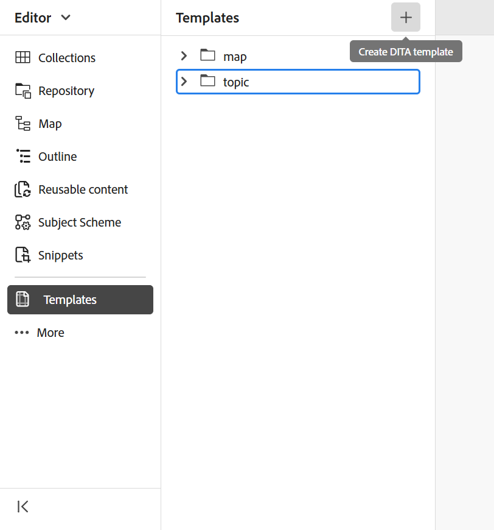

# Creación de mapas basados en plantillas personalizadas {#id225VF0808MP}

Se pueden crear plantillas de mapa personalizadas y utilizarlas para crear mapas DITA junto con las plantillas de tema y las plantillas de mapa a las que se hace referencia en la plantilla de mapa

Puede hacer referencia a otras plantillas de mapas y plantillas de temas desde la plantilla de mapas personalizada. Las plantillas de mapas a las que se hace referencia pueden hacer referencia a varias plantillas de mapas, plantillas de temas, temas, mapas, imágenes, vídeos y otros recursos. La plantilla de mapa personalizada puede ayudarle a replicar muy fácilmente las plantillas de mapa y toda la estructura de carpetas de referencia. Estas plantillas personalizadas son especialmente útiles para crear y recrear varios mapas con estructuras y referencias recursivas.

>[!NOTE]
>
> Las plantillas de temas no se crean de forma recursiva. Solo se generan las plantillas de tema que están directamente dentro de la plantilla de mapa y cualquier plantilla de tema dentro de una plantilla de tema simplemente se hace referencia en el elemento principal directamente.

## Creación de plantillas personalizadas

Adobe Experience Manager Guides permite crear temas y mapas personalizados a partir de la carpeta dita-templates. Puede utilizar estas plantillas personalizadas para crear el mapa y el tema. También puede compartir estas plantillas con los autores para que puedan utilizarlas en la creación de sus archivos. Con estas plantillas, puede permitir a los autores mantener copias independientes de ciertos recursos que están dentro de la carpeta de plantillas.

>[!NOTE]
>
> Todos los recursos a los que solo se haga referencia y que se mantengan deben mantenerse fuera de la carpeta de plantillas.


Puede crear plantillas de temas y asignaciones de las siguientes maneras:
- [Crear plantillas personalizadas desde el editor](#create-customized-templates-from-the-editor)
- [Creación de plantillas personalizadas desde la interfaz de usuario de Assets](#create-customized-templates-from-the-assets-ui)


### Crear plantillas personalizadas desde el editor

La característica **Templates** está presente en el panel [izquierdo de la interfaz del Editor](./web-editor-left-panel.md) y solo está disponible para los administradores. Con este panel, el administrador puede crear y administrar fácilmente plantillas que luego los autores pueden utilizar. De manera predeterminada, las plantillas se clasifican en las plantillas de tipo *map* y *topic*.

{width="300" align="left"}

De forma predeterminada, puede ver los archivos por títulos. Al pasar el ratón por encima de una plantilla, puede ver el título y el nombre del archivo como información sobre herramientas.

>[!NOTE]
>
> Como administrador, también puede elegir ver la lista de archivos en el Editor. Seleccione la opción **Nombre de archivo** de la sección **Archivos del editor muestran la configuración** en **Preferencias de usuario**.

Realice los siguientes pasos para crear un tema o una plantilla de asignación desde el Editor:

1. Abra el panel **Plantillas** en el Editor y seleccione el icono **Crear plantilla DITA**.

   {width="500" align="left"}

1. Elija **Plantilla de tema** o **Plantilla de mapa** del menú desplegable en función del tipo de plantilla que desee crear.
1. Si selecciona **Plantilla de tema**, se mostrará el cuadro de diálogo **Nueva plantilla de tema**.

   {width="300" align="left"}

   Si selecciona **Plantilla de mapa**, se mostrará el cuadro de diálogo **Nueva plantilla de mapa**.

   {width="300" align="left"}

   También puede seleccionar **Carpeta** de la lista desplegable si desea crear primero una carpeta dentro de la carpeta **topic** o **map**.

1. En el cuadro de diálogo **Nueva plantilla de tema**/ **Nueva plantilla de mapa**, proporcione el **Título**, que aparece en el panel **Plantillas**. El **Nombre** de la plantilla se sugiere automáticamente basándose en el título; sin embargo, puede proporcionar un nombre de archivo diferente.
Además, elija el tipo de plantilla que desea crear en la lista desplegable **Plantilla**.

   >[!NOTE]
   >
   > Si el administrador ha habilitado nombres de archivo automáticos basados en la configuración de UUID, no verá el campo Nombre.

1. Seleccione **Crear**.

Una vez creada la plantilla, debe añadirla a su perfil global o de nivel de carpeta. Una vez añadida la plantilla, los autores empezarán a ver la nueva plantilla en el proceso de creación de temas/mapas.

Si usa el menú **Opciones** en una plantilla existente, puede elegir **editarla** o **duplicarla**. En caso de duplicación, la estructura y el tipo \(de documento\) de la plantilla se conservarán y podrá volver a utilizarlos para crear otra plantilla a partir de ella.

{width="500" align="left"}

### Creación de plantillas personalizadas desde la interfaz de usuario de Assets

Realice los siguientes pasos para crear una plantilla de mapa o tema desde la interfaz de usuario de Assets:

1. En la **interfaz de usuario de Assets**, vaya a la carpeta dita-templates.

   {align="left"}

1. Abra la carpeta **topics** si desea crear una plantilla de **Tema**. Abra la carpeta **maps** si desea crear una plantilla **Map**.
1. Seleccione **Crear \> plantilla DITA**.

   {width="300" align="left"}
1. En la página Modelo, seleccione **Tema \> Siguiente** para crear una plantilla de tema. De lo contrario, seleccione **Mapa \> Siguiente** para crear una plantilla de asignación.
1. En la página Propiedades, especifique la plantilla **Title**.
1. Especifique el archivo **Name**.

   >[!NOTE]
   >
   > El nombre del archivo debe tener la extensión .dita.

1. \(Opcional\) Agregue una descripción.
1. Seleccione **Crear**.

   Aparecerá el mensaje de plantilla de tema creada. A continuación, puede abrir la plantilla y editarla. Para una plantilla de mapa, también puede agregar las referencias para las plantillas de tema, las plantillas de mapa y también otros recursos en la plantilla de mapa.


**Menú de opciones en la IU de Assets**

Para crear un mapa o una plantilla de tema mediante el menú Opciones de la interfaz de usuario de Assets, realice los siguientes pasos:

1. Seleccione la carpeta **Map** o **Topic** en la carpeta de plantillas actual. Por ejemplo, la carpeta `dita-templates`.
1. En el menú **Opciones**, seleccione **Crear plantilla de mapa** o **Crear plantilla de tema**.

   Se abre el cuadro de diálogo **Crear nueva plantilla de mapa** o **Crear nueva plantilla de tema**.
1. Introduzca el título y el nombre de la nueva plantilla.
1. Elija el tipo de plantilla que desea crear en la lista desplegable **Plantilla**.

Aparecerá el mensaje creado para la plantilla de mapa. Puede agregar la plantilla a su perfil global o de nivel de carpeta. A continuación, la nueva plantilla aparece en el tema o en el proceso de creación de mapas, y se pueden crear mapas o temas mediante ella.

El administrador también puede crear una carpeta y configurarla para que sea la carpeta en la que puede crear y guardar las plantillas.

En función de la configuración, aprenda a configurar la ruta de carpeta de la plantilla DITA personalizada:
<details>
    <summary> Cloud Services </summary>

Aprenda a [configurar la ruta de la carpeta de la plantilla DITA personalizada](../install-guide/conf-template-tags-custom-dita-topic-template.md#configure-custom-dita-template-folder-path-id191lcf0095z) en la Guía de instalación y configuración de Cloud Services.
</details>

<details>
    <summary> Software On-Premise</summary>

Aprenda a [configurar la ruta de la carpeta de la plantilla DITA personalizada](../cs-install-guide/conf-template-tags-custom-dita-topic-template.md#configure-custom-dita-template-folder-path-id191lcf0095z) en la Guía de instalación y configuración On-Premise.
</details>

## Pasar el título definido en las plantillas

Si desea pasar el título del tema o el mapa utilizado dentro de la plantilla a los mapas DITA creados con esa plantilla, utilice llaves alrededor del título.

Ejemplo

```XML
<pubtitle>
   <mainpubtitle outputclass="booktitle">
   {title}
   </mainpubtitle>
   <subtitle>Subtitle</subtitle>
</pubtitle>

The resultant DITA map with title "Rootmap1" will look like as follows:
<pubtitle>
   <mainpubtitle outputclass="booktitle">Rootmap1
   </mainpubtitle>
   <subtitle>Subtitle</subtitle>
</pubtitle>
```

>[!NOTE]
> Solo la primera aparición de llaves se sustituirá por el título.

Si no utiliza llaves alrededor del título, el mapa DITA resultante solo seleccionará el primer elemento y el anidamiento del título no se seleccionará de la plantilla y tendrá el siguiente aspecto:

```XML
<pubtitle> Rootmap1 </pubtitle>
```

>[!NOTE]
> También se pueden utilizar llaves alrededor del texto para pasar su estructura anidada desde las plantillas personalizadas a los mapas DITA.

Ejemplo

```XML
<title>    
    <sub>        
        <b>{title}</b>    
    </sub>
</title>
```

## Utilice la plantilla de asignación para crear nuevas asignaciones

>[!NOTE]
>
> El administrador debe configurar y poner a disposición de la creación la plantilla de mapa. Para obtener más información, vea la sección *Configuración de plantillas de creación* en Instalar y configurar Adobe Experience Manager Guides as a Cloud Service.

En el **Editor**, realice los siguientes pasos para crear un mapa con la plantilla de mapa personalizada:

1. En el **Editor**, vaya a la carpeta donde desea crear la asignación.
1. En el menú Opciones de la carpeta, seleccione **Nuevo \> Mapa DITA**.

   {width="500" align="left"}
1. Se muestra el diálogo **Nuevo mapa**.
1. En el cuadro de diálogo **Nuevo mapa**, especifique el mapa **Título**, archivo **Nombre** y seleccione la plantilla de mapa que desee usar.

   Por ejemplo, si ha creado una plantilla de mapa &quot;plantilla de prueba&quot;, selecciónela.

1. Seleccione **Crear**.

   Aparecerá el mensaje de asignación creada.

En la **interfaz de usuario de Assets**, realice los siguientes pasos para crear un mapa con la plantilla de mapa personalizada:

1. En la **interfaz de usuario de Assets,** vaya a la carpeta donde desea crear el mapa.
1. Seleccione **Crear \> mapa DITA**.
1. En la página Modelo, seleccione la plantilla de asignación que desee usar y seleccione **Siguiente**. Por ejemplo, si ha creado una plantilla de mapa &quot;plantilla de prueba&quot;, selecciónela.
1. En la página Propiedades, especifique el mapa **Title**.
1. Especifique el archivo **Name**.

   >[!NOTE]
   >
   > El nombre del archivo debe tener la extensión .ditamap.

1. Seleccione **Crear**. Aparecerá el mensaje de asignación creada.

## Notas adicionales para mapas DITA creados con plantillas personalizadas


El mapa genera todos los recursos a los que se hace referencia dentro de la carpeta de plantillas. Algunos tipos de recursos a los que se hace referencia en un mapa pueden ser los siguientes:

- Si el mapa contiene la referencia a una plantilla de tema, se crea una copia de ella dentro de la carpeta, en la misma jerarquía que en la carpeta de temas de la carpeta `dita-templates`.
- Si el mapa contiene la referencia a una plantilla de mapa, se crea una copia de ella dentro de la carpeta, en la misma jerarquía que en la carpeta de mapas de la carpeta `dita-templates`.
- Si la asignación contiene la referencia genérica a un tema o asignación fuera de la carpeta `dita-templates/topics` o `dita-templates/maps`, solo se hace referencia a la misma y no se crea ninguna copia.

  >[!NOTE]
  >
  > `dita-templates/topics` y `dita-templates/maps` son las rutas predeterminadas en las guías y se pueden configurar.


  Si hay una definición de clave de plantilla de tema dentro de la plantilla de asignación, se crea una nueva clave \(por lo tanto, nuevo tema\) y se hace referencia a ella en el mapa.

- Si se crea otro mapa o tema en el mismo nivel de la carpeta, los nombres de los recursos recién creados se anexan con 0,1,2, etc. Puede elegir abrir la asignación para editarla o guardar el archivo de asignación en el repositorio.

**Tema principal:**[ Introducción al editor de mapas](map-editor.md)
