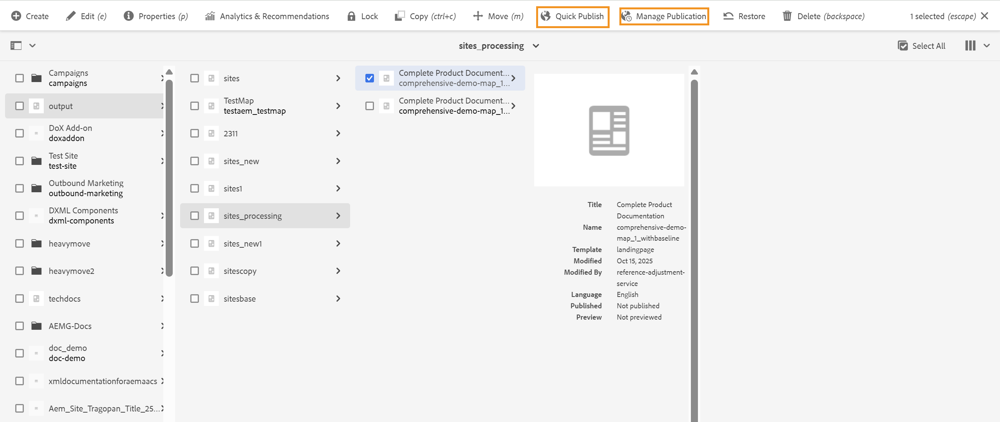

# Administrar la duplicación de recursos de origen DITA

Cuando los resultados generados a partir del contenido DITA se publican mediante **Publicación rápida** o **Administrar publicación** en algún entorno de publicación, AEM también intenta publicar los recursos de origen DITA asociados, como mapas DITA y, en algunos casos, temas DITA. Esto ocurre porque AEM trata los recursos DITA como dependencias de las páginas de Sites generadas.

{width="350" align="left"}

Para evitar la replicación no deseada del contenido DITA en el entorno de publicación y evitar problemas de rendimiento, los administradores deben administrar explícitamente la replicación de recursos DITA mediante el Administrador de configuración. Esta configuración permite a los administradores controlar la replicación de tipos de recursos DITA admitidos, incluidos los mapas DITA, los temas DITA, los archivos XML y los archivos Markdown (.md).

Para configurar la característica de replicación de recursos DITA, vea [Configurar la replicación de recursos DITA para Cloud Service](../cs-install-guide/configure-dita-assets-replication.md) o [Configurar la replicación de recursos DITA para local](../install-guide/configure-dita-asset-replication.md) según la configuración que utilice

