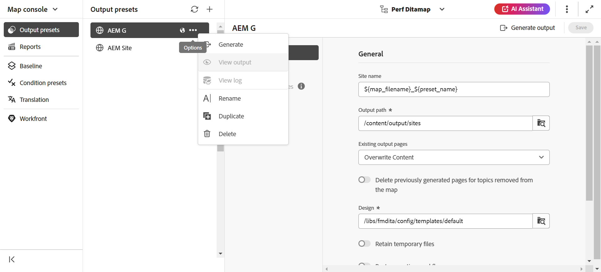

# Editar, duplicar o eliminar un ajuste preestablecido de salida {#id205BEH0K09Z}

Puede administrar los ajustes preestablecidos de salida desde la consola Mapa y el panel Mapa. En ambos casos, se obtienen opciones para editar, duplicar y eliminar un ajuste preestablecido de salida, como se muestra en la siguiente sección.

## Uso de la consola Mapa

Puede editar el ajuste preestablecido de salida seleccionado cambiando directamente los campos obligatorios a la configuración preestablecida necesaria.

Además, puede duplicar o eliminar un ajuste preestablecido de salida mediante el menú desplegable **Opciones**, como se muestra a continuación.

## Uso del tablero de mapas

Puede editar, duplicar y eliminar un ajuste preestablecido de salida utilizando el panel de asignación seleccionando la pestaña requerida en la barra superior como se muestra a continuación.

**Tema principal:**[ Generación de resultados](generate-output.md)
