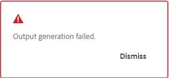
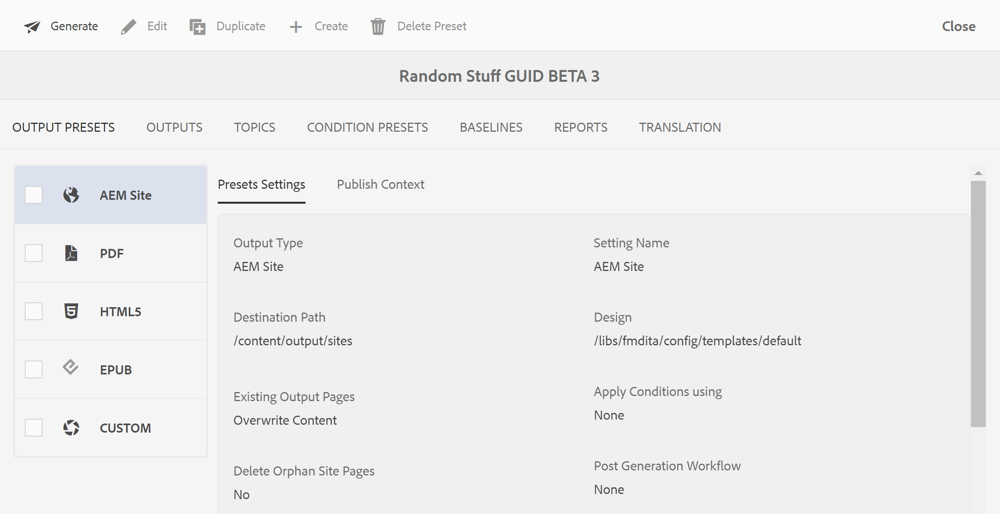

# Generar salida

Existen dos formas de generar resultados para un mapa DITA:

- [Generar salida para un mapa DITA desde la consola Mapa](#generate-output-for-a-dita-map-from-the-map-console)
- [Generar salida para un mapa DITA desde el panel Mapa](#generate-output-for-a-dita-map-from-the-map-dashboard)

## Generar salida para un mapa DITA desde la consola Mapa

Realice los siguientes pasos para generar la salida de un mapa DITA mediante la consola Mapa:

1. [Abra un archivo de asignación en la consola de mapas](./open-files-map-console.md).
2. La consola de mapas DITA se muestra con la lista de **Ajustes preestablecidos de salida** disponibles para generar resultados.

3. Abra el ajuste preestablecido que desee utilizar para generar la salida y seleccione **Generar salida** para iniciar el proceso de generación.

   

   O bien, pase el ratón sobre el ajuste preestablecido y seleccione **Generar** en el menú contextual del ajuste preestablecido.

   

Una vez que finalice la generación de resultados, seleccione **Ver resultados** para ver el resultado.

Un cuadro de diálogo **Correcto** está visible en la esquina inferior derecha de la pantalla.

Si una salida no se realiza correctamente, se muestra el siguiente mensaje de error.

Para ver el registro de errores, seleccione **Descartar**, pase el ratón sobre la pestaña del ajuste preestablecido seleccionado y seleccione **Ver registro** en el menú contextual del ajuste preestablecido.

## Generar salida para un mapa DITA desde el panel Mapa

Realice los siguientes pasos para generar la salida de un mapa DITA mediante el tablero de mandos Mapa:

1. En la interfaz de usuario de Assets, desplácese hasta el fichero de mapa DITA que desee publicar y selecciónelo.

   Aparecerá la consola de mapas DITA con la lista de Ajustes preestablecidos de salida disponibles para generar la salida.

1. Seleccione uno o varios ajustes preestablecidos de salida que desee utilizar para generar la salida.

   {width="800" align="left"}

1. Seleccione el icono **Generate** para iniciar el proceso de generación de resultados.

Puede ver el estado actual de la solicitud de generación de resultados en la ficha **Salidas**. Para obtener más información, vea [Ver el estado de la tarea de generación de resultados](./generate-output-manage-process.md#view-the-status-of-the-output-generation-task).

>[!IMPORTANT]
>
> Si un proceso de generación de resultados de un ajuste preestablecido está en cola o en curso, no se puede iniciar otra tarea de generación de resultados para el mismo ajuste preestablecido.

También se puede generar la salida de AEM Sites para uno o más temas o todo el mapa DITA desde la consola Mapa. Para obtener más información, vea [Generar salida de la base de conocimiento](web-editor-article-publishing.md#id218CK0U019I).

**Tema principal:**[ Generación de resultados](generate-output.md)
