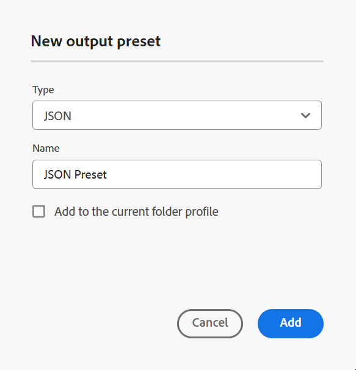

# JSON {#id231KK0180T4}

Realice los siguientes pasos para crear el ajuste preestablecido JSON desde la consola Mapa:

1. [Abra un archivo de mapa DITA en la consola de mapas](./open-files-map-console.md).

   También puede obtener acceso al archivo de asignación desde el widget **Archivos recientes** en la [sección Información general](./intro-home-page.md#overview). El archivo de mapa seleccionado se abriría en la consola de mapas.
1. En la pestaña **Ajustes preestablecidos de salida**, seleccione el icono + para crear un ajuste preestablecido de salida.
1. Seleccione **JSON** del menú desplegable Tipo en el cuadro de diálogo **Nuevo ajuste preestablecido de salida**.
1. En el campo **Nombre**, proporcione un nombre para este ajuste preestablecido.
1. Seleccione la opción **Agregar al perfil de carpeta actual** para crear un ajuste preestablecido de salida dentro del perfil de carpeta actual. El  indica un ajuste preestablecido de nivel de perfil de carpeta.

   Obtenga más información sobre [Administrar ajustes preestablecidos de salida de perfil global y de carpeta](./web-editor-manage-output-presets.md).

1. Seleccione **Añadir**.

   Se crea el ajuste preestablecido JSON.

   {width="300"}

Una vez creado el ajuste preestablecido, puede configurar las siguientes configuraciones preestablecidas disponibles en la pestaña General.

- Ruta de salida
- Archivo de índice
- Aplicar condiciones utilizando \(Si las condiciones están definidas para un mapa\)
- Utilizar Línea base \(Si se crea una línea base para un mapa\)
- Conservar archivos temporales
- Propiedades para propagar en la salida
- Flujo de trabajo de generación posterior

Para obtener más información, consulte [Configuración de JSON](#json-configuration).

## Configuración de JSON

Las siguientes opciones están disponibles para el ajuste preestablecido JSON:

>[!NOTE]
>
> También puede editar el archivo JSON en el Editor.

| Opciones de JSON | Descripción |
| --- | --- |
| Ruta de salida | Ruta de acceso dentro del repositorio de AEM donde se almacena la salida JSON. La ruta de acceso de salida se establece a través de la variable `${base_output_path}`, que configura el administrador. Para configurar la ruta de salida, vea [Configurar la ubicación de salida base para Cloud Services](../native-pdf/configure-base-location-cs.md) o [Configurar la ubicación de salida base para On-Premise Services](../native-pdf/configure-base-output-location.md) según el servicio que esté usando. |
| Archivo de índice | Puede dar un nombre al archivo de índice que está creando para la salida JSON. De forma predeterminada, selecciona el nombre de archivo del mapa DITA y agrega un sufijo (como `map_filename_index.json`).  También puede utilizar variables al configurar el archivo de índice. Para obtener más información acerca del uso de variables, vea [Usar variables para establecer las opciones Ruta de destino, Nombre de sitio o Nombre de archivo](generate-output-use-variables.md#id18BUG70K05Z). |
| Aplicación de condiciones mediante | Seleccione una de las siguientes opciones:  * **Ninguna aplicada**: Seleccione esta opción si no desea aplicar ninguna condición en la salida publicada. * **Archivo DITAVAL**: Seleccione los archivos DITAVAL para generar contenido personalizado. Puede seleccionar varios archivos DITAVAL mediante el cuadro de diálogo de exploración o escribiendo la ruta del archivo. Utilice el icono en forma de cruz situado cerca del nombre del archivo para eliminarlo. Los archivos DITAVAL se evalúan en el orden especificado, por lo que las condiciones especificadas en el primer archivo tienen prioridad sobre las condiciones coincidentes especificadas en archivos posteriores. Puede mantener el orden de los archivos añadiendo o eliminando archivos. También puede aplicar marcas dentro de un archivo DITAVAL para marcar visualmente el contenido. Cada indicador puede incluir una imagen y tener un estilo con formato como negrita o cursiva. Para obtener más información sobre cómo personalizar estilos de indicación o resolver conflictos de formato, vea [Usar el editor DITAVAL](../user-guide/ditaval-editor.md). Si el archivo DITAVAL se mueve a otra ubicación o se elimina, no se elimina automáticamente del panel de mapas. Debe actualizar la ubicación en caso de que los archivos se muevan o eliminen. Puede pasar el ratón sobre el nombre del archivo para ver la ruta en el repositorio de AEM donde está almacenado el archivo. Solo puede seleccionar archivos DITAVAL y se mostrará un error si ha seleccionado cualquier otro tipo de archivo. * **Ajuste preestablecido de condición**: Seleccione un ajuste preestablecido de condición en la lista desplegable para aplicar una condición al publicar la salida. La opción está visible si se ha añadido una condición presente en la ficha Ajustes preestablecidos de condición de la consola de mapa DITA. Para obtener más información acerca de los ajustes preestablecidos de condición, vea [Usar ajustes preestablecidos de condición](generate-output-use-condition-presets.md#id1825FL004PN). |
| Usar línea base | Si ha creado una Línea base para el mapa DITA seleccionado, seleccione esta opción para especificar la versión que desea publicar.  Ver [Trabajar con línea de base](generate-output-use-baseline-for-publishing.md#id1825FI0J0PF) para obtener más detalles. |
| Conservar archivos temporales | Seleccione esta opción para conservar los ficheros temporales generados por DITA-OT. Si se producen errores al generar la salida mediante DITA-OT, seleccione esta opción para conservar los ficheros temporales. Puede utilizar esos archivos para solucionar errores de generación de resultados.    Después de generar la salida, seleccione el icono **Descargar archivos temporales**  para descargar la carpeta ZIP que contiene los archivos temporales. Los archivos descargados también incluirían `system_config.xml` archivo que le brinda información sobre la URL del autor, la URL local y la URL de publicación. Estas direcciones URL se configuran en la configuración de externalización de AEM y se reflejan en el archivo `system_config.xml`.    **Nota**: Si las propiedades de archivo se agregan durante la generación, los archivos temporales de salida también incluyen un archivo *metadata.xml* que contiene esas propiedades. |
| Propiedades para propagar en la salida | Seleccione las propiedades que desee procesar como metadatos. Estas propiedades se definen desde la página Propiedades del fichero de mapa DITA o de mapa de libros. Las propiedades que seleccione en la lista desplegable se enumeran debajo del campo Propiedades.  **Nota**: También puede definir propiedades personalizadas y pasar los metadatos a la salida mediante la publicación DITA-OT. Para obtener más información, [Trabaje con metadatos](metadata-dita.md#id21BJ00QD0XA). |
| Flujo de trabajo de generación posterior | Al elegir esta opción, se muestra una nueva lista desplegable Flujo de trabajo de generación posterior que contiene todos los flujos de trabajo configurados en AEM. Debe seleccionar un flujo de trabajo que desee ejecutar después de finalizar el flujo de trabajo de generación de resultados.  **Nota**: para obtener más información acerca de la creación de un flujo de trabajo de generación posterior a la salida personalizado, vea _Personalizar flujo de trabajo de generación posterior a la salida_ en la guía Instalar y configurar Adobe Experience Manager Guides as a Cloud Service. |

**Tema principal:**[ Explicación de los ajustes preestablecidos de salida](generate-output-understand-presets.md)
