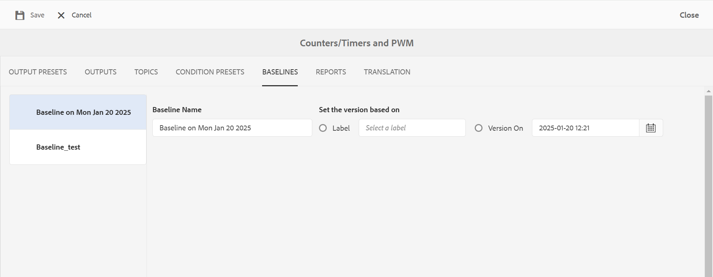

# Trabajo con Línea base desde el panel Mapa {#id1825FI0J0PF}

Experience Manager Guides proporciona la característica Línea base que permite a los usuarios crear líneas de base y utilizarlas para publicar o traducir temas de distintas versiones. También pueden publicar varios ajustes preestablecidos de salida del mismo mapa DITA en paralelo.

>[!TIP]
>
> Vea la sección *Línea de base* en la Guía de prácticas recomendadas para obtener prácticas recomendadas sobre cómo trabajar con Líneas de base.

El administrador puede configurar la pestaña Línea base en el panel de asignaciones. Para obtener más información, vea la ficha *Configurar línea de base en el tablero de mapas DITA* en la Guía de instalación y configuración.

En la **pestaña Líneas bases**, puede realizar las siguientes acciones:

- [Crear una línea base](#create-a-baseline)
- [Ver contenido de una línea base](#view-contents-of-a-baseline)
- [Editar, duplicar o eliminar líneas bases](#edit-duplicate-or-remove-baselines)
- [Agregar etiquetas a una línea de base](#add-labels-to-a-baseline)

## Crear una línea base

Puede crear una Línea base con una versión específica de los temas y contenido referenciado disponible en una fecha y hora específicas, o con una etiqueta definida para una versión de los temas. Puede especificar individualmente las versiones de los temas seleccionados en una Línea base para que cada vez que aplique la Línea base en el flujo de trabajo de publicación o traducción, los temas seleccionados y sus versiones correspondientes se incluyan para la generación o traducción de resultados.

Realice los siguientes pasos para crear una línea base:

1. Abra un archivo de mapa DITA en la interfaz de usuario de Assets y vaya a la página **Líneas de base**.
2. Seleccione **Crear** en la parte superior izquierda.
3. En la página Línea de base, escriba un nombre para la Línea de base en el campo **Nombre de línea de base**.

   {width="300" align="left"}

4. En **Establecer la versión basada en**, seleccione una de las siguientes opciones:

   - **Etiqueta**: seleccione esta opción para elegir los temas según la etiqueta aplicada. Introduzca una etiqueta para filtrar la lista en función de la cadena introducida. En la lista filtrada, puede elegir una etiqueta para seleccionar temas y otros recursos que tengan la etiqueta especificada.

     Al seleccionar Etiqueta, también se le ofrece una opción adicional para utilizar la última versión de temas que no tengan aplicada la etiqueta especificada. Si no selecciona esta opción y hay algún tema o archivo multimedia que no tenga la etiqueta especificada en él, el proceso de creación de la línea base fallará. Para obtener más información sobre cómo agregar etiquetas, consulte Uso de etiquetas.

   - **Versión en**: elige la versión de los temas en la fecha y hora especificadas. Tenga en cuenta que la hora que especifique aquí corresponde a la zona horaria del servidor de Adobe Experience Manager. Si el servidor se encuentra en una zona horaria diferente, los temas se recogerán según la zona horaria del servidor y no según la zona horaria local.

     Una vez seleccionada una etiqueta o versión como en la fecha, todos los temas a los que se hace referencia y los archivos multimedia dentro del mapa se seleccionan según corresponda. Esta selección de temas no se muestra en la interfaz de usuario, pero se guarda en el servidor.
5. Seleccione **Guardar**.

## Ver contenido de una línea base

Para ver el contenido de una instantánea existente, seleccione la ficha Instantánea y seleccione la versión de instantánea que desee en la lista. La página Líneas bases se divide en tres partes: fichero de mapa DITA, contenido o temas del mapa y contenido referenciado. Si el mapa contiene submapas, los temas a los que se hace referencia en el submapa también se muestran en la sección Contenido. A continuación se describen las distintas columnas de la página Línea Base:

- **Nombre**: enumera el título del tema o el mapa DITA o el nombre del recurso, como el nombre de archivo de una imagen.

- **Tipo**: enumera el tipo o tipo de recurso del mapa, como un mapa DITA, un tema DITA o un formato de imagen.

- **Versión**: enumera la versión del recurso disponible en la Línea de base.

- **Fecha y hora de la versión**: detalla la fecha y hora de creación del recurso para la versión seleccionada.

- **Última**: indica si se utiliza la versión más reciente del recurso en la Línea de base.

- **Mapa principal**: Si el archivo de asignación contiene subasignaciones, esta columna contiene el nombre del mapa en el que se hace referencia a un tema.

- **Etiqueta**: enumera las etiquetas\(s\) aplicadas a la versión del tema.

- **Referido por**: esta columna solo está disponible para el contenido referenciado. Indica el tema principal del recurso al que se hace referencia. Si se hace referencia a un recurso mediante varios temas, estos se separarán mediante comas.

## Editar, duplicar o eliminar líneas bases

**Editar líneas base**

Realice los siguientes pasos para editar una línea base existente:

1. Seleccione la Línea de base y seleccione **Editar**.
1. Realice los cambios necesarios en la línea de base. Puede cambiar el nombre y la versión del tema o el contenido al que se hace referencia.
1. Si desea utilizar una versión diferente para uno o más temas, puede seleccionarlos manualmente. Seleccione **Examinar tema**, seleccione el tema para el que desea usar una versión diferente. En la lista desplegable Seleccionar una versión para el tema seleccionado, seleccione una versión del tema que desee usar en la línea de base y seleccione **Aceptar**.

   {align="left"}

   La información sobre el tema y su versión seleccionada se almacenan en el servidor. Puede repetir este paso para cambiar la versión seleccionada de varios temas.

1. Para cargar todos los temas y archivos multimedia referidos desde el mapa DITA, seleccione el vínculo **Examinar todos los temas**. El UUID de los temas y archivos multimedia también se muestra debajo del título del tema o del nombre del archivo \(media\).

   >[!NOTE]
   >
   > Si tiene un gran conjunto de archivos en el mapa DITA, con mapas y temas anidados, la selección de Examinar todos los temas podría tardar algún tiempo en cargar todos los archivos.

   El contenido del mapa se presenta en las tres secciones: el archivo de mapa, Contenido \(referencias de temas\) y Contenido de referencia \(temas anidados, mapas y otros recursos\). Una vez que tenga disponible todo el contenido al que se hace referencia, puede seleccionar individualmente la versión del tema que desee utilizar en la línea de base.

   La lista desplegable **Versión** muestra las versiones disponibles de los temas o el contenido al que se hace referencia. Para el contenido al que se hace referencia, tiene la opción de elegir una versión automáticamente.

   Si elige **Seleccionar automáticamente** para el contenido referenciado, el sistema selecciona automáticamente la versión del contenido referenciado correspondiente a la versión del contenido en el que se hace referencia. Por ejemplo, supongamos que un tema A hace referencia a una imagen B. Cuando se creó la versión 1.5 del tema A, la versión de la imagen B era 1.2 en el repositorio. Ahora, cuando se crea una línea de base con la versión 1.5 del tema A con la imagen B establecida en **Seleccionar automáticamente**, el sistema elegirá automáticamente la versión 1.2 de la imagen B.

   Si crea una línea de base con las etiquetas, **Seleccionar automáticamente** se aplicará a la versión de todo el contenido referenciado.

   Si el contenido o los recursos a los que se hace referencia \(tema, submapas, imágenes o vídeos\) no tienen versiones \(como, contenido recién cargado\), al crear una línea de base se creará una versión para dichos archivos. Sin embargo, si se crean versiones de los archivos, no se creará ninguna versión incremental para esos archivos. Este comportamiento se controla mediante la configuración de creación automática de versiones, que está habilitada de forma predeterminada. Esto también es necesario para traducir contenido, donde el proceso de traducción espera que todos los archivos tengan una versión.

   >[!NOTE]
   >
   > Si desea especificar una versión diferente para un recurso en particular, puede hacerlo eligiendo la versión deseada de la lista desplegable **Versión**.
1. Seleccione **Guardar**.

**Líneas bases duplicadas**

Seleccione la Línea base y seleccione **Duplicate** para crear una copia de una Línea base existente. Especifique un nombre diferente para la línea de base, elija el número de versión de los temas y del contenido referenciado y seleccione **Guardar**.

**Quitar líneas bases**

Seleccione la versión de las líneas de base y seleccione **Quitar** para quitar una línea de base.

## Agregar etiquetas a una línea de base

Añadir etiquetas a cada tema puede llevar mucho tiempo. Experience Manager Guides proporciona un mecanismo de un solo clic que permite añadir etiquetas a varios temas y a contenido referenciado en un mapa DITA.

Realice los siguientes pasos para agregar una etiqueta a varios temas y contenido referenciado en un mapa DITA:

1. En la página Líneas bases, seleccione una línea base que contenga los temas y el contenido referenciado al que desea agregar una etiqueta.

   >[!NOTE]
   >
   > Asegúrese de que la línea de base no tenga la última versión de ningún tema o recurso. Una etiqueta solo se puede agregar a un tema o recurso con versiones.

1. Seleccione **Agregar etiquetas**.

   {align="left"}

1. En el cuadro de diálogo **Agregar etiqueta**, especifique una etiqueta única para asociarla a esta línea de base.

   Si el administrador ha configurado etiquetas predefinidas, estas se muestran en una lista desplegable. Debe elegir una etiqueta de la lista.

1. Si desea aplicar la etiqueta a los temas a los que se hace referencia en las subasignaciones, seleccione **Aplicar etiqueta a las asignaciones secundarias y a sus dependientes**.

   - Seleccione **Agregar**.
La etiqueta especificada se añade al mapa DITA y a los temas y contenido a los que se hace referencia.

     {width="650" align="left"}

## Exportar línea base traducida

Puede utilizar Línea de base para traducir contenido. Por ejemplo, puede crear una Línea base para la versión 1.1 que esté lista para su traducción al francés. En la pestaña Traducción, debe utilizar Línea de base para filtrar el contenido y, a continuación, seleccionar la Línea de base para la versión 1.1 del contenido. El uso de Línea de base para traducir contenido facilita la administración del contenido.

Una vez traducido el contenido, puede exportar la línea de base traducida para archivarla o compartirla con diferentes equipos de su organización. Debe tener en cuenta los siguientes puntos antes de exportar una instantánea traducida:

- Exportar una línea de base solo es posible después de traducir el contenido de la línea de base. Si intenta exportar una línea de base para la que la traducción no se ha iniciado o no se ha completado, obtendrá un error.
- Solo puede transferir Línea base para una versión que ya está traducida. Por ejemplo, si ha creado una Línea base para la versión 1.1 del contenido y se traduce lo mismo, puede exportar esta línea base. Sin embargo, si ha creado una Línea base para la versión 1.2, que no está traducida, no puede exportar esta Línea base.
- Si ya se ha exportado una línea de base, puede sobrescribir la línea de base existente seleccionando la opción *Sobrescribir línea de base existente* al exportar.

Realice los siguientes pasos para exportar una línea base traducida:

1. Abra el mapa DITA que contiene la instantánea traducida.

1. En la pestaña **Traducción**, expanda la opción **Línea de base** disponible en el carril izquierdo.

   {align="left"}

1. Seleccione la opción **Usar línea de base** y elija la línea de base que desea exportar.

1. Seleccione **Exportar línea de base**.

   Se muestra el estado de exportación. Si el proceso se realiza correctamente, aparecerá un mensaje en el que se indica el idioma para el que se exporta la Línea base. En caso de error, se muestra la causa del error.

   Si intenta exportar la instantánea que ya se ha exportado, también aparecerá el mensaje de error de creación de instantánea.

1. \(Opcional\) Para exportar una línea de base que ya se ha exportado, seleccione **Sobrescribir línea de base existente** y, a continuación, seleccione **Exportar línea de base**.

**Tema principal:**[ Generación de resultados](generate-output.md)
