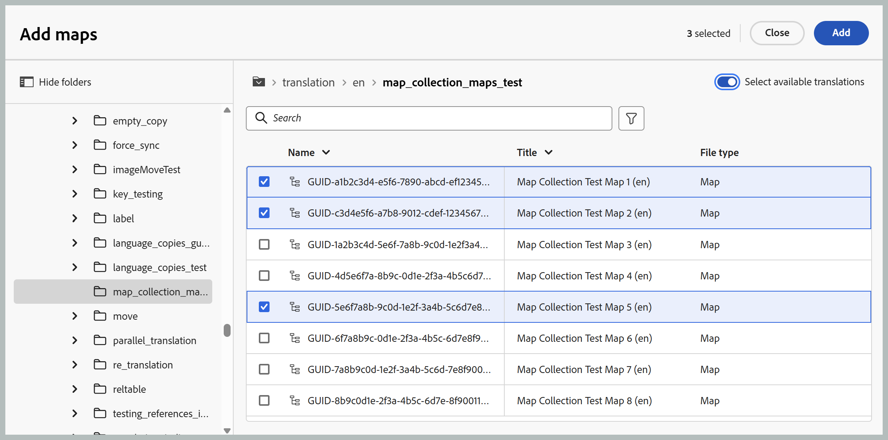
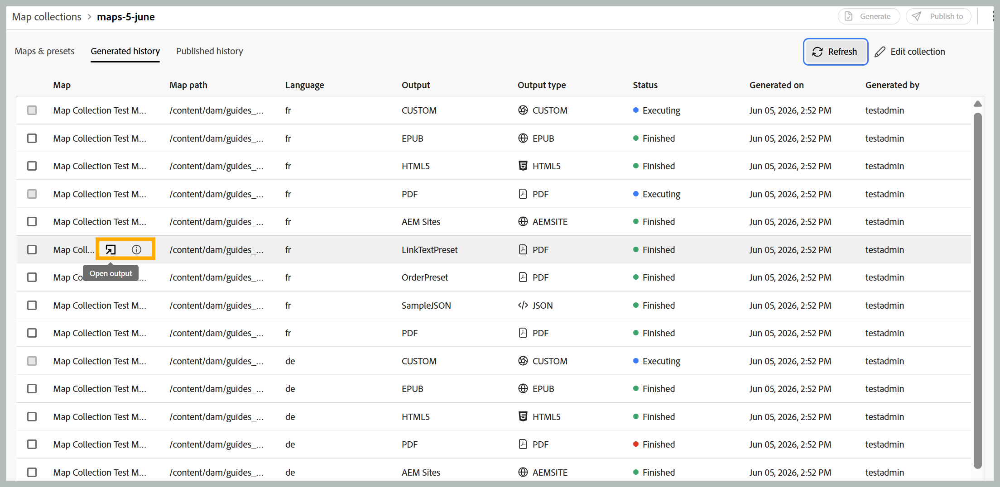
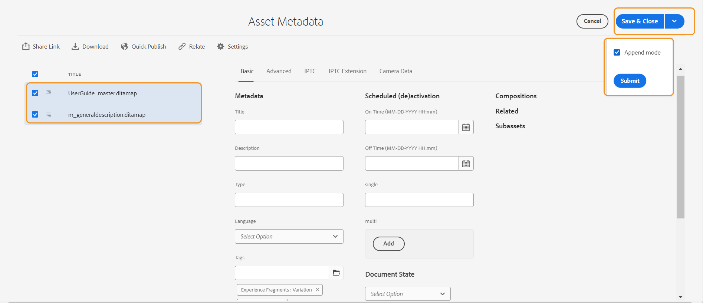

# Utilice la nueva colección de mapas para la generación de resultados (Beta)

>[!IMPORTANT]
>
> La nueva colección de mapas está disponible en Experience Manager Guides as a Cloud Service a partir de la versión 2026.06.0. Póngase en contacto con el equipo de éxito del cliente para habilitar esta función.

La recopilación de mapas en Adobe Experience Manager Guides permite a los especialistas en publicación organizar varios documentos en una sola colección, controlar la salida generada para cada documento y generar y publicar salidas por lotes de forma eficaz desde un panel centralizado. También proporciona visibilidad sobre el progreso de generación de resultados, resalta los cambios realizados en las asignaciones desde su último resultado publicado y le permite volver a publicar contenido cuando sea necesario.

La nueva colección de mapas consolida la funcionalidad que antes estaba distribuida en la antigua colección de mapas y la publicación masiva en una sola interfaz unificada. Una vez activados, puede administrar mapas, ajustes preestablecidos, historial de generación, historial de publicación, metadatos y pertenencia a colecciones desde una ubicación.

## Creación de una colección de mapas y adición de mapas DITA

Para crear una colección de mapas y agregarle asignaciones, realice los siguientes pasos:

1. Abra la página de inicio de Experience Manager Guides y seleccione **Nuevas colecciones de mapas**.

   Se abre la página **Colecciones de mapas**.

   {width="650"}

1. En la página **Colecciones de mapas**, seleccione **Crear** en la parte superior derecha y proporcione un **Nombre** para su nueva colección de mapas.

   {width="350"}

1. Seleccione **Crear**.

   Se muestra un mensaje de éxito al crear la colección de mapas.

1. Abra la colección de asignaciones a la que desee agregar las asignaciones.

   

   Al pasar el ratón por encima del título de la colección de mapas, puede realizar las siguientes acciones:

   - **Generar historial**: lo desplaza directamente a la pestaña Historial generado que enumera todas las asignaciones con salidas generadas para los ajustes preestablecidos definidos definidos.
   - **Historial de publicación**: lo desplaza directamente a la pestaña Historial de publicaciones que enumera todas las asignaciones con resultados publicados para los ajustes preestablecidos definidos definidos.
   - **Cambiar nombre**: cambia el nombre de la colección de asignaciones.

1. Seleccione **Editar colección** y luego seleccione **Agregar asignaciones**.

   

1. Seleccione las asignaciones que desee y habilite la opción **Seleccionar traducciones disponibles** para agregar automáticamente todas las copias de traducción disponibles de esa asignación a la colección de asignaciones. Si el mapa no tiene ninguna copia de traducción, se añade el idioma predeterminado al mapa.

   

1. Seleccione **Añadir**.

   Los archivos de mapa se enumeran junto con todas sus copias traducidas disponibles. Para los mapas que no tienen ninguna copia traducida, se muestra el idioma predeterminado.

   

1. Seleccione las asignaciones necesarias o todas las asignaciones de la lista y, a continuación, seleccione el botón **Recuperar ajustes preestablecidos** para recuperar los ajustes preestablecidos disponibles para las asignaciones seleccionadas.

   Verá una lista de todos los ajustes preestablecidos disponibles para los mapas seleccionados, agrupados en dos categorías: **Ajustes preestablecidos de perfil de carpeta** y **Otros ajustes preestablecidos**. **Los ajustes preestablecidos de perfil de carpeta** son comunes a todas las asignaciones seleccionadas, mientras que **Otros ajustes preestablecidos** son específicos de asignaciones individuales. Para ajustes preestablecidos bajo **Otros ajustes preestablecidos**, el mapa asociado se indica junto al conmutador correspondiente.

   

1. Seleccione **Habilitar todos los ajustes preestablecidos** o **Habilitar todos los ajustes preestablecidos de perfil de carpeta**, según sus necesidades. También puede utilizar el icono Filtro de la derecha para reducir la lista. El filtro proporciona dos niveles de filtrado: **Tipos de ajustes preestablecidos** para reducir los ajustes preestablecidos enumerados y **Estado del mapa** para elegir cualquier asignación específica del panel Mapas.

   

1. Seleccione **Guardar**.

Se obtiene una lista de todas las asignaciones deseadas con el título del mapa, el nombre del archivo correspondiente, el idioma en el que está disponible y los ajustes preestablecidos configurados.

La pestaña **Mapas y ajustes preestablecidos** presenta información en función de los mapas seleccionados para un idioma específico en las siguientes columnas:

- **Ajuste preestablecido**: muestra el tipo de ajuste preestablecido de salida configurado en el archivo de asignación.
- **Línea de base**: Muestra la línea de base que utiliza el ajuste preestablecido de salida.  Si no se usa ninguna línea de base, se muestra un guión `-`.
- **Modificado desde la generación**: indica si el mapa DITA se actualiza después de la generación. En función de esta información, puede decidir si desea publicar la salida para este mapa DITA o no.
- **Modificado desde la publicación**: indica si el mapa DITA se actualiza después de la última publicación. En función de esta información, puede decidir si desea volver a publicar la salida para este mapa DITA o no.
- **Última generación**: muestra la fecha y la hora del último resultado generado.
- **Última publicación**: muestra la fecha y la hora de la última salida publicada.

**Opciones de filtrado**

Las siguientes opciones de filtrado están disponibles en el panel derecho de la página Mapas y ajustes preestablecidos:

- **Modificado desde la generación**: puede seleccionar Sí, No o No generado aún. Si selecciona Sí, en la pestaña Mapas y ajustes preestablecidos solo se muestran las asignaciones que se han modificado desde la generación.
- **Modificado desde la publicación**: puede seleccionar Sí, No o No generado aún. Si selecciona Sí, en la pestaña Mapas y ajustes preestablecidos solo se muestran las asignaciones que se han modificado desde la publicación.
- **Ajustes preestablecidos**: seleccione un ajuste preestablecido para el que desee filtrar los archivos de asignación. Por ejemplo, si elige el ajuste preestablecido *AEM Site*, solo se mostrarán los mapas que tengan configurado el ajuste preestablecido de salida *AEM Site*.
- **Idioma**: puede seleccionar cualquiera de los códigos de idioma disponibles y mostrar solo el idioma seleccionado en la pestaña Mapas y ajustes preestablecidos.

  

## Generación de la salida mediante una colección de mapas

Para generar la salida utilizando una colección de mapas, realice los siguientes pasos:

1. Abra la colección Mapa. Puede ver los distintos ajustes preestablecidos de salida, como AEM Sites, PDF (incluido Native PDF), HTML5, EPUB y Ajustes preestablecidos personalizados según la configuración.

1. Para generar resultados para las asignaciones seleccionadas, seleccione los archivos de asignación necesarios y los ajustes preestablecidos específicos y, a continuación, seleccione **Generar**.

   >[!IMPORTANT]
   >
   > Si un proceso de generación de salida para un ajuste preestablecido o un mapa DITA está en cola o en curso, no se puede iniciar otra tarea de generación de salida para el mismo ajuste preestablecido o mapa.

1. Una vez generado el resultado, vaya a la pestaña **Historial generado** para ver la lista de todas las asignaciones generadas. Puede realizar un seguimiento del progreso de generación en la columna **Estado**, que indica si una generación se está ejecutando o ha finalizado.

   

1. Seleccione **Actualizar** para ver el estado más reciente del proceso de generación. La columna Estado se actualiza para reflejar el estado actual de cada mapa y sus ajustes preestablecidos asociados:

   - **Finalizado (verde)**: la generación se completó correctamente.
   - **Finalizado (rojo)**: la generación se completó con errores. Los detalles del error se pueden ver en los registros.
   - **Ejecutando (azul)**: la generación está actualmente en curso.

   

1. También puede cancelar la tarea de generación de resultados hasta que se esté ejecutando el estado de la tarea seleccionando el icono **Cancelar generación**.

   

1. Además, puede ver el resultado generado para los mapas cuya generación de resultados se ha completado seleccionando el icono **Abrir salida** que aparece al pasar el ratón por encima del nombre del mapa o ver los registros de generación seleccionando el icono **Registros** adyacente.

   

## Publicar el resultado mediante una colección de mapas

Para publicar la salida (si está configurada) mediante una colección de mapas, realice los siguientes pasos:

1. Seleccione las asignaciones que desee en la ficha **Mapas y ajustes preestablecidos** o en la ficha **Historial generado** y seleccione **Publicar en**.
1. Seleccione el entorno de destino en el que desea publicar el resultado: **Vista previa** o **Publicar** instancia.

   

1. Cambie a la pestaña **Historial publicado** para monitorizar el estado de la tarea de publicación.

   

1. Seleccione **Actualizar** para ver el estado más reciente de la tarea.
1. Una vez que el estado cambie a **Correcto**, compruebe el contenido publicado en la instancia de destino seleccionada.

## Configurar las propiedades de los metadatos

En la colección de mapas, puede configurar las propiedades de metadatos de forma masiva para los mapas DITA. Seleccione el icono **Configurar metadatos** de la pestaña **Mapas y ajustes preestablecidos** para abrir la página **Metadatos de recursos**. En la página **Metadatos del recurso**, todas las asignaciones presentes en la colección se muestran a la izquierda.

Siga estos pasos para configurar las propiedades de los metadatos:

1. Puede elegir las asignaciones para las que desea actualizar los metadatos. De forma predeterminada, se seleccionan todas las asignaciones DITA presentes.

1. Una vez seleccionadas las asignaciones DITA, se pueden ver propiedades como metadatos, programación (desactivación), referencias, estado del documento, etc.

1. Actualice las propiedades de los metadatos.

1. Seleccione **Guardar y cerrar** en la parte superior para guardar las actualizaciones.
1. (Opcional) Al actualizar las etiquetas, también puede seleccionar Anexar en el menú desplegable **Guardar y cerrar** para anexar las nuevas etiquetas a la lista existente.
1. Seleccione **Enviar** del menú desplegable **Guardar y cerrar**.
Las propiedades de metadatos se actualizan de forma masiva para las asignaciones DITA que seleccione en la colección de asignaciones.

>[!NOTE]
> 
>Para el menú desplegable **Estado del documento**, puede seleccionar solo aquellos estados de documento que se permiten en común para todas las asignaciones DITA seleccionadas. Para obtener más información, vea [**Estado del documento**](./web-editor-document-states.md).

Las propiedades de metadatos están sincronizadas con las propiedades del archivo. Una vez que los actualice, podrá verlos en el panel **Propiedades del archivo** del Editor.

**Tema principal:**[ Generación de resultados](generate-output.md)
