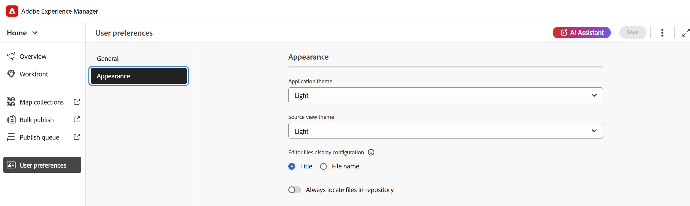

# Experiencia de la página de inicio de Experience Manager Guides

La página de inicio es la primera pantalla que ve al iniciar sesión en Experience Manager Guides. Proporciona una experiencia de pantalla de bienvenida unificada e intuitiva, que incluye una vista rápida de los archivos a los que ha accedido recientemente, las colecciones y mucho más.

{align="left"}

La página de inicio de Experience Manager Guides se divide en las siguientes secciones:

- Barra de encabezado
- Barra de navegación
- Panel izquierdo

## Barra de encabezado

La barra de encabezado es la barra superior de la página principal que muestra el logotipo de Adobe Experience Manager (o un Unified Shell si utiliza Unified Shell como interfaz de usuario de Experience Manager Guides). Al seleccionar el logotipo, se le redirige a la página Navegación de Experience Manager.

{align="left"}

## Barra de navegación

La barra de navegación muestra las herramientas para cambiar la navegación, personalizar el diseño de la descripción general y ajustar la vista de página. También muestra el perfil de carpeta actual en uso.

>[!NOTE]
>
> Si usas el as a Cloud Service de Adobe Experience Manager Guides, aparecerá una característica adicional denominada **Ayudante de IA** en la barra de navegación.

{align="left"}

Las funciones disponibles en la barra de navegación se explican de la siguiente manera:

- **Conmutador de navegación**: permite una navegación perfecta a otras páginas:
   - **Inicio**: La página predeterminada que ve al iniciar sesión en Experience Manager Guides.
   - **Editor**: un editor basado en web fácil de usar que le permite crear y administrar documentos estructurados en Experience Manager Guides. [Conozca la interfaz del editor](./web-editor.md).
   - **Consola de mapas**: proporciona un área de trabajo dedicada para administrar todos los aspectos de la administración y publicación de mapas. [Conozca la interfaz de la consola Map](./map-console-overview.md).
- **Ayudante de IA**: Una potente herramienta impulsada por IA diseñada para mejorar su productividad mediante características de ayuda inteligentes. Además, cuando trabaje en la interfaz del editor, puede aprovechar las capacidades de creación inteligente del asistente de IA, que hace que su proceso de creación sea más inteligente y rápido mediante sugerencias inteligentes para la reutilización y optimización de contenido.

  La característica [AI Assistant](./ai-assistant.md) solo está disponible actualmente para Adobe Experience Manager as a Cloud Service.
- **Personalizar sección de información general**: Permite ocultar o mostrar los widgets en la sección Widgets.
- **Perfil de carpeta en uso**: Muestra el perfil de carpeta que se está usando actualmente.
- **Más acciones**: Proporciona acceso a opciones adicionales. Al seleccionar este botón, se abre un menú con las siguientes opciones:

   - **Assets**: lo lleva a un destino basado en su configuración.
      - **Cloud Services**: Si usas Cloud Services, al seleccionar la opción **Assets** accederás a la página Navegación de AEM.

      - **Software On-Premise**: Si utiliza Adobe Experience Manager Guides (4.2.1 y versiones posteriores), al seleccionar la opción **Assets**, se le redirigirá a la ruta de archivo actual en la interfaz de usuario de Assets.
   - **Configuración de Workspace**: lo lleva al cuadro de diálogo **Configuración de Workspace**. Para obtener más información, vea [Configurar las opciones de Workspace](../cs-install-guide/workspace-settings.md).

     >[!NOTE]
     >
     > En la página de inicio, la opción de configuración de Workspace solo está disponible para la configuración de Cloud Services. En una configuración On-Premise, la opción More actions no está disponible en la página de inicio. Sin embargo, aún puede acceder a la configuración relevante a través de la interfaz del editor y la consola de mapas, navegando a Más opciones > Configuración.

- **Expandir vista**: permite expandir la vista de página mediante el icono **Expandir**. En esta vista, la barra de encabezado está oculta, lo que maximiza el espacio de contenido. Para volver a la vista estándar, usa el icono **Salir de la vista expandida**.

## Panel izquierdo

El panel izquierdo le permite acceder rápidamente a las funciones Información general, Colecciones de mapas, Publicación masiva, Cola de publicación y Preferencias de usuario. Puede expandir el panel seleccionando el icono **Expandir** ubicado en la esquina inferior izquierda de la interfaz. Una vez expandido, usa el icono **Contraer** para contraer el panel.

{width="300" align="left"}

Lo que vea en este panel depende de la función de usuario que tenga. En la tabla siguiente se enumeran las funciones y las secciones respectivas que se muestran en el panel izquierdo.

- **Administrador y editor**: La capacidad para ver todas las secciones del panel.
- **Autor**: La capacidad para ver todas las secciones excepto la publicación. Los autores no tienen acceso a las secciones Colecciones de mapas, Cola de publicación y Publicación masiva.
- **Revisor**: La capacidad de ver solamente la sección Información general. Al seleccionar la sección Información general, se muestra un mensaje de estado vacío predeterminado o el widget de tareas de Workfront, en función de si Adobe Workfront está configurado o no.

Las funciones disponibles en el panel izquierdo se explican de la siguiente manera:

- [Información general](#overview)
- [Colecciones de mapas](#map-collections)
- [Publicación masiva](#bulk-publish)
- [Cola de publicación](#publish-queue)
- [Preferencias de usuario](#user-preferences)

>[!NOTE]
>
> Además, si el administrador ha configurado la integración de Adobe Workfront en el sistema, también se mostrará la opción **Workfront** en el panel izquierdo. Obtenga información acerca de la [integración de Adobe Workfront](./workfront-integration.md) en Experience Manager Guides.

### Información general

**Información general** actúa como un tablero personalizado diseñado para mejorar la productividad. Incluye diferentes widgets que le ayudan a mantenerse organizado y centrado.

Los widgets también proporcionan opciones para ordenar y cambiar el tamaño de las columnas. Para ver estas opciones, seleccione el encabezado de columna y las opciones se mostrarán en una lista.

Los siguientes widgets están presentes en la sección Widgets:

- **Archivos recientes**: El widget proporciona una instantánea de los archivos abiertos recientemente (una lista de los archivos a los que ha accedido en el Editor) junto con los detalles clave del archivo, incluidos Título, Nombre de archivo, Tipo de archivo, Ruta de archivo y Acceso en las fechas.

  {align="left"}

  Puede ordenar y cambiar el tamaño de las columnas seleccionando opciones en el menú desplegable de columnas. De forma predeterminada, los datos se ordenan en función de la última fecha y hora a las que se accedió.

  {align="left"}

  Desde [Preferencias de usuario](#user-preferences), puede establecer el número máximo de archivos que se pueden mostrar en este widget. De manera predeterminada, este límite está establecido en **20**.

  Las siguientes opciones están disponibles cuando pasa el ratón por encima de un archivo:

   - **Abrir en el editor**: permite abrir el archivo en el editor. También puede abrir un archivo simplemente seleccionándolo.
   - **Anclar/desanclar**: permite anclar uno o más archivos al widget Archivos recientes. Los archivos anclados se muestran en la parte superior de la lista de widgets. Para desanclar un archivo, usa la opción **Desanclar**.
   - **Quitar**: Permite quitar el archivo del widget Archivos recientes.

  **Crear nuevo archivo desde el menú desplegable Nuevo archivo**

  El menú desplegable **Nuevo archivo** le permite crear un tema o mapa DITA directamente desde el widget **Archivos recientes**. Cuando la creación de archivos se realice correctamente, se le redirigirá a la interfaz del Editor, donde podrá trabajar con el archivo.

- **Colecciones**: si trabaja en un conjunto de archivos o carpetas, puede agregarlos a este widget para acceder a ellos rápidamente. Una vez agregados, puede ver los archivos por título junto con otros detalles clave como Propietario y Fecha de creación. A medida que selecciona la lista desplegable de columnas, puede ver las opciones para ordenar y cambiar el tamaño de la columna.

  {align="left"}

  Las rutas de exploración de la colección seleccionada se muestran en la parte superior del widget Colección. Puede seleccionarlo para volver a una carpeta específica dentro de la jerarquía.

  {align="left"}

  Las siguientes opciones están disponibles cuando pasa el ratón sobre una colección y selecciona el icono Más :

   - **Cambiar nombre**: permite cambiar el nombre de la colección.
   - **Eliminar**: permite eliminar la colección.
   - **Ver en la interfaz de usuario de Assets**: permite abrir la colección en la interfaz de usuario de Assets.

  Puede abrir una colección seleccionando el título Colección. Las siguientes opciones están disponibles cuando pasa el ratón por encima de un archivo de colección y selecciona el icono Más :

   - **Abrir en el editor**: permite abrir el archivo en el editor. También puede seleccionar el título del archivo para abrirlo.
   - **Abrir en la consola de mapas**: Permite abrir el archivo de mapa en la consola de mapas. (Disponible sólo para un fichero de mapa DITA).
   - **Agregar a colecciones**: Permite agregar el archivo a una colección nueva o existente.
   - **Quitar de colecciones**: Permite quitar el archivo de la lista de colecciones.
   - **Ver en la interfaz de usuario de Assets**: permite localizar el archivo en la interfaz de usuario de Assets.

  **Crear nueva colección desde el menú desplegable Nueva colección**

  El menú desplegable **Nueva colección** le permite crear una nueva colección y agregarla al widget **Colecciones**.

>[!NOTE]
>
> Además, si el administrador ha configurado la integración de Adobe Workfront en el sistema, el widget **Sus tareas** también se muestra en la sección Widgets. Obtenga más información acerca de la [integración de Adobe Workfront](./workfront-integration.md#working-with-the-your-tasks-widget) en Experience Manager Guides.

### Asignación de colecciones

Experience Manager Guides permite organizar el contenido para su publicación mediante un tablero denominado **Colecciones de mapas**. Para usar esta característica, seleccione **Colecciones de mapas** en el panel izquierdo. Le lleva a la página Colecciones de mapas en la **interfaz de usuario de Assets**, donde puede [usar la colección de mapas para generar resultados.](./generate-output-use-map-collection-output-generation.md)

### Publicación masiva

La función Activación masiva le permite activar rápida y fácilmente el contenido desde la creación a la publicación. Para usar esta característica, seleccione **Publicación en lotes** en el panel izquierdo. Le lleva a la página Colecciones de activación en lotes de la interfaz de usuario de Assets, donde puede crear y administrar [la activación en lotes del contenido publicado](./conf-bulk-activation.md).

### Cola de publicación

Cuando se ejecuta un gran conjunto de tareas de publicación en el sistema, resulta prácticamente imposible comprobar cada mapa DITA de forma individual para controlar su tarea de publicación. Experience Manager Guides ofrece a los administradores y editores una vista unificada de todas las tareas de publicación que se ejecutan en el sistema.

Para usar esta característica, seleccione **Cola de publicación** en el panel izquierdo. Le lleva a la página Panel de publicación en la interfaz de usuario de Assets, donde puede [administrar tareas de publicación mediante el panel de publicación](./generate-output-publish-dashboard.md).

### Preferencias de usuario

Las preferencias de usuario están disponibles para todos los autores. Con las preferencias, puede configurar las siguientes opciones:

- **General**: la ficha General permite configurar las siguientes opciones:

  {align="left"}

   - **Perfil de carpeta**: el perfil de carpeta controla varias configuraciones relacionadas con atributos condicionales, plantillas de creación, ajustes preestablecidos de salida y configuraciones del editor. El perfil Global se muestra de forma predeterminada. Además, si el administrador ha configurado perfiles de carpeta en el sistema, esos perfiles de carpeta también se muestran en la lista Perfiles de carpeta.
   - **Ruta básica**: de forma predeterminada, al acceder al repositorio de Experience Manager Guides desde el Editor, se muestran los recursos desde la ubicación /content/dam. Es muy probable que la carpeta de trabajo esté compuesta por unas pocas carpetas dentro de la carpeta /content/dam/. Puede establecer la Ruta básica en la carpeta de trabajo y, a continuación, la vista Repositorio le mostrará el contenido desde esa ubicación. Esto reduce el tiempo para tener acceso a la carpeta de trabajo. Además, al insertar cualquier referencia o archivo multimedia en el tema, la ubicación de exploración de archivos comienza con la carpeta establecida en la Ruta base.
   - **Seleccionar mapa raíz**: seleccione un archivo de mapa DITA para resolver referencias clave o entradas del glosario. El mapa raíz seleccionado tiene la prioridad más alta para resolver las referencias clave. Para obtener más información, vea [Resolver referencias clave](./map-editor-other-features.md).
   - **Número máximo de archivos recientes**: utilice este campo para establecer un límite máximo de archivos que se mostrarán en el widget Archivos recientes.
   - **Preferencias de apertura para Mapas**: aquí puede seleccionar un comportamiento predeterminado que el sistema seguirá al abrir un archivo de mapa DITA.

- **Aspecto**: la ficha Aspecto le proporciona las opciones para seleccionar los temas de la aplicación y la vista de origen del área de edición de contenido. Utilice esta pestaña para configurar las siguientes opciones:

  {align="left"}

   - **Tema de aplicación y vista de Source**: puede elegir entre los temas Claro u Oscuro para la aplicación y la vista de origen. En el caso del tema Claro, las barras de herramientas y los paneles utilizan un fondo de color gris claro. En el caso del tema Oscuro, las barras de herramientas y los paneles utilizan un fondo de color negro. Seleccione **Usar el tema del dispositivo** para permitir que Experience Manager Guides seleccione los temas claro y oscuro en función del tema del dispositivo.

     En todas las temáticas, el área de edición de contenido se muestra en fondo de color blanco en la vista Autor.

   - **Los archivos del editor muestran la configuración**: seleccione la forma predeterminada de ver los archivos en el editor. Puede ver la lista de archivos por títulos o los nombres de archivo desde los distintos paneles de la vista Autor. De forma predeterminada, los archivos se muestran por título en el Editor.

   - **Buscar siempre archivos en el repositorio**: seleccione esta opción para mostrar la ubicación de un archivo en el repositorio mientras lo edita en el Editor.
