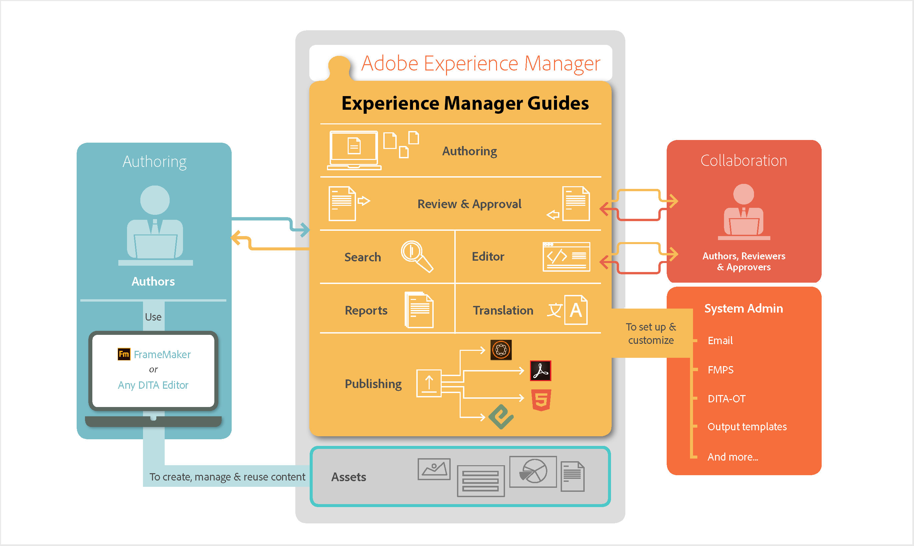

# Cómo funciona Adobe Experience Manager Guides {#id167G9A00DO4}

El diagrama siguiente ilustra cómo funciona Experience Manager Guides con AEM y cualquier editor DITA para habilitar la administración, reutilización, traducción y revisión de contenido en un escenario empresarial.

{align="center"}

**Tema principal:**[ Acerca de Adobe Experience Manager Guides as a Cloud Service](intro.md)
