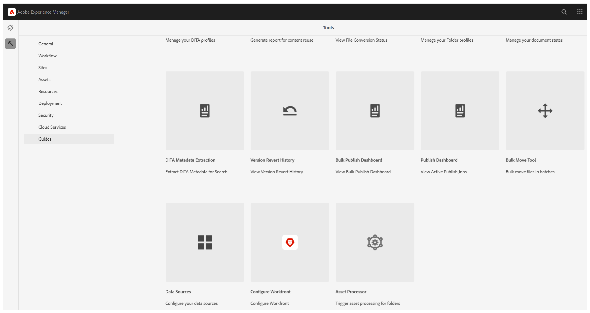

# Migración de colecciones de mapas antiguas a nuevas colecciones de mapas

Si ya ha configurado las colecciones de mapas en el formato antiguo, no es necesario reconstruirlas desde cero al pasar a la nueva experiencia. Puede volver a crearlos manualmente o utilizar la herramienta de migración integrada para mover todo en un solo paso.

La herramienta de migración, agregada como un nuevo tipo de proceso dentro del **procesador en lotes**, lee las colecciones de mapas antiguas existentes y crea automáticamente nuevas colecciones de mapas que coinciden. Este artículo explica cómo ejecutar la migración y destaca algunos comportamientos clave que debe conocer antes de utilizarla.

>[!NOTE]
>
> La función de activación masiva no se migra a la experiencia de Nueva recopilación de mapas. Vuelva a crear las colecciones de mapas utilizadas para la activación masiva en la nueva experiencia de recopilación de mapas, si es necesario.

## Migrar a una nueva colección de mapas

Realice los siguientes pasos para migrar las colecciones de mapas antiguas a nuevas colecciones de mapas:

1. Seleccione el logotipo de Adobe Experience Manager y elija **Herramientas**.
1. En el panel **Herramientas**, seleccione **Guías**.
1. Seleccione el mosaico **Procesador en lotes**.

   

1. La ventana Guides Bulk Processor se abre con los siguientes detalles:

   - **Tipo de característica**: Muestra la característica del proceso que se está ejecutando.

   - **ID de ejecución**: es el ID único para cada tarea de migración que realice.

   - **Creada por**: Muestra quién creó la tarea.

   - **Hora de inicio**: muestra la fecha y la hora en que se inició la migración.

   - **Hora de finalización**: muestra la fecha y la hora en que finaliza la migración.

   - **Estado**: muestra el estado de la migración como En curso, Completada o Error.

   

1. Seleccione la pestaña **Nuevo proceso** en la esquina superior derecha de la ventana para iniciar una nueva tarea de migración.

   Se abre el cuadro de diálogo **Nuevo proceso**.

    {width="350"}

1. Seleccione **Colección de mapas** del menú desplegable **Tipo de característica**.

    {width="350"}

1. Seleccione **Crear**.

Esto ejecuta un único trabajo que migra todas las colecciones de mapas antiguas existentes a nuevas colecciones de mapas. No se requiere ninguna configuración adicional.

>[!NOTE]
>
> Si la tarea de migración falla, puede comprobar la opción **Ver registros** pasando el puntero sobre el ID de ejecución.

## Consideraciones importantes

- **Volver a ejecutar la migración:** Si se vuelve a ejecutar el proceso de migración, no se comprueban los cambios en las colecciones de asignaciones de origen (antiguas). Volverá a migrar o sobrescribirá incondicionalmente las nuevas colecciones de mapas.
- **Marcas de hora y características únicas:** Cada colección de mapas migrada almacena la marca de tiempo de la primera vez que se migró. Esta marca de tiempo se utiliza para mantener la exclusividad del registro migrado. Debido a esto, la colección de mapas migrada no reflejará las actualizaciones posteriores realizadas en la colección de mapas original (origen), solo el estado en el momento de la migración se captura.

