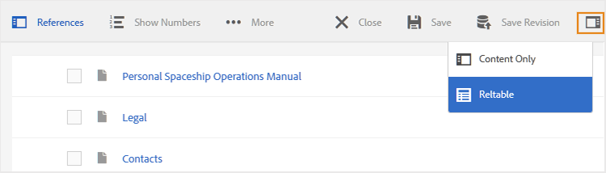
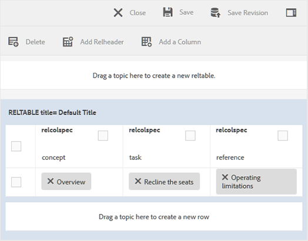

# Funciones del editor de mapas {#id1942D0S0IHS}

La barra de herramientas del Editor de mapas es similar al Editor de temas. Las operaciones básicas como cambiar el panel izquierdo, guardar el mapa, crear una nueva versión del mapa, deshacer/rehacer la última operación y eliminar los elementos seleccionados son comunes en ambos editores. Para obtener información detallada sobre cómo funcionan estas operaciones, vea la barra de herramientas [en la sección Editor](web-editor-toolbar.md#).

Las opciones que se ven en la barra de herramientas del editor se basan en la vista Editor de mapas. Hay cuatro vistas disponibles en el editor de mapas:

- [Diseño](#layout-view)
- [Autor](#author-view)
- [Origen](#source-view)
- [Vista previa](#preview)

Las secciones siguientes describen las opciones de la barra de herramientas disponibles en las distintas vistas del Editor de mapas:

## Vista Presentación

Cuando se abre un mapa para editarlo, se abre la vista Presentación del Editor de mapas. La vista Presentación muestra la jerarquía de mapas en una vista de árbol y permite organizar los temas en un mapa.

>[!NOTE]
>
> La vista Presentación sólo muestra las referencias presentes en un mapa. Si hay referencias rotas, se mostrará un símbolo de cruz pequeño a la izquierda de la referencia

Las siguientes opciones están disponibles en la barra de herramientas de la vista Presentación:

**Referencia de tema** - 

Muestra el cuadro de diálogo Seleccionar archivo. Desplácese hasta el tema o archivo de asignación que desee insertar y elija **Seleccionar** para agregarlo al mapa.

{align="left"}

**Grupo de temas** - 

Inserte el elemento `topicgroup`. Para obtener más información sobre la agrupación de temas, vea la documentación de [topicgroup](https://docs.oasis-open.org/dita/v1.0/langspec/topicgroup.html) en Especificación del lenguaje DITA OASIS.

**Definición de clave** - 

Muestra el cuadro de diálogo Insertar definición de clave. Utilice este cuadro de diálogo para definir cualquier definición de clave que desee utilizar en el mapa.

{width="300" align="left"}

**Insertar antes o insertar después** -  / 

Muestra el cuadro de diálogo Insertar elemento. Seleccione el elemento que desea insertar en el mapa. Según la operación, el nuevo elemento se inserta antes o después del elemento actual en el mapa.

**Insertar contenido frontal** - 

Este icono se muestra al abrir un mapa de libro para editarlo. Puede insertar componentes al principio del libro, como una tabla de contenido, un índice y una lista de tablas.

**Insertar materia posterior** - 

Este icono se muestra al abrir un mapa de libro para editarlo. Puede insertar componentes para al final del libro, como un índice, un glosario y una lista de ilustraciones.

**Mover el elemento seleccionado a la izquierda/derecha** -  / 

Seleccione la flecha izquierda para mover el tema hacia el lado izquierdo de la jerarquía. Esto promociona esencialmente el tema correspondiente un nivel arriba en la jerarquía. Por ejemplo, si selecciona la flecha izquierda mientras selecciona un tema secundario, conviértalo en el elemento secundario del tema situado encima. Del mismo modo, si selecciona la flecha derecha, el tema se empuja hacia el lado derecho, lo que lo convierte en el elemento secundario del tema situado encima.

**Mover arriba/abajo el elemento seleccionado**  - / 

Seleccione los iconos de flecha arriba o abajo&#39; para mover el tema hacia arriba o hacia abajo en la jerarquía.

>[!NOTE]
>
> También puede arrastrar y soltar las referencias para moverlas en un mapa.

**Bloquear/Desbloquear**

Obtiene un bloqueo en el archivo de asignación y libera el bloqueo. Si tiene cambios sin guardar en el fichero de asignación, en el momento de liberar el bloqueo, se le pedirá que guarde el fichero de asignación. Los cambios se guardan en la versión actual del archivo de asignación.

**Combinar** - 

Para obtener más información acerca de cómo combinar contenido de una versión diferente del mismo archivo o de otro diferente, vea [Combinar](web-editor-features.md#menu-dropdown) en el Editor.

**Historial de versiones** - 

Compruebe las versiones y etiquetas disponibles del tema activo y vuelva a cualquier versión desde el propio editor.

**Etiqueta de versión** - 

Muestra el cuadro de diálogo Administración de etiquetas de versión. Seleccione una versión en la lista desplegable. Elija la etiqueta que desee aplicar a la versión seleccionada y seleccione **Agregar etiqueta** para agregarla.

**Mostrar nombre de archivo**

Muestra el nombre de archivo de los títulos de los temas.

>[!NOTE]
>
> Cuando pasa el puntero sobre el título de un tema, se muestra la ruta del archivo.

**Mostrar números de línea**

Muestra u oculta el número de línea de cada tema. Los números de línea se muestran según el nivel de la jerarquía.

**Mostrar casilla**

Muestra u oculta una casilla de verificación para cada tema. Puede utilizar la casilla de verificación para seleccionar los temas y realizar diversas tareas mediante el menú Opciones.

**Menú de opciones en la vista de diseño**

Además de organizar los temas en el archivo de asignación, también puede realizar las siguientes acciones mediante el menú Opciones que aparece al pasar el cursor sobre un archivo o al hacer clic con el botón derecho en el editor en la vista de diseño:

{width="650" align="left"}

- **Agregar**: puede elegir agregar un nuevo tema o una referencia vacía desde el Editor de mapas:
   - **Referencia vacía**: esta opción permite agregar una referencia vacía en el mapa DITA. Puede hacer doble clic en la referencia vacía insertada más adelante y agregar los detalles del Tema.
   - **Nuevo tema**: cuando elige crear un nuevo tema desde el menú, aparece el cuadro de diálogo **Nuevo tema**. En el cuadro de diálogo **Nuevo tema**, proporcione los detalles necesarios y seleccione **Crear**.
- **Mover**: puede elegir mover un tema hacia arriba/abajo/derecha/izquierda en la jerarquía. También puede arrastrar y soltar un tema o un mapa desde el panel del repositorio al mapa abierto en el Editor de mapas.
- **Deshacer**: Deshacer la última operación en la vista Presentación.
- **Rehacer**: rehace la última operación en la vista Presentación.
- **Copiar**: copie la referencia seleccionada del archivo de asignación.

  >[!NOTE]
  >
  > Puede mostrar y, a continuación, seleccionar las casillas de verificación para copiar varias referencias.

- **Pegar**: pegue las referencias copiadas en la ubicación actual de la jerarquía.
- **Eliminar**: elimine las referencias seleccionadas del archivo de asignación.

  >[!NOTE]
  >
  > Puede mostrar y, a continuación, seleccionar las casillas de verificación para eliminar varias referencias.

**Ver temas basados en filtros condicionales**

Si ha aplicado alguna condición a un tema, se muestra un icono de filtro a la derecha del tema. Cuando pasa el puntero sobre un icono de filtro, se muestra la condición aplicada y su valor de atributo.

## Vista de autor

La vista **Autor** permite editar el mapa DITA en el editor. Esto muestra la vista WYSIWYG del Editor de mapas y algunos de los iconos que se muestran en la vista Autor son los mismos que la vista Presentación.

{align="left"}

Además, puede ver los iconos siguientes y realizar las tareas relacionadas desde la vista Autor:

**Insertar antes/Insertar después** -  / 

Muestra el cuadro de diálogo **Insertar elemento antes o &#x200B;** Insertar elemento después. Seleccione el elemento que desea insertar en el mapa. Según la operación, el nuevo elemento se inserta antes o después del elemento actual en el mapa.

**Elemento** - 

Muestra el cuadro de diálogo **Insertar elemento**. Seleccione el elemento que desea insertar. Puede utilizar el teclado para desplazarse por la lista de elementos y pulsar Intro para insertar el elemento requerido. También puede seleccionar el elemento para insertarlo en el mapa.

<!-----------------------------------------------------------

**Relationship table** - 

Inserts a relationship table in the map.

Perform the following steps to work with relationship tables in the Basic Map Editor:

1.  In the Assets UI, navigate to the DITA map in which you want to create the relationship table.

1.  Select the DITA map to open it in DITA map console.

1.  Select the **Topics** tab to view a list of topics available in the DITA map.

    >[!TIP]
    >
    > The Topics tab gives you an option to download the map file with its dependents. For more details, view [Export a DITA map file](authoring-download-assets.md#id218UBA00IXA).

1.  In the main toolbar, select **Edit**.

    The map file is opened in the Advanced Map Editor.

1.  Select **Reltable** from the toolbar.

    {width="650" align="left"}

1.  Drag-and-drop topics from the topic list to the Reltable editor.

    >[!NOTE]
    >
    > You can add topics from any folder in the References rail.

    {width="550" align="left"}

1.  To add a header to your relationship table, click **Add Relheader**.

1.  To add a column to your relationship table, click **Add a Column**.

    {width="550" align="left"}

1.  Click **Save**.

You can also perform the following actions from the relationship table editor:

**Delete rows or columns**

If you want to delete a column from your table, select the checkbox in the column header and click Delete. If you want to remove a row from table, select the checkbox in the first column of the respective row and click Delete.

**Delete a topic**

If you want to delete a topic from your table, click the cross icon next to the topic.

**Delete the relationship table**

If you want to delete the relationship table, click anywhere outside the relationship table and click Delete. For details, view [Work with relationship tables in the Map Editor](map-editor-basic-map-editor.md).
----->

**Contenido reutilizable** - 

Muestra el cuadro de diálogo **Reutilizar contenido**. Utilice este cuadro de diálogo para insertar el contenido que desea reutilizar en el mapa.

**Actualizar atributo de título de navegación** - 

Permite mantener sincronizados el atributo `@navtitle` y el elemento `title` de un archivo al que se hace referencia. Puede agregar distintos tipos de archivos a un mapa, como temas, tareas, referencias o submapas. La mayoría de ellos admiten el atributo `@navtitle`, que controla cómo aparece el nombre de archivo en el mapa o en la tabla de contenido. Si un archivo contiene el atributo `@navtitle`, se actualiza el atributo `@navtitle` para el mismo archivo en el mapa. Si el atributo `@navtitle` no está presente, el atributo `@navtitle` se agrega a ese archivo de referencia y su `title` también se actualiza para mostrar el `@navtitle`.

>[!NOTE]
>
> El administrador puede elegir mostrar u ocultar este botón en la barra de herramientas del Editor de mapas mediante una propiedad de configuración. También pueden habilitar la adición automática del atributo `@navtitle` cuando se agreguen archivos a un mapa. Para obtener más información, vea [Incluir @navtitle atributo de forma predeterminada](../cs-install-guide/auto-add-navtitle.md)* en Instalar y configurar Adobe Experience Manager Guides as a Cloud Service.

**Etiquetas**

Muestra u oculta las etiquetas XML. Las etiquetas sirven como indicaciones visuales que indican el límite de un elemento. En este modo, si desea insertar una referencia de tema/mapa, arrastre y suelte el archivo deseado antes o después de la etiqueta. La barra horizontal no se muestra en el modo Vista de etiquetas.

**Rastrear cambios** - 

Puede realizar un seguimiento de todas las actualizaciones realizadas en el archivo de asignación activando el modo Control de cambios. Después de habilitar el seguimiento de cambios, todas las inserciones y eliminaciones se capturan en el documento. Para obtener más información, vea [Rastrear cambios](web-editor-features.md#track-changes) en el editor.

**Crear tarea de revisión** - 

Puede crear una tarea de revisión del tema actual o asignar archivos directamente desde el Editor. Abra el archivo para el que desea crear la tarea de revisión y seleccione **Crear tarea de revisión** para iniciar el proceso de creación de la revisión. Siga las instrucciones indicadas en la [Introducción a la revisión](review.md#) para obtener más detalles.

## Vista de Source

Esta vista permite editar contenido en formato sin procesar, lo que proporciona control total sobre la estructura y el formato.

{align="left"}

En esta vista, la barra de herramientas proporciona opciones básicas de edición e inserción de contenido disponibles en la lista desplegable **Menú**, que incluye Cortar, Copiar, Deshacer, Rehacer, Eliminar, Buscar y reemplazar, Etiqueta de versión, Combinar, Guardar como nueva versión, Bloquear y Desbloquear.

## Vista previa

El modo de previsualización procesa el contenido tal como aparecerá en la salida final, lo que permite revisar el diseño y el formato antes de publicarlo.

Además de poder ver la posición de cada archivo de tema dentro de un mapa, es deseable ver el contenido del mapa en un flujo consecutivo. La función Vista previa de mapa permite ver todo el contenido del archivo de mapa con un solo clic. No es necesario generar una salida del archivo de asignación para ver el aspecto que tendrá todo el mapa una vez publicado. Simplemente puede acceder a la vista previa del mapa y todos los temas y submapas se representan en forma de libro.

{align="left"}

>[!NOTE]
>
> No hay opciones de edición o inserción de contenido disponibles en la barra de herramientas del modo de vista previa. No puede editar el contenido en esta vista. Sin embargo, puedes usar las funciones **Guardar como nueva versión** y **Bloquear** o **Desbloquear**.

Puede realizar las siguientes tareas adicionales en el modo de vista previa:

**Abrir temas para editar**

- Haz clic con el botón derecho en un tema y selecciona **Editar** para abrir el tema y editarlo en una pestaña nueva.

  >[!NOTE]
  >
  > Si no tiene derechos de edición, el tema se abrirá en modo de solo lectura.

  {width="650" align="left"}

- Vaya al tema deseado seleccionando el título del tema en el árbol de mapas \(en el panel izquierdo\).

- El tema actual en la vista previa del mapa también se resalta en el árbol del mapa.

**Actualizar temas o asignación**

Cuando se abre un mapa en el modo Vista previa y se vuelve a él desde otra pestaña del Editor, la vista previa no se actualiza automáticamente. Para volver a cargar la vista previa del mapa, se requiere una actualización manual.

Puede utilizar la funcionalidad Actualizar, disponible en el modo Vista previa del mapa, de dos formas:

- **Actualización a nivel de mapa**: al seleccionar el botón **Actualizar**, se actualiza la vista previa de todo el mapa (incluidos todos los temas) y se lleva a la primera posición de desplazamiento para una vista clara.
  {width="650" align="left"}

- **Actualización a nivel de tema**: al seleccionar **Actualizar tema** en el menú contextual, se actualiza ese tema específico sin modificar la posición de desplazamiento.
  {width="650" align="left"}

**Otras formas de obtener una vista previa de un archivo de asignación**

Puede acceder a la vista previa de un mapa desde:

- **Interfaz de usuario de Assets**: en la interfaz de usuario de Assets, vaya a la ubicación del mapa, seleccione el archivo del mapa y elija **Vista previa del mapa** en la barra de herramientas. La vista previa del mapa se muestra en una nueva pestaña. Puede ver el contenido de todos los temas en el modo de vista previa. En esta vista, no se puede editar ningún tema.

  >[!NOTE]
  >
  > Si la opción *Vista previa del mapa* no está visible en la barra de herramientas principal, es posible que se haya movido al menú de la barra de herramientas **Más**.

- **Editor de mapas**: en el editor de mapas, selecciona **Vista previa** del menú de opciones para ver la vista previa del mapa actual.

  {width="650" align="left"}

  La vista previa del mapa se muestra en un cuadro emergente.

  {width="500" align="left"}

**Asignar propiedades**

Muestra el cuadro de diálogo Propiedades del mapa, donde puede establecer los atributos y la información de metadatos del mapa.

## Edición de temas mediante el mapa DITA {#id17ACJ0F0FHS}

La edición de un tema individual no proporciona el contexto completo al autor. Un autor no tendría información sobre dónde se coloca un tema en un mapa DITA. Sin esta información contextual, se vuelve un poco difícil para los autores crear contenido.

Experience Manager Guides permite a los autores abrir un mapa DITA en el Editor y ver la ubicación de los temas dentro del mapa. Esto ayuda a los autores a saber exactamente dónde se coloca el tema en el mapa y crear contenido más relevante. Además, si hay varios autores trabajando en un proyecto, pueden saber cuáles son todos los temas disponibles en el mapa y reutilizar el contenido, donde sea necesario.

Para editar temas a través de un mapa DITA, realice los siguientes pasos:

1. En el panel Repositorio, desplácese hasta el fichero de mapa DITA que desee editar y ábralo.

   El archivo de mapa se abre en la vista Mapa.

>[!NOTE]
>
> También se puede utilizar la interfaz de usuario de Assets para abrir un fichero de mapa DITA. Desplácese hasta el archivo de asignación DITA que contiene los temas que desea editar y seleccione **Editar temas** en la barra de herramientas principal para iniciar el Editor.

1. Seleccione cualquier vínculo del tema para abrirlo en el Editor y editarlo.

   Puede abrir varios temas en el editor, y cada tema se abre en una nueva pestaña del editor. Incluso si el mapa DITA contiene submapas, los temas de los submapas también se abren en una nueva pestaña para su edición. Si desea ver los temas bajo un submapa, puede seleccionar y expandir el submapa.

   {align="left"}

   Si selecciona un fichero de mapa, el mapa se abrirá en una nueva pestaña del Editor.

1. Una vez que haya terminado de editar los temas, puede hacer lo siguiente:

   - Puede guardarlos de forma individual. Si cierra sin guardar los temas, verá un cuadro de diálogo que le pedirá que guarde los temas no guardados:

     {width="300" align="left"}

     Puede elegir guardar todos los temas seleccionados o anular la selección de los temas que no desee guardar.

   - Puede desbloquear el tema con la opción **Guardar como nueva versión**. Al guardar una versión del tema, se crea una nueva versión y también se libera el bloqueo.

     Se recomienda guardar los cambios antes de desbloquear los archivos.  Al guardar los cambios, se valida el archivo XML.

   - También puede ver el progreso de los temas en el cuadro de diálogo **Guardar como nueva versión**. Se muestra un mensaje de éxito cuando los archivos están desbloqueados.

   - Si el administrador ha activado la opción de desbloquear archivos al cerrar, se le mostrará un mensaje para guardar los archivos cada vez que se cierren los archivos bloqueados. Con esta opción habilitada, al cerrar el editor con archivos modificados, se muestra la lista de archivos bloqueados que deben guardarse. Los archivos bloqueados se muestran con un icono de bloqueo:

     {width="350" align="left"}

## Panel derecho en el editor de mapas

El panel derecho muestra las Propiedades de contenido y las Propiedades de mapa en la vista Diseño del Editor de mapas.

**Propiedades de contenido**

El panel Propiedades del contenido contiene información sobre el tipo de tema seleccionado actualmente en el mapa, su dirección URL del vínculo y sus atributos. Para obtener más información, vea [Propiedades de contenido](web-editor-features.md#right-panel) en el editor.

- **Otros atributos** Si el administrador ha creado un perfil para atributos, obtendrá esos atributos junto con los valores configurados. Con el panel de propiedades de contenido, puede elegir esos atributos y asignarlos al contenido relevante del tema. También puede asignar atributos configurados por el administrador en **Atributos de visualización**. Los atributos definidos para un elemento se muestran en las vistas Diseño y Esquema. Esto le ayuda a echar un vistazo rápido a todos los temas de un mapa para los que se ha definido un atributo en particular. Por ejemplo, todos los temas que tienen el atributo `audience` se definen como `US`.

  {width="650" align="left"}

  Para obtener más información, vea [Atributos de visualización](../cs-install-guide/workspace-settings.md#display-attributes).

- **Metadatos** Mediante los metadatos, puede establecer la información de los metadatos. Puede definir el Título de navegación, el Texto del vínculo, la Descripción breve y las Palabras clave.

Para obtener más información acerca de los atributos y metadatos estándar del tema, vea la documentación de [topicref](https://docs.oasis-open.org/dita/v1.2/os/spec/langref/topicref.html) en Especificación del lenguaje DITA OASIS.

**Tema principal:** [Introducción al editor de mapas](map-editor.md)
