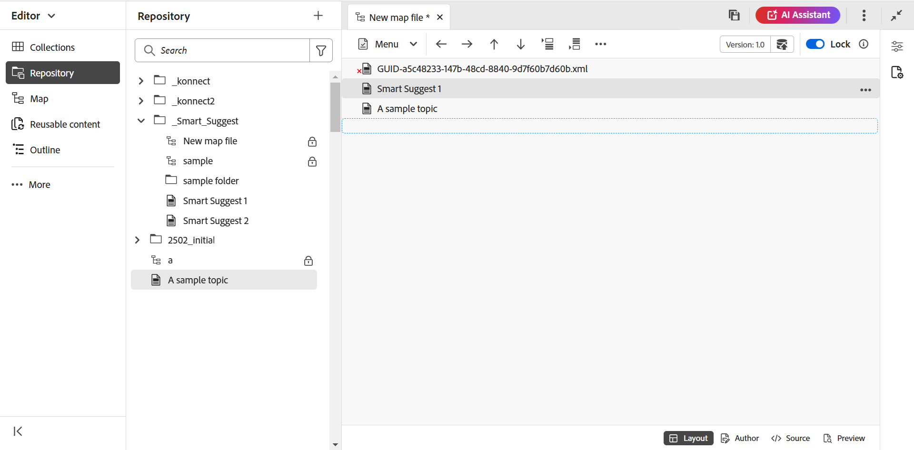

# Creación de un mapa {#id176FEN0D05Z}

Adobe Experience Manager Guides proporciona dos plantillas de mapas integradas: DITA map y Bookmap. También puede crear sus propias plantillas de mapa y compartirlas con sus autores para crear archivos de mapa.

Siga estos pasos para crear una asignación:

1. En el panel Repositorio, seleccione el icono **Nuevo archivo** y, a continuación, seleccione **Mapa DITA** en el menú desplegable.

   {align="left"}

   También puede acceder a esta opción desde la [página principal de Experience Manager Guides](./intro-home-page.md) y desde el menú de opciones de una carpeta en la vista Repositorio.

2. Se muestra el cuadro de diálogo **Nuevo mapa**.

3. En el cuadro de diálogo **Nuevo mapa**, proporcione los siguientes detalles:
   - Título del mapa.
   - \(Opcional\)* El nombre de archivo del mapa. El nombre del archivo se sugiere automáticamente en función del tema Título. Si el administrador ha habilitado nombres de archivo automáticos basados en la configuración de UUID, no verá el campo Nombre.
   - Una plantilla en la que se basará el tema. Para un archivo de mapa, las opciones disponibles son **Bookmap**, **Map** y **Esquema del asunto**.
   - Ruta de acceso donde desea guardar el archivo de asignación. De forma predeterminada, la ruta de la carpeta seleccionada actualmente en el repositorio se muestra en el campo Ruta.

   {width="300" align="left"}

4. Seleccione **Crear**.

El mapa se crea en la ruta especificada. Además, el mapa se abre en el Editor de mapas para editarlo.

{align="left"}

## Adición de temas a un archivo de asignación

Además de editar archivos de mapa directamente desde el Editor, también puede abrir archivos de tema en un mapa para editar el Editor. Puede agregar temas a un archivo de asignación.

Realice los siguientes pasos para agregar temas a un archivo de asignación desde la consola Mapa:

1. En la vista Repositorio, desplácese hasta el archivo de asignación que desee editar y ábralo.
1. Seleccione el icono **Editar**.

   {width="450" align="left"}

1. El fichero de mapa se abre en el editor de mapas. Si ha abierto un nuevo archivo de mapa, solo se muestra el título del mapa en el editor.

   {align="left"}

   - **A** - \(*Barra de fichas*\): Es similar a la barra de fichas del Editor. Ver [barra de fichas](./web-editor-tab-bar.md) en el editor para obtener más detalles.

   - **B** - \(*Barra de herramientas*\) Esta es la barra de herramientas que le permite trabajar con los archivos de asignación. Para obtener más información sobre las funcionalidades disponibles en la barra de herramientas, vea [Características disponibles en la barra de herramientas del Editor de mapas](#features-available-in-the-map-editors-toolbar).

   - **C** - \(*Vistas de mapas*\): Permite cambiar el Editor de mapas entre el Diseño, Autor, Source y Vista previa. La vista **Diseño** permite organizar los temas en un mapa DITA. Esto proporciona la vista de árbol o jerárquica del mapa. La vista **Autor** le permite editar los temas en el Editor de mapas. Esto también proporciona la vista de WYSIWYG del archivo de mapa. La vista **Source** le permite trabajar con el XML subyacente del archivo de asignación. La vista previa le ofrece una vista consolidada de todos los temas y subasignaciones dentro del archivo de asignación.

   - **D** - \(*Panel izquierdo*\): otorga acceso al panel izquierdo que le da acceso a las colecciones, repositorio, mapa, esquema y otras características. Puede expandirla o contraerla seleccionando el icono Expandir/Contraer. Para obtener más información acerca de las características disponibles en el panel izquierdo, vea [Panel izquierdo](./web-editor-left-panel.md) en el editor.

   - **E** - \(*Área central*\): Asignar área de edición de contenido.

   - **F** - \(*Panel derecho*\): otorga acceso al panel Propiedades. Puede ver las propiedades de contenido y las propiedades de asignación del tema o mapa seleccionado. Para obtener más información acerca de las funcionalidades disponibles en este panel, vea [Panel derecho](web-editor-right-panel.md) en el editor.

1. En el panel izquierdo, cambie a la vista **Repositorio**.

1. En el repositorio de Adobe Experience Manager, vaya a la carpeta que contiene los temas o las asignaciones secundarias que desea agregar.

1. Seleccione el tema o el archivo de asignación en la vista **Repositorio** y arrástrelo y suéltelo en el área de edición de contenido de asignación \(middle\).

   El tema se añade en el mapa.

   {align="left"}

1. Para agregar temas subsiguientes o un submapa, arrastre y suelte el tema o submapa en la ubicación requerida del mapa.

   Tenga en cuenta los siguientes puntos al crear el archivo de mapa:

   - El archivo se agrega en una ubicación en la que aparece la barra rectangular discontinua en el área de edición del mapa. En la siguiente captura de pantalla, se agregará *un tema de ejemplo* entre los temas *Sugerencia inteligente 1* y *Sugerencia inteligente 2*.

     {align="left"}

   - Para reemplazar un tema, arrastre y suelte el nuevo tema encima del tema que desee reemplazar. y soltarlo indica que se reemplazará con el tema que se está soltando en él.

   - Si se añade un submapa al mapa DITA, este se mostrará como un vínculo en el mapa DITA. Para ver todos los temas del submapa, pulse Ctrl y haga clic en el vínculo del submapa. El contenido del submapa se muestra en una nueva pestaña. Del mismo modo, para abrir un tema desde el mapa DITA, pulse Ctrl y haga clic en el vínculo del tema para que se abra en la nueva pestaña.

   - Puede utilizar las teclas de método abreviado CTRL+Z y CTRL+Y o sus respectivos iconos en la barra de herramientas para deshacer o rehacer cualquier cambio en el mapa.

   - Para cambiar la posición de un tema, seleccione el tema \(seleccionando el icono del tema\) y arrástrelo y suéltelo en la ubicación deseada en el archivo de asignación. En la siguiente captura de pantalla, el tema *Sugerencia inteligente 1* se está moviendo después del tema *Ejemplo*.

     {align="left"}

   - Para comprobar las propiedades del archivo de asignación, haga clic con el botón secundario en cualquier lugar del área de edición del mapa y elija **Propiedades** en el menú contextual. En función de su versión de Adobe Experience Manager, puede ver propiedades como metadatos, programar \(de\)activación, referencias, estado del documento y mucho más.

1. Seleccione **Guardar**.

## Creación de un mapa desde la interfaz de usuario de Assets

También puede crear un archivo de mapa desde la interfaz de usuario de Assets y abrirlo en el Editor de mapas para editarlo.

Siga estos pasos para crear un mapa desde la interfaz de usuario de Assets:

1. En la interfaz de usuario de Assets, vaya a la ubicación en la que desea crear el archivo de asignación.

1. Seleccione **Crear** \> **Mapa DITA**.

1. En la página Modelo, seleccione el tipo de plantillas de mapa que desee usar y seleccione **Siguiente**.

   >[!NOTE]
   >
   > La forma en que se hace referencia a los temas en un archivo de mapa depende de la plantilla de mapa. Por ejemplo, si selecciona la plantilla Mapa, las referencias del tema \(`topicref`\) se utilizarán para hacer referencia a los temas. En el caso de un mapa de libros, las referencias de temas se crean utilizando el elemento `chapter` en DITA.

   {align="left"}

1. En la página Propiedades, especifique el mapa **Title**.

1. \(Opcional\) Especifique el archivo **Nombre**.

   Si el administrador ha configurado un nombre de archivo automático basado en la configuración de UUID, no verá la opción para especificar el nombre de archivo. Se asigna automáticamente un nombre de archivo basado en UUID al archivo.

   Si la opción de nomenclatura de archivos está disponible, también el nombre se sugiere automáticamente en función del Título del mapa. Si desea especificar manualmente el nombre del archivo de asignación, asegúrese de que el nombre del archivo no contenga espacios, apóstrofos ni llaves y termine con `.ditamap`.

1. Seleccione **Crear**.

   Aparecerá el mensaje Crear mapa.

   A cada nuevo archivo de mapa que cree desde la interfaz de usuario de Assets o el editor se le asigna un ID de mapa único. Además, la nueva asignación se guarda como la última copia de trabajo en DAM. Hasta que guarde una revisión de una asignación recién creada, no verá ningún número de versión en el Historial de versiones. Si abre el mapa para editarlo, la información de la versión se muestra en la esquina superior derecha de la pestaña del archivo de mapa:

   {align="left"}

   La información de versión de un mapa recién creado se muestra como *none*. Al guardar una nueva versión, se le asigna un número de versión como 1.0. Para obtener más información acerca de cómo guardar una nueva versión, vea [Guardar como nueva versión](web-editor-features.md#save-as-new-version).

   Puede elegir abrir la asignación para editarla en el editor de asignaciones configurado o guardar el archivo de asignación en el repositorio de Adobe Experience Manager.

   >[!NOTE]
   >
   > Para utilizar el Editor de mapas avanzado, acceda al archivo de asignación en el Editor. Si el administrador ha configurado el Editor de mapas avanzado como editor por defecto en los ficheros de mapa, el fichero de mapa se abrirá directamente en el Editor de mapas avanzado para editarlo. Ver la sección *Establecer el editor de mapas avanzado como predeterminado* en Instalar y configurar Adobe Experience Manager Guides as a Cloud Service.

### Adición de temas a un archivo de asignación desde la interfaz de usuario de Assets

Realice los siguientes pasos para agregar temas a un archivo de asignación desde la interfaz de usuario de Assets:

1. En la interfaz de usuario de Assets, vaya al archivo de asignación que desee editar.

   >[!NOTE]
   >
   > Asegúrese de que no ha habilitado el modo de selección de recursos.

1. Para obtener un bloqueo exclusivo en el archivo de asignación, selecciónelo y, a continuación, seleccione la opción **Retirar** en la parte superior.

   >[!NOTE]
   >
   > Una vez que tenga un bloqueo exclusivo en un archivo de mapa, los demás usuarios no podrán editar el mapa. Sin embargo, podrían trabajar en los temas dentro del archivo de mapa. Si el administrador ha configurado el Editor para que bloquee los archivos antes de editarlos, no podrá editar un archivo hasta que lo bloquee.

1. Con el archivo de asignación seleccionado, seleccione **Editar temas**.

   {align="left"}

   O bien, también puede seleccionar la opción **Editar temas** en el menú de acción del archivo de asignación:

   {align="left"}

   El archivo de mapa se abre para editarlo en el Editor. Para agregar temas al archivo de asignación, siga los pasos (4-8) en [Agregar temas a un archivo de asignación](#add-topics-to-a-map-file).

**Tema principal: [Introducción al editor de mapas](map-editor.md)
