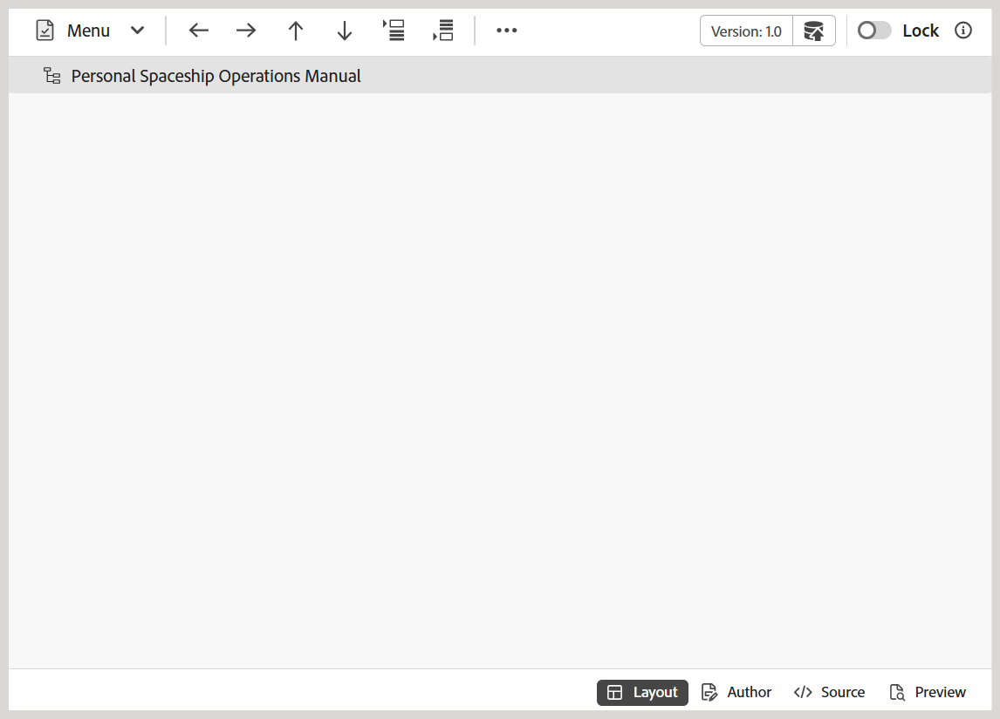

# Funciones adicionales en el editor de mapas {#id1942D0T0HUI}

Algunas funciones comunes del Editor de mapas son:

## Resolver referencias clave {#id176GD01H05Z}

Una referencia de clave de contenido DITA o `conkeyref` es un mecanismo para insertar una parte del contenido de un tema en otro. Este mecanismo utiliza claves para localizar el contenido que se va a reutilizar, en lugar del mecanismo de referencia de contenido directo. Para obtener más información acerca de las referencias directas e indirectas en DITA, vea *Direccionamiento DITA* en Especificación del lenguaje DITA OASIS.

Si el tema DITA tiene referencias clave asociadas, deben resolverse antes de obtener una vista previa, editar o revisar un tema.

Las referencias clave se resuelven en función del mapa raíz establecido en el siguiente orden de prioridad:

1. Preferencias de usuario
1. Panel Vista de mapa
1. Perfil de carpeta

El mapa raíz seleccionado en Preferencias de usuario tiene la prioridad más alta para resolver las referencias clave seguidas del panel Vista de mapa y el mapa raíz Perfil de carpeta. Por lo tanto, si no se define ningún mapa en las Preferencias del usuario, se utilizará el mapa abierto en el panel Vista de mapa. Si no se abre ninguna asignación en el panel Vista de mapa, se utiliza el conjunto de asignaciones de los Perfiles de carpeta para resolver las referencias clave.

Las referencias clave se pueden almacenar en un fichero de mapa DITA o en un fichero DITA independiente. En Experience Manager Guides, puede especificar referencias clave en el nivel de proyecto o de sesión. Si ya se ha definido un mapa raíz para la sesión del usuario, se utilizará para resolver las claves. De lo contrario, se utiliza el mapa raíz predeterminado para esa carpeta. Si no se configura un mapa raíz predeterminado, las referencias clave que faltan se resaltan al usuario.

Existen varias formas de resolver referencias clave en un tema DITA mediante la definición del mapa DITA que se utilizará en las siguientes ubicaciones:

**Propiedades del proyecto**: puede definir un mapa raíz para resolver referencias clave al crear un proyecto en la sección Propiedades del proyecto.

Esta asignación raíz se aplicará a todos los recursos \(carpetas y subcarpetas\) asociados a ese proyecto. Para el contenido al que se hace referencia en varios proyectos, se mantiene una lista alfabética de proyectos y se utiliza el mapa raíz predeterminado asociado al primer proyecto. También se puede elegir el mapa DITA que se utilizará de la lista para resolver referencias clave.

**Vista previa del tema**: en el modo de vista previa del tema, seleccione el icono Resolución de clave en la barra de herramientas y seleccione el archivo DITA que se utilizará para las referencias de clave.

**Vista de edición de tema**: seleccione el icono Resolución de clave al editar un tema DITA y seleccione el archivo DITA que se utilizará para resolver las referencias de clave.

## Agregar referencias de navegación

El elemento `navref` se utiliza dentro de un mapa DITA para incluir referencias de navegación de otro mapa DITA. Esto permite a los autores reutilizar la estructura de navegación, como los menús o vínculos compartidos, sin combinar el contenido real del mapa al que se hace referencia en la salida.

>[!NOTE]
>
> El elemento `navref` está diseñado únicamente con fines de navegación dentro de la estructura del mapa. No contribuye a la salida de mapa DITA generada y se excluye del procesamiento y visualización en la vista Mapa, Informes, Línea base, Traducción y Vista previa.

Para añadir referencias de navegación a un mapa, realice los siguientes pasos:

1. Abra el fichero de mapa DITA en el que desee añadir una referencia de navegación.

   El fichero de mapa se abre en el editor de mapas.
1. Cambie a la vista Autor y coloque el cursor en una ubicación válida para una referencia de navegación.
1. Seleccione la opción **Element** en la barra de herramientas.
1. En el diálogo **Insertar elemento**, seleccione **navref**.

   
1. Se muestra el diálogo **Seleccionar ruta**. Seleccione un archivo de mapa que desee incluir como referencia de navegación en el mapa y elija **Seleccionar**.

Se añade una referencia de navegación del fichero de mapa seleccionado en la ubicación especificada. Además, el título del mapa al que se hace referencia se muestra en las vistas Autor y Diseño.

*Vista de autor*

*Vista de diseño*

**Tema principal:**[ Introducción al editor de mapas](map-editor.md)
