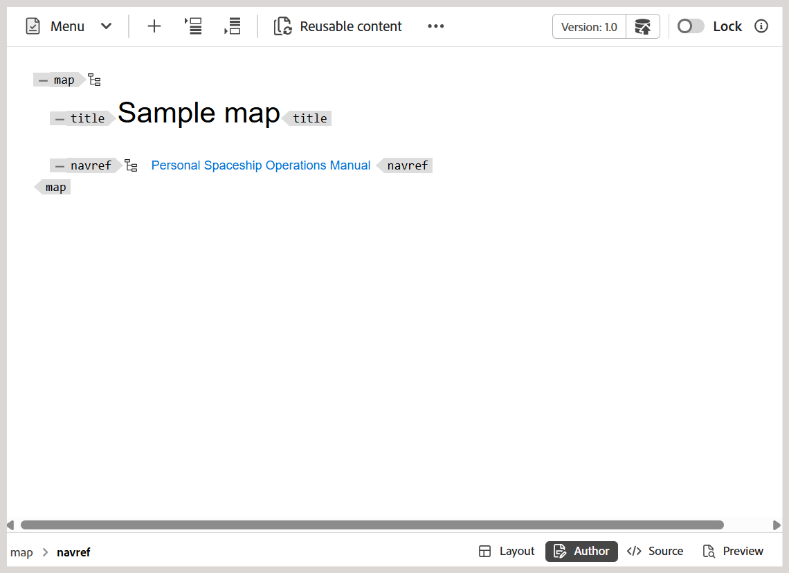

# Funciones adicionales en el editor de mapas {#id1942D0T0HUI}

Algunas funciones comunes del Editor de mapas son:

## Resolver referencias clave {#id176GD01H05Z}

Una referencia de clave de contenido DITA o `conkeyref` es un mecanismo para insertar una parte del contenido de un tema en otro. Este mecanismo utiliza claves para localizar el contenido que se va a reutilizar, en lugar del mecanismo de referencia de contenido directo. Para obtener más información acerca de las referencias directas e indirectas en DITA, vea *Direccionamiento DITA* en Especificación del lenguaje DITA OASIS.

Si el tema DITA tiene referencias clave asociadas, deben resolverse antes de obtener una vista previa, editar o revisar un tema.

Las referencias clave se resuelven en función del mapa raíz establecido en el siguiente orden de prioridad:

1. Preferencias de usuario
1. Panel Vista de mapa
1. Perfil de carpeta

El mapa raíz seleccionado en Preferencias de usuario tiene la prioridad más alta para resolver las referencias clave seguidas del panel Vista de mapa y el mapa raíz Perfil de carpeta. Por lo tanto, si no se define ningún mapa en las Preferencias del usuario, se utilizará el mapa abierto en el panel Vista de mapa. Si no se abre ninguna asignación en el panel Vista de mapa, se utiliza el conjunto de asignaciones de los Perfiles de carpeta para resolver las referencias clave.

Las referencias clave se pueden almacenar en un fichero de mapa DITA o en un fichero DITA independiente. En Experience Manager Guides, puede especificar referencias clave en el nivel de proyecto o de sesión. Si ya se ha definido un mapa raíz para la sesión del usuario, se utilizará para resolver las claves. De lo contrario, se utiliza el mapa raíz predeterminado para esa carpeta. Si no se configura un mapa raíz predeterminado, las referencias clave que faltan se resaltan al usuario.

Existen varias formas de resolver referencias clave en un tema DITA mediante la definición del mapa DITA que se utilizará en las siguientes ubicaciones:

**Propiedades del proyecto**: puede definir un mapa raíz para resolver referencias clave al crear un proyecto en la sección Propiedades del proyecto.

Esta asignación raíz se aplicará a todos los recursos \(carpetas y subcarpetas\) asociados a ese proyecto. Para el contenido al que se hace referencia en varios proyectos, se mantiene una lista alfabética de proyectos y se utiliza el mapa raíz predeterminado asociado al primer proyecto. También se puede elegir el mapa DITA que se utilizará de la lista para resolver referencias clave.

**Vista previa del tema**: en el modo de vista previa del tema, seleccione el icono Resolución de clave en la barra de herramientas y seleccione el archivo DITA que se utilizará para las referencias de clave.

**Vista de edición de tema**: seleccione el icono Resolución de clave al editar un tema DITA y seleccione el archivo DITA que se utilizará para resolver las referencias de clave.

## Agregar referencias de navegación

El elemento `navref` se utiliza dentro de un mapa DITA para incluir referencias de navegación de otro mapa DITA. Esto permite a los autores reutilizar la estructura de navegación, como los menús o vínculos compartidos, sin combinar el contenido real del mapa al que se hace referencia en la salida.

>[!NOTE]
>
> El elemento `navref` está diseñado únicamente con fines de navegación dentro de la estructura del mapa. No contribuye a la salida de mapa DITA generada y se excluye del procesamiento y visualización en la vista Mapa, Informes, Línea base, Traducción y Vista previa.

Para añadir referencias de navegación a un mapa, realice los siguientes pasos:

1. Abra el fichero de mapa DITA en el que desee añadir una referencia de navegación.

   El fichero de mapa se abre en el editor de mapas.
1. Cambie a la vista Autor y coloque el cursor en una ubicación válida para una referencia de navegación.
1. Seleccione la opción **Element** en la barra de herramientas.
1. En el diálogo **Insertar elemento**, seleccione **navref**.

   
1. Se muestra el diálogo **Seleccionar ruta**. Seleccione un archivo de mapa que desee incluir como referencia de navegación en el mapa y elija **Seleccionar**.

Se añade una referencia de navegación del fichero de mapa seleccionado en la ubicación especificada. Además, el título del mapa al que se hace referencia se muestra en las vistas Autor y Diseño.

*Vista de autor*

*Vista de diseño*

## Ejecutar comprobación de estado en un mapa

La opción Ejecutar comprobación de estado del menú contextual le permite ejecutar una comprobación de estado en el mapa seleccionado para detectar problemas como vínculos rotos, ID duplicados y errores de validación de Schematron antes de la publicación.

>[!NOTE]
>
> Esta función está habilitada de forma predeterminada. Si prefiere no utilizar esta función en su entorno, póngase en contacto con el equipo de éxito del cliente.

Las comprobaciones disponibles para ejecutarse se definen mediante un ajuste preestablecido de comprobación de estado, creado y administrado por un administrador en el nivel de perfil de carpeta. Para obtener más información, vea [Crear y administrar ajustes preestablecidos de comprobación de estado](../install-conf-guide/conf-health-check-preset.md).

Realice los siguientes pasos para ejecutar una comprobación de estado en un mapa:

1. Abra un mapa en el Editor.
1. En el menú Opciones, seleccione **Ejecutar comprobación de estado**.
   
1. Se muestra el cuadro de diálogo Ejecutar comprobación de estado. Seleccione un ajuste preestablecido de comprobación de estado que desee ejecutar. Solo se pueden seleccionar los ajustes preestablecidos configurados para el perfil de carpeta.

   Al seleccionar un ajuste preestablecido, se cargan las comprobaciones definidas en el cuadro de diálogo.

   
1. *Opcional* Seleccione una línea de base. Si no desea usar una línea de base, seleccione **Ninguna**.
1. Seleccione **Ejecutar**.

También puede ejecutar una comprobación de estado en un mapa desde el panel **Informe de comprobación de estado**. Para ello, abra un mapa en la vista Mapa y seleccione el icono **Informe de comprobación de estado**.

>[!NOTE]
>
>Esta opción solo se muestra para un mapa en el que aún no se ha ejecutado ninguna comprobación de estado. Si ya se ha ejecutado una comprobación de estado en el mapa, al seleccionar el icono **Informe de comprobación de estado** se abrirá el informe existente en su lugar.

En el panel, seleccione **Ejecutar comprobación**.

Se abre el mismo cuadro de diálogo **Ejecutar comprobación de estado** en el que puede seleccionar un ajuste preestablecido de comprobación de estado y una línea de base para ejecutar una comprobación de estado en el mapa, tal como se describe en los pasos anteriores.

## Uso del informe de comprobación de estado en el editor

Cuando ejecuta una comprobación de estado de un mapa, el informe se abre en el panel **Informe de comprobación de estado** como se muestra a continuación:

### Barra de informes

La barra de herramientas de la parte superior del panel muestra lo siguiente:

- **Nombre del mapa**: El nombre del mapa para el que se generó el informe.
- **Icono de información**: seleccione esta opción para ver el nombre del ajuste preestablecido, la versión del mapa y la línea de base (si existe) que se utilizó para generar el informe.
- **Filtro**: reduce el informe a una regla específica, por ejemplo, para ver únicamente los resultados de los vínculos rotos. El filtro solo enumera los tipos de reglas que produjeron resultados en el informe actual.
- **Descargar informe**: descarga el informe.
- **Regenerar**: vuelve a ejecutar la comprobación de estado.

### Resultados de comprobación de estado

Cada resultado producido por las comprobaciones seleccionadas se enumera con los siguientes detalles:
- **Gravedad**: El nivel de gravedad del resultado, por ejemplo Error, Advertencia, Información o Grave.
- **Nombre del ajuste preestablecido de comprobación de estado**: Nombre del ajuste preestablecido de comprobación de estado utilizado para generar el informe
- **Nombre de regla**: La regla que produjo el resultado; por ejemplo, Vínculos rotos o Identificador duplicado.
- **Número de línea**: La línea del archivo donde se produce el problema.
- **Recurso**: El archivo en el que se encontró el problema.

Seleccione un resultado para abrir el archivo correspondiente en la línea exacta donde persiste el problema.

>[!NOTE]
>
>Los resultados de los vínculos rotos abren el archivo en el modo Autor. Los resultados de validación de ID y Schematron duplicados abren el archivo en modo Source.

### Regeneración del informe

Después de solucionar un problema, selecciona **Volver a generar** en la barra de herramientas para ejecutar de nuevo la comprobación de estado y confirmar que se ha resuelto el problema. En el cuadro de diálogo **Regenerar** que se muestra, seleccione las comprobaciones que desee incluir en el informe regenerado.

>[!NOTE]
>
> Los informes de comprobación de estado son específicos del usuario que los generó. Si varios usuarios generan un informe para el mismo mapa, cada usuario ve sus propios resultados. Sin embargo, los administradores siempre tienen acceso al último informe generado para el mapa.

### Descarga del informe

Seleccione **Descargar informe** para descargar el informe en formato XLS, con información detallada para cada resultado.

**Tema principal:**[ Introducción al editor de mapas](map-editor.md)
