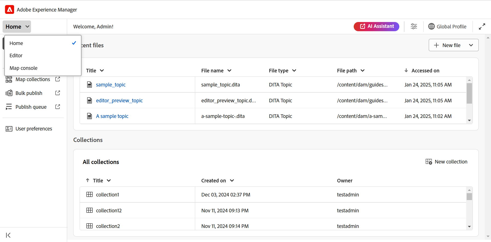
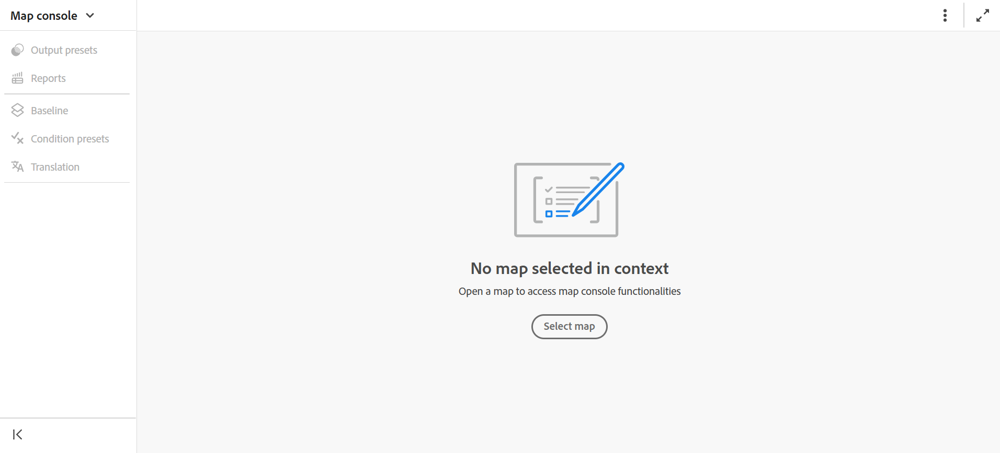

# Abrir archivos en la consola Mapa

Siga estos pasos para abrir un archivo de mapa DITA en la consola de mapas:

1. Abra **la consola de mapas** desde la página principal.

   {width="800"}

2. Dado que no se ha seleccionado ningún archivo de asignación, se le pedirá que seleccione un archivo de asignación para utilizar las funciones de gestión y publicación de mapas.

   

3. Elija **Seleccionar mapa** y seleccione una ruta donde se encuentre el archivo de mapa DITA.

   El archivo de asignación se abre en la consola Mapa. De manera predeterminada, la ficha **Ajustes preestablecidos de salida** está seleccionada.

   {width="800"}

   >[!NOTE]
   >
   >  El mapa abierto en la consola Mapa se sincroniza con la vista Mapa disponible en el Editor.

## Abra los archivos de mapa desde el Editor

También puede abrir un archivo de asignación existente en la consola Mapa desde el Editor.

1. Desplácese hasta el fichero de mapa DITA y selecciónelo en la vista Repositorio.

   El archivo de mapa se abre en la vista Mapa.

2. Seleccione el icono **Abrir en la consola de mapas**.

   El archivo de asignación se abre en la consola Mapa.

   
